# Repeating Earthquake Activity at RCS

## Waveforms
[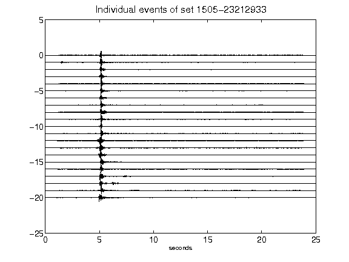](figures/1505-23212933_AllEv.png)[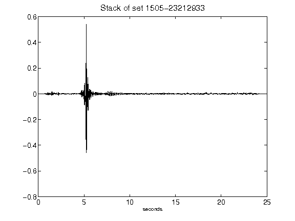](figures/1505-23212933_Stack.png)[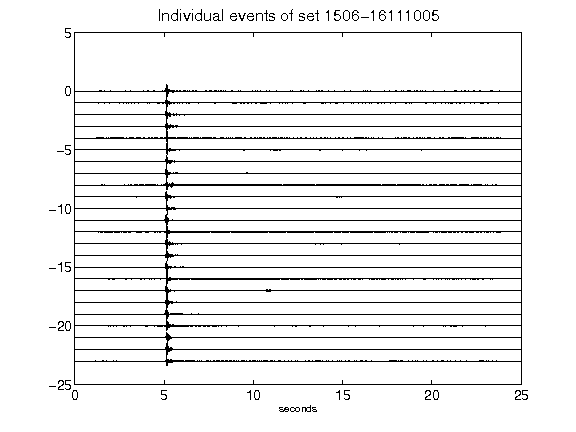](figures/1506-16111005_AllEv.png)[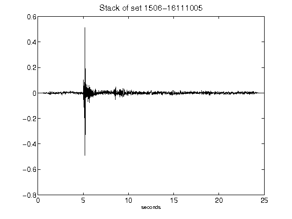](figures/1506-16111005_Stack.png)[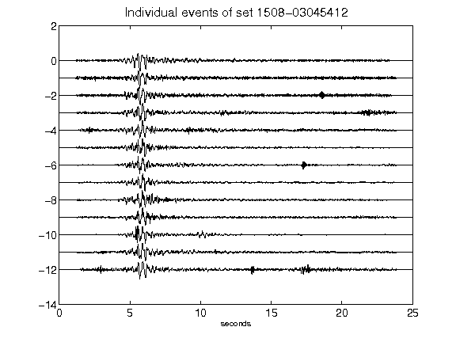](figures/1508-03045412_AllEv.png)[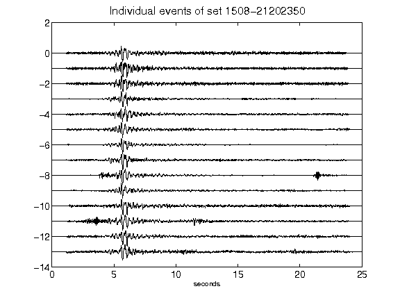](figures/1508-21202350_AllEv.png)[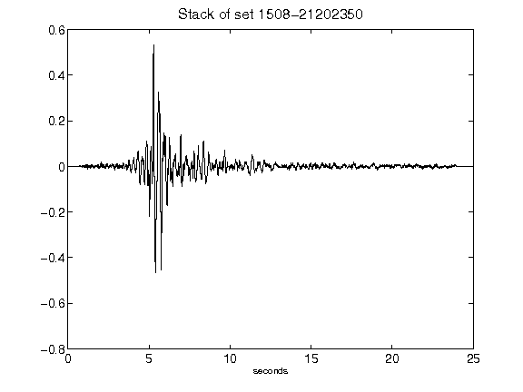](figures/1508-21202350_Stack.png)[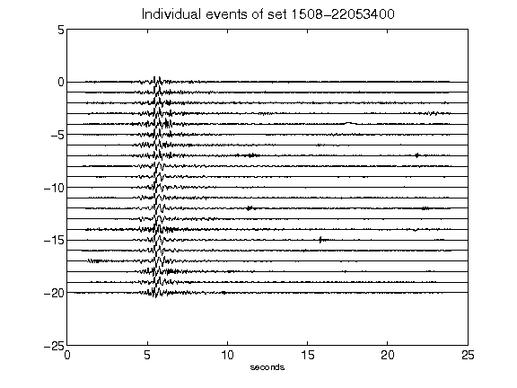](figures/1508-22053400_AllEv.png)[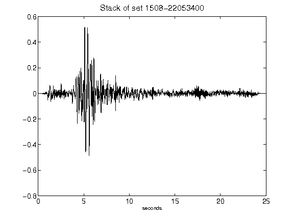](figures/1508-22053400_Stack.png)[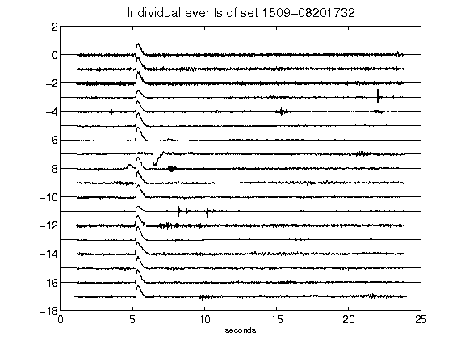](figures/1509-08201732_AllEv.png)[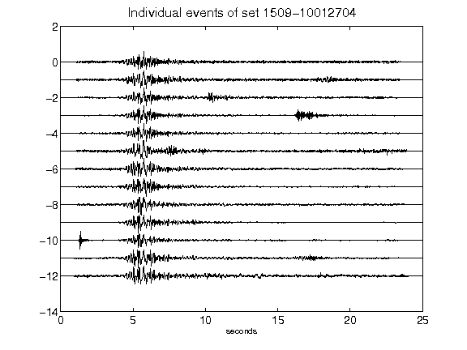](figures/1509-10012704_AllEv.png)[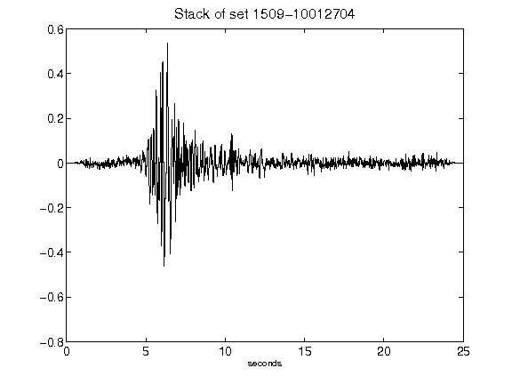](figures/1509-10012704_Stack.png)[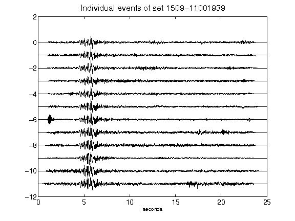](figures/1509-11001939_AllEv.png)[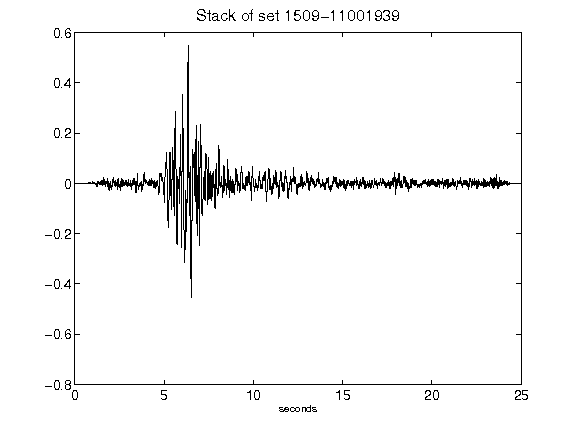](figures/1509-11001939_Stack.png)