# Repeating Earthquake Activity at RCS

## Waveforms
[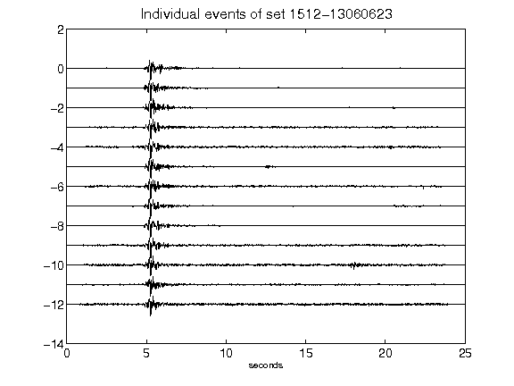](figures/1512-13060623_AllEv.png)[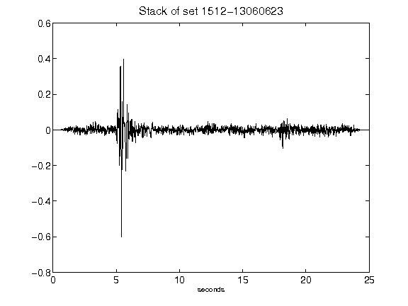](figures/1512-13060623_Stack.png)[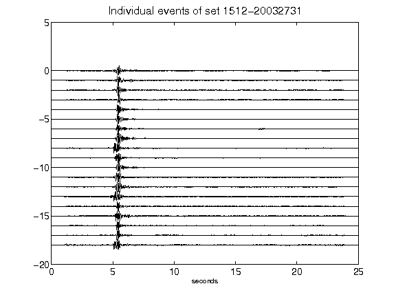](figures/1512-20032731_AllEv.png)[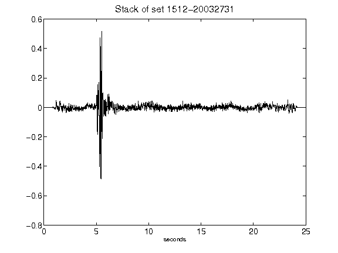](figures/1512-20032731_Stack.png)[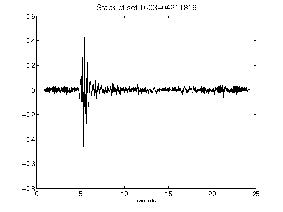](figures/1603-04211819_Stack.png)[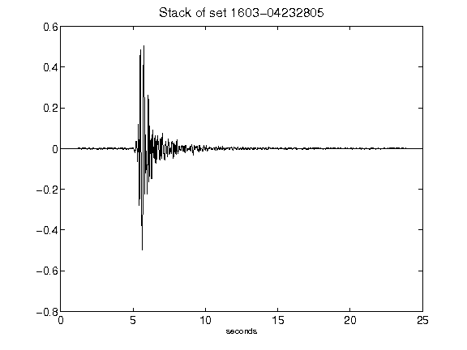](figures/1603-04232805_Stack.png)[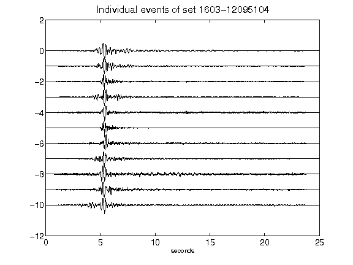](figures/1603-12095104_AllEv.png)[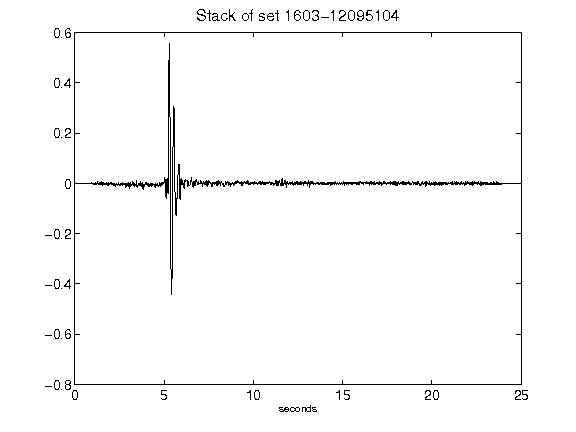](figures/1603-12095104_Stack.png)[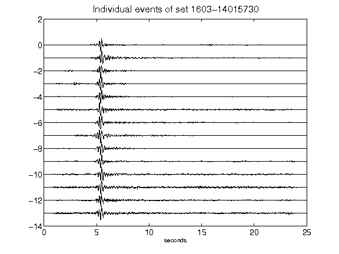](figures/1603-14015730_AllEv.png)[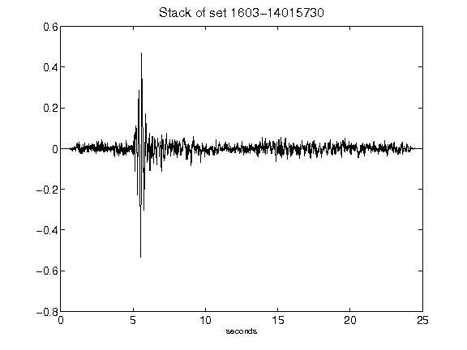](figures/1603-14015730_Stack.png)[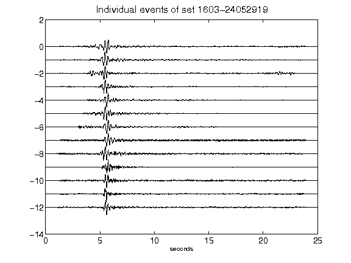](figures/1603-24052919_AllEv.png)