# Repeating Earthquake Activity at RCS

## Waveforms
[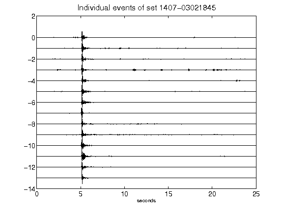](figures/1407-03021845_AllEv.png)[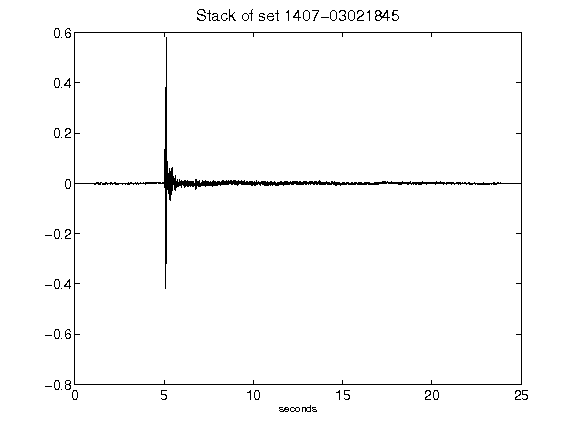](figures/1407-03021845_Stack.png)[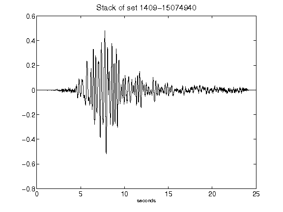](figures/1409-15074940_Stack.png)[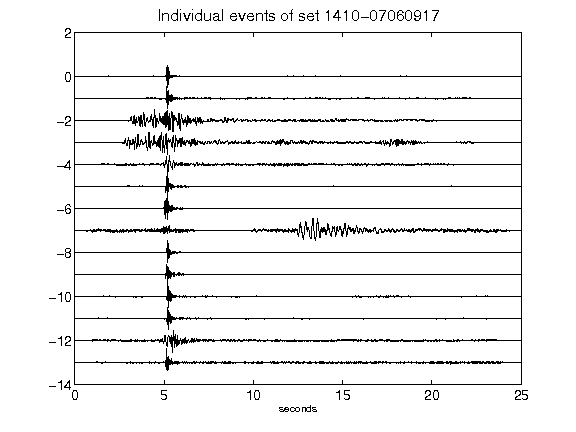](figures/1410-07060917_AllEv.png)[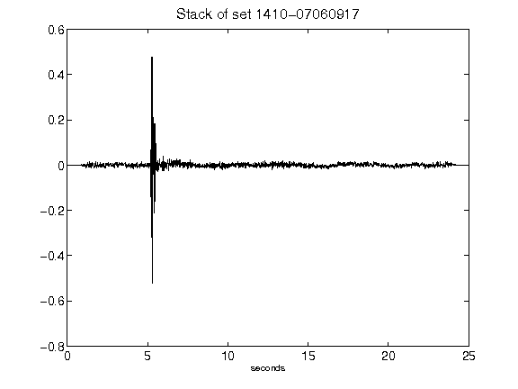](figures/1410-07060917_Stack.png)[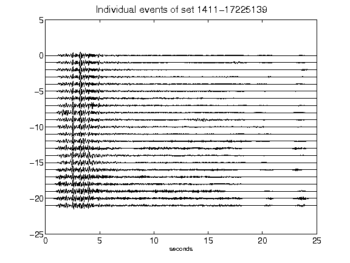](figures/1411-17225139_AllEv.png)[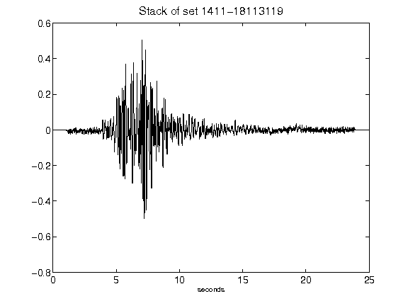](figures/1411-18113119_Stack.png)[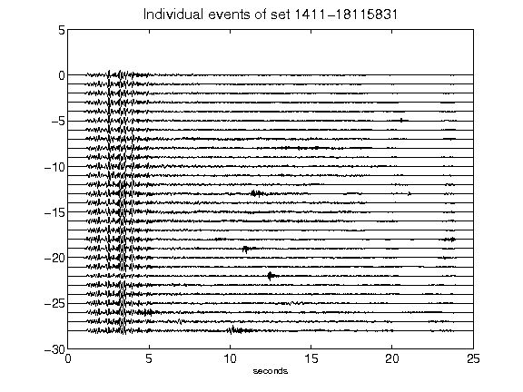](figures/1411-18115831_AllEv.png)[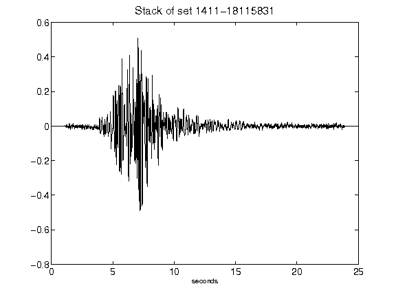](figures/1411-18115831_Stack.png)[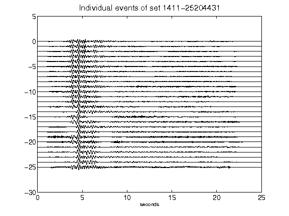](figures/1411-25204431_AllEv.png)[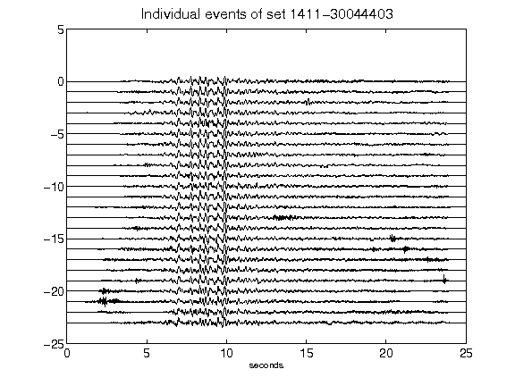](figures/1411-30044403_AllEv.png)[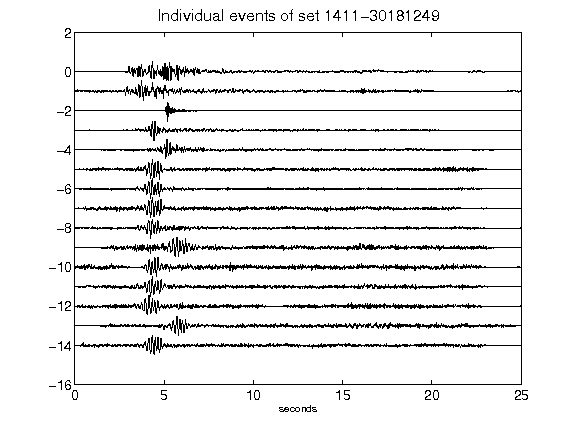](figures/1411-30181249_AllEv.png)[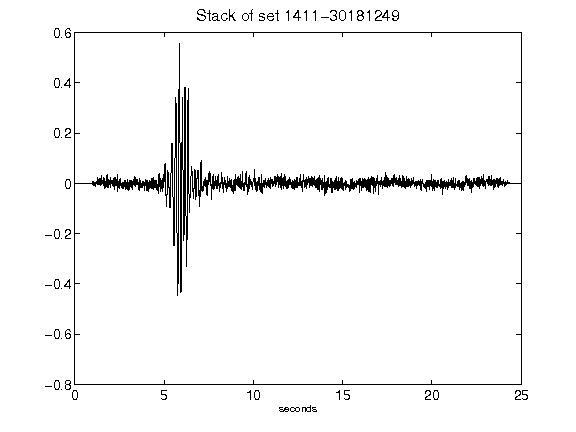](figures/1411-30181249_Stack.png)[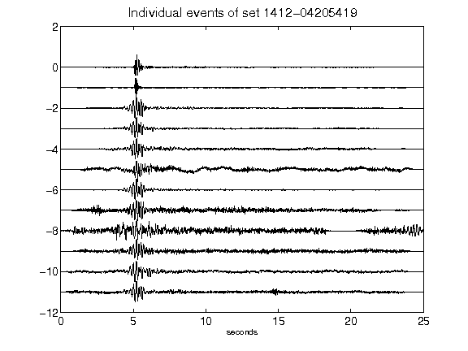](figures/1412-04205419_AllEv.png)[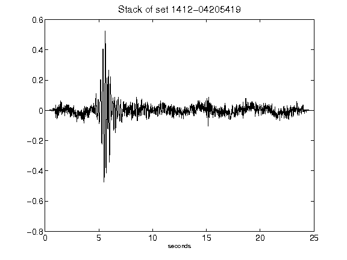](figures/1412-04205419_Stack.png)[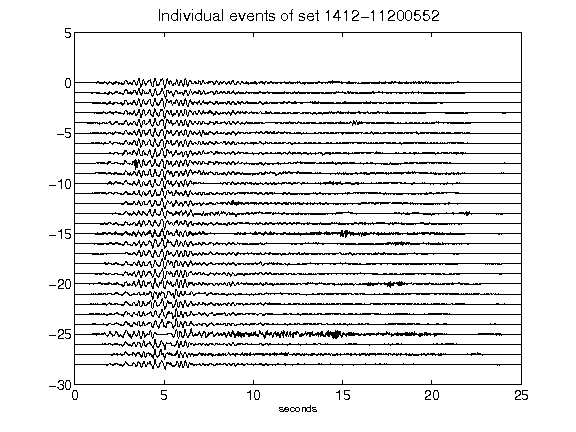](figures/1412-11200552_AllEv.png)[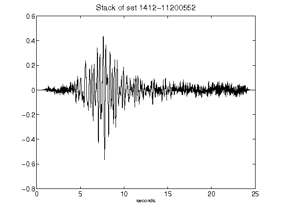](figures/1412-11200552_Stack.png)[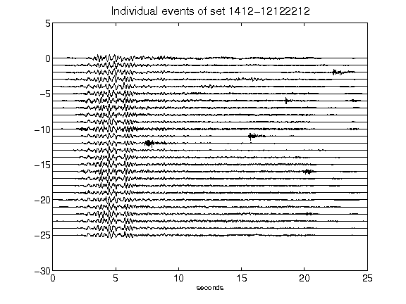](figures/1412-12122212_AllEv.png)[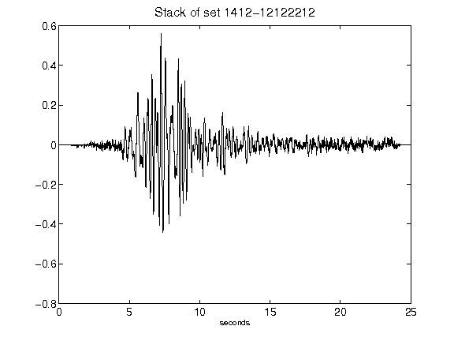](figures/1412-12122212_Stack.png)