# Repeating Earthquake Activity at RCS

## Waveforms
[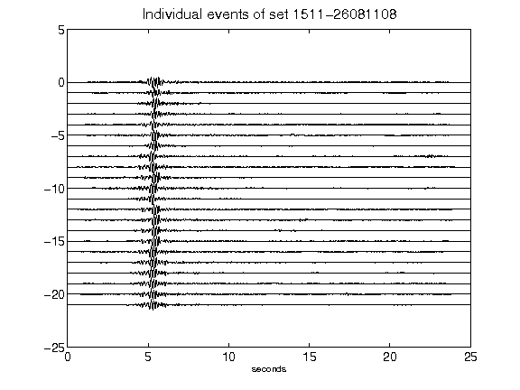](figures/1511-26081108_AllEv.png)[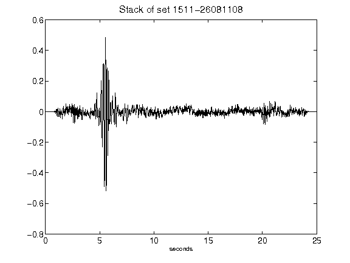](figures/1511-26081108_Stack.png)[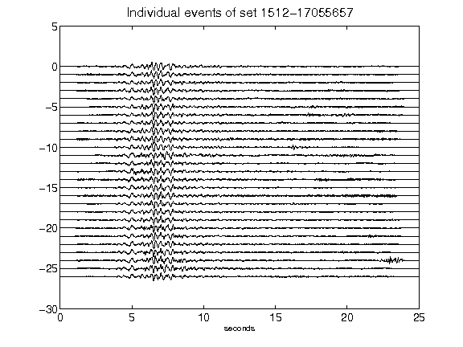](figures/1512-17055657_AllEv.png)[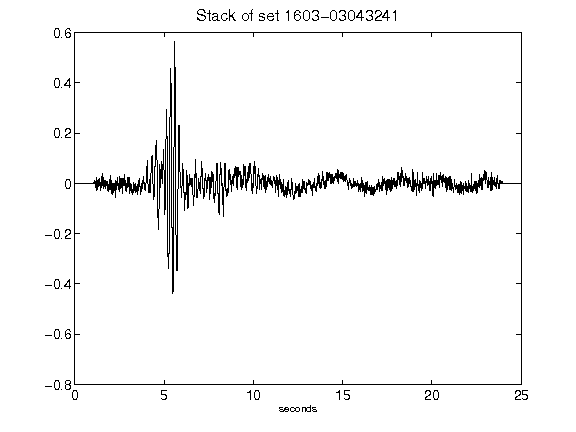](figures/1603-03043241_Stack.png)[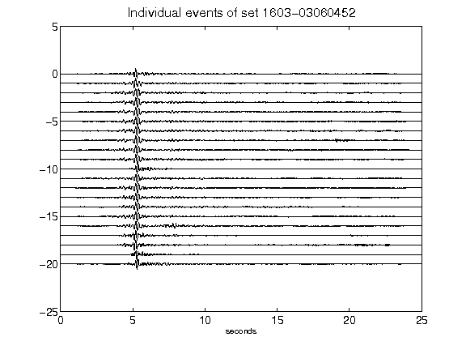](figures/1603-03060452_AllEv.png)[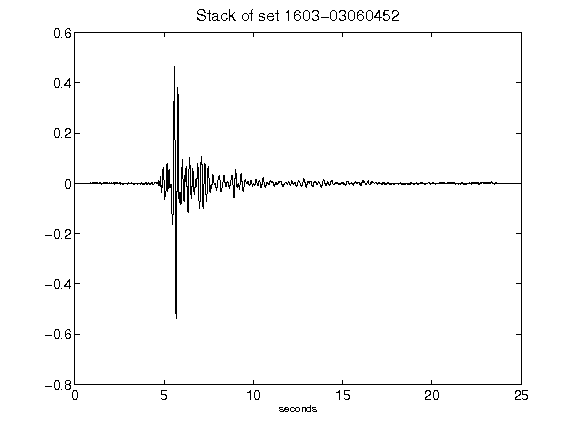](figures/1603-03060452_Stack.png)[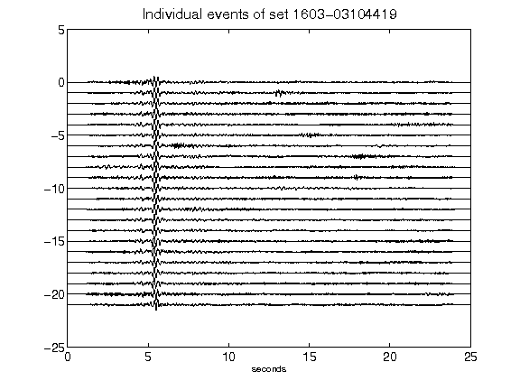](figures/1603-03104419_AllEv.png)[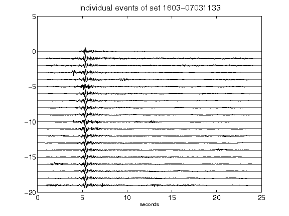](figures/1603-07031133_AllEv.png)[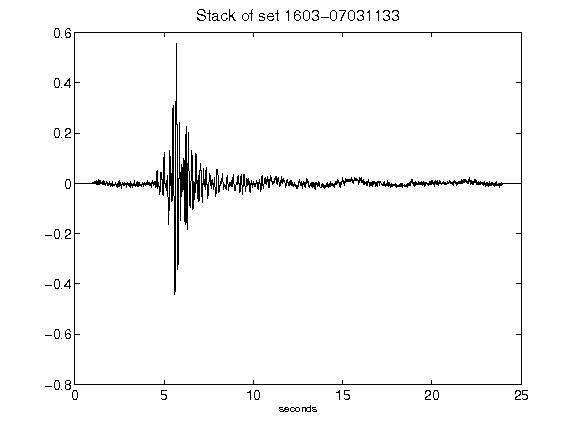](figures/1603-07031133_Stack.png)[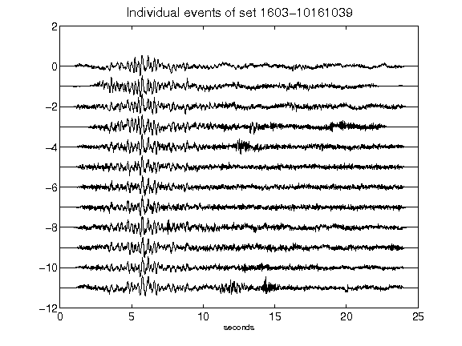](figures/1603-10161039_AllEv.png)[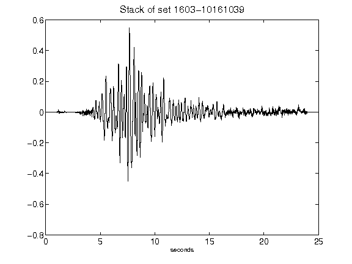](figures/1603-10161039_Stack.png)[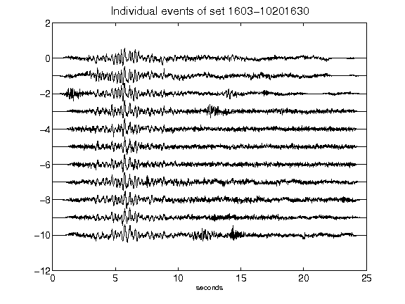](figures/1603-10201630_AllEv.png)[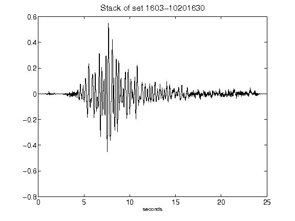](figures/1603-10201630_Stack.png)[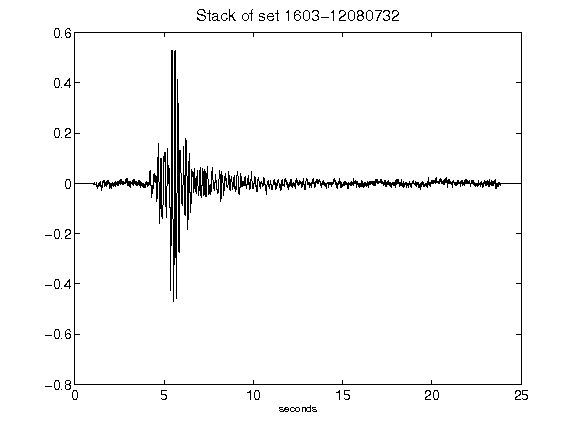](figures/1603-12080732_Stack.png)[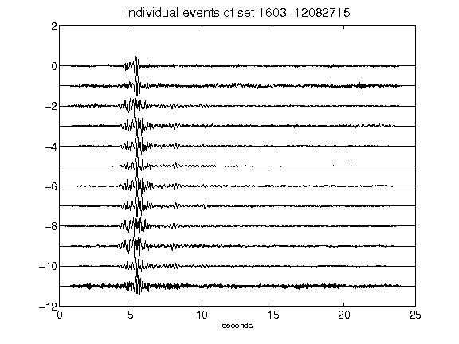](figures/1603-12082715_AllEv.png)[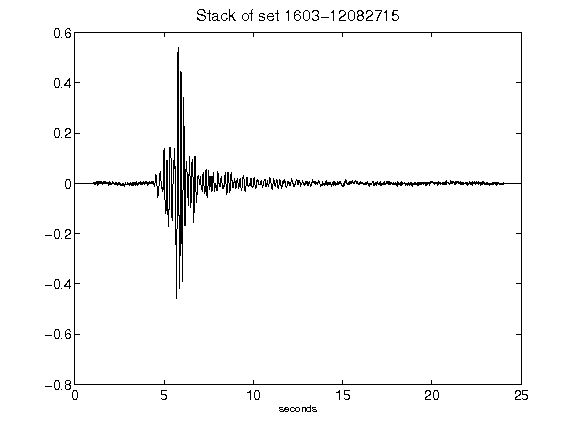](figures/1603-12082715_Stack.png)[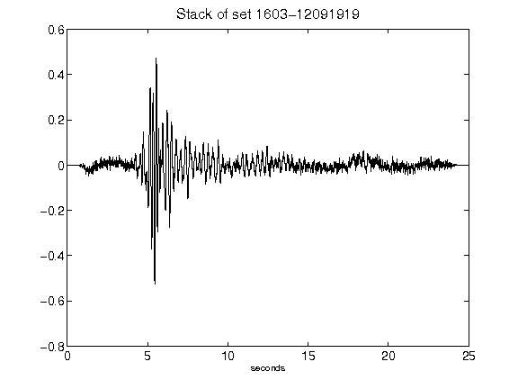](figures/1603-12091919_Stack.png)[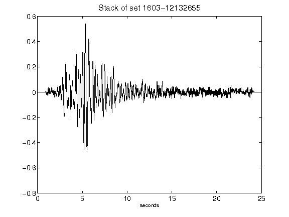](figures/1603-12132655_Stack.png)