# Repeating Earthquake Activity at RCS

## Waveforms
[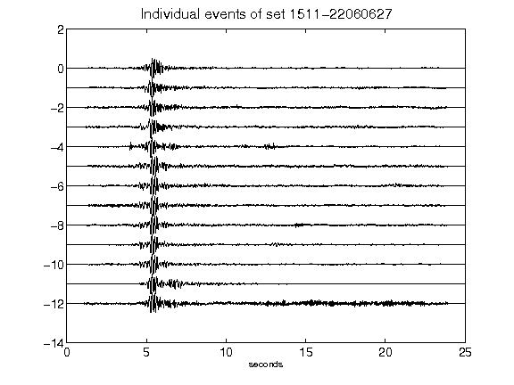](figures/1511-22060627_AllEv.png)[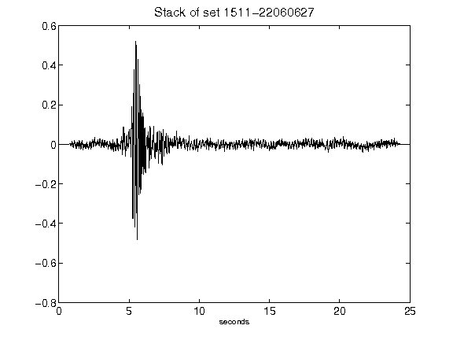](figures/1511-22060627_Stack.png)[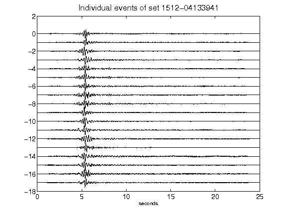](figures/1512-04133941_AllEv.png)[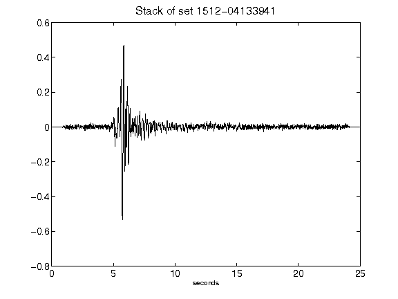](figures/1512-04133941_Stack.png)[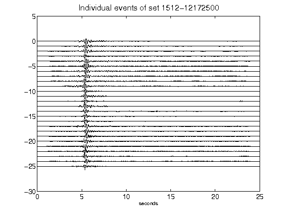](figures/1512-12172500_AllEv.png)[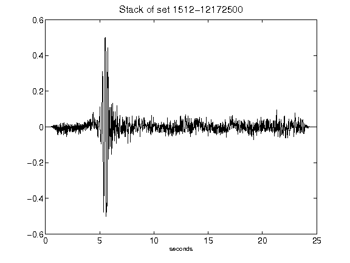](figures/1512-12172500_Stack.png)[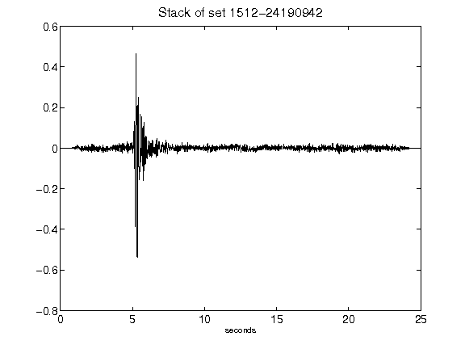](figures/1512-24190942_Stack.png)[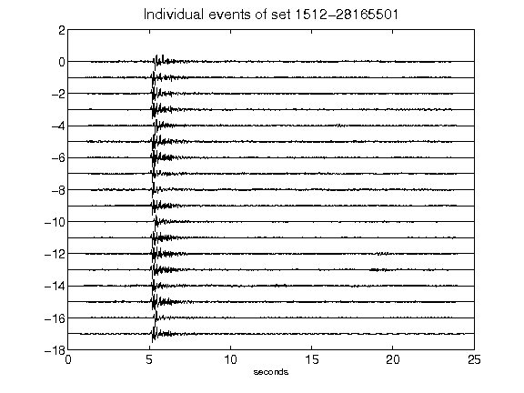](figures/1512-28165501_AllEv.png)[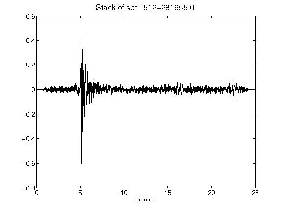](figures/1512-28165501_Stack.png)[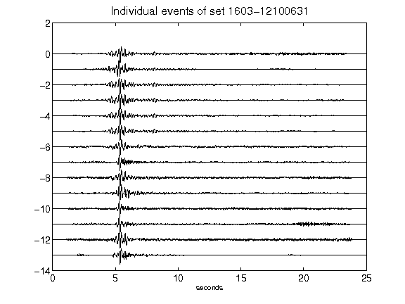](figures/1603-12100631_AllEv.png)[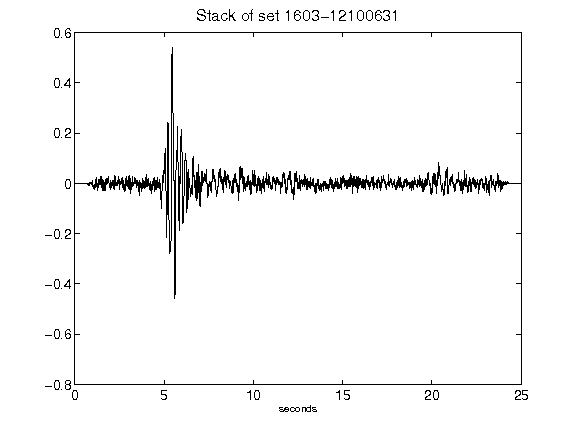](figures/1603-12100631_Stack.png)[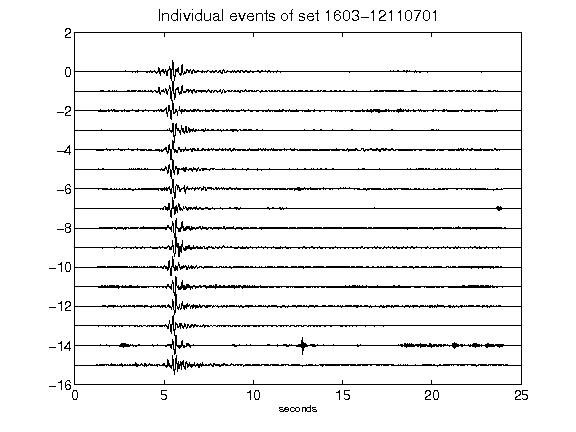](figures/1603-12110701_AllEv.png)[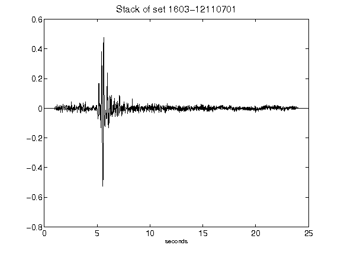](figures/1603-12110701_Stack.png)[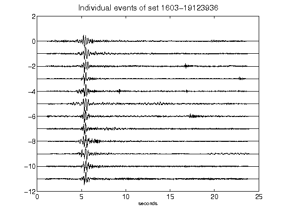](figures/1603-19123936_AllEv.png)[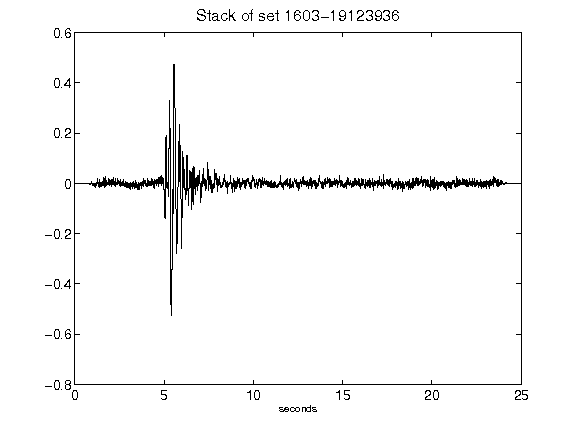](figures/1603-19123936_Stack.png)[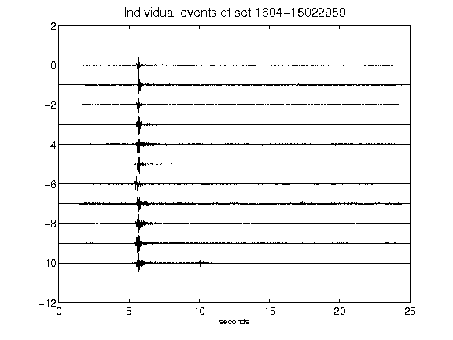](figures/1604-15022959_AllEv.png)[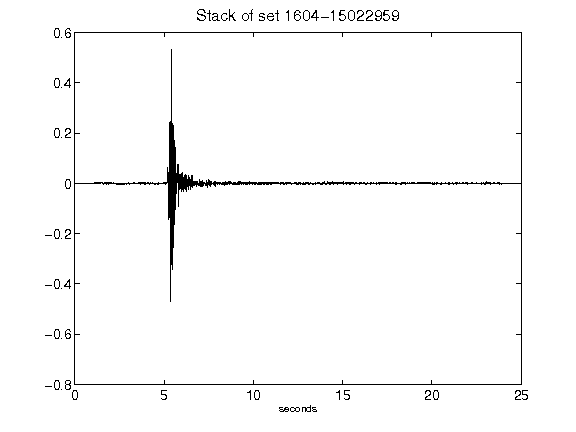](figures/1604-15022959_Stack.png)