# Repeating Earthquake Activity at RCS

## Waveforms
[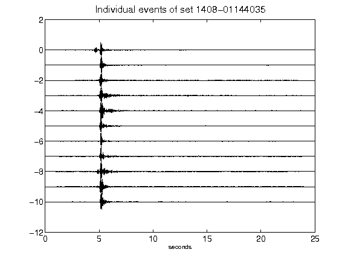](figures/1408-01144035_AllEv.png)[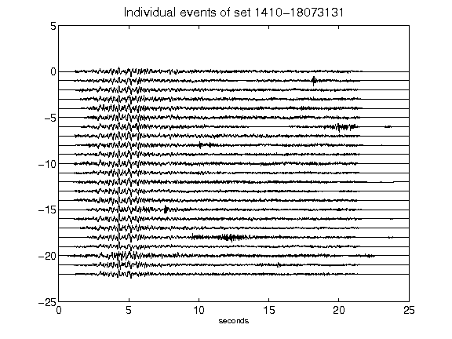](figures/1410-18073131_AllEv.png)[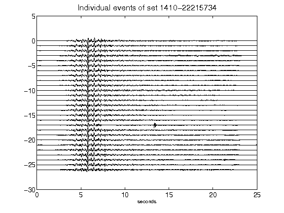](figures/1410-22215734_AllEv.png)[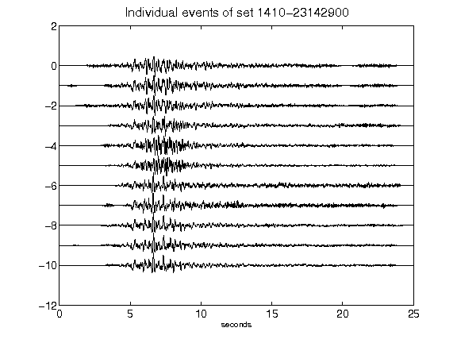](figures/1410-23142900_AllEv.png)[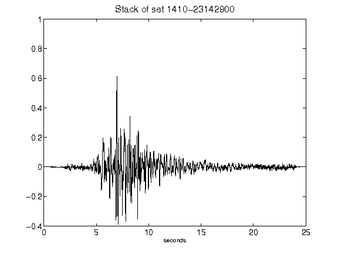](figures/1410-23142900_Stack.png)[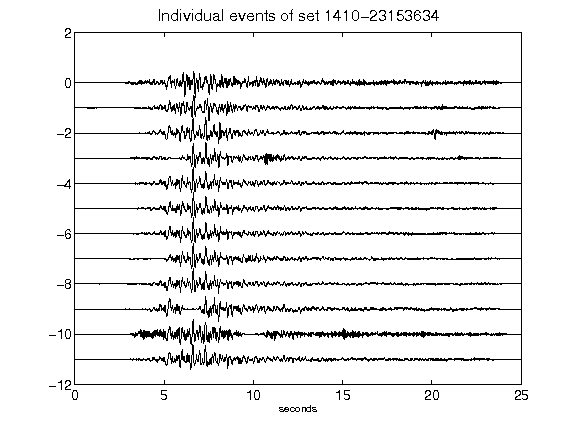](figures/1410-23153634_AllEv.png)[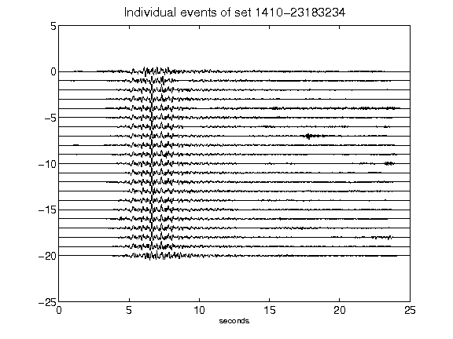](figures/1410-23183234_AllEv.png)[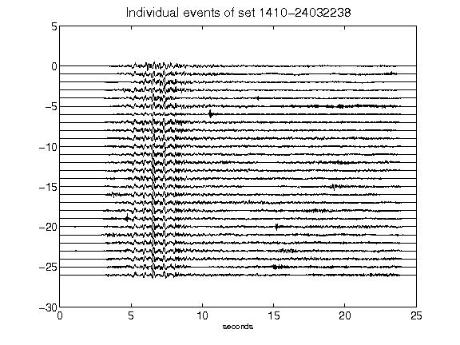](figures/1410-24032238_AllEv.png)[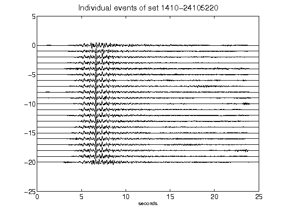](figures/1410-24105220_AllEv.png)[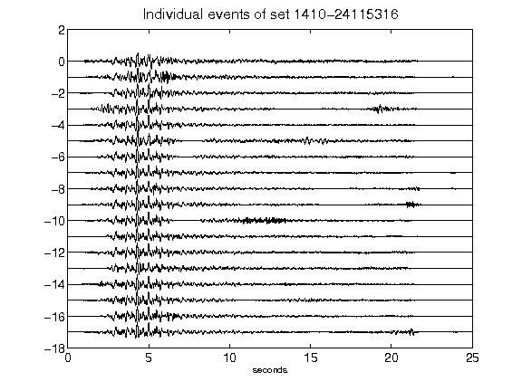](figures/1410-24115316_AllEv.png)[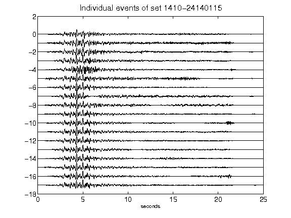](figures/1410-24140115_AllEv.png)[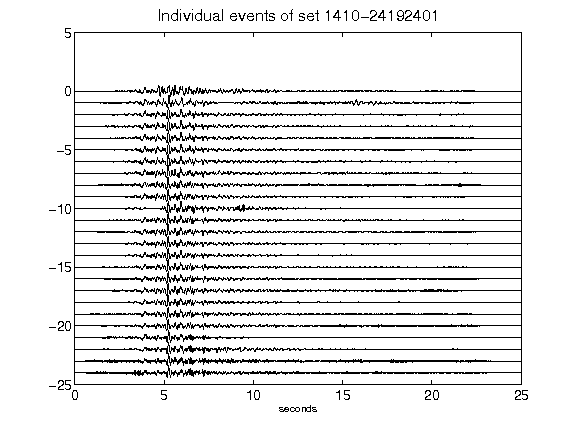](figures/1410-24192401_AllEv.png)[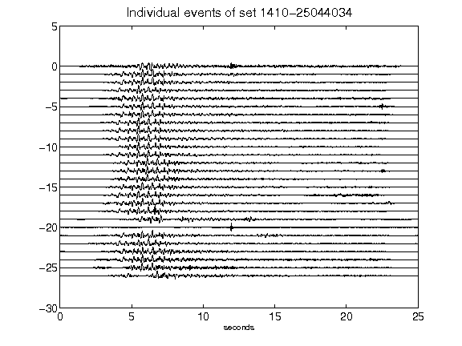](figures/1410-25044034_AllEv.png)[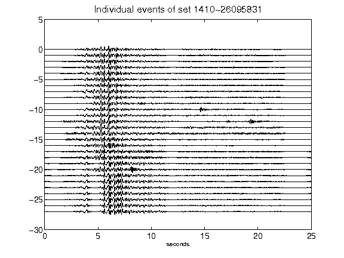](figures/1410-26095831_AllEv.png)[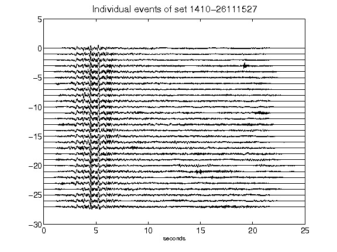](figures/1410-26111527_AllEv.png)[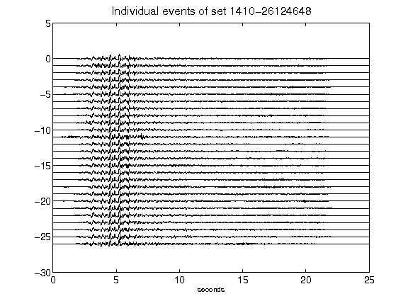](figures/1410-26124648_AllEv.png)[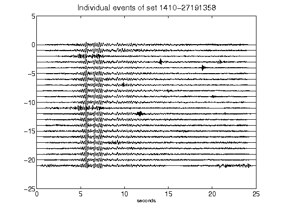](figures/1410-27191358_AllEv.png)[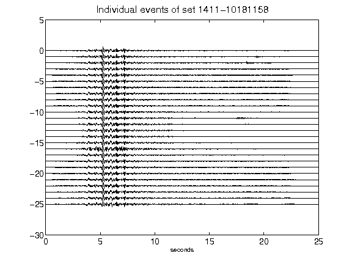](figures/1411-10181158_AllEv.png)[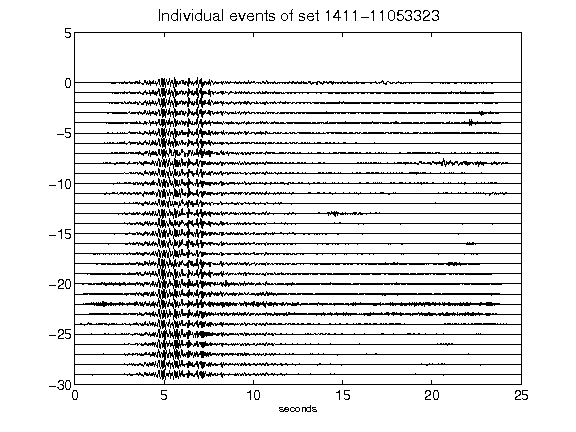](figures/1411-11053323_AllEv.png)[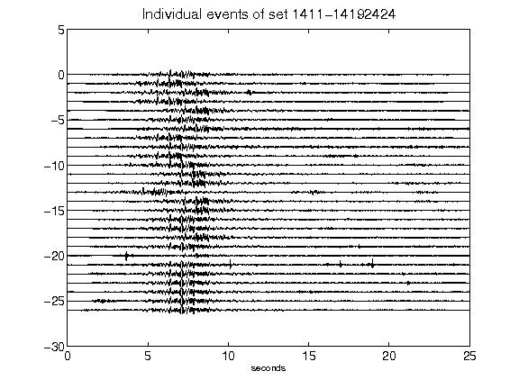](figures/1411-14192424_AllEv.png)