# Repeating Earthquake Activity at RCS

## Waveforms
[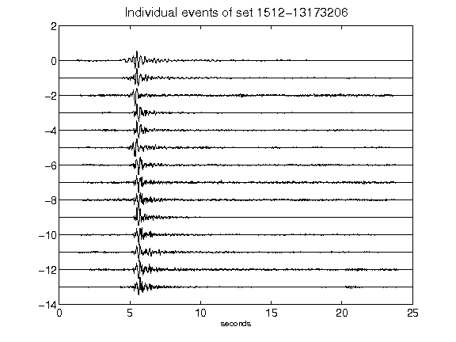](figures/1512-13173206_AllEv.png)[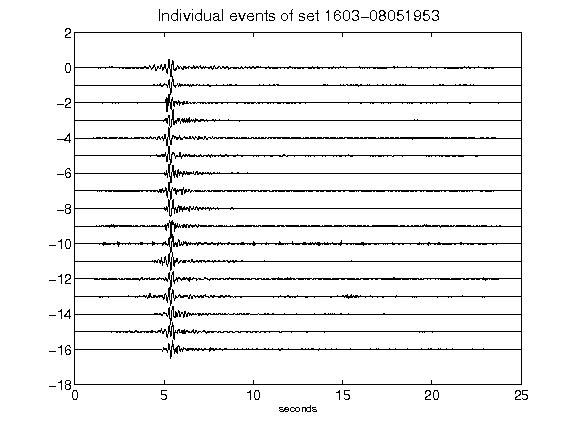](figures/1603-08051953_AllEv.png)[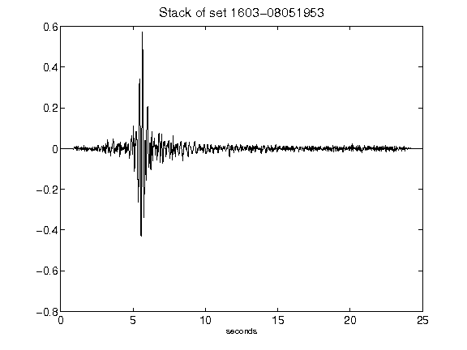](figures/1603-08051953_Stack.png)[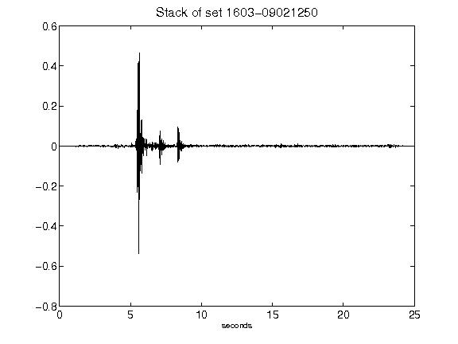](figures/1603-09021250_Stack.png)[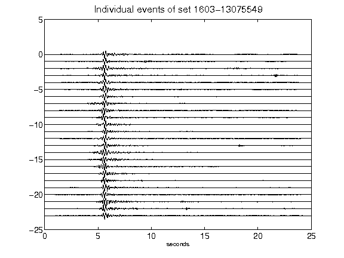](figures/1603-13075549_AllEv.png)[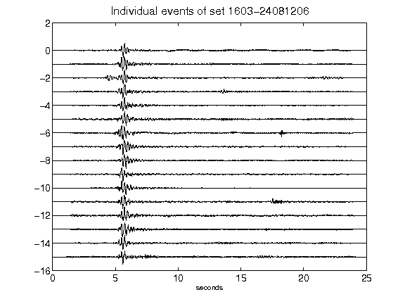](figures/1603-24081206_AllEv.png)[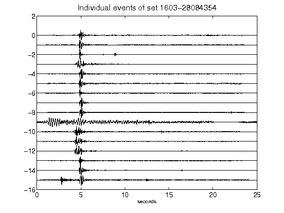](figures/1603-28084354_AllEv.png)[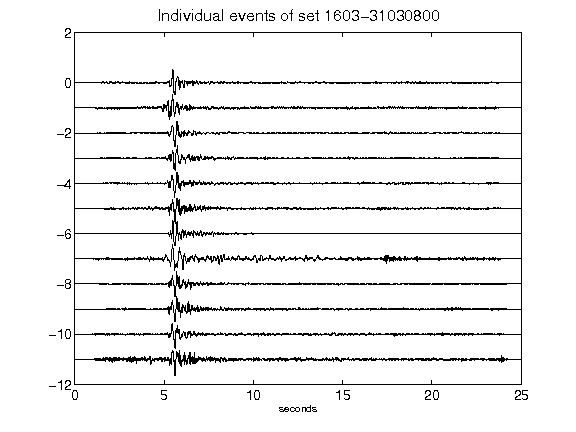](figures/1603-31030800_AllEv.png)[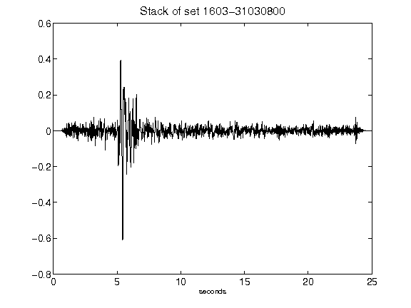](figures/1603-31030800_Stack.png)[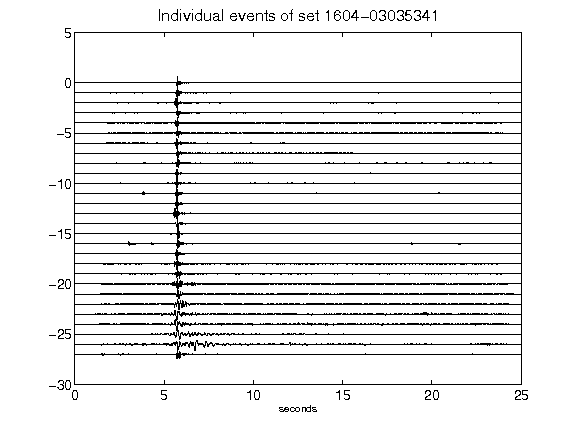](figures/1604-03035341_AllEv.png)[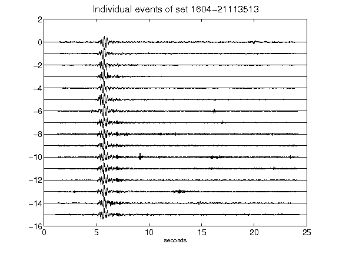](figures/1604-21113513_AllEv.png)[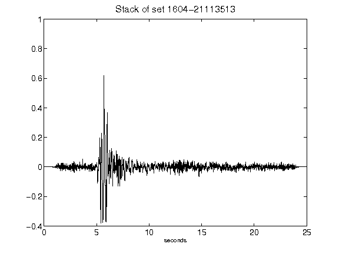](figures/1604-21113513_Stack.png)