# Repeating Earthquake Activity at RCS

## Waveforms
[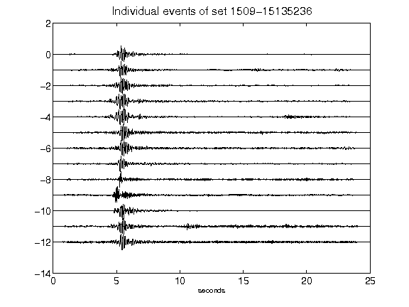](figures/1509-15135236_AllEv.png)[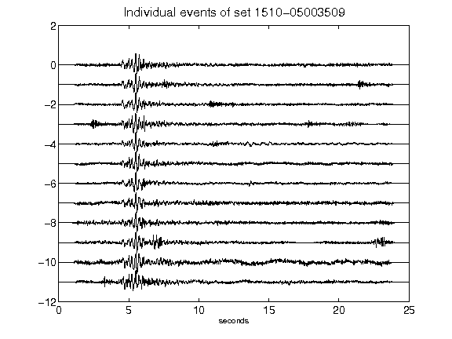](figures/1510-05003509_AllEv.png)[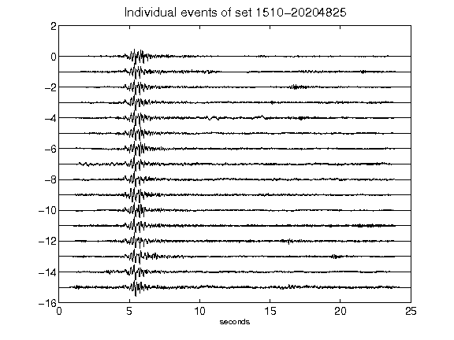](figures/1510-20204825_AllEv.png)[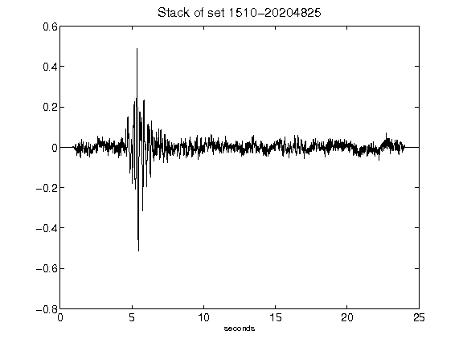](figures/1510-20204825_Stack.png)[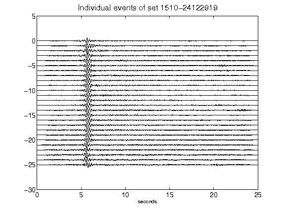](figures/1510-24122919_AllEv.png)[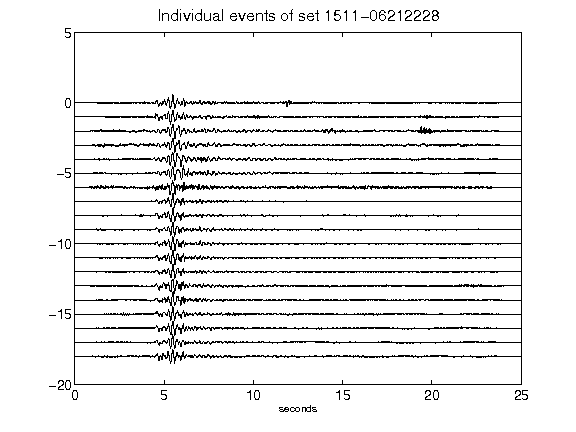](figures/1511-06212228_AllEv.png)[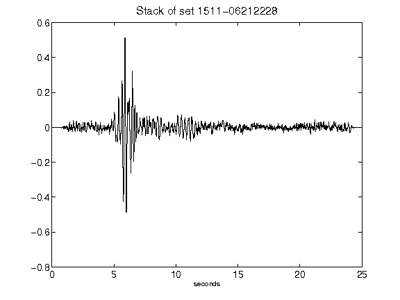](figures/1511-06212228_Stack.png)[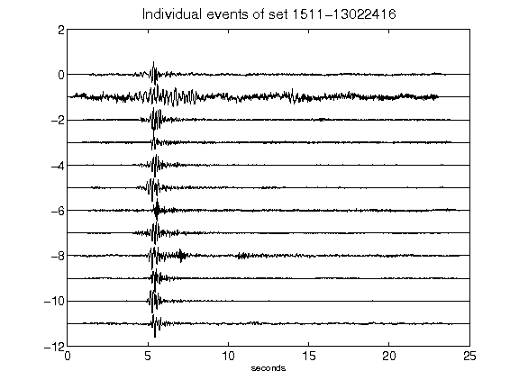](figures/1511-13022416_AllEv.png)[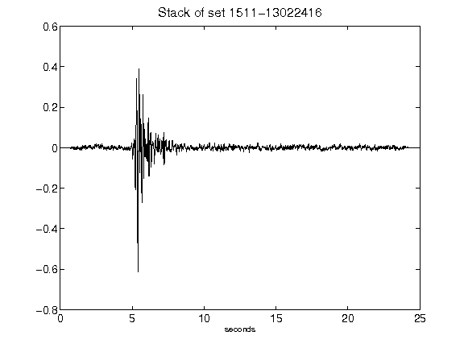](figures/1511-13022416_Stack.png)[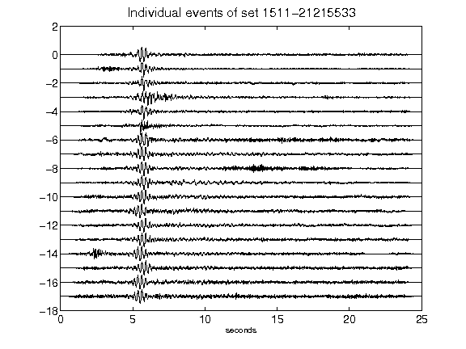](figures/1511-21215533_AllEv.png)[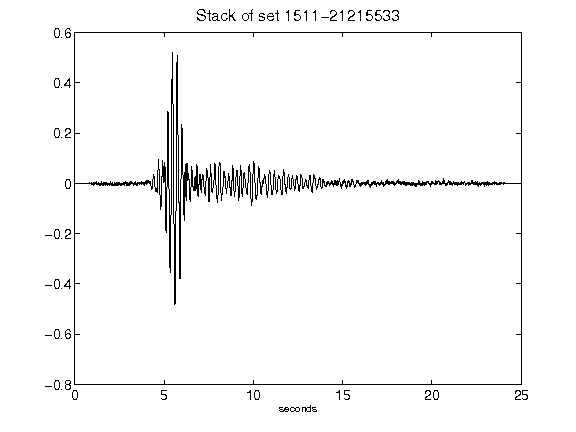](figures/1511-21215533_Stack.png)[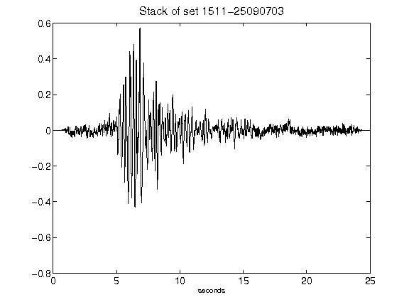](figures/1511-25090703_Stack.png)[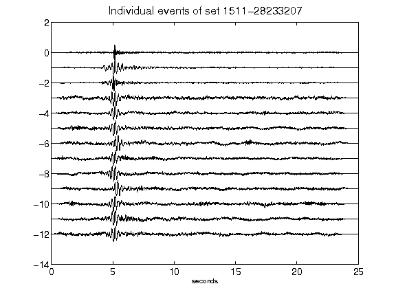](figures/1511-28233207_AllEv.png)[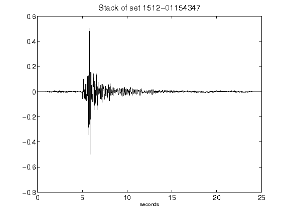](figures/1512-01154347_Stack.png)[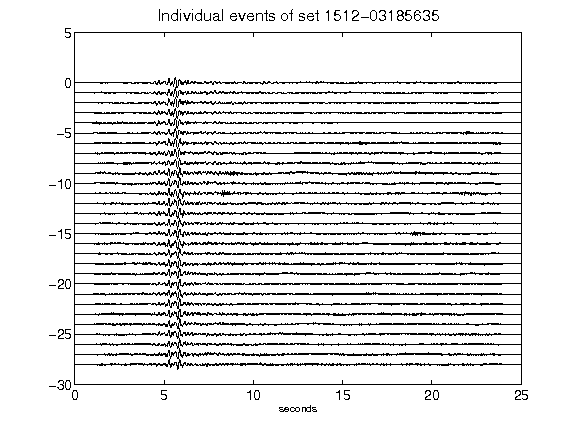](figures/1512-03185635_AllEv.png)[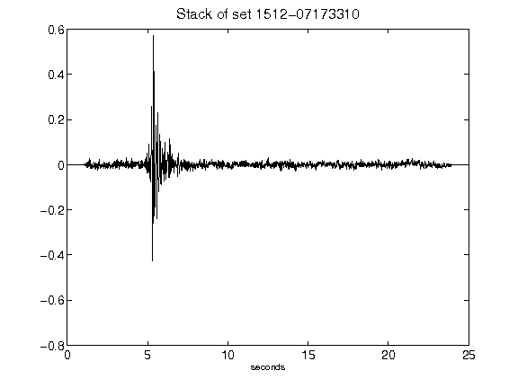](figures/1512-07173310_Stack.png)[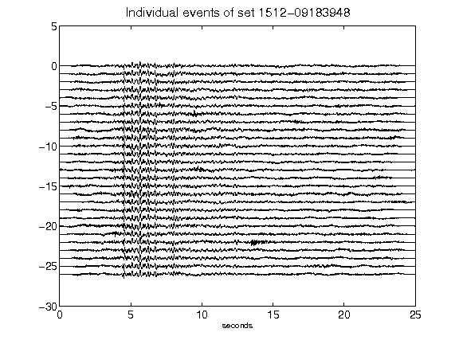](figures/1512-09183948_AllEv.png)[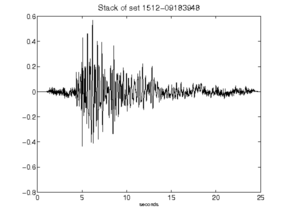](figures/1512-09183948_Stack.png)