# Repeating Earthquake Activity at RCS

## Waveforms
[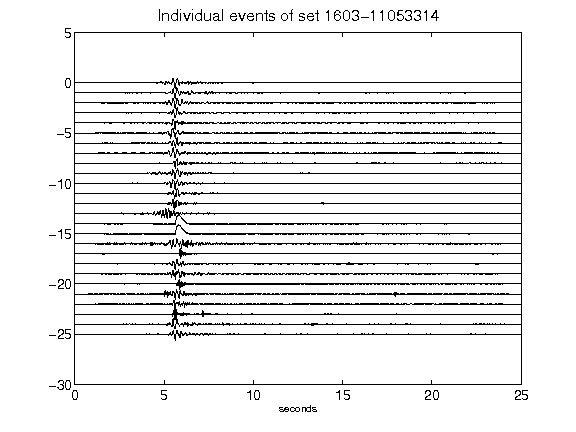](figures/1603-11053314_AllEv.png)[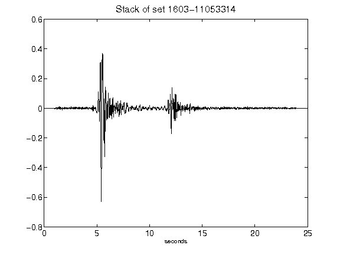](figures/1603-11053314_Stack.png)[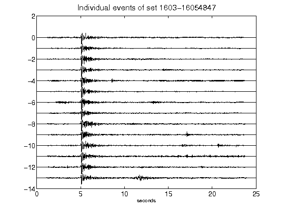](figures/1603-16054847_AllEv.png)[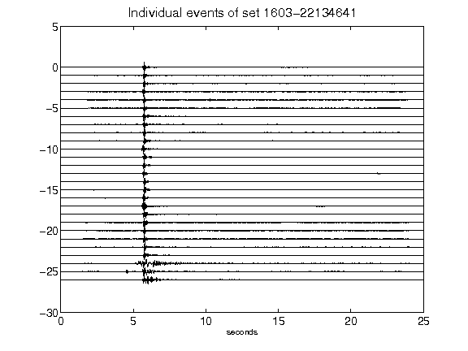](figures/1603-22134641_AllEv.png)[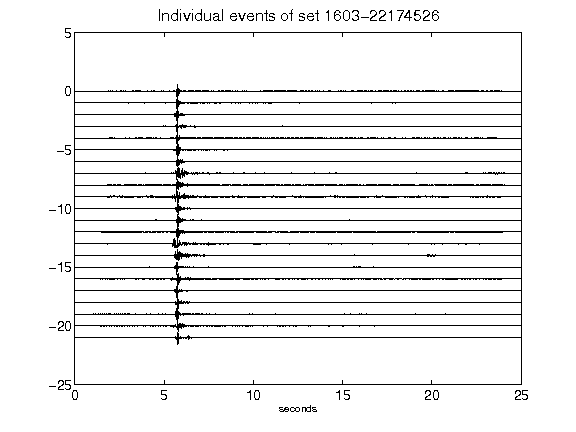](figures/1603-22174526_AllEv.png)[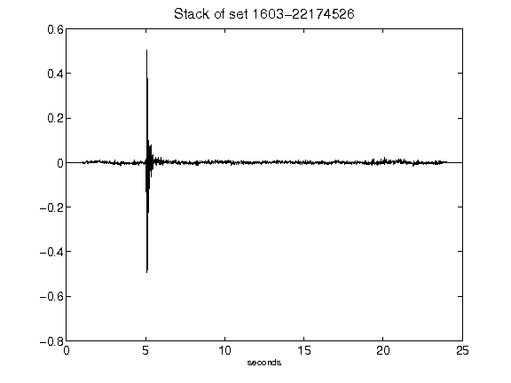](figures/1603-22174526_Stack.png)[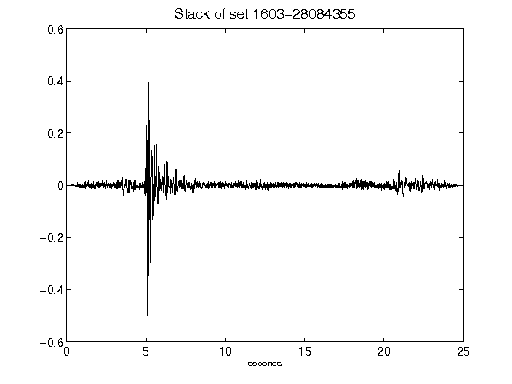](figures/1603-28084355_Stack.png)[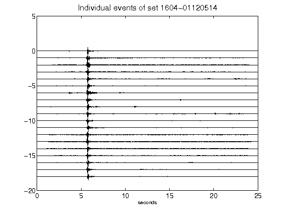](figures/1604-01120514_AllEv.png)[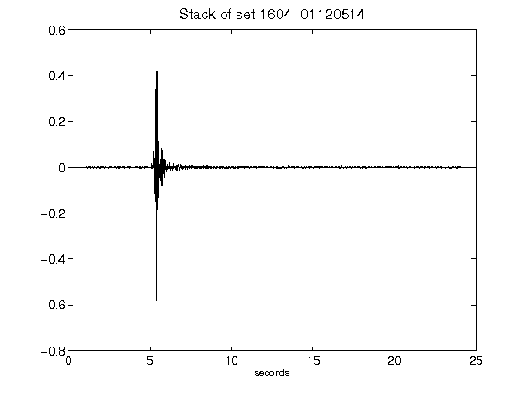](figures/1604-01120514_Stack.png)[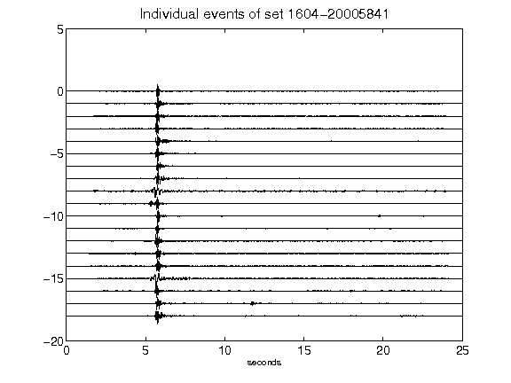](figures/1604-20005841_AllEv.png)[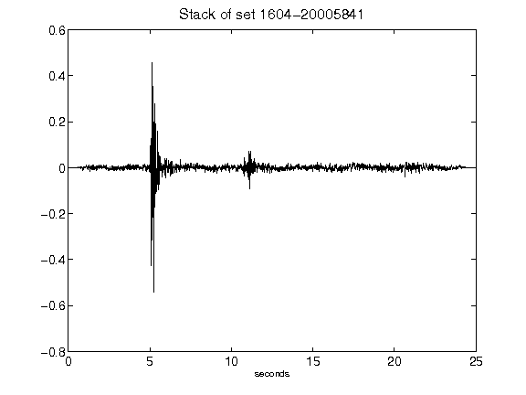](figures/1604-20005841_Stack.png)[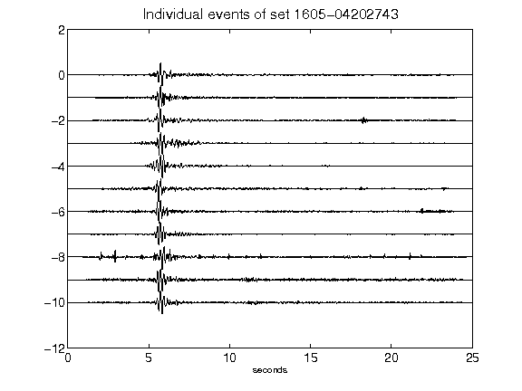](figures/1605-04202743_AllEv.png)[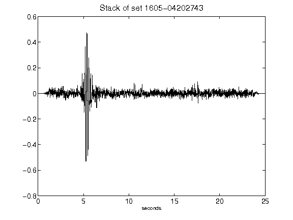](figures/1605-04202743_Stack.png)[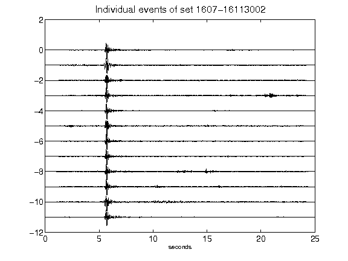](figures/1607-16113002_AllEv.png)