# Repeating Earthquake Activity at RCS

## Waveforms
[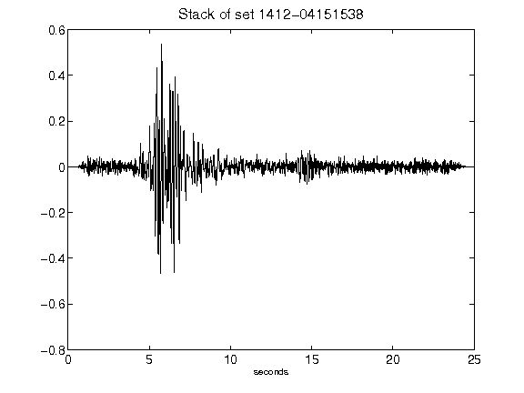](figures/1412-04151538_Stack.png)[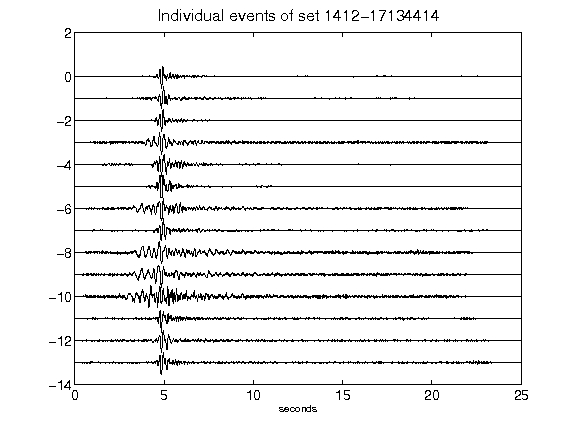](figures/1412-17134414_AllEv.png)[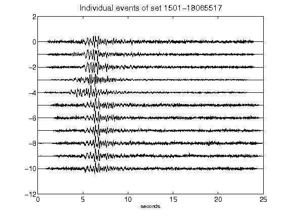](figures/1501-18065517_AllEv.png)[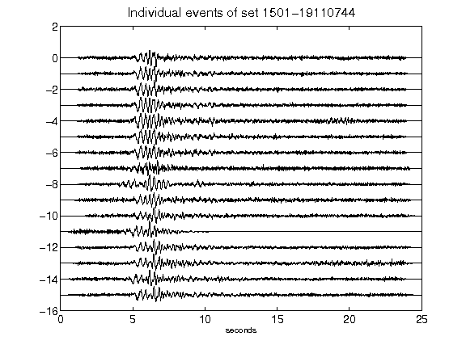](figures/1501-19110744_AllEv.png)[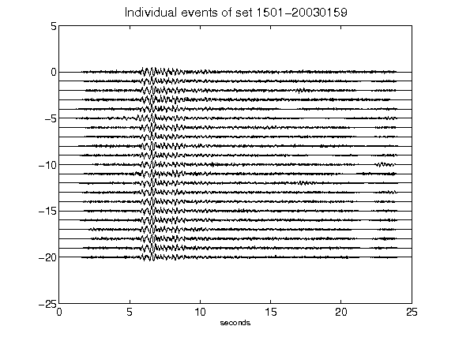](figures/1501-20030159_AllEv.png)[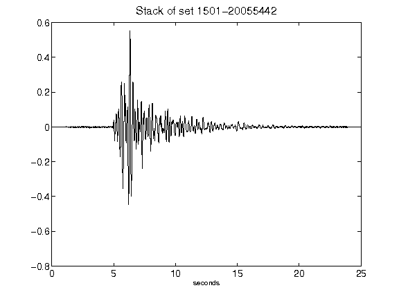](figures/1501-20055442_Stack.png)[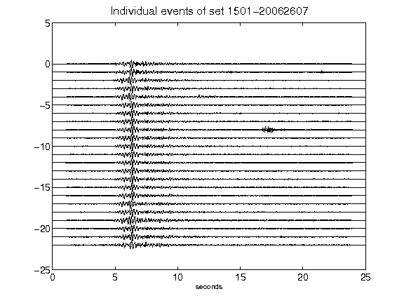](figures/1501-20062607_AllEv.png)[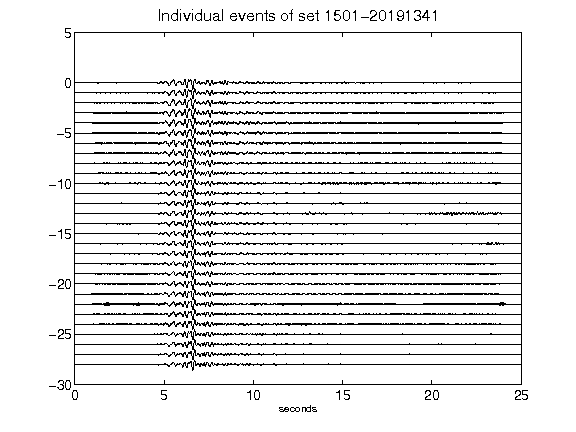](figures/1501-20191341_AllEv.png)[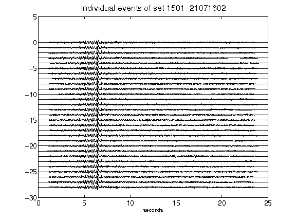](figures/1501-21071602_AllEv.png)[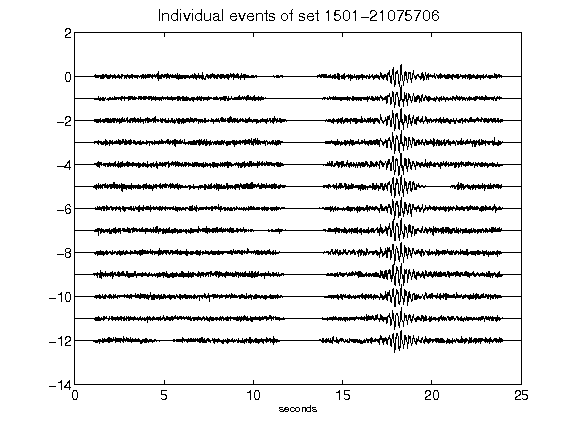](figures/1501-21075706_AllEv.png)[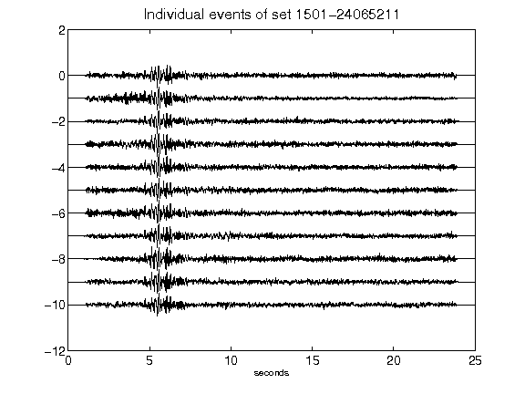](figures/1501-24065211_AllEv.png)[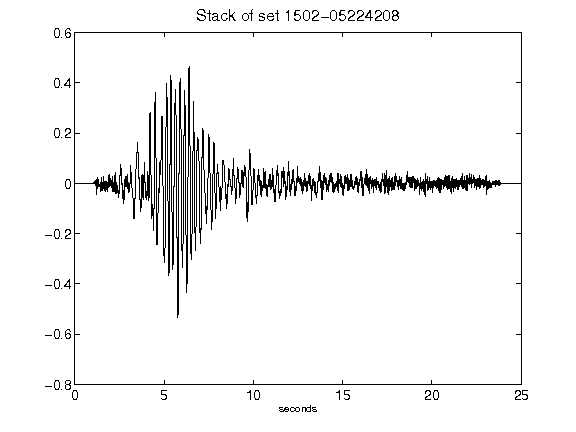](figures/1502-05224208_Stack.png)