# Repeating Earthquake Activity at RCS

## Waveforms
[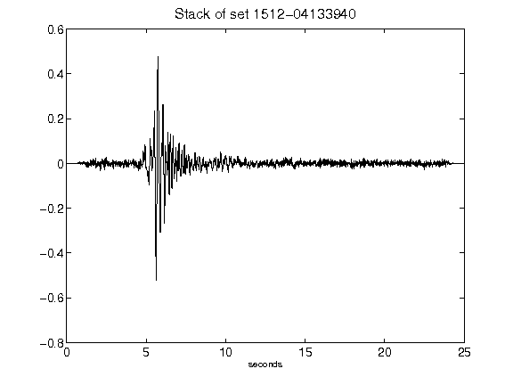](figures/1512-04133940_Stack.png)[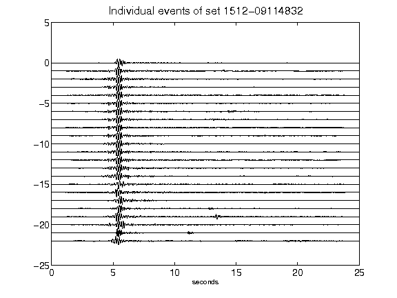](figures/1512-09114832_AllEv.png)[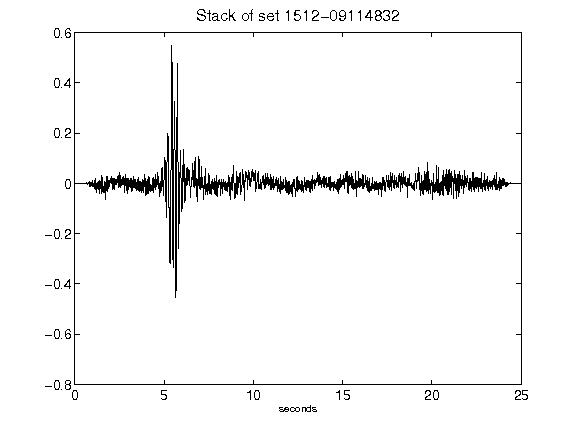](figures/1512-09114832_Stack.png)[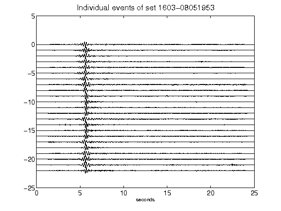](figures/1603-08051953_AllEv.png)[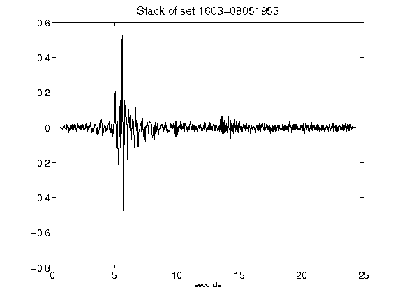](figures/1603-08051953_Stack.png)[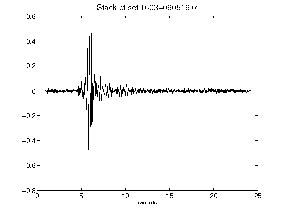](figures/1603-09051907_Stack.png)[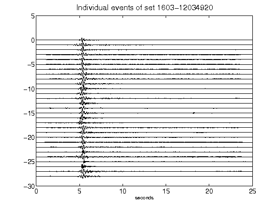](figures/1603-12034920_AllEv.png)[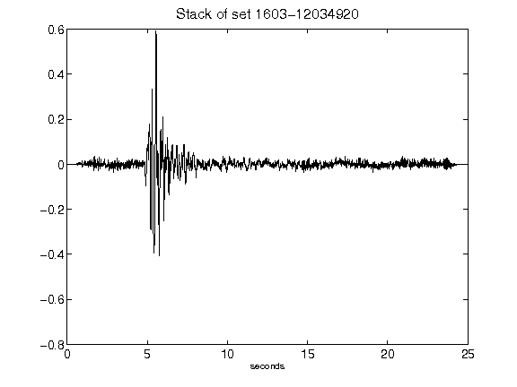](figures/1603-12034920_Stack.png)[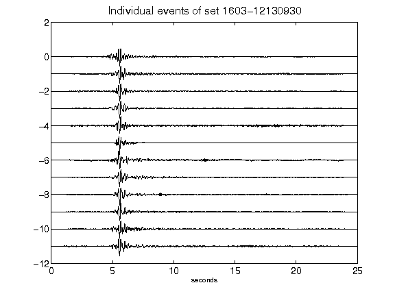](figures/1603-12130930_AllEv.png)[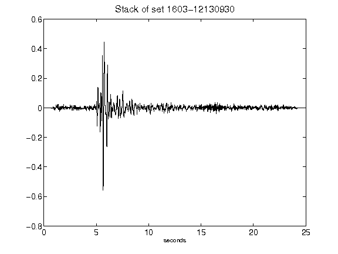](figures/1603-12130930_Stack.png)[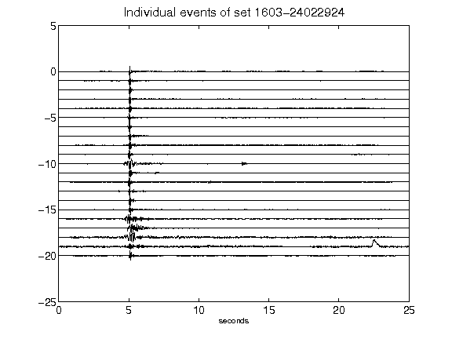](figures/1603-24022924_AllEv.png)[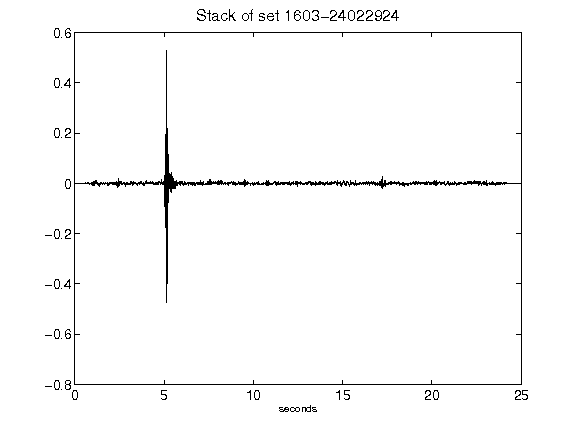](figures/1603-24022924_Stack.png)[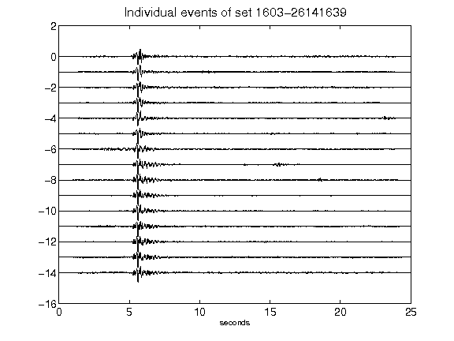](figures/1603-26141639_AllEv.png)[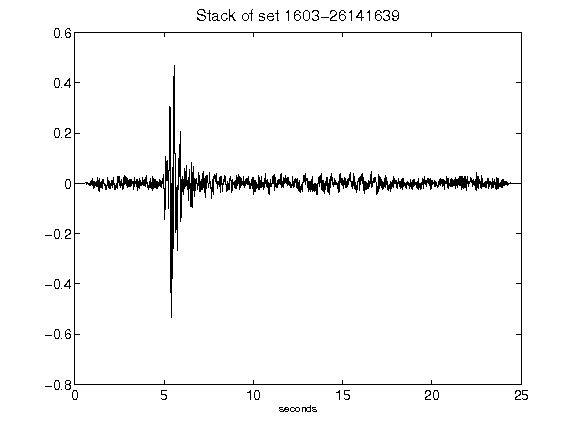](figures/1603-26141639_Stack.png)