# Repeating Earthquake Activity at RCS

## Waveforms
[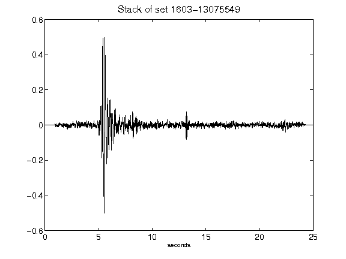](figures/1603-13075549_Stack.png)[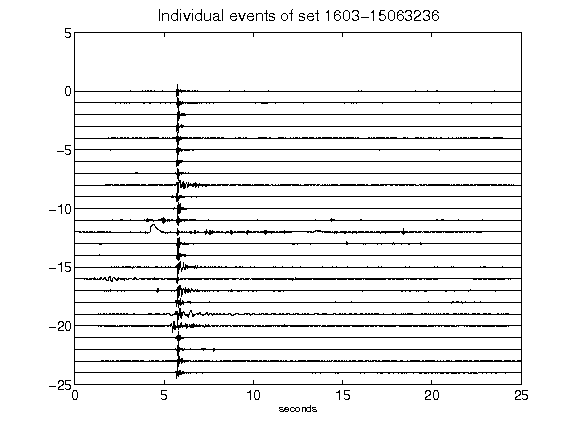](figures/1603-15063236_AllEv.png)[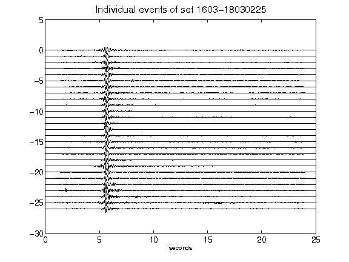](figures/1603-18030225_AllEv.png)[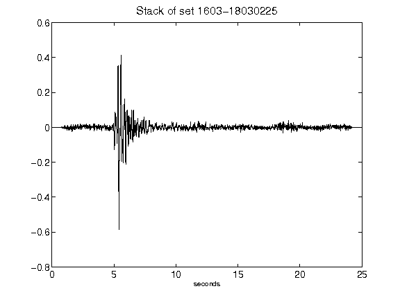](figures/1603-18030225_Stack.png)[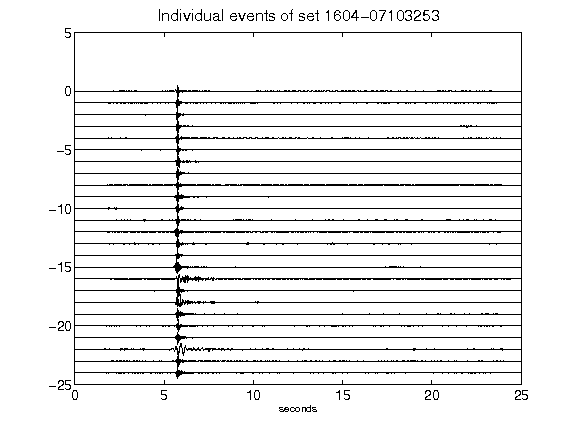](figures/1604-07103253_AllEv.png)[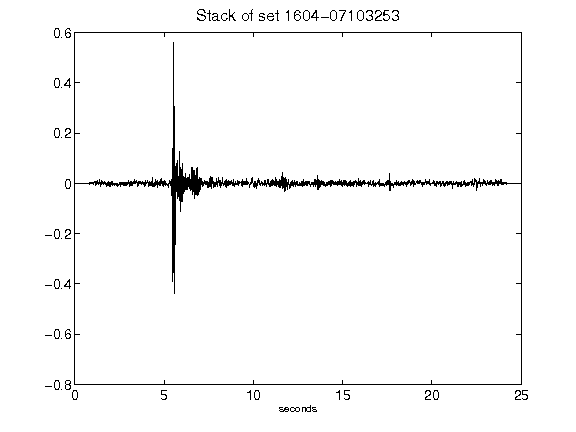](figures/1604-07103253_Stack.png)[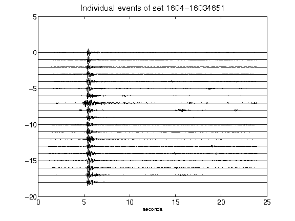](figures/1604-16034651_AllEv.png)[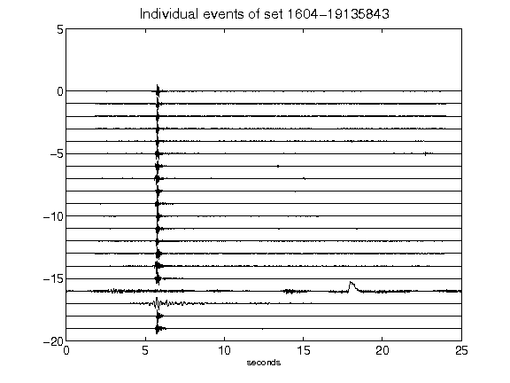](figures/1604-19135843_AllEv.png)[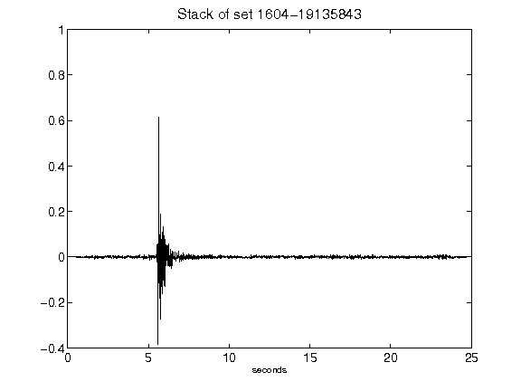](figures/1604-19135843_Stack.png)[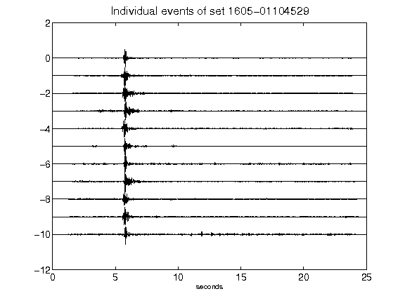](figures/1605-01104529_AllEv.png)[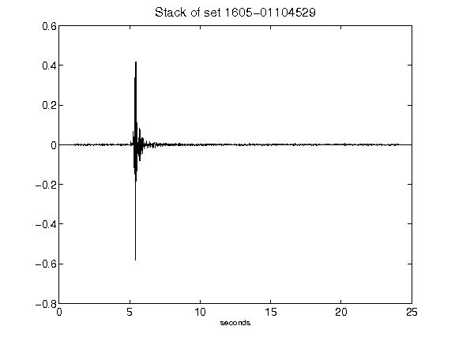](figures/1605-01104529_Stack.png)[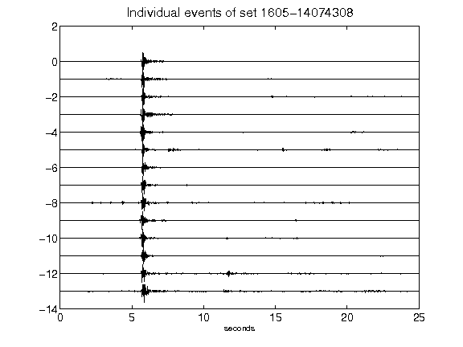](figures/1605-14074308_AllEv.png)[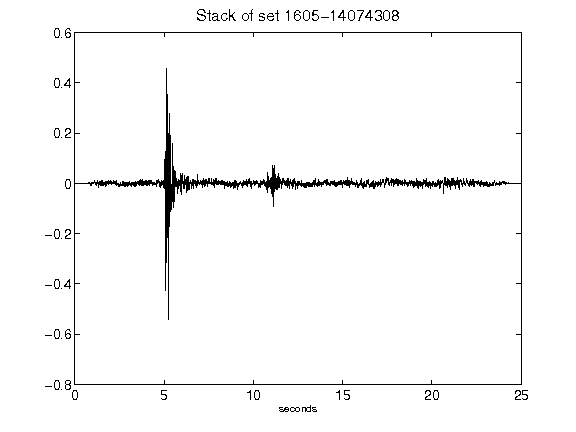](figures/1605-14074308_Stack.png)[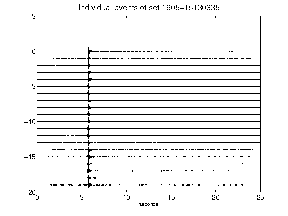](figures/1605-15130335_AllEv.png)[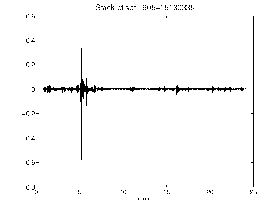](figures/1605-15130335_Stack.png)[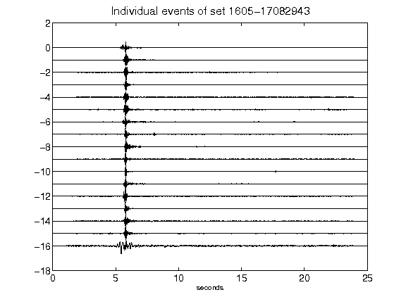](figures/1605-17082943_AllEv.png)[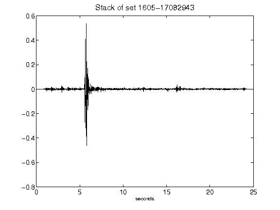](figures/1605-17082943_Stack.png)[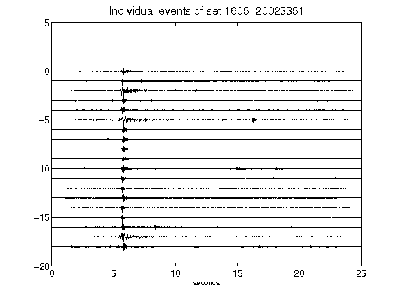](figures/1605-20023351_AllEv.png)[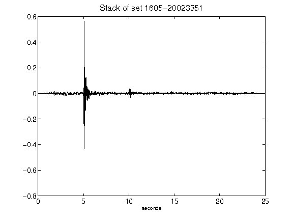](figures/1605-20023351_Stack.png)[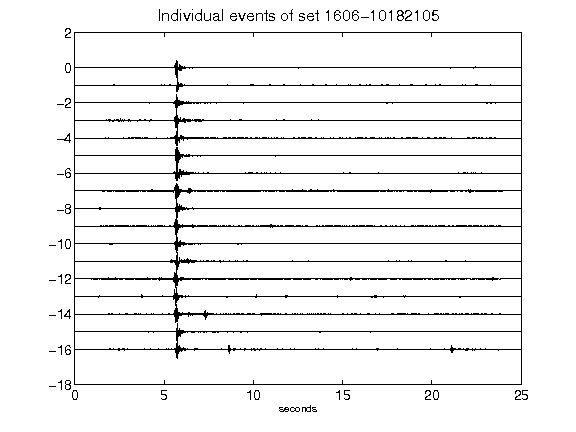](figures/1606-10182105_AllEv.png)[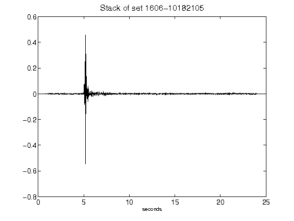](figures/1606-10182105_Stack.png)