# Repeating Earthquake Activity at RCS

## Waveforms
[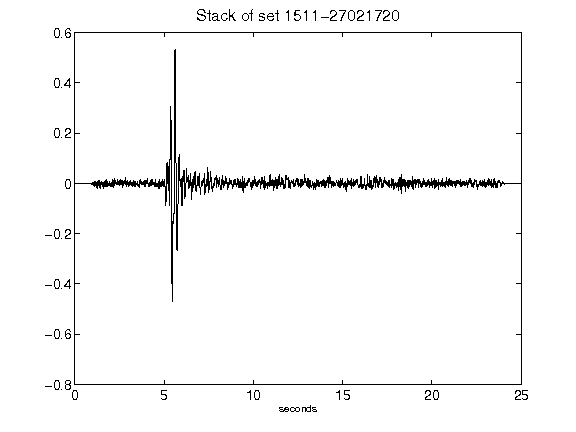](figures/1511-27021720_Stack.png)[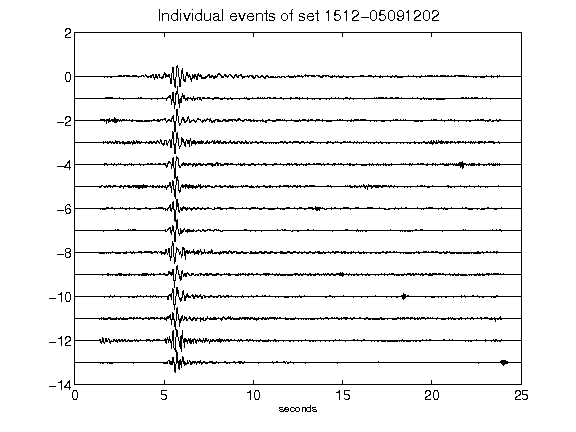](figures/1512-05091202_AllEv.png)[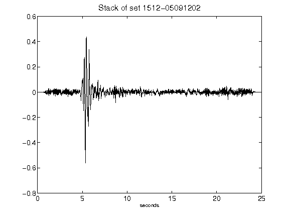](figures/1512-05091202_Stack.png)[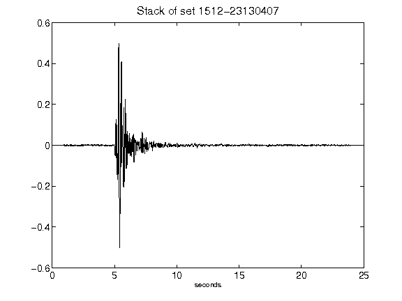](figures/1512-23130407_Stack.png)[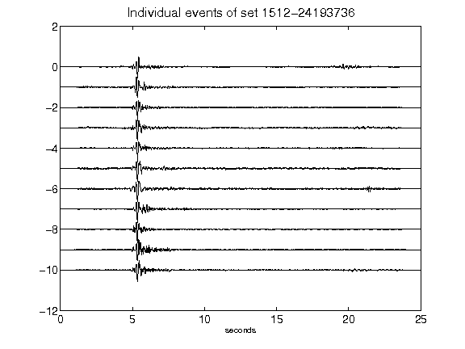](figures/1512-24193736_AllEv.png)[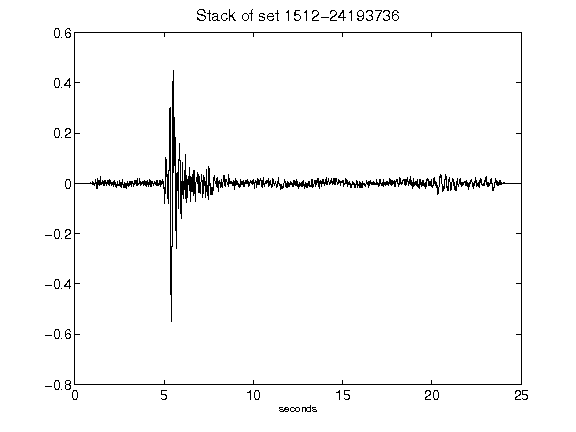](figures/1512-24193736_Stack.png)[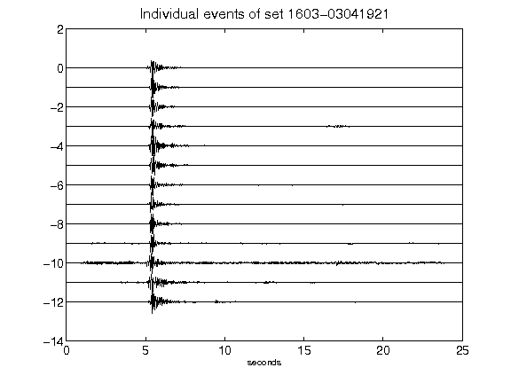](figures/1603-03041921_AllEv.png)[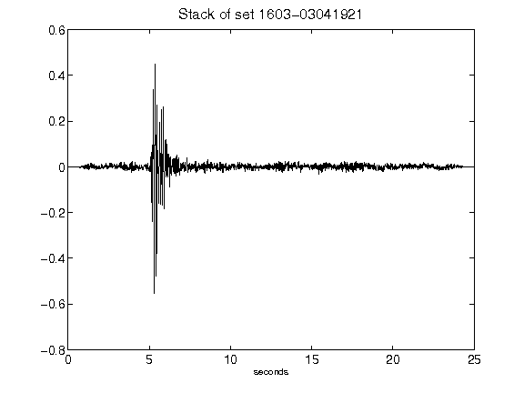](figures/1603-03041921_Stack.png)[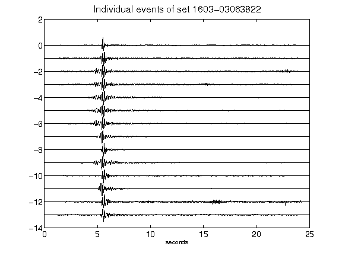](figures/1603-03063822_AllEv.png)[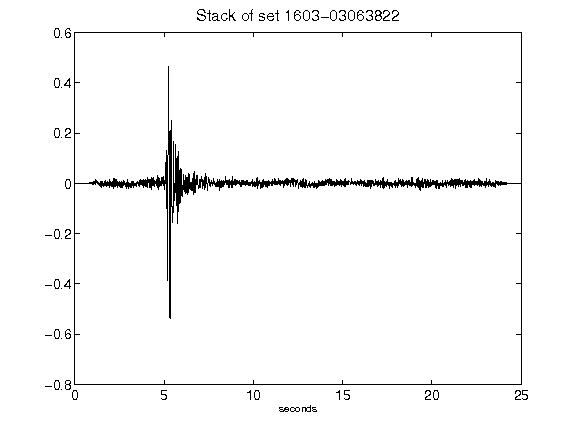](figures/1603-03063822_Stack.png)[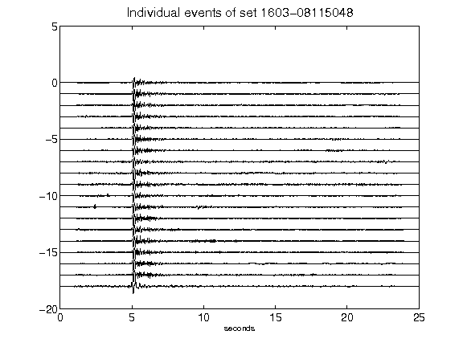](figures/1603-08115048_AllEv.png)[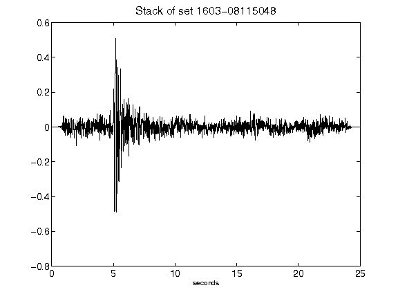](figures/1603-08115048_Stack.png)[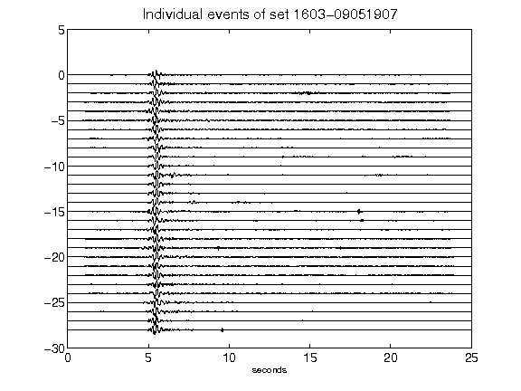](figures/1603-09051907_AllEv.png)[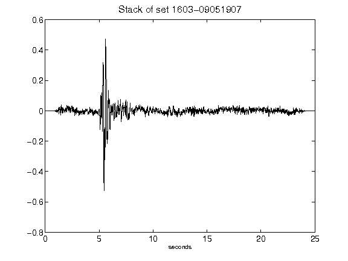](figures/1603-09051907_Stack.png)[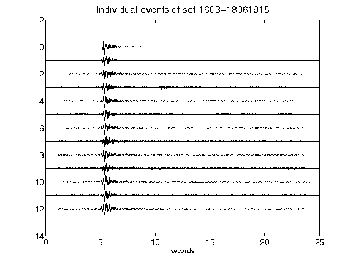](figures/1603-18061915_AllEv.png)[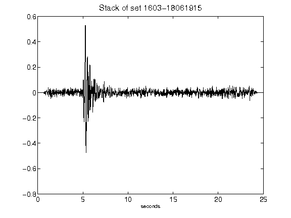](figures/1603-18061915_Stack.png)[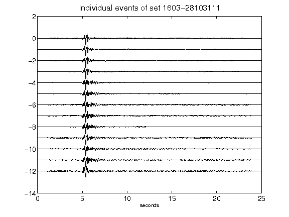](figures/1603-28103111_AllEv.png)[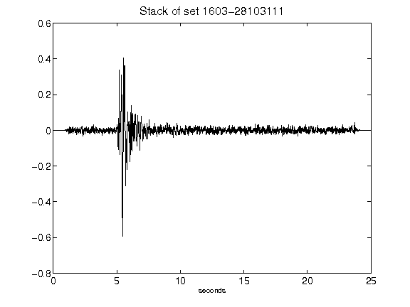](figures/1603-28103111_Stack.png)