# Repeating Earthquake Activity at RCS

## Waveforms
[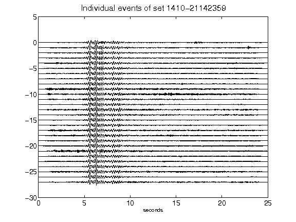](figures/1410-21142359_AllEv.png)[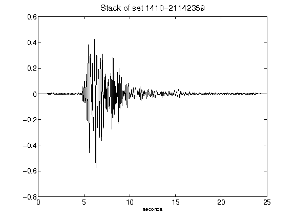](figures/1410-21142359_Stack.png)[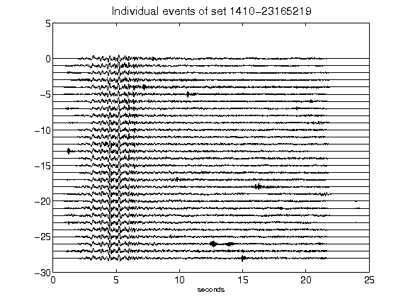](figures/1410-23165219_AllEv.png)[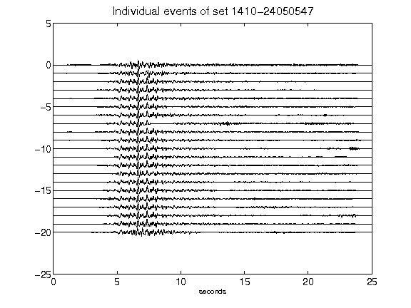](figures/1410-24050547_AllEv.png)[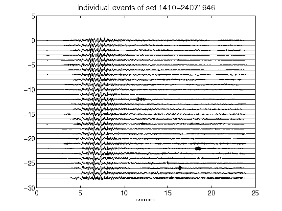](figures/1410-24071946_AllEv.png)[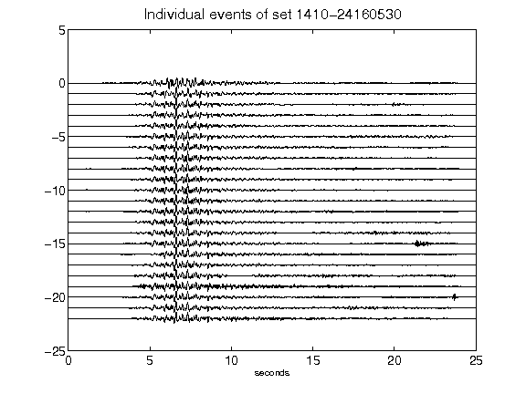](figures/1410-24160530_AllEv.png)[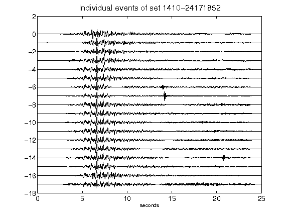](figures/1410-24171852_AllEv.png)[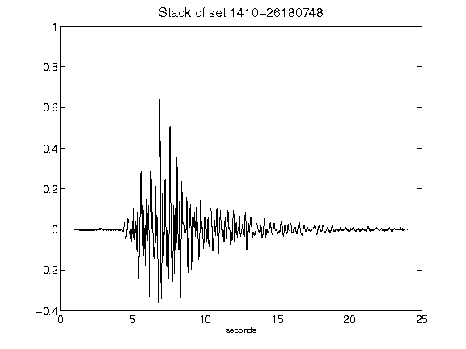](figures/1410-26180748_Stack.png)[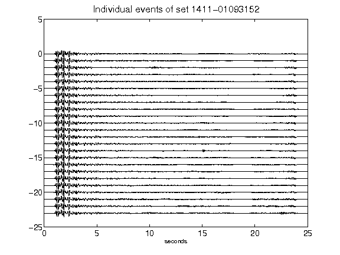](figures/1411-01093152_AllEv.png)[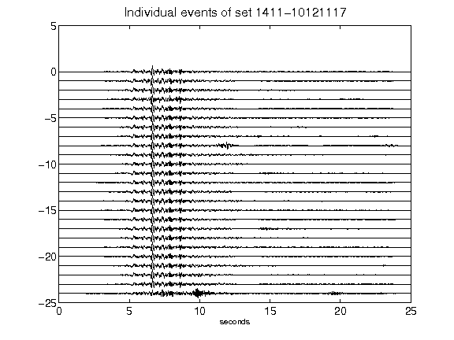](figures/1411-10121117_AllEv.png)[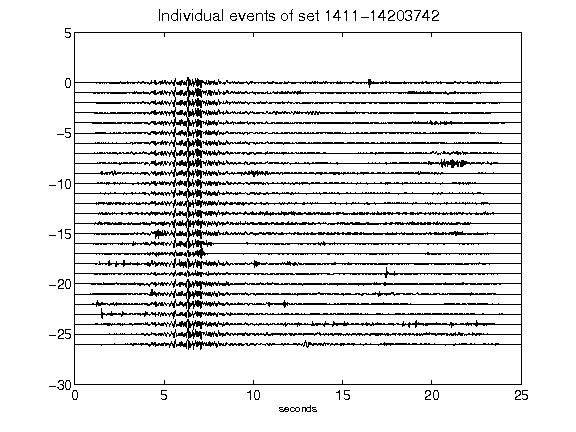](figures/1411-14203742_AllEv.png)[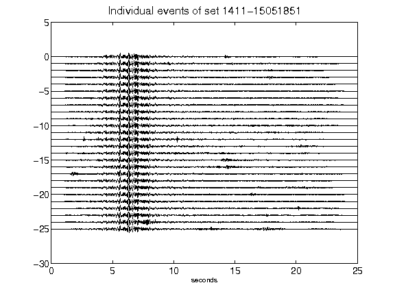](figures/1411-15051851_AllEv.png)[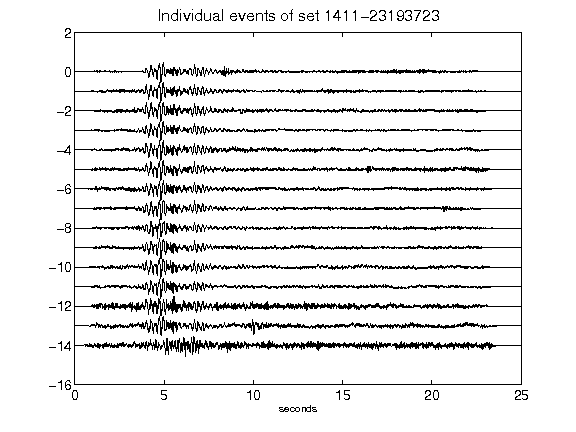](figures/1411-23193723_AllEv.png)