# Repeating Earthquake Activity at RCS

## Waveforms
[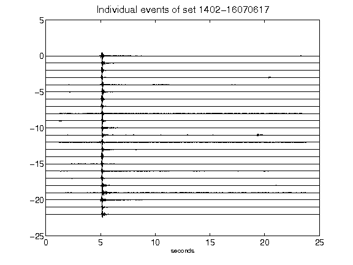](figures/1402-16070617_AllEv.png)[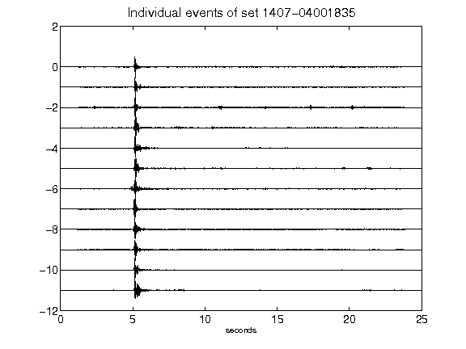](figures/1407-04001835_AllEv.png)[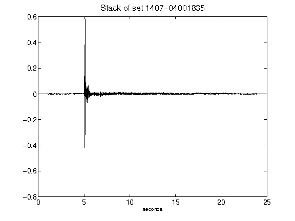](figures/1407-04001835_Stack.png)[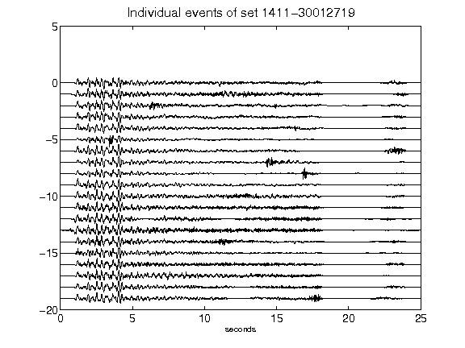](figures/1411-30012719_AllEv.png)[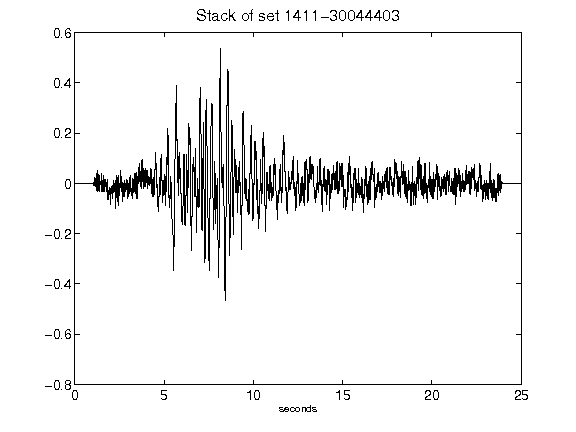](figures/1411-30044403_Stack.png)[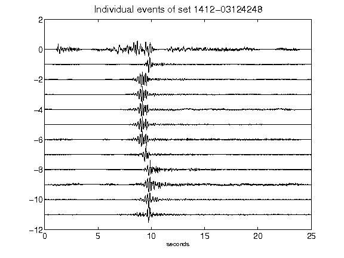](figures/1412-03124248_AllEv.png)[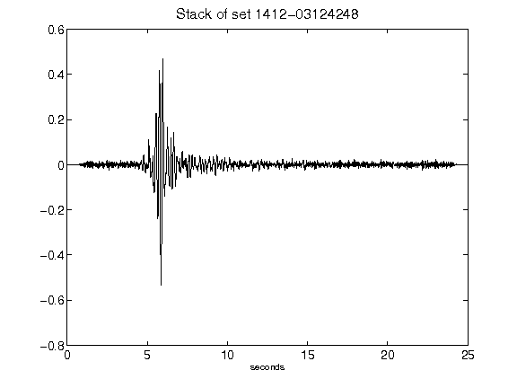](figures/1412-03124248_Stack.png)[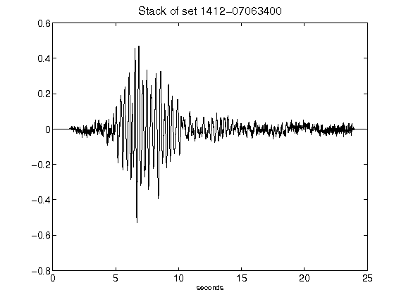](figures/1412-07063400_Stack.png)[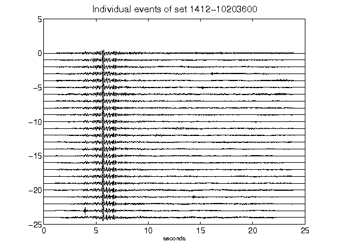](figures/1412-10203600_AllEv.png)[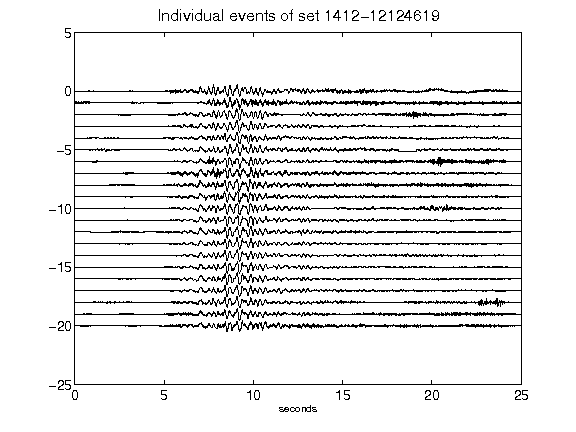](figures/1412-12124619_AllEv.png)[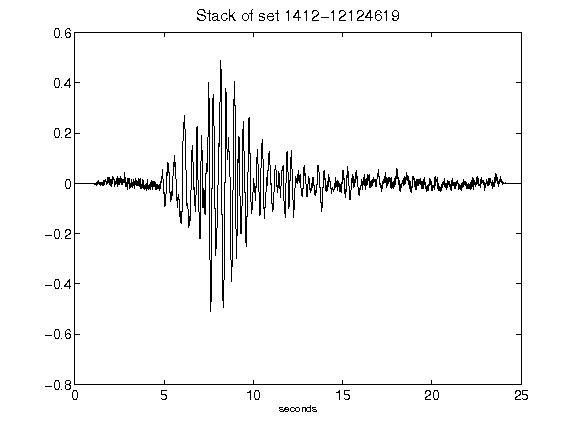](figures/1412-12124619_Stack.png)