# Repeating Earthquake Activity at RCS

## Waveforms
[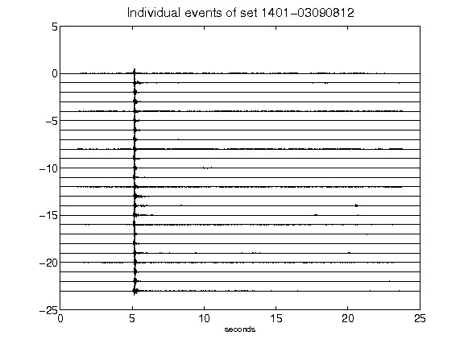](figures/1401-03090812_AllEv.png)[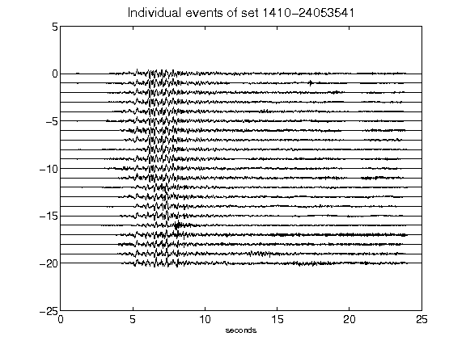](figures/1410-24053541_AllEv.png)[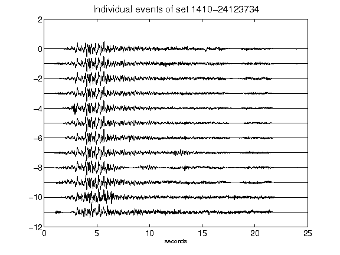](figures/1410-24123734_AllEv.png)[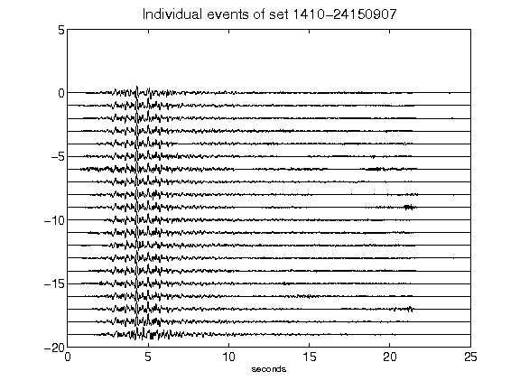](figures/1410-24150907_AllEv.png)[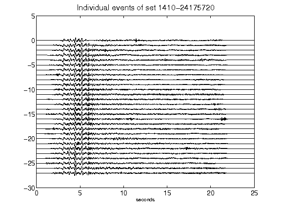](figures/1410-24175720_AllEv.png)[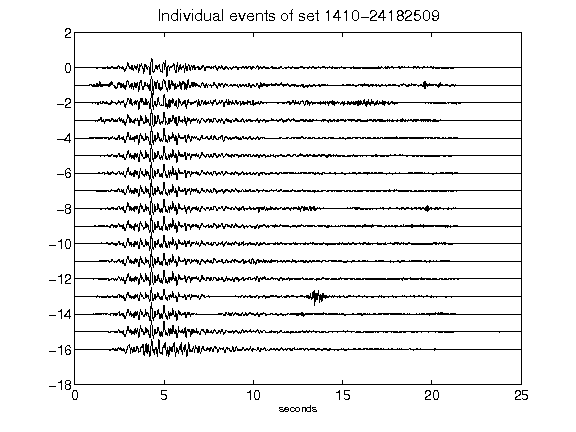](figures/1410-24182509_AllEv.png)[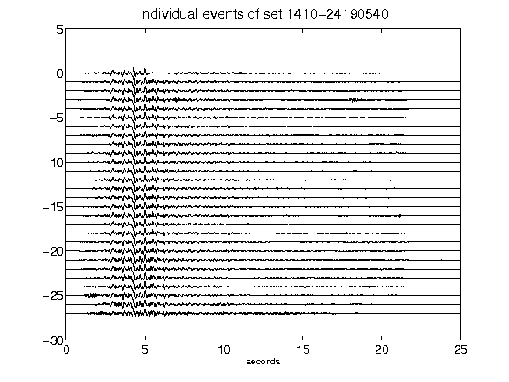](figures/1410-24190540_AllEv.png)[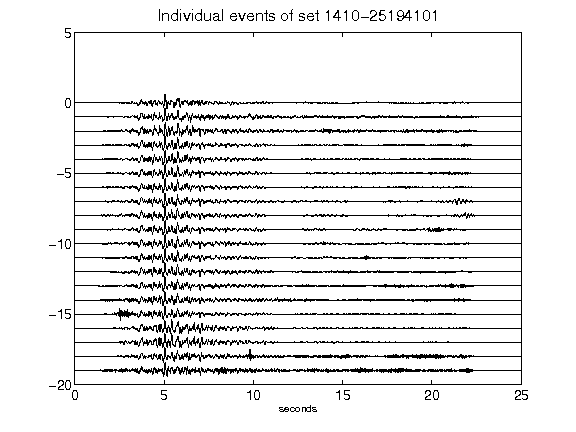](figures/1410-25194101_AllEv.png)[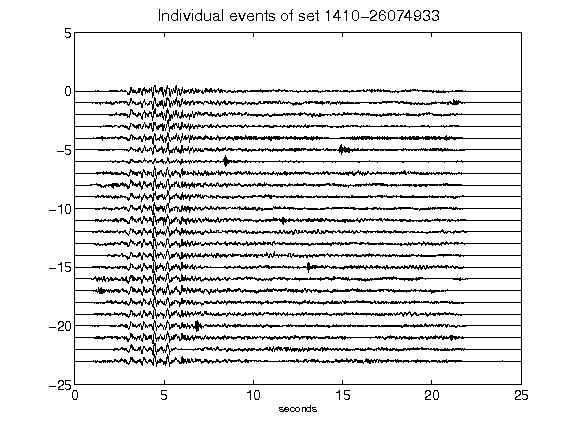](figures/1410-26074933_AllEv.png)[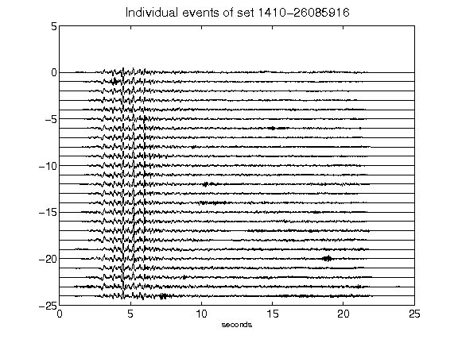](figures/1410-26085916_AllEv.png)[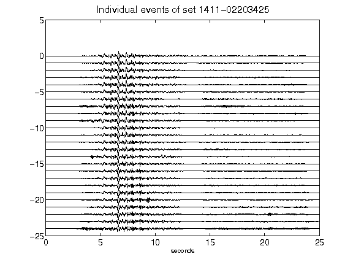](figures/1411-02203425_AllEv.png)[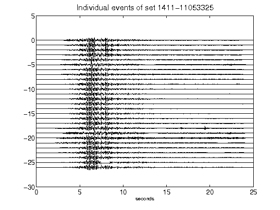](figures/1411-11053325_AllEv.png)[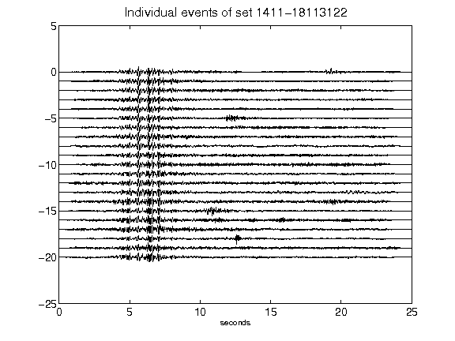](figures/1411-18113122_AllEv.png)[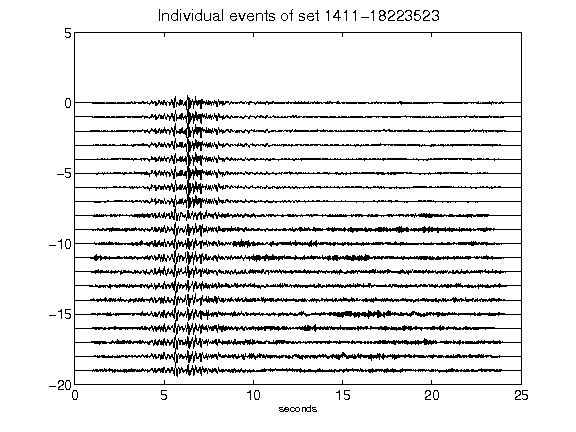](figures/1411-18223523_AllEv.png)[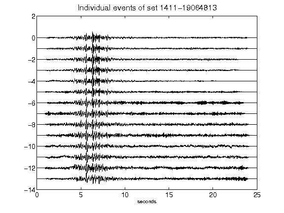](figures/1411-19064813_AllEv.png)[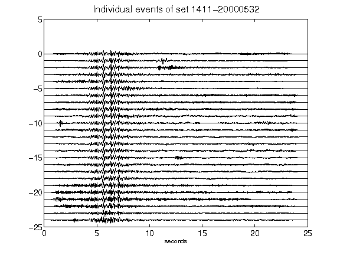](figures/1411-20000532_AllEv.png)[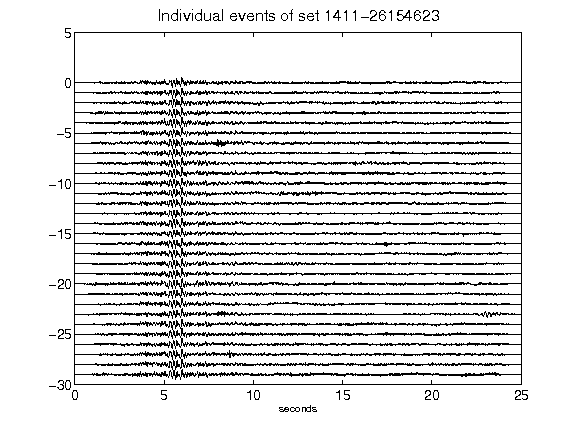](figures/1411-26154623_AllEv.png)