# Repeating Earthquake Activity at RCS
  
  

## Waveforms
[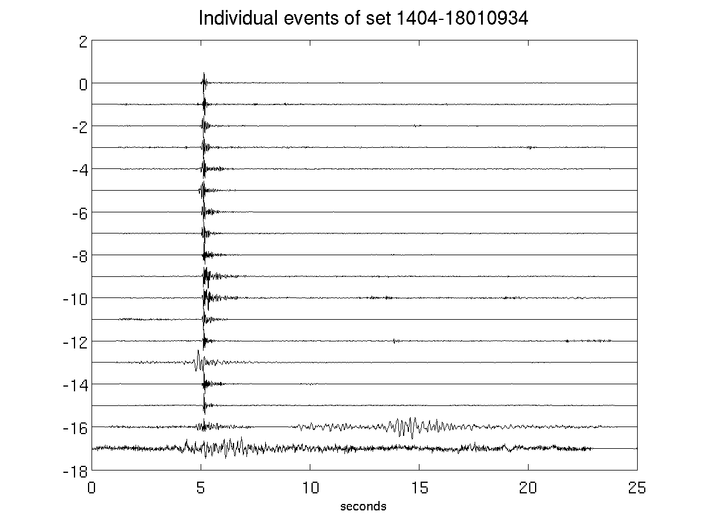](figures/1404-18010934_AllEv.png)[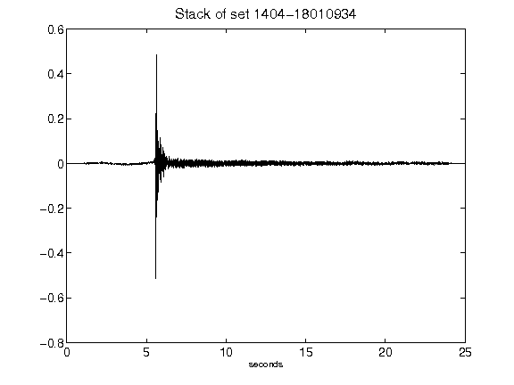](figures/1404-18010934_Stack.png)[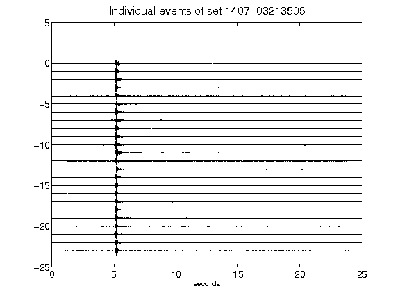](figures/1407-03213505_AllEv.png)[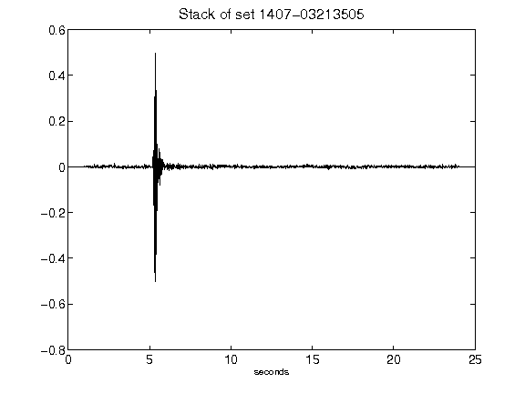](figures/1407-03213505_Stack.png)[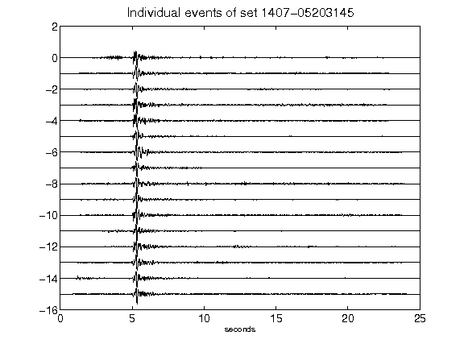](figures/1407-05203145_AllEv.png)[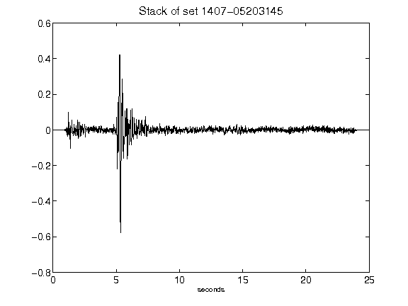](figures/1407-05203145_Stack.png)[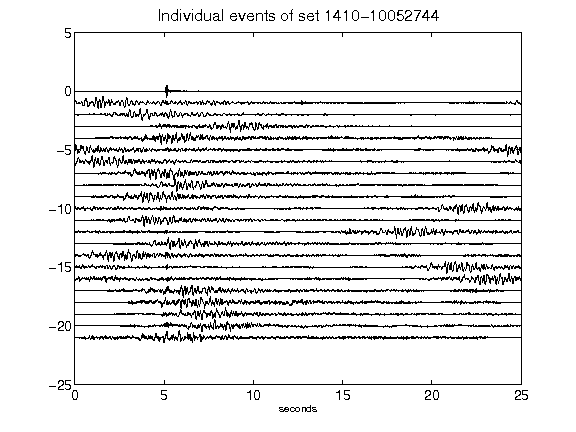](figures/1410-10052744_AllEv.png)[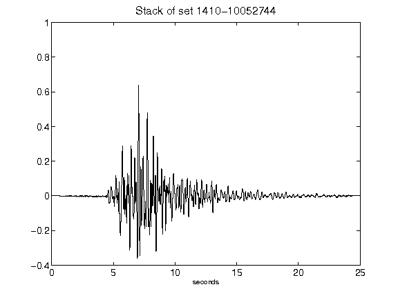](figures/1410-10052744_Stack.png)[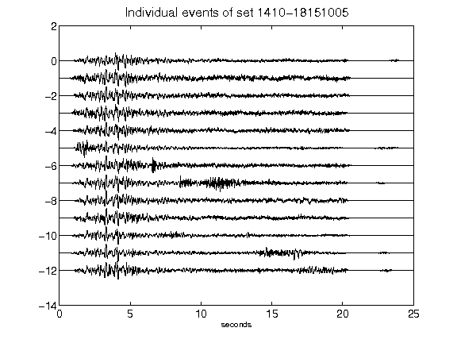](figures/1410-18151005_AllEv.png)[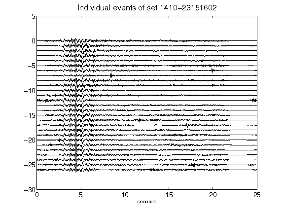](figures/1410-23151602_AllEv.png)[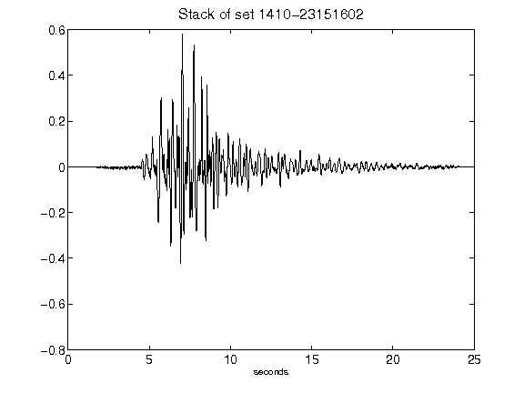](figures/1410-23151602_Stack.png)[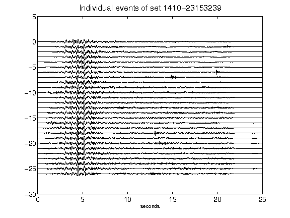](figures/1410-23153239_AllEv.png)[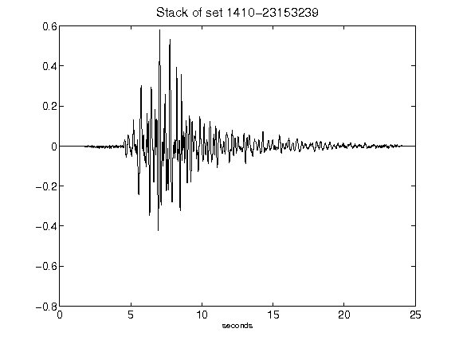](figures/1410-23153239_Stack.png)[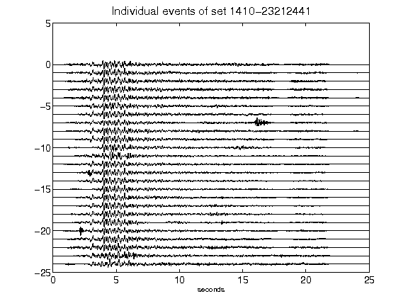](figures/1410-23212441_AllEv.png)[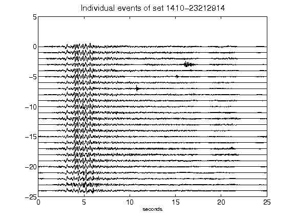](figures/1410-23212914_AllEv.png)[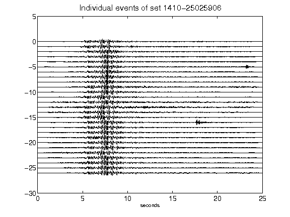](figures/1410-25025906_AllEv.png)[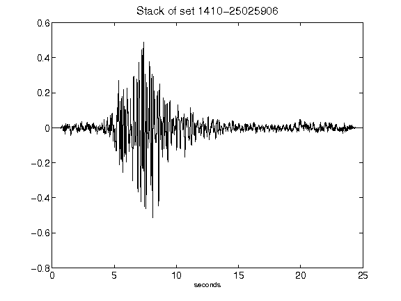](figures/1410-25025906_Stack.png)[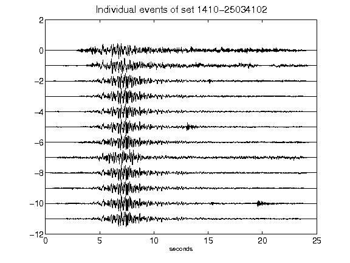](figures/1410-25034102_AllEv.png)[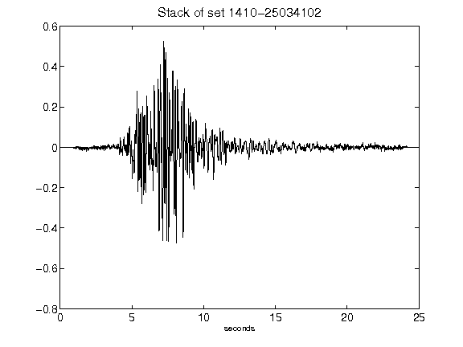](figures/1410-25034102_Stack.png)[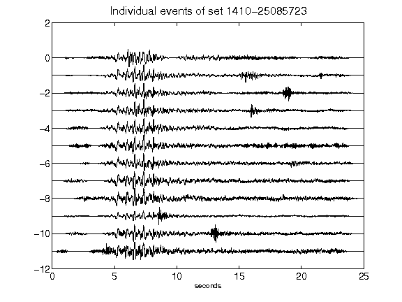](figures/1410-25085723_AllEv.png)[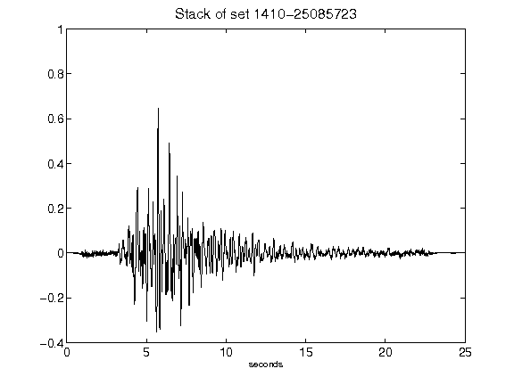](figures/1410-25085723_Stack.png)[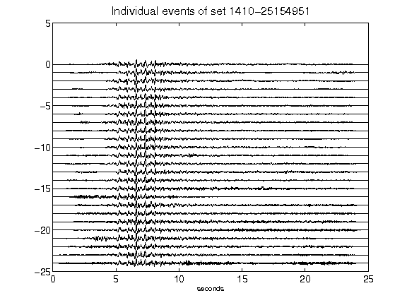](figures/1410-25154951_AllEv.png)[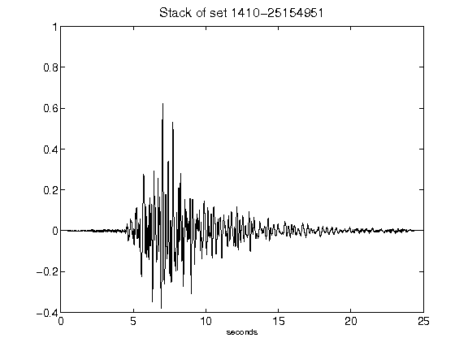](figures/1410-25154951_Stack.png)[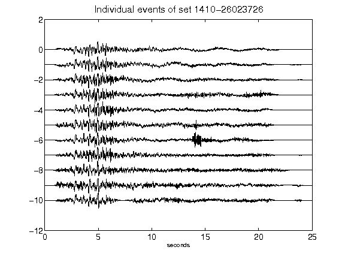](figures/1410-26023726_AllEv.png)[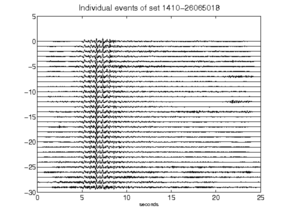](figures/1410-26065018_AllEv.png)[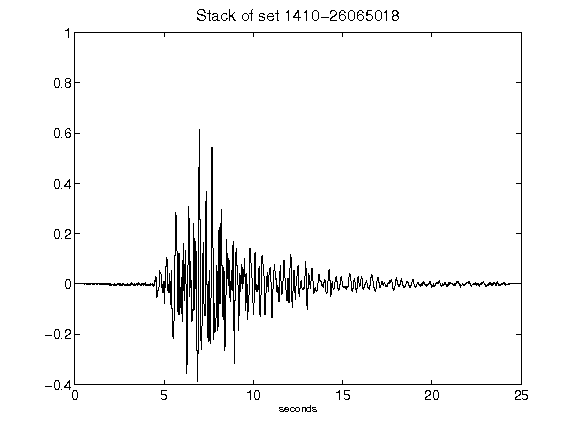](figures/1410-26065018_Stack.png)[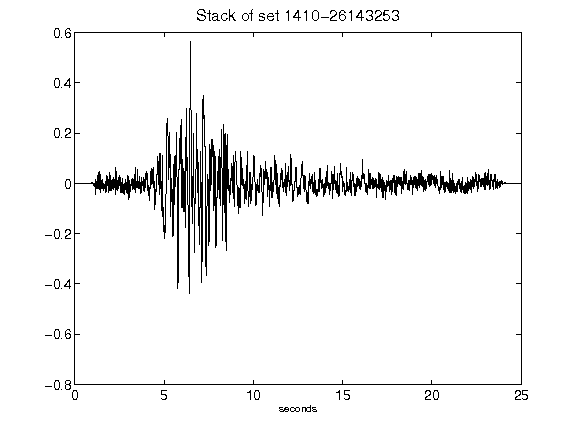](figures/1410-26143253_Stack.png)[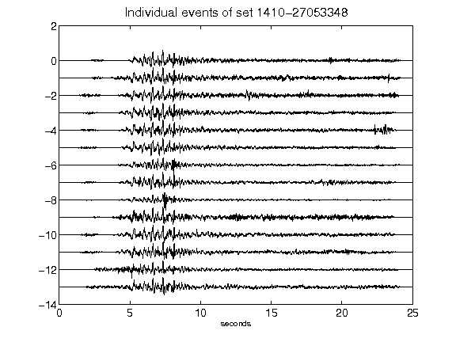](figures/1410-27053348_AllEv.png)[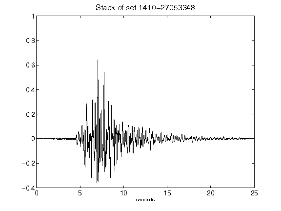](figures/1410-27053348_Stack.png)[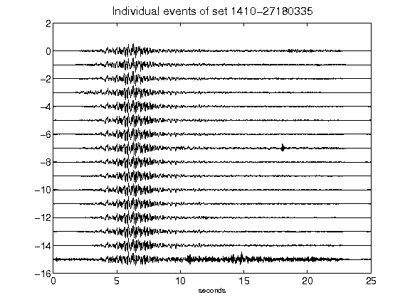](figures/1410-27180335_AllEv.png)[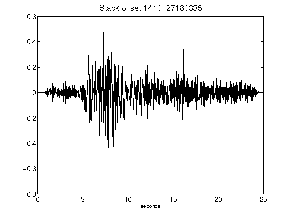](figures/1410-27180335_Stack.png)[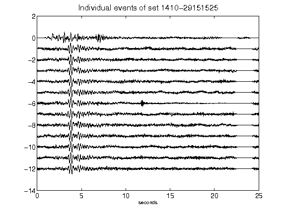](figures/1410-29151525_AllEv.png)[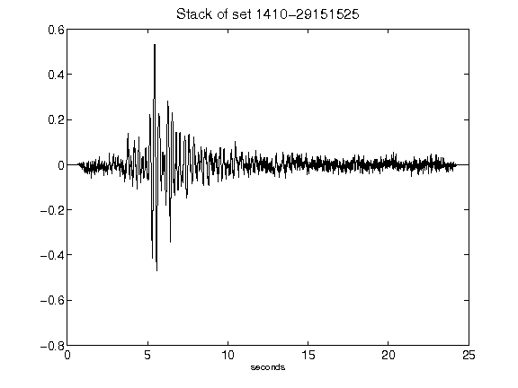](figures/1410-29151525_Stack.png)