# Repeating Earthquake Activity at RCS

## Waveforms
[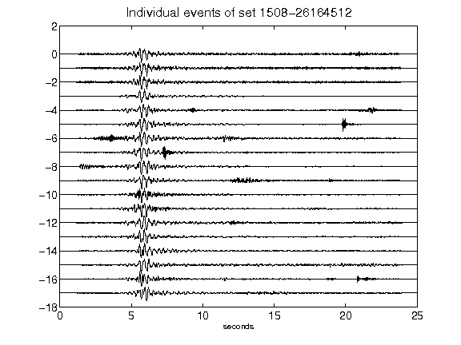](figures/1508-26164512_AllEv.png)[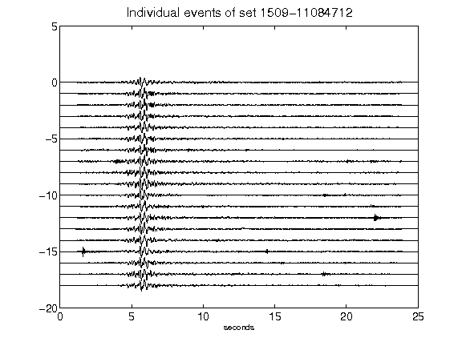](figures/1509-11084712_AllEv.png)[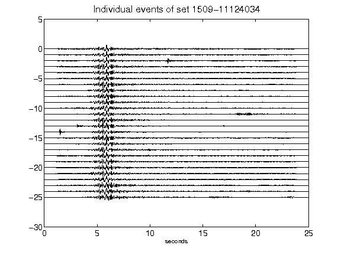](figures/1509-11124034_AllEv.png)[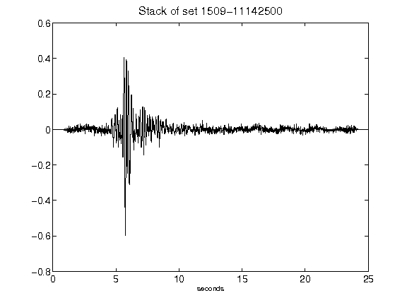](figures/1509-11142500_Stack.png)[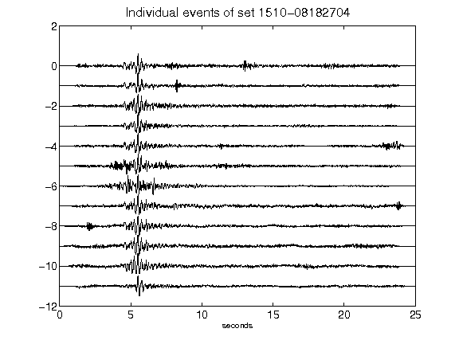](figures/1510-08182704_AllEv.png)[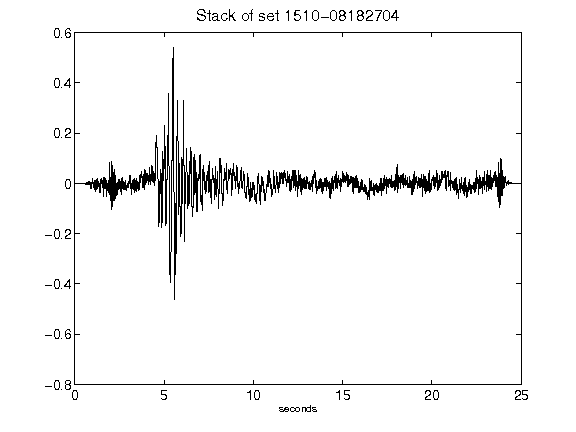](figures/1510-08182704_Stack.png)[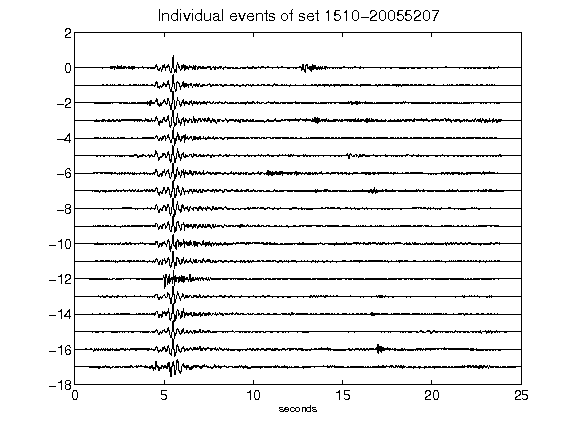](figures/1510-20055207_AllEv.png)[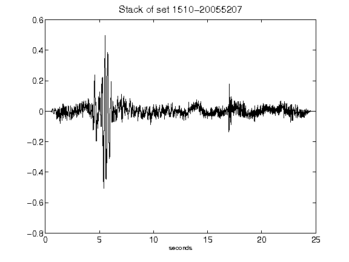](figures/1510-20055207_Stack.png)[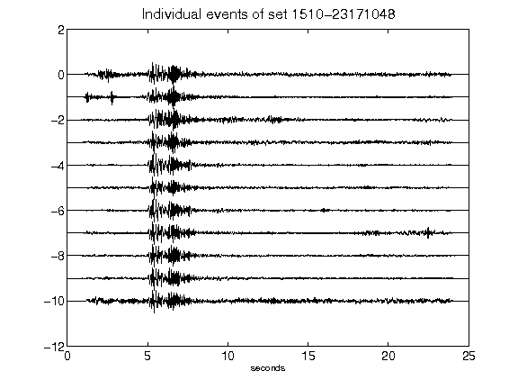](figures/1510-23171048_AllEv.png)[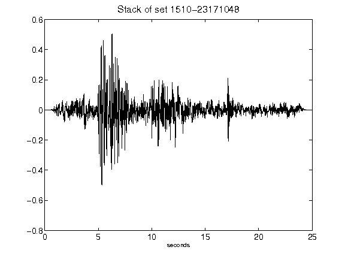](figures/1510-23171048_Stack.png)[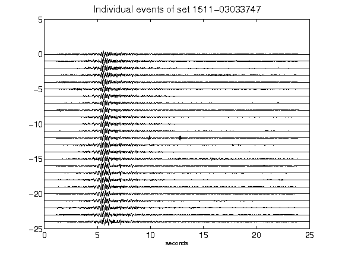](figures/1511-03033747_AllEv.png)[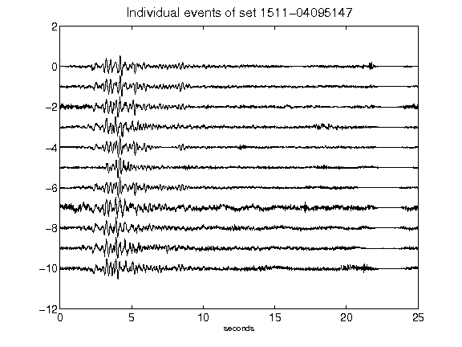](figures/1511-04095147_AllEv.png)[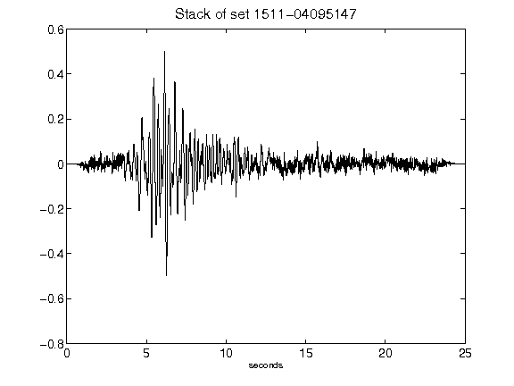](figures/1511-04095147_Stack.png)[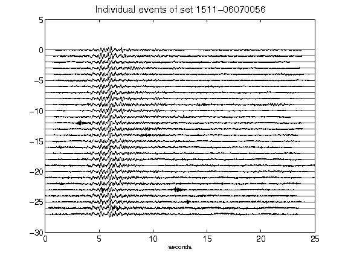](figures/1511-06070056_AllEv.png)[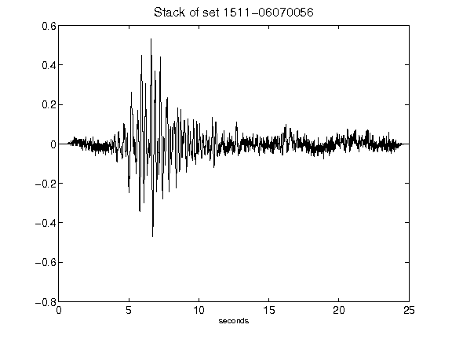](figures/1511-06070056_Stack.png)[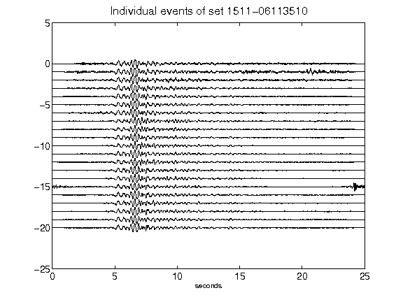](figures/1511-06113510_AllEv.png)[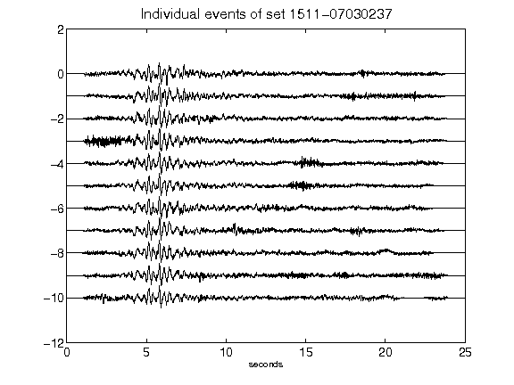](figures/1511-07030237_AllEv.png)