# Repeating Earthquake Activity at RCS
[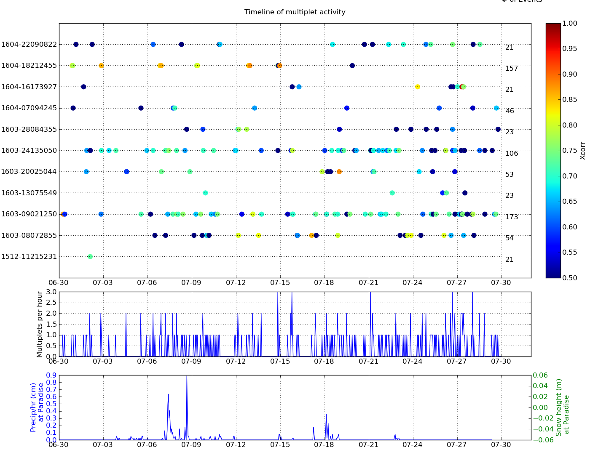](figures/multTimeline20py.png)

## Waveforms
[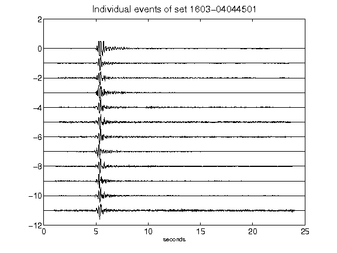](figures/1603-04044501_AllEv.png)[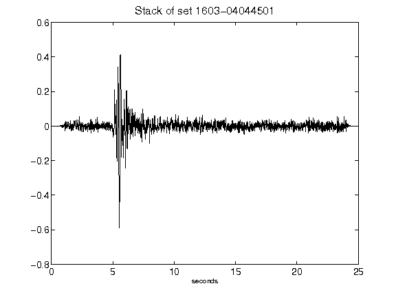](figures/1603-04044501_Stack.png)[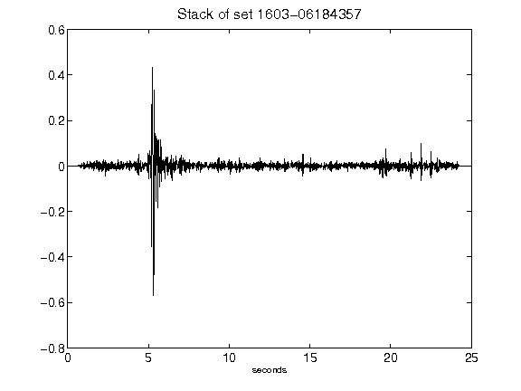](figures/1603-06184357_Stack.png)[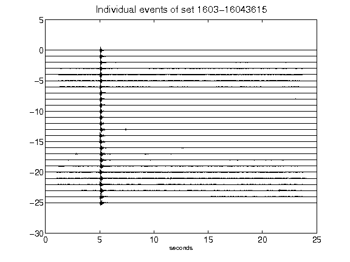](figures/1603-16043615_AllEv.png)[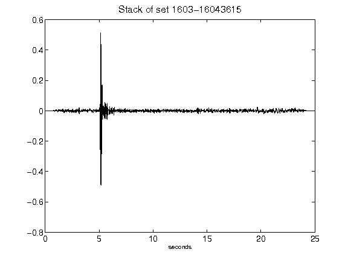](figures/1603-16043615_Stack.png)[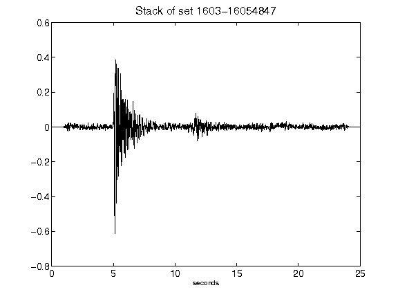](figures/1603-16054847_Stack.png)[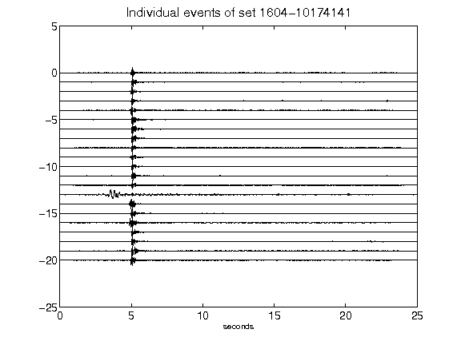](figures/1604-10174141_AllEv.png)[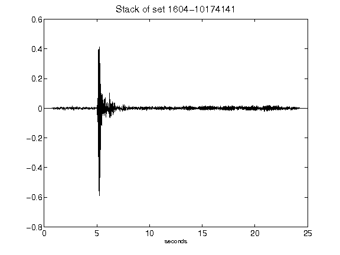](figures/1604-10174141_Stack.png)[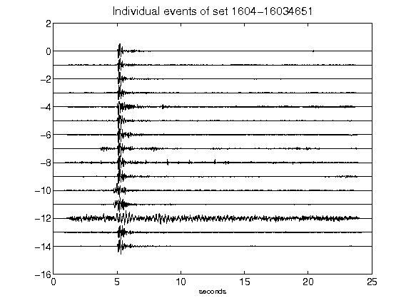](figures/1604-16034651_AllEv.png)[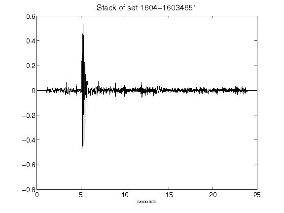](figures/1604-16034651_Stack.png)[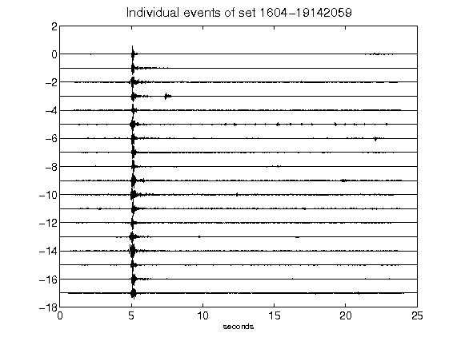](figures/1604-19142059_AllEv.png)[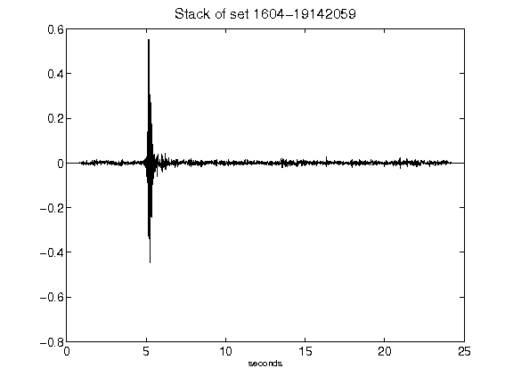](figures/1604-19142059_Stack.png)[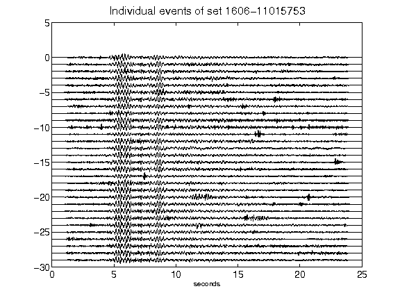](figures/1606-11015753_AllEv.png)