# Repeating Earthquake Activity at RCS

## Waveforms
[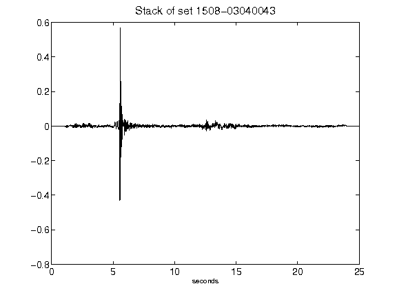](figures/1508-03040043_Stack.png)[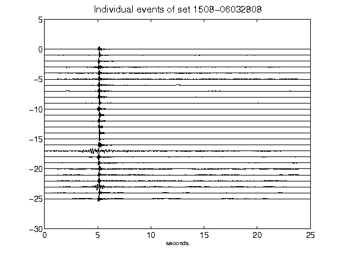](figures/1508-06032808_AllEv.png)[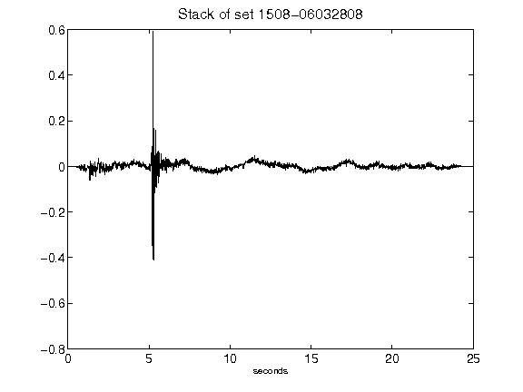](figures/1508-06032808_Stack.png)[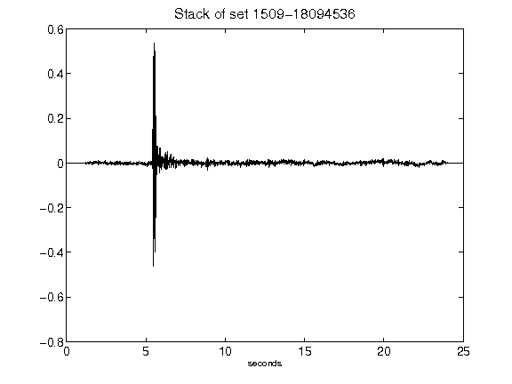](figures/1509-18094536_Stack.png)[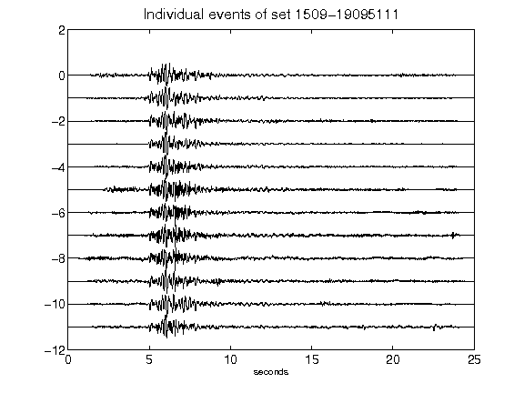](figures/1509-19095111_AllEv.png)[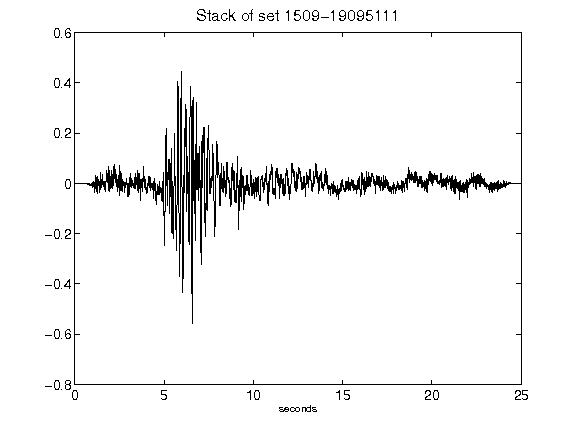](figures/1509-19095111_Stack.png)[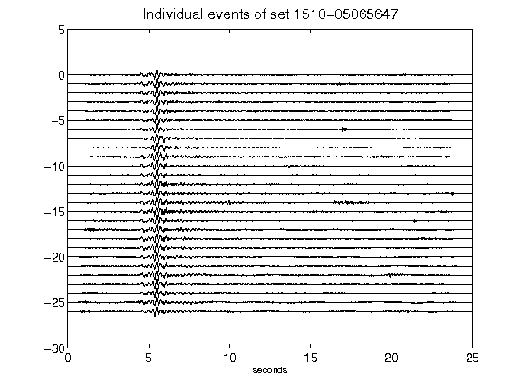](figures/1510-05065647_AllEv.png)[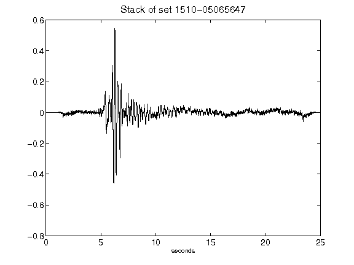](figures/1510-05065647_Stack.png)[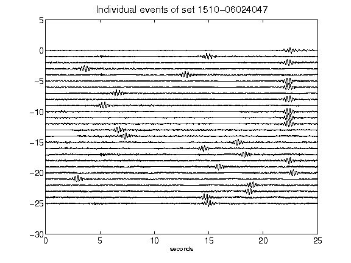](figures/1510-06024047_AllEv.png)[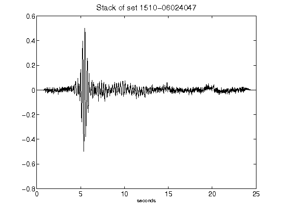](figures/1510-06024047_Stack.png)[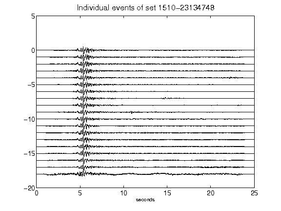](figures/1510-23134748_AllEv.png)[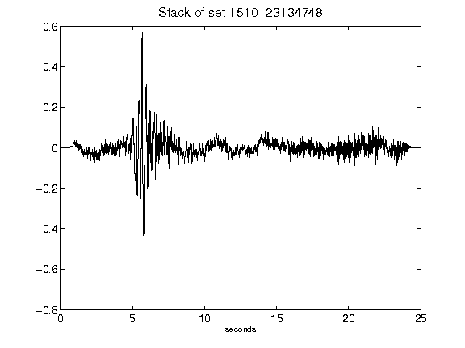](figures/1510-23134748_Stack.png)[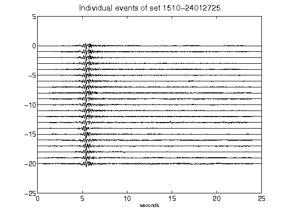](figures/1510-24012725_AllEv.png)[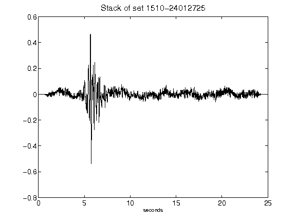](figures/1510-24012725_Stack.png)[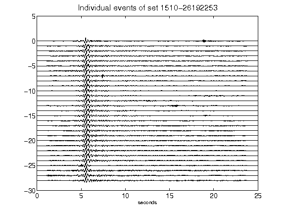](figures/1510-26192253_AllEv.png)[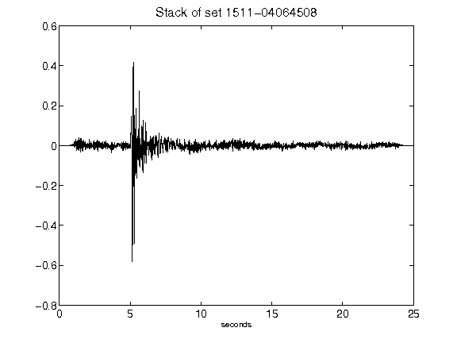](figures/1511-04064508_Stack.png)[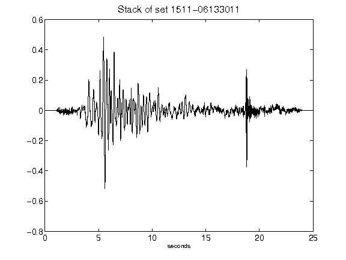](figures/1511-06133011_Stack.png)[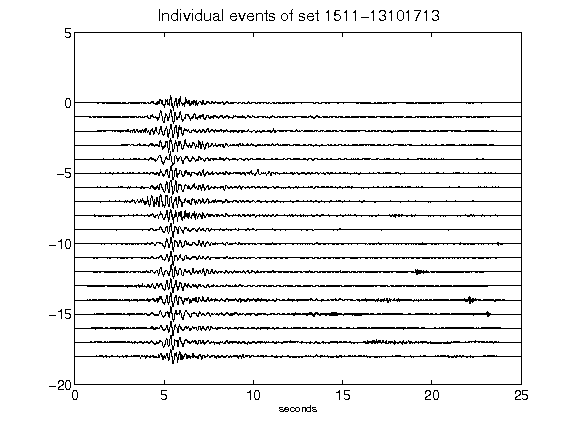](figures/1511-13101713_AllEv.png)[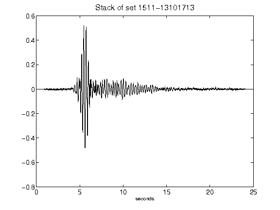](figures/1511-13101713_Stack.png)[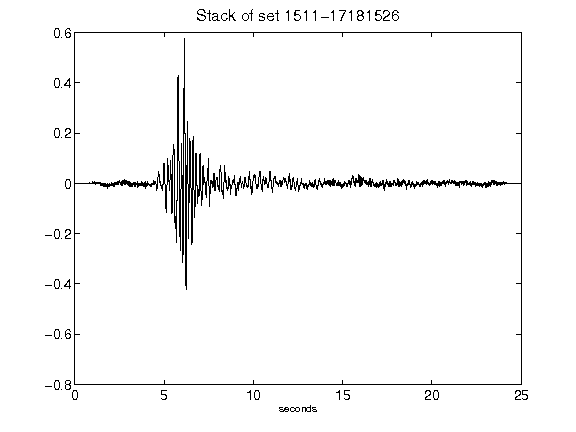](figures/1511-17181526_Stack.png)[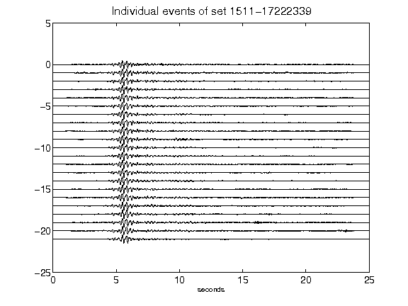](figures/1511-17222339_AllEv.png)[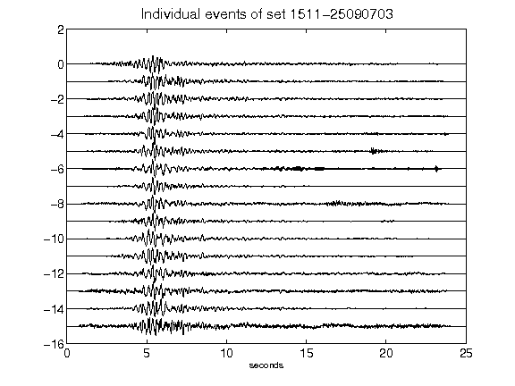](figures/1511-25090703_AllEv.png)[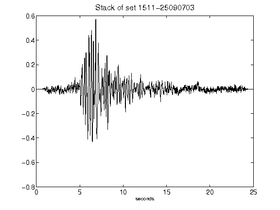](figures/1511-25090703_Stack.png)[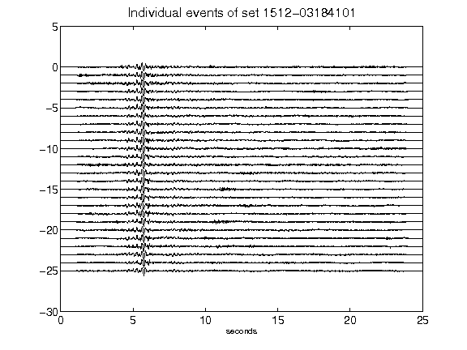](figures/1512-03184101_AllEv.png)[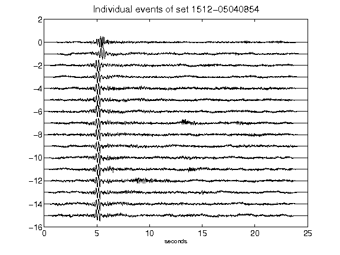](figures/1512-05040854_AllEv.png)[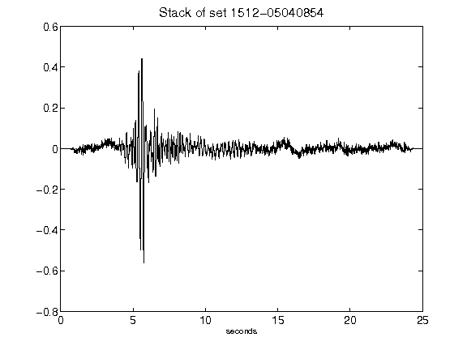](figures/1512-05040854_Stack.png)