# Repeating Earthquake Activity at RCS

## Waveforms
[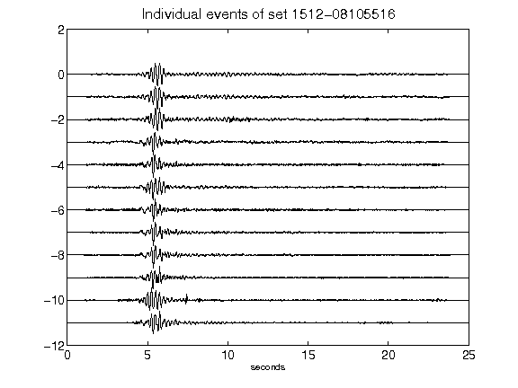](figures/1512-08105516_AllEv.png)[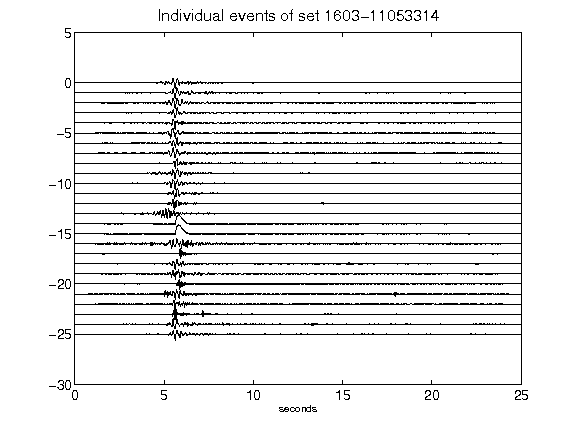](figures/1603-11053314_AllEv.png)[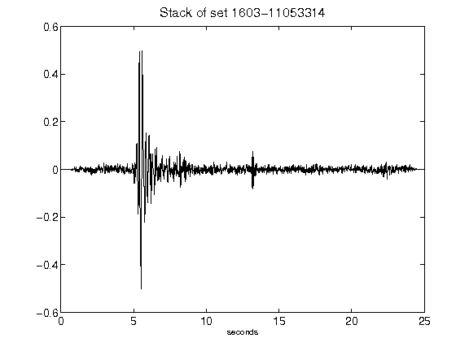](figures/1603-11053314_Stack.png)[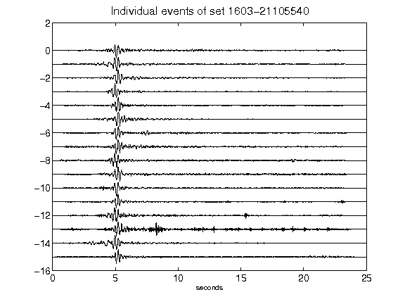](figures/1603-21105540_AllEv.png)[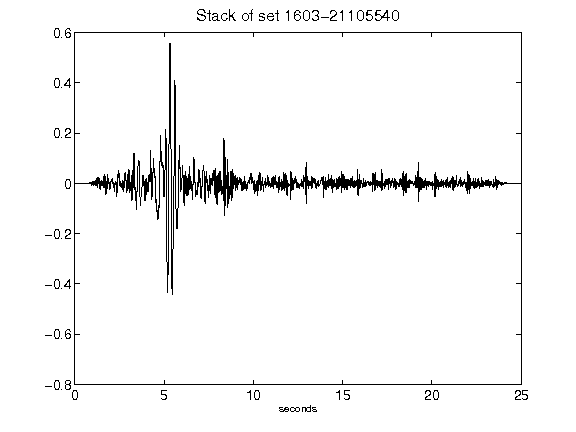](figures/1603-21105540_Stack.png)[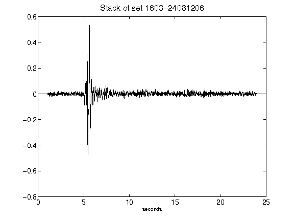](figures/1603-24081206_Stack.png)[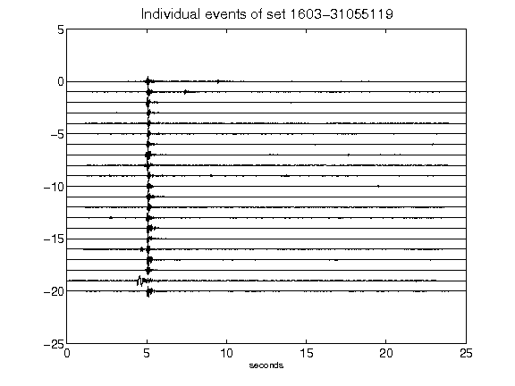](figures/1603-31055119_AllEv.png)[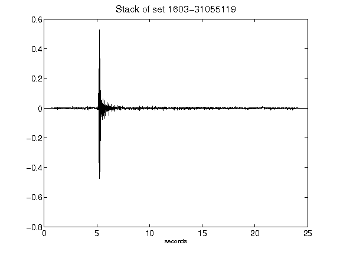](figures/1603-31055119_Stack.png)[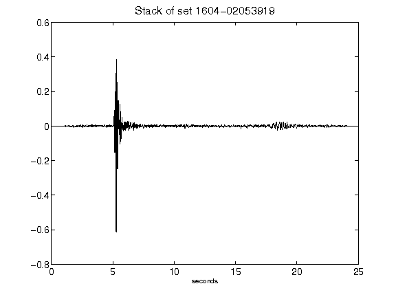](figures/1604-02053919_Stack.png)[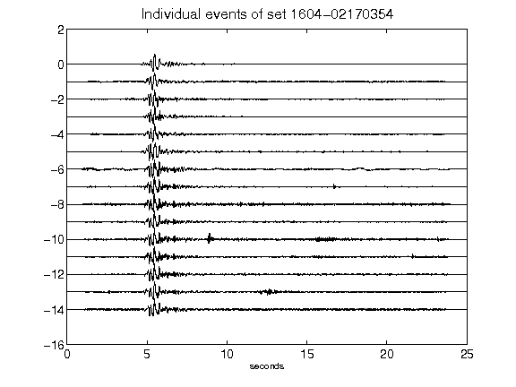](figures/1604-02170354_AllEv.png)[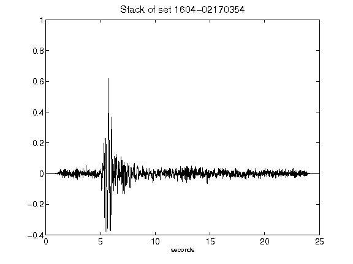](figures/1604-02170354_Stack.png)[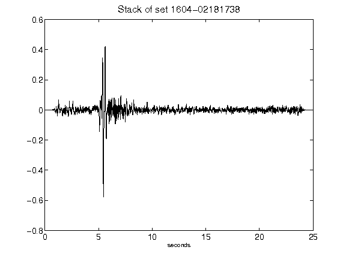](figures/1604-02181738_Stack.png)[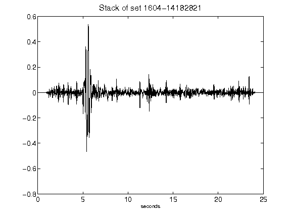](figures/1604-14182821_Stack.png)[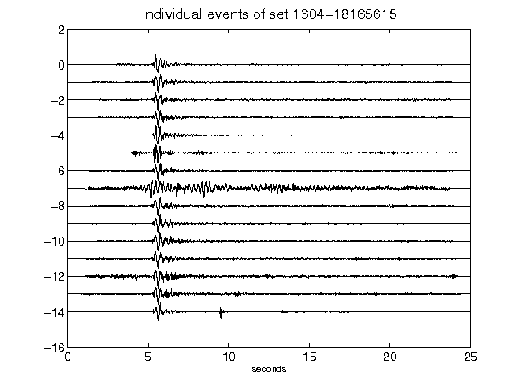](figures/1604-18165615_AllEv.png)[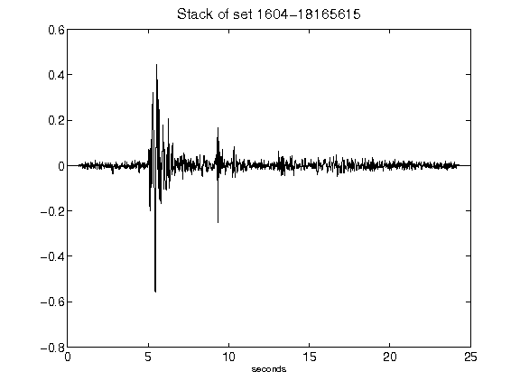](figures/1604-18165615_Stack.png)[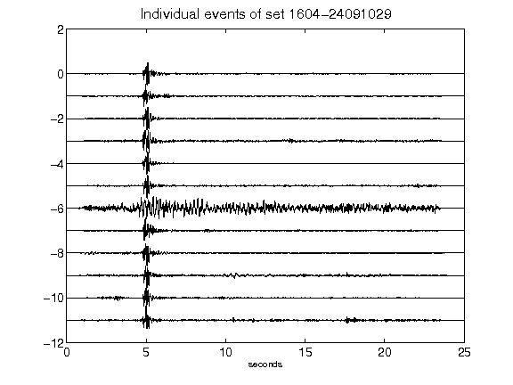](figures/1604-24091029_AllEv.png)[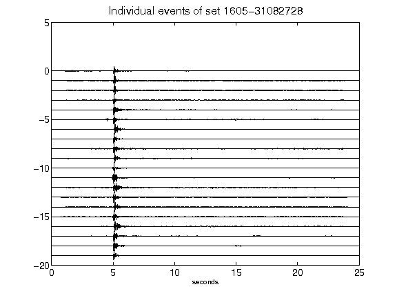](figures/1605-31082728_AllEv.png)[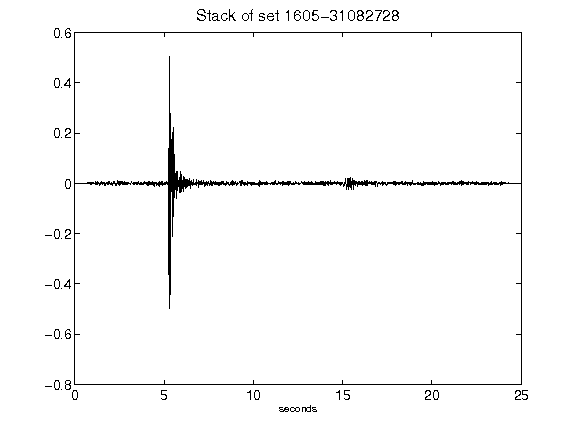](figures/1605-31082728_Stack.png)