# Repeating Earthquake Activity at RCS

## Waveforms
[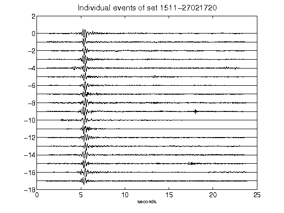](figures/1511-27021720_AllEv.png)[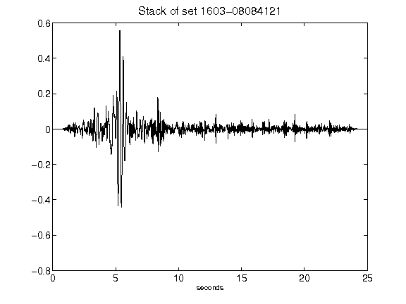](figures/1603-08084121_Stack.png)[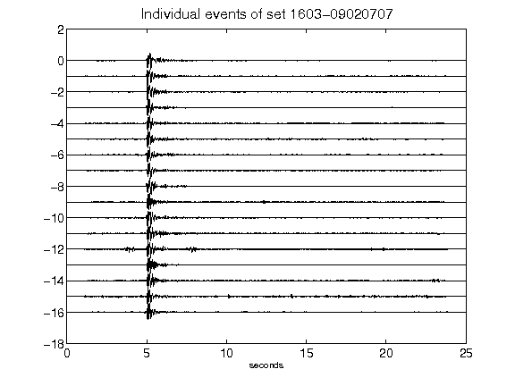](figures/1603-09020707_AllEv.png)[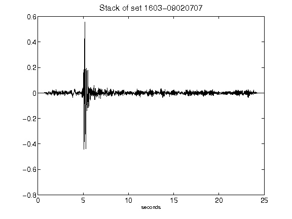](figures/1603-09020707_Stack.png)[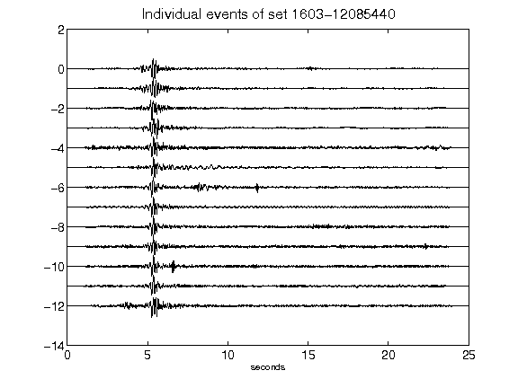](figures/1603-12085440_AllEv.png)[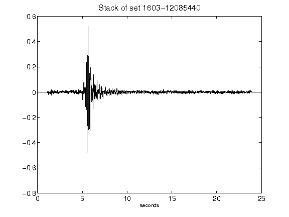](figures/1603-12085440_Stack.png)[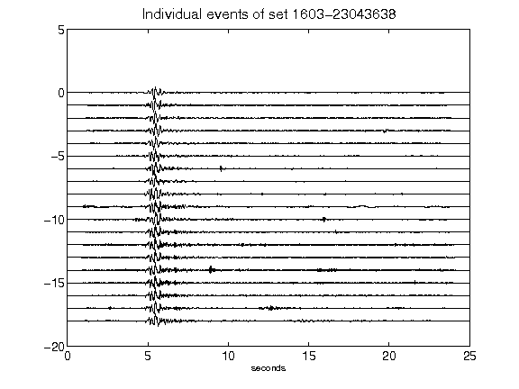](figures/1603-23043638_AllEv.png)[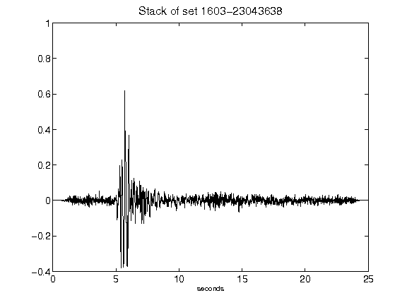](figures/1603-23043638_Stack.png)[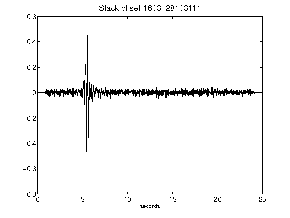](figures/1603-28103111_Stack.png)[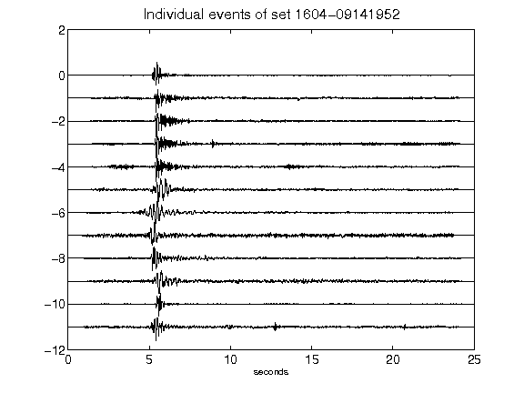](figures/1604-09141952_AllEv.png)[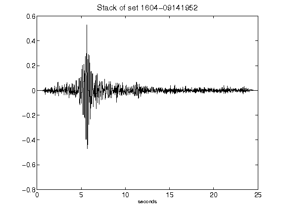](figures/1604-09141952_Stack.png)[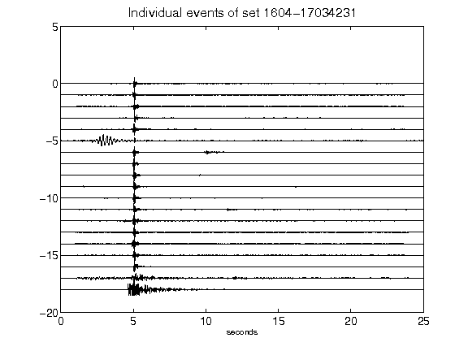](figures/1604-17034231_AllEv.png)[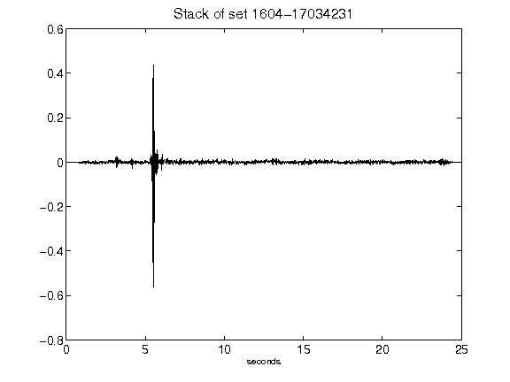](figures/1604-17034231_Stack.png)[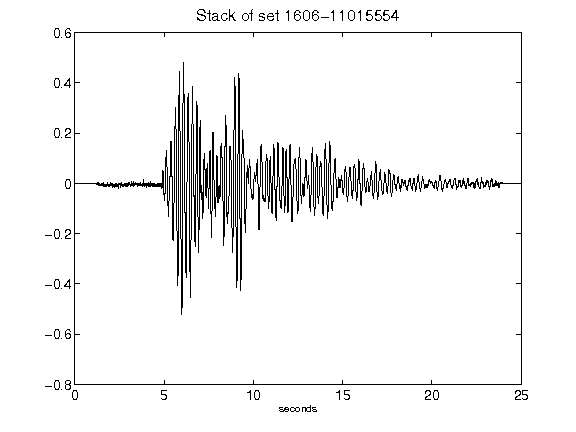](figures/1606-11015554_Stack.png)[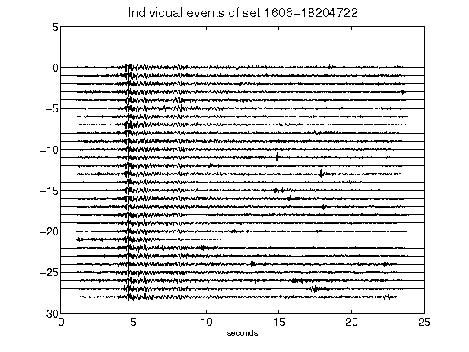](figures/1606-18204722_AllEv.png)