# Repeating Earthquake Activity at RCS

## Waveforms
[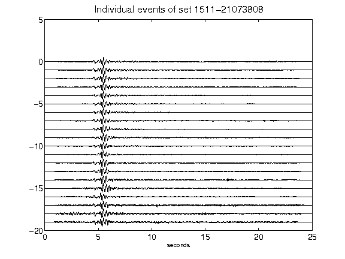](figures/1511-21073808_AllEv.png)[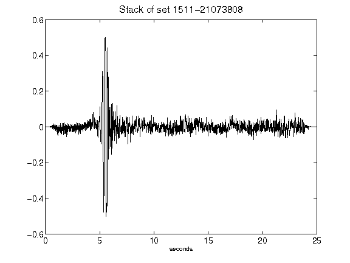](figures/1511-21073808_Stack.png)[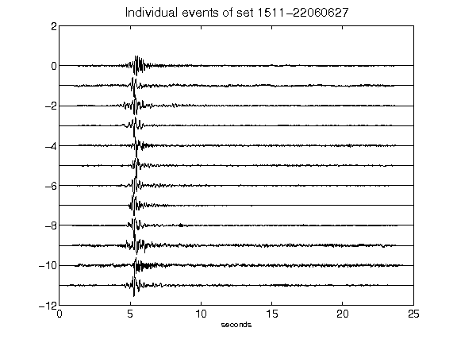](figures/1511-22060627_AllEv.png)[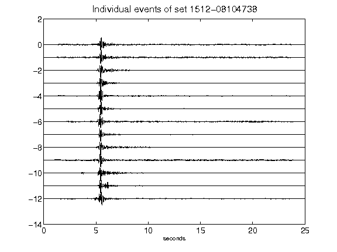](figures/1512-08104738_AllEv.png)[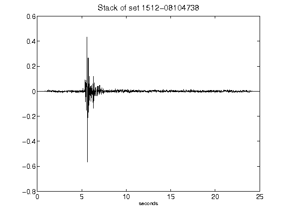](figures/1512-08104738_Stack.png)[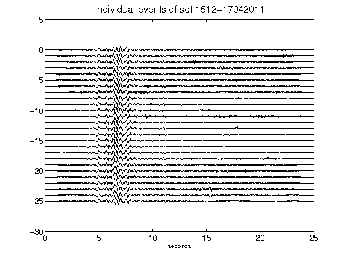](figures/1512-17042011_AllEv.png)[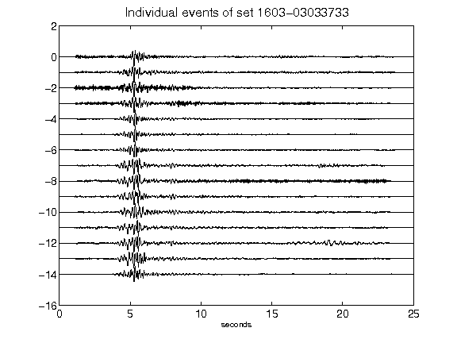](figures/1603-03033733_AllEv.png)[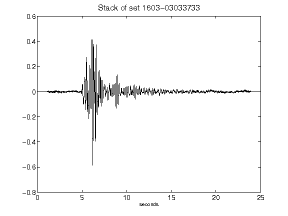](figures/1603-03033733_Stack.png)[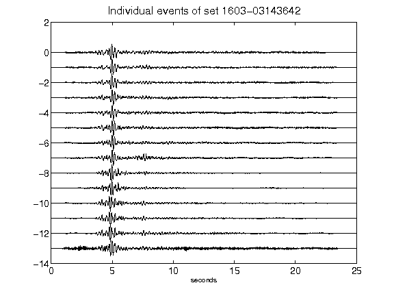](figures/1603-03143642_AllEv.png)[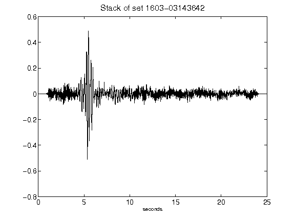](figures/1603-03143642_Stack.png)[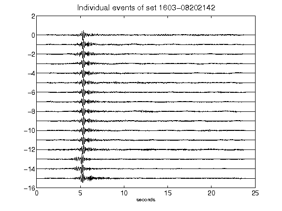](figures/1603-08202142_AllEv.png)[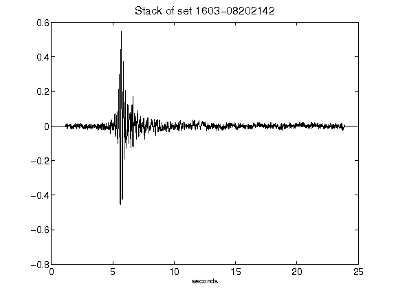](figures/1603-08202142_Stack.png)[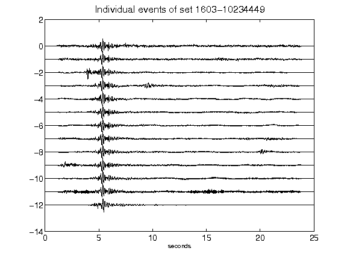](figures/1603-10234449_AllEv.png)[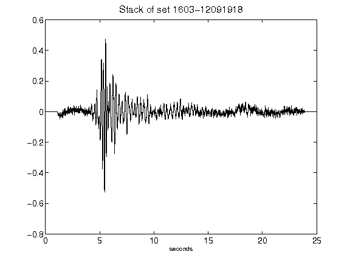](figures/1603-12091918_Stack.png)[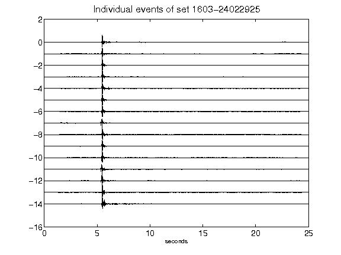](figures/1603-24022925_AllEv.png)[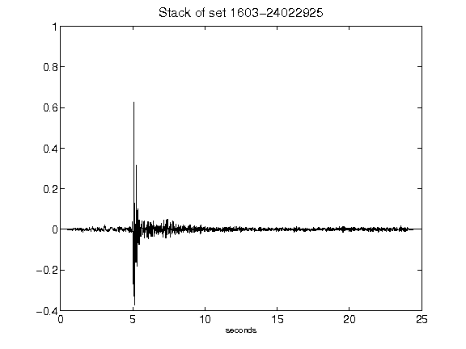](figures/1603-24022925_Stack.png)