# Repeating Earthquake Activity at RCS

## Waveforms
[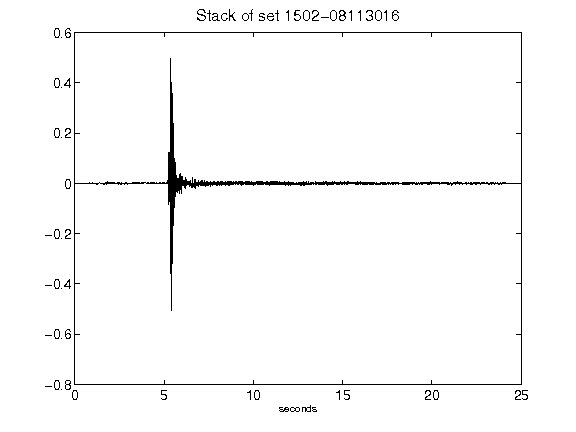](figures/1502-08113016_Stack.png)[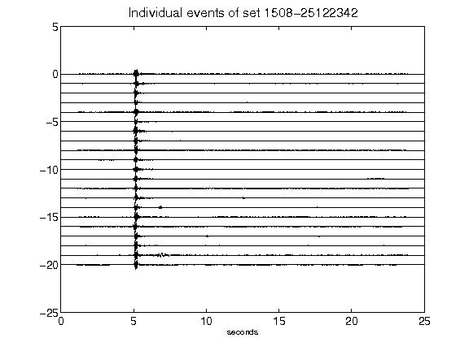](figures/1508-25122342_AllEv.png)[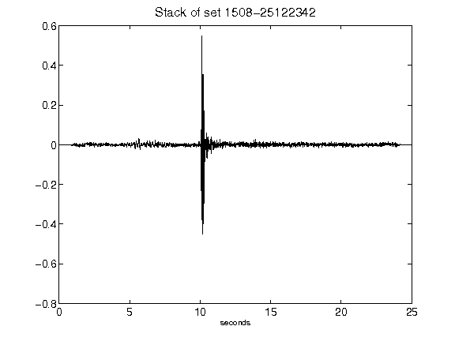](figures/1508-25122342_Stack.png)[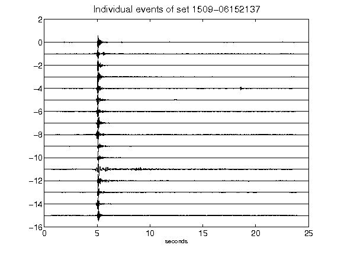](figures/1509-06152137_AllEv.png)[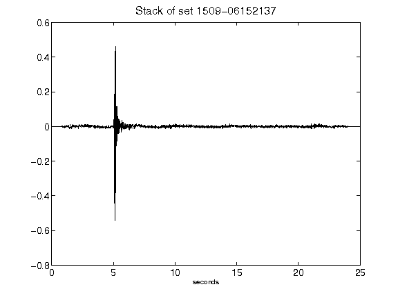](figures/1509-06152137_Stack.png)[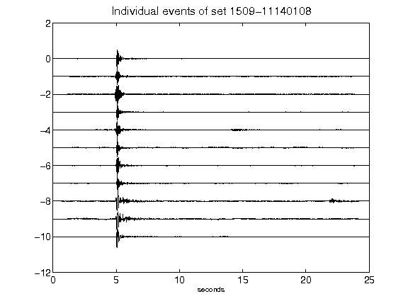](figures/1509-11140108_AllEv.png)[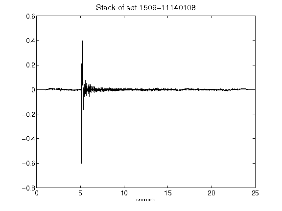](figures/1509-11140108_Stack.png)[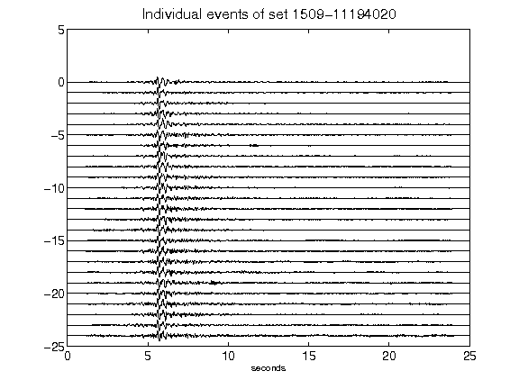](figures/1509-11194020_AllEv.png)[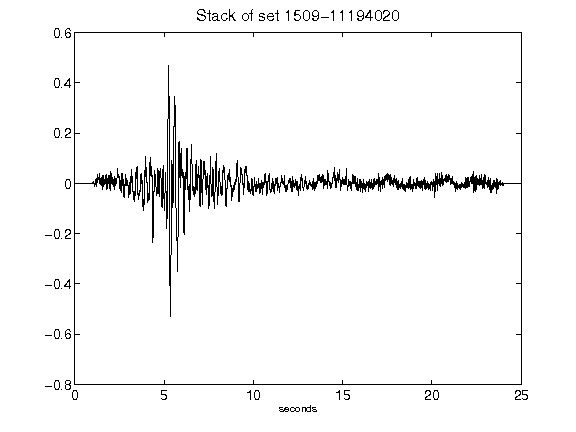](figures/1509-11194020_Stack.png)[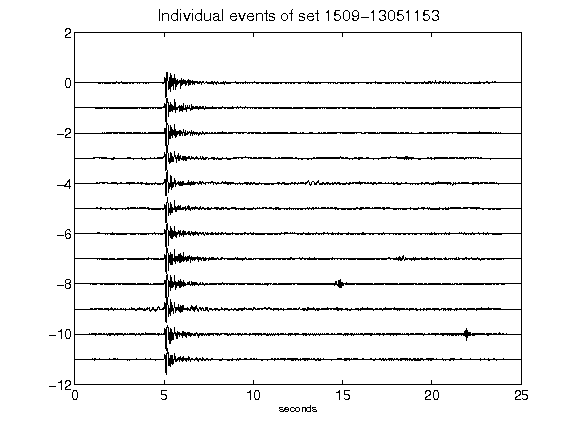](figures/1509-13051153_AllEv.png)[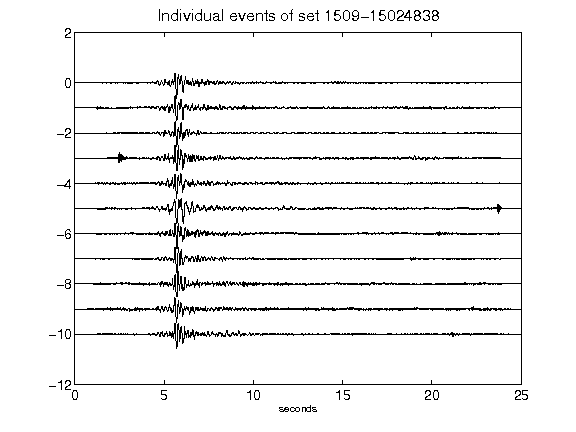](figures/1509-15024838_AllEv.png)[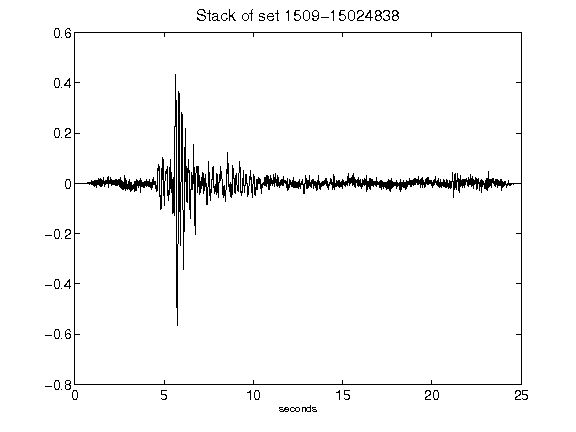](figures/1509-15024838_Stack.png)[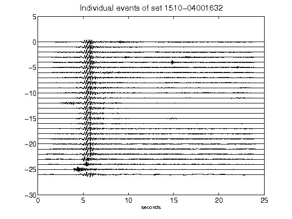](figures/1510-04001632_AllEv.png)[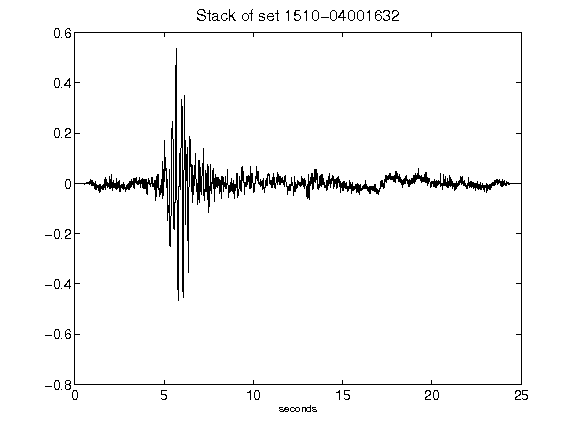](figures/1510-04001632_Stack.png)[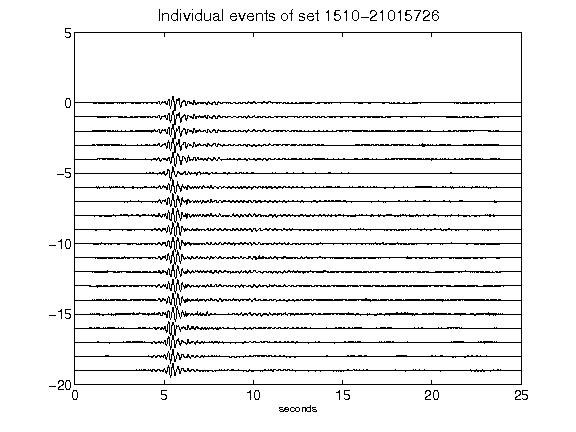](figures/1510-21015726_AllEv.png)