# Repeating Earthquake Activity at RCS

## Waveforms
[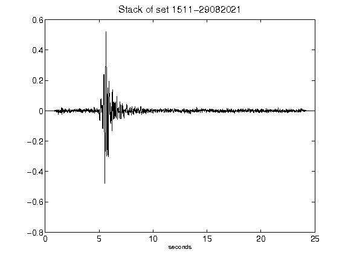](figures/1511-29082021_Stack.png)[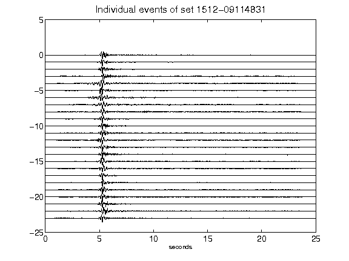](figures/1512-09114831_AllEv.png)[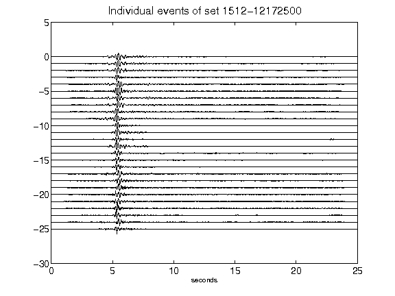](figures/1512-12172500_AllEv.png)[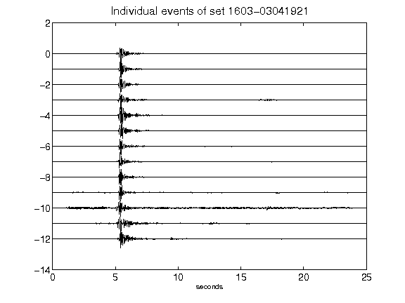](figures/1603-03041921_AllEv.png)[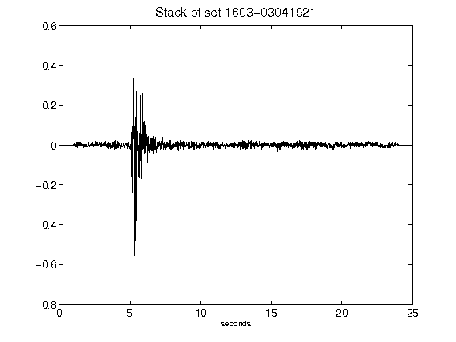](figures/1603-03041921_Stack.png)[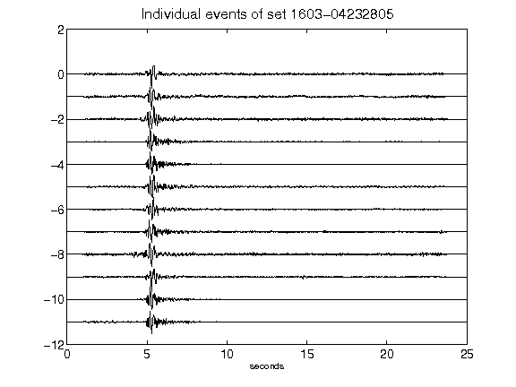](figures/1603-04232805_AllEv.png)[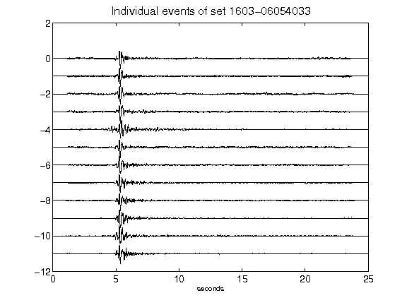](figures/1603-06054033_AllEv.png)[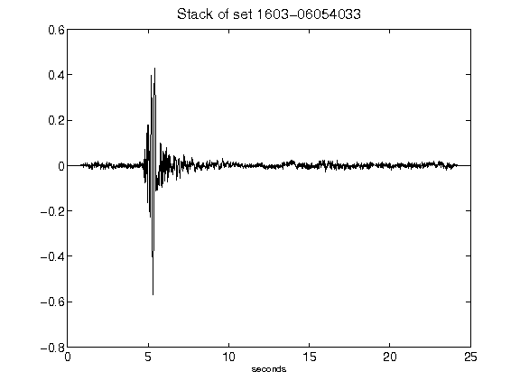](figures/1603-06054033_Stack.png)[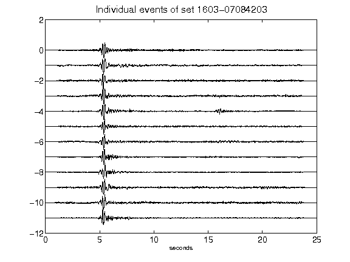](figures/1603-07084203_AllEv.png)[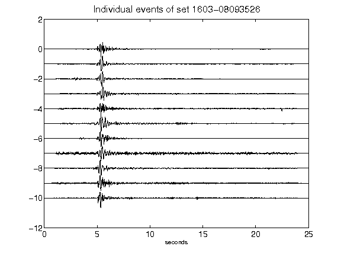](figures/1603-08093526_AllEv.png)[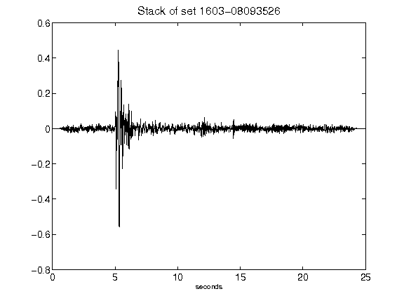](figures/1603-08093526_Stack.png)[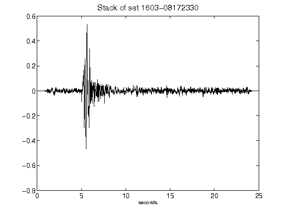](figures/1603-08172330_Stack.png)[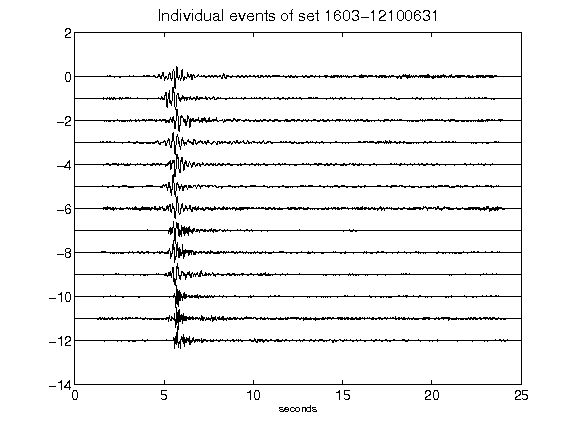](figures/1603-12100631_AllEv.png)[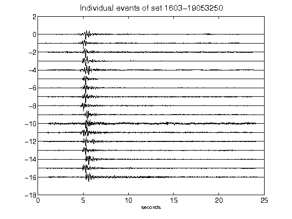](figures/1603-19053250_AllEv.png)[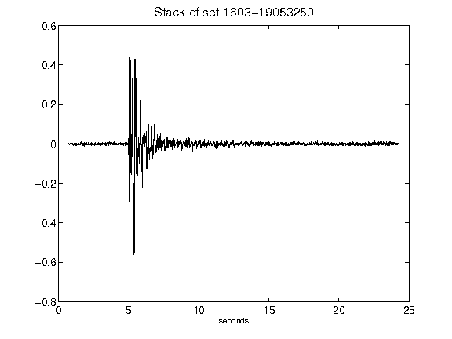](figures/1603-19053250_Stack.png)[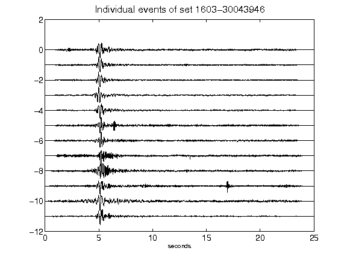](figures/1603-30043946_AllEv.png)[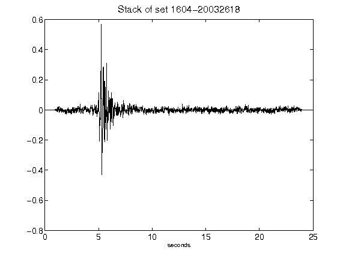](figures/1604-20032618_Stack.png)