# Repeating Earthquake Activity at RCS

## Waveforms
[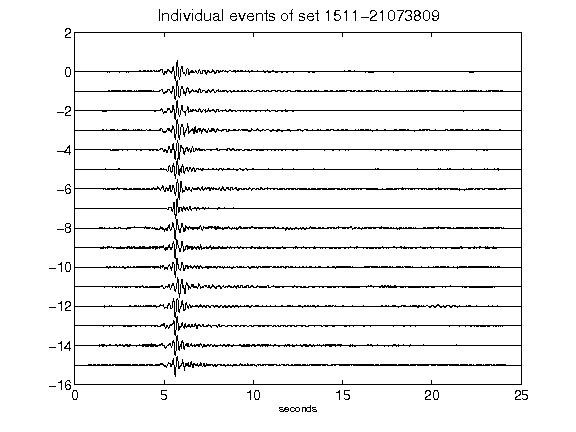](figures/1511-21073809_AllEv.png)[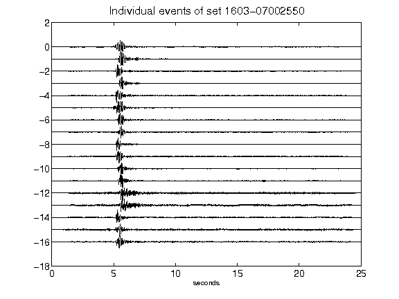](figures/1603-07002550_AllEv.png)[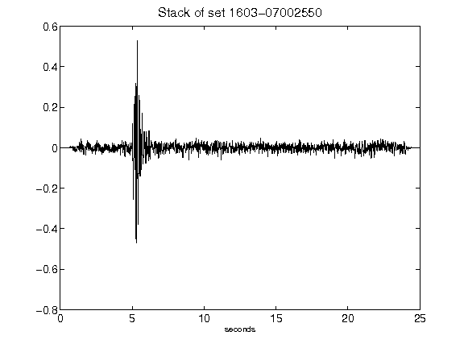](figures/1603-07002550_Stack.png)[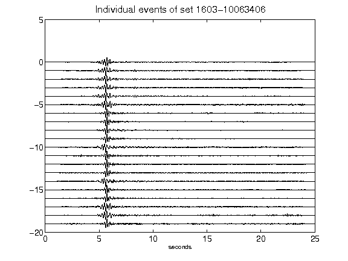](figures/1603-10063406_AllEv.png)[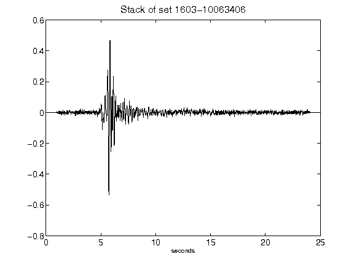](figures/1603-10063406_Stack.png)[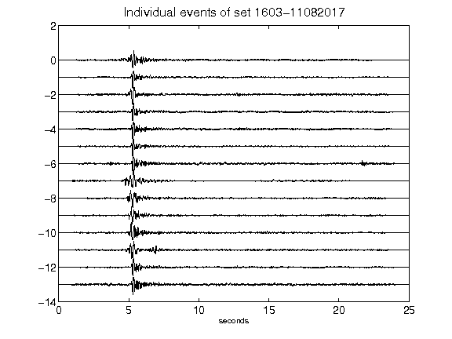](figures/1603-11082017_AllEv.png)[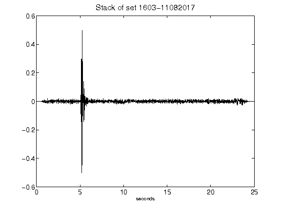](figures/1603-11082017_Stack.png)[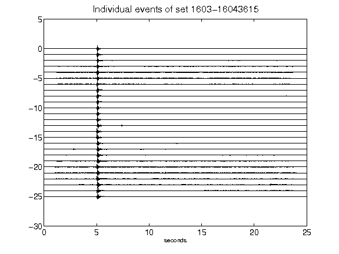](figures/1603-16043615_AllEv.png)[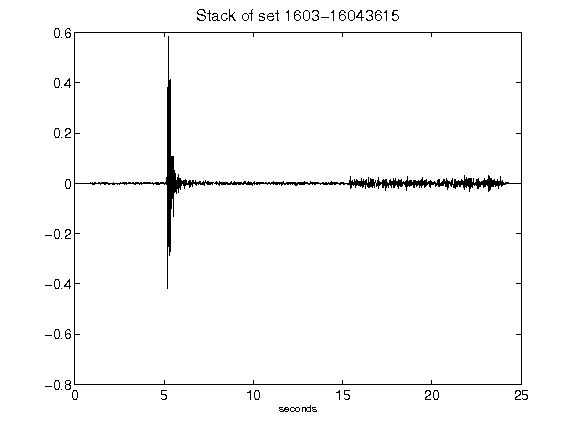](figures/1603-16043615_Stack.png)[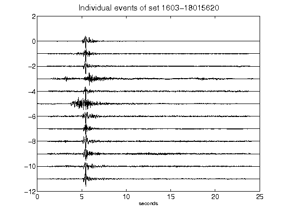](figures/1603-18015620_AllEv.png)[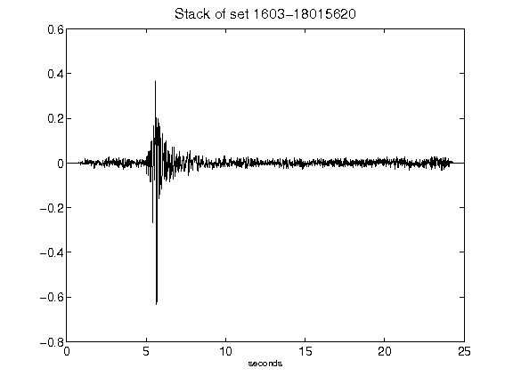](figures/1603-18015620_Stack.png)[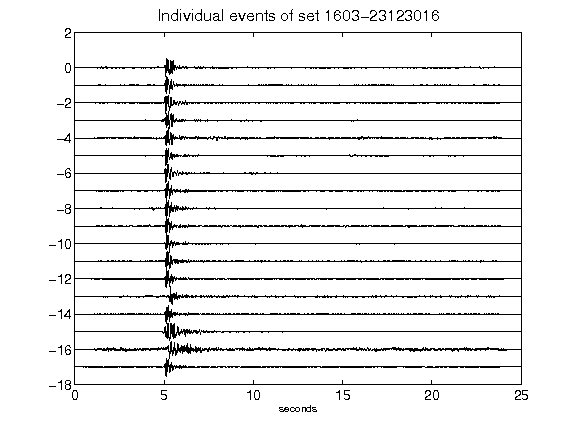](figures/1603-23123016_AllEv.png)[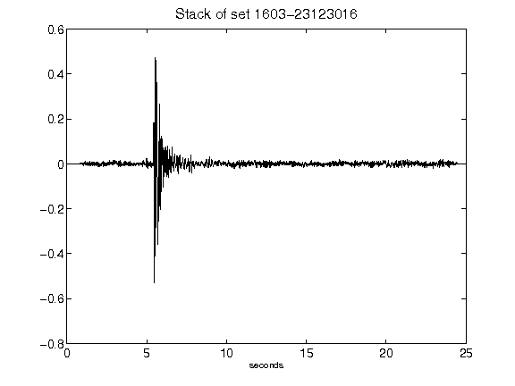](figures/1603-23123016_Stack.png)[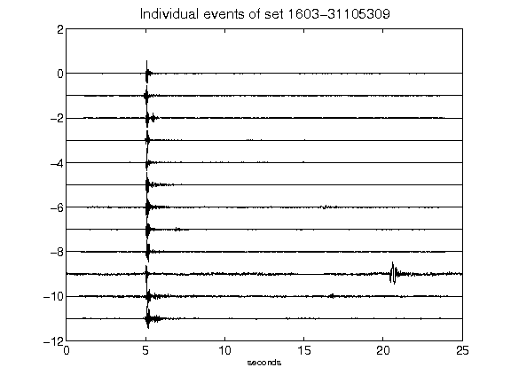](figures/1603-31105309_AllEv.png)[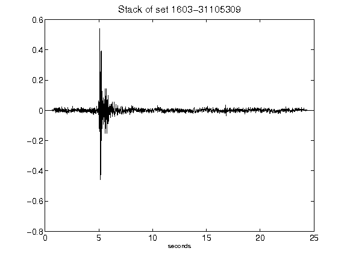](figures/1603-31105309_Stack.png)