# Repeating Earthquake Activity at RCS

## Waveforms
[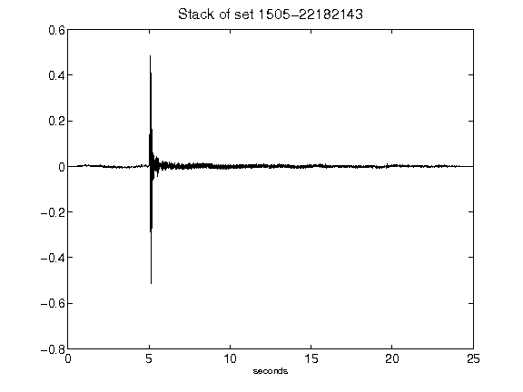](figures/1505-22182143_Stack.png)[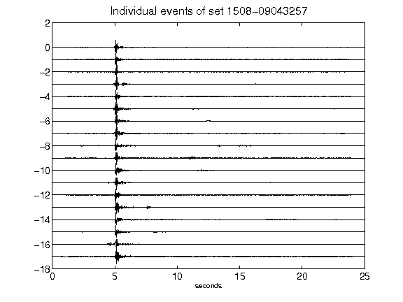](figures/1508-09043257_AllEv.png)[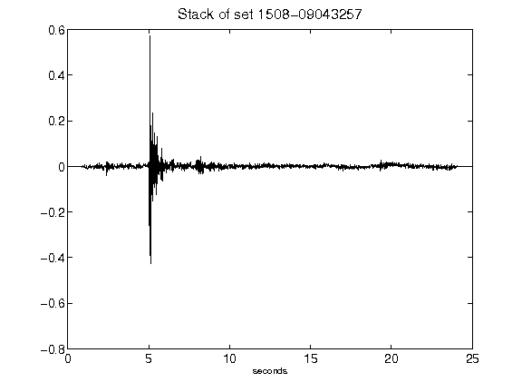](figures/1508-09043257_Stack.png)[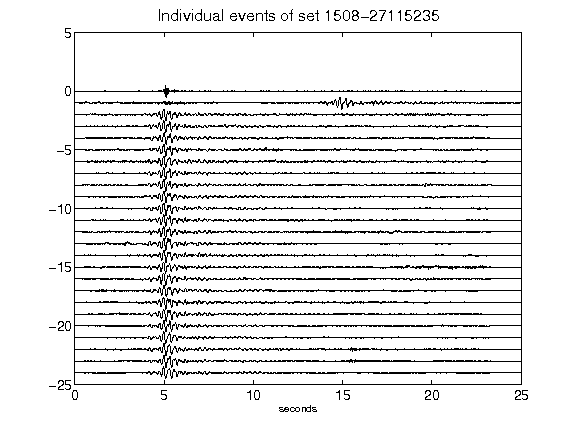](figures/1508-27115235_AllEv.png)[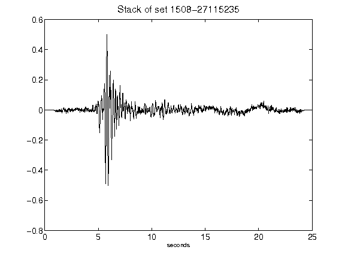](figures/1508-27115235_Stack.png)[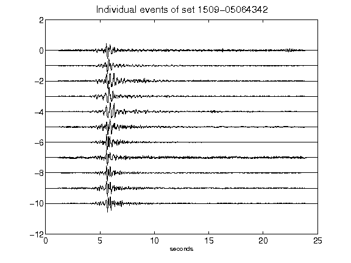](figures/1509-05064342_AllEv.png)[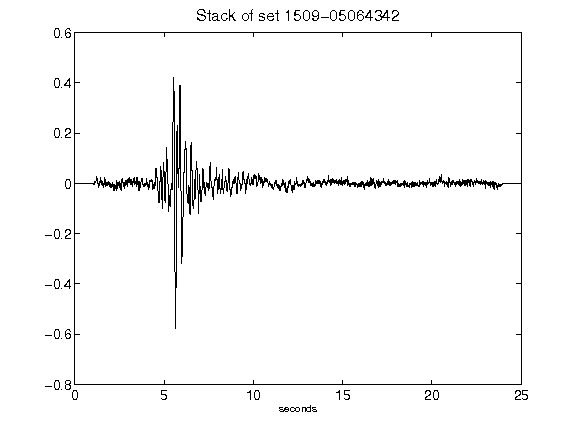](figures/1509-05064342_Stack.png)[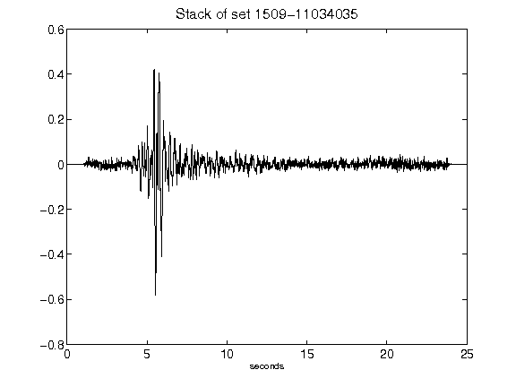](figures/1509-11034035_Stack.png)[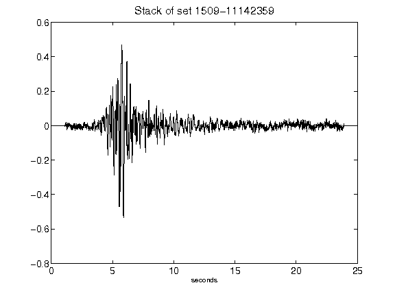](figures/1509-11142359_Stack.png)[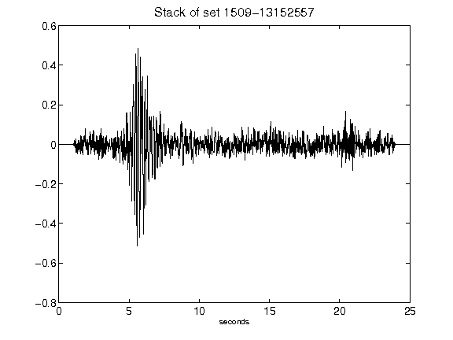](figures/1509-13152557_Stack.png)[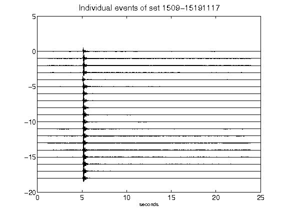](figures/1509-15191117_AllEv.png)[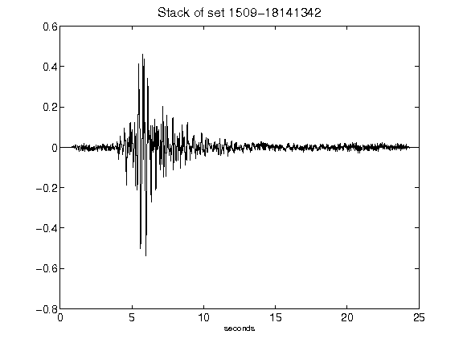](figures/1509-18141342_Stack.png)[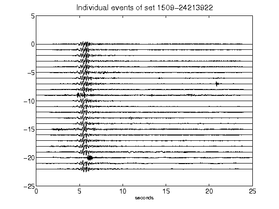](figures/1509-24213922_AllEv.png)[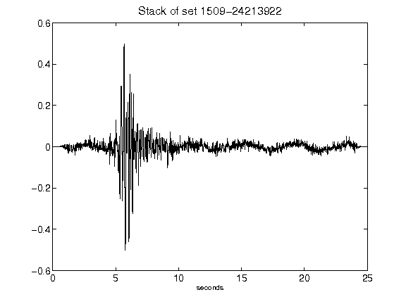](figures/1509-24213922_Stack.png)