# Repeating Earthquake Activity at RCS

## Waveforms
[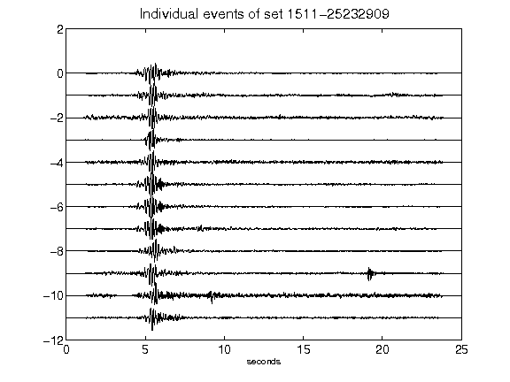](figures/1511-25232909_AllEv.png)[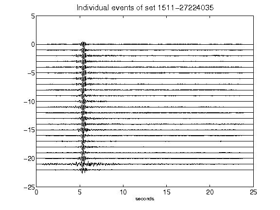](figures/1511-27224035_AllEv.png)[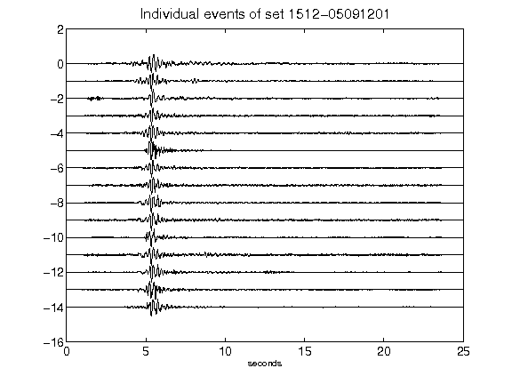](figures/1512-05091201_AllEv.png)[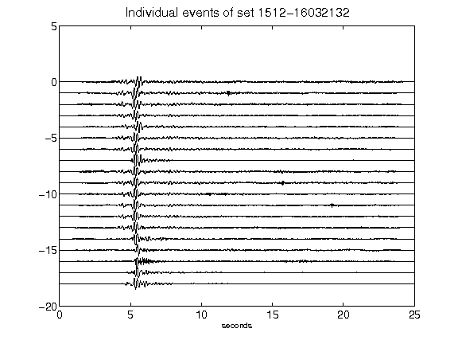](figures/1512-16032132_AllEv.png)[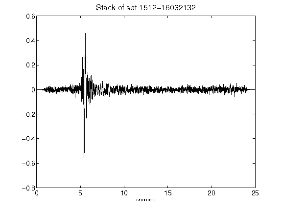](figures/1512-16032132_Stack.png)[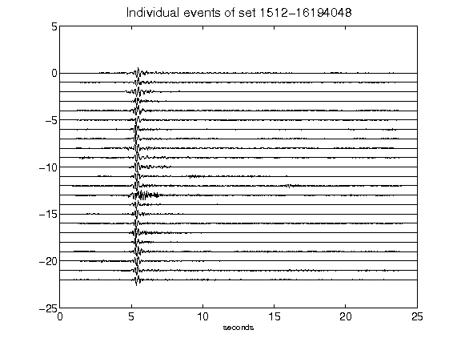](figures/1512-16194048_AllEv.png)[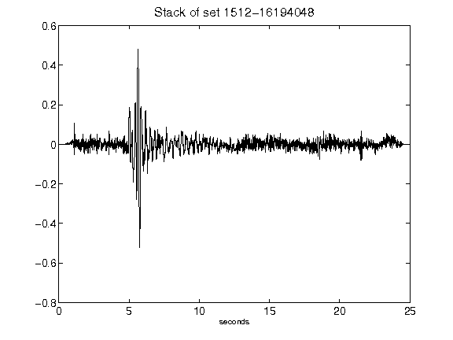](figures/1512-16194048_Stack.png)[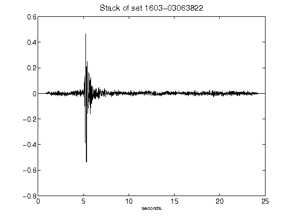](figures/1603-03063822_Stack.png)[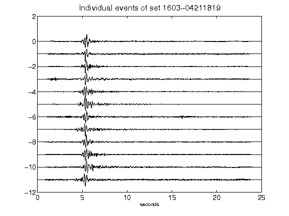](figures/1603-04211819_AllEv.png)[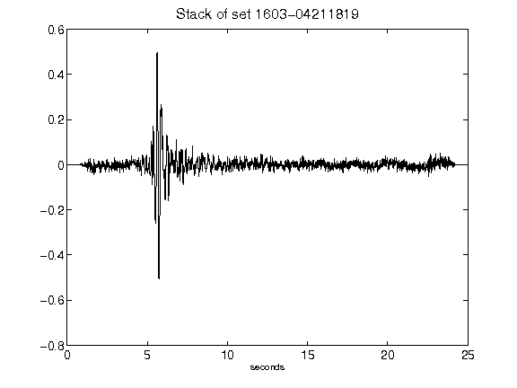](figures/1603-04211819_Stack.png)[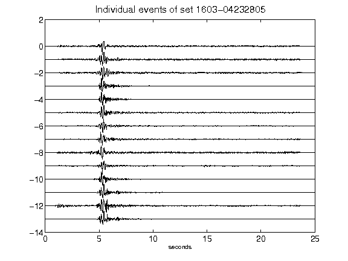](figures/1603-04232805_AllEv.png)[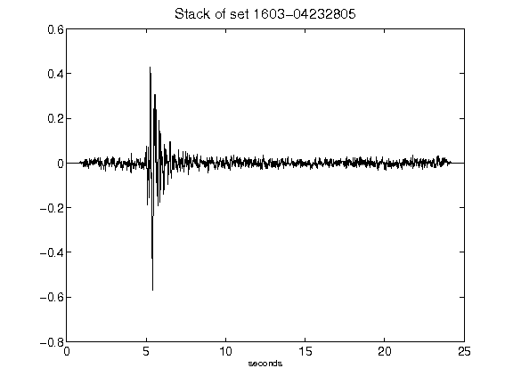](figures/1603-04232805_Stack.png)[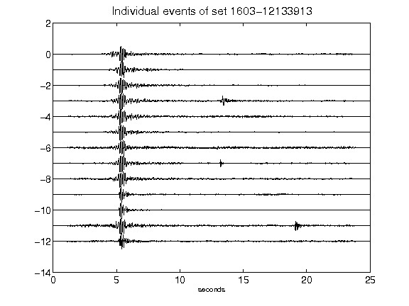](figures/1603-12133913_AllEv.png)[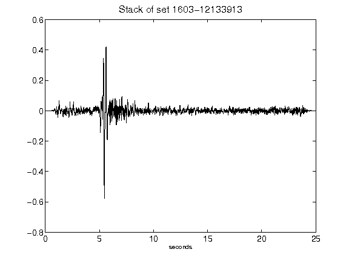](figures/1603-12133913_Stack.png)[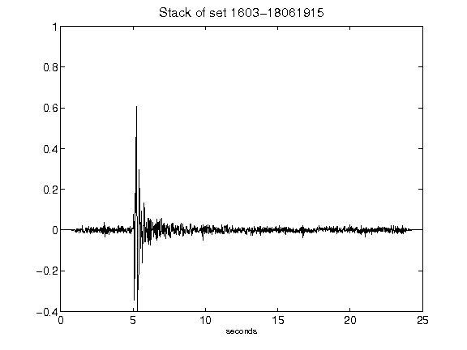](figures/1603-18061915_Stack.png)