# Repeating Earthquake Activity at RCS
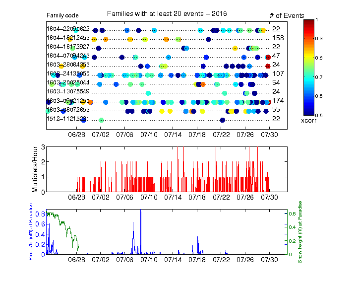  
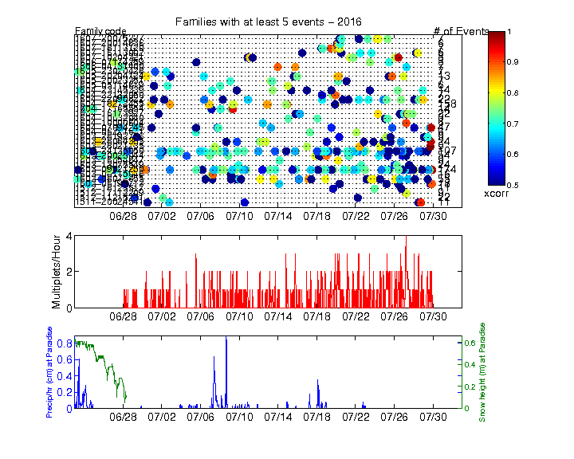  

## Waveforms
[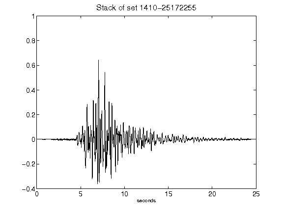](figures/1410-25172255_Stack.png)[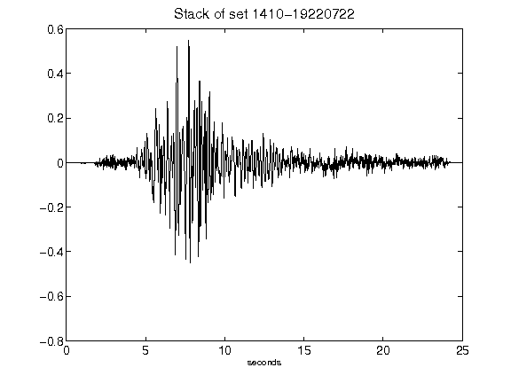](figures/1410-19220722_Stack.png)[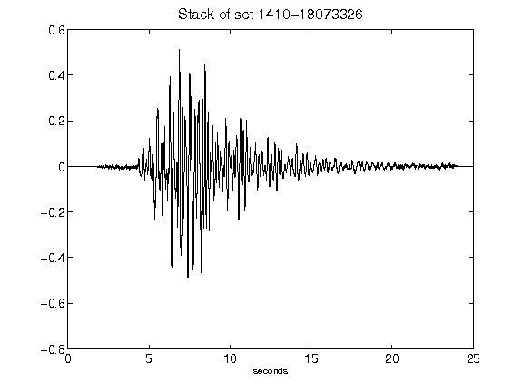](figures/1410-18073326_Stack.png)[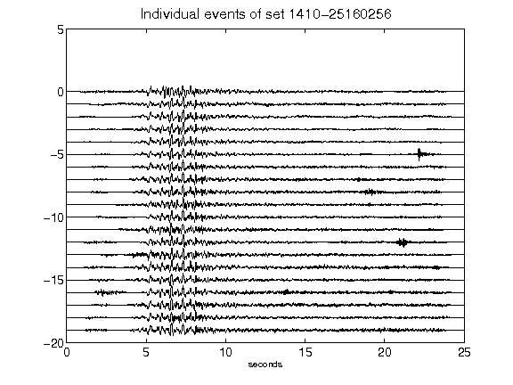](figures/1410-25160256_AllEv.png)[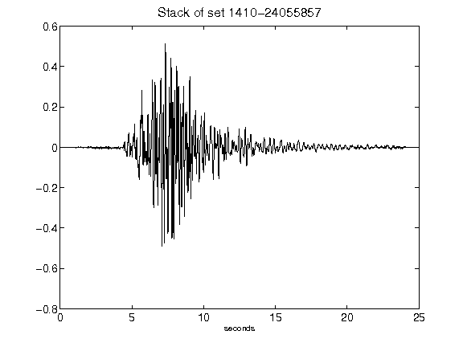](figures/1410-24055857_Stack.png)[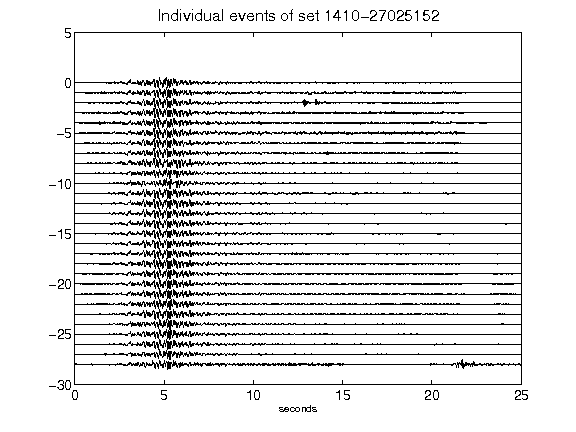](figures/1410-27025152_AllEv.png)[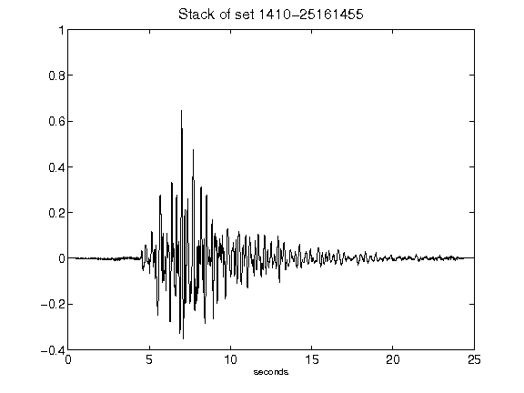](figures/1410-25161455_Stack.png)[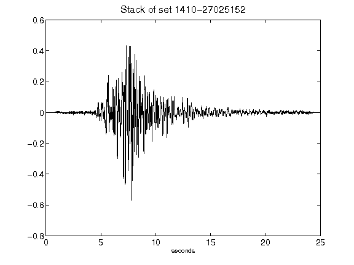](figures/1410-27025152_Stack.png)[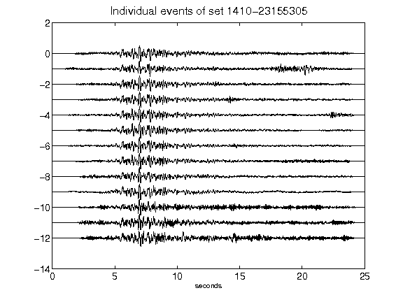](figures/1410-23155305_AllEv.png)[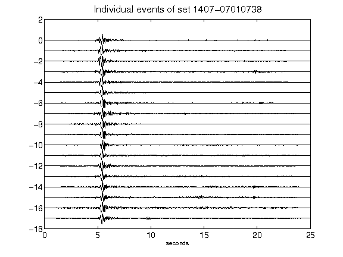](figures/1407-07010738_AllEv.png)[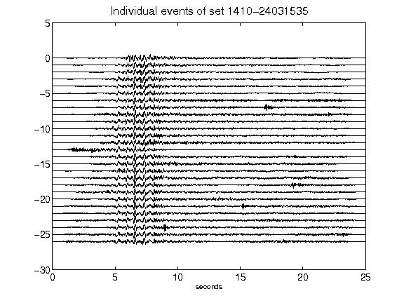](figures/1410-24031535_AllEv.png)[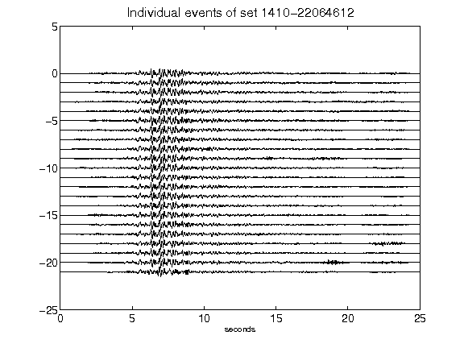](figures/1410-22064612_AllEv.png)[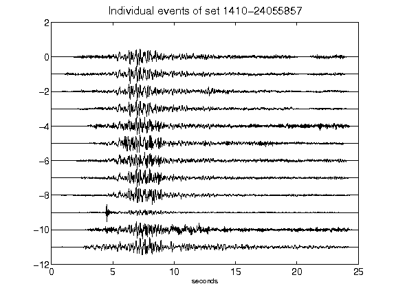](figures/1410-24055857_AllEv.png)[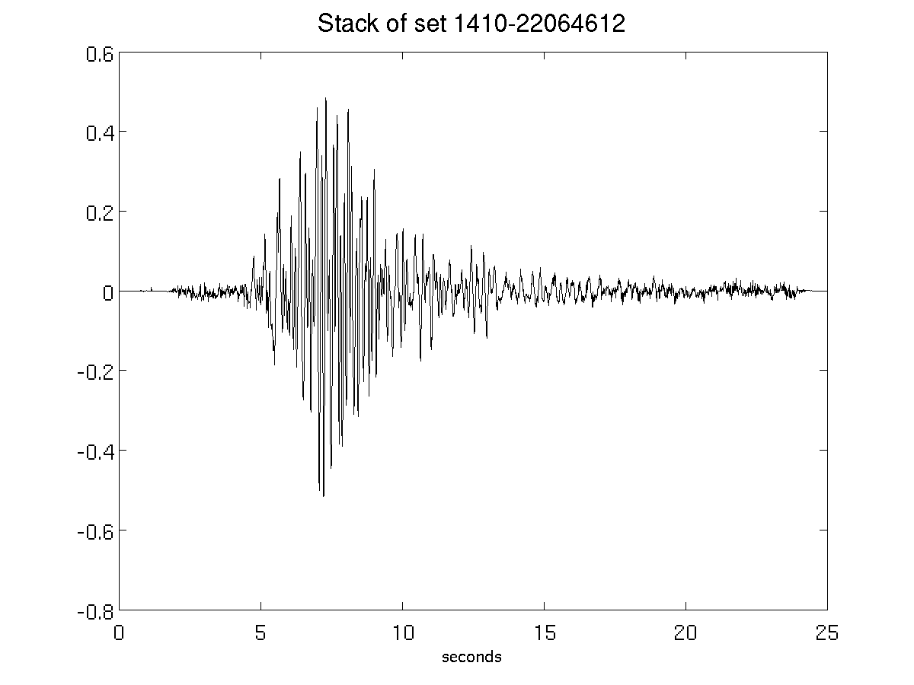](figures/1410-22064612_Stack.png)[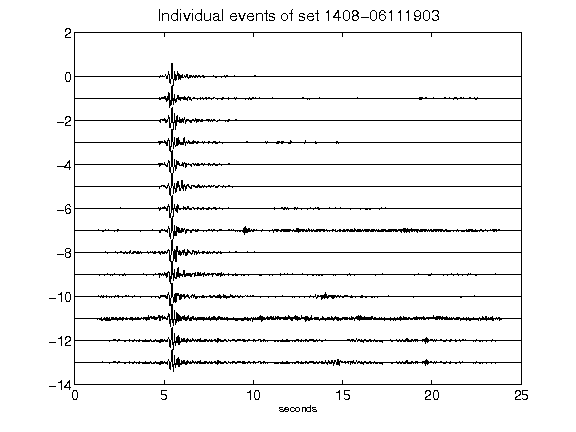](figures/1408-06111903_AllEv.png)[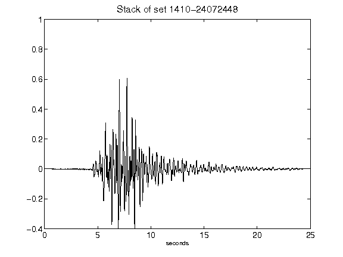](figures/1410-24072448_Stack.png)[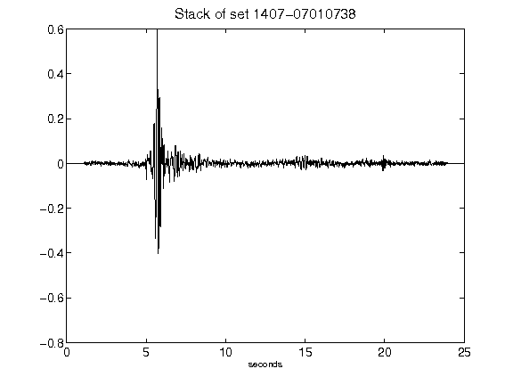](figures/1407-07010738_Stack.png)[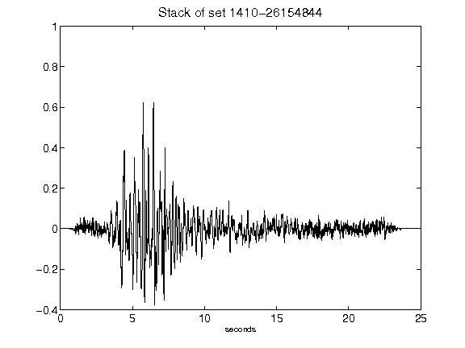](figures/1410-26154844_Stack.png)[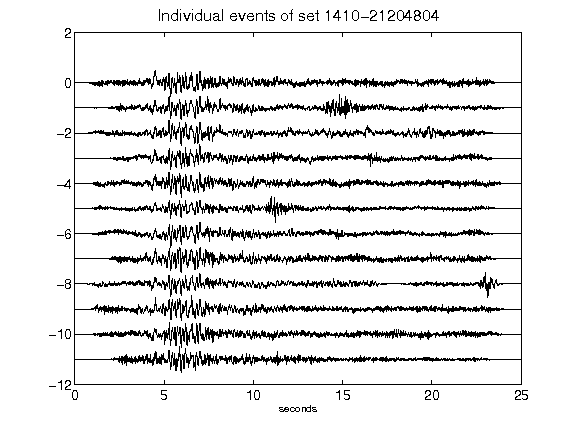](figures/1410-21204804_AllEv.png)[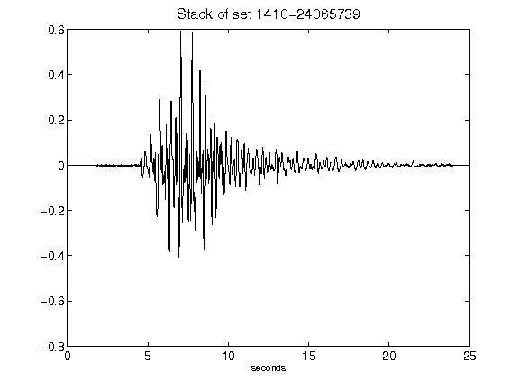](figures/1410-24065739_Stack.png)[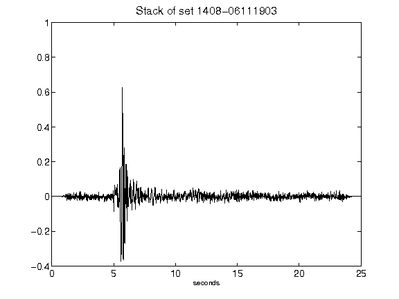](figures/1408-06111903_Stack.png)[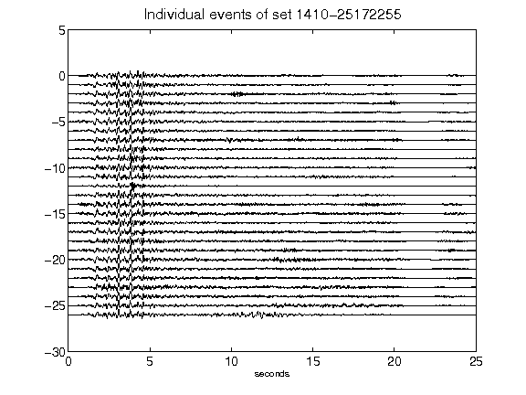](figures/1410-25172255_AllEv.png)[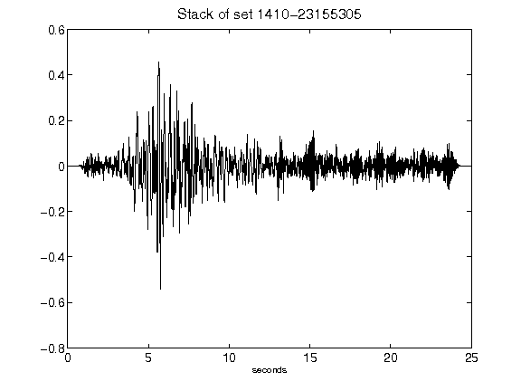](figures/1410-23155305_Stack.png)[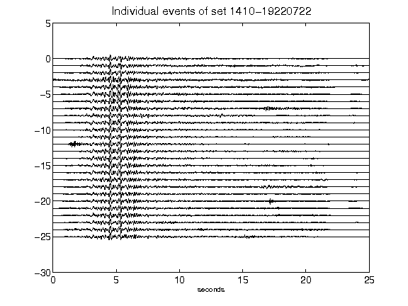](figures/1410-19220722_AllEv.png)[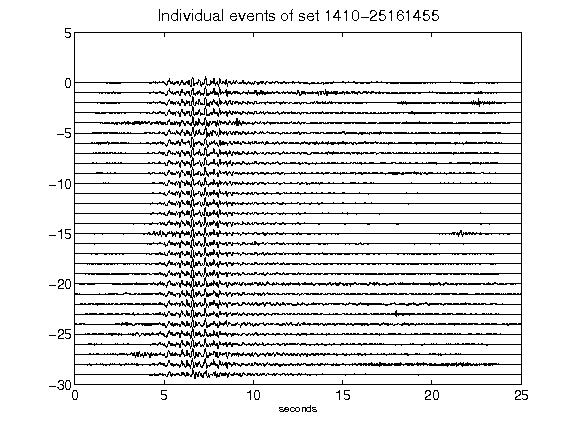](figures/1410-25161455_AllEv.png)[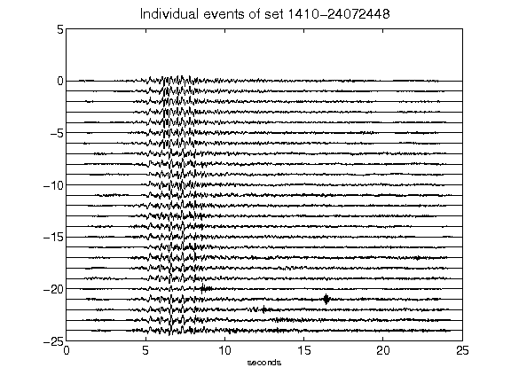](figures/1410-24072448_AllEv.png)[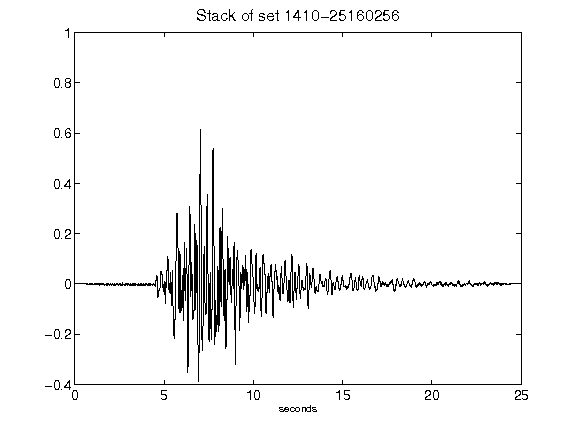](figures/1410-25160256_Stack.png)[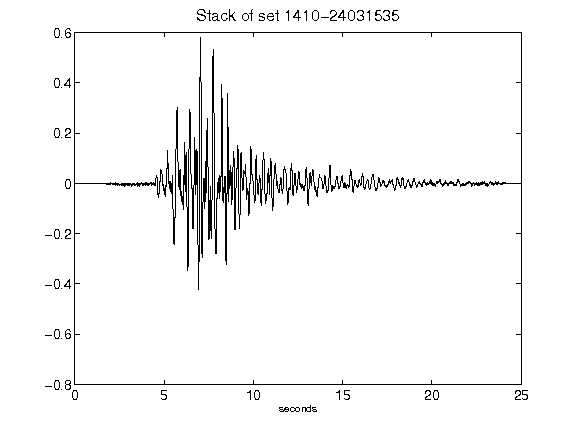](figures/1410-24031535_Stack.png)[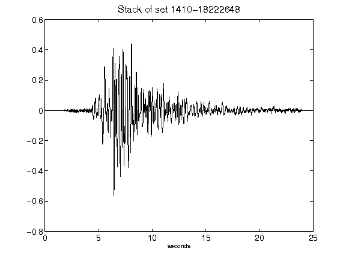](figures/1410-18222648_Stack.png)[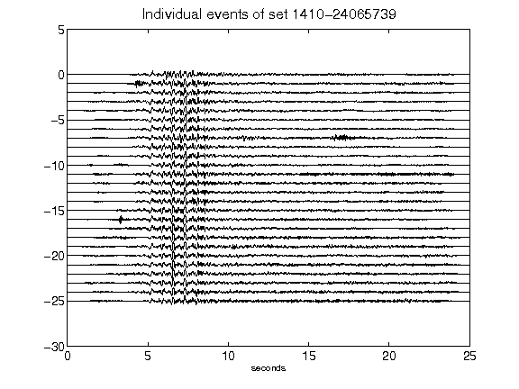](figures/1410-24065739_AllEv.png)[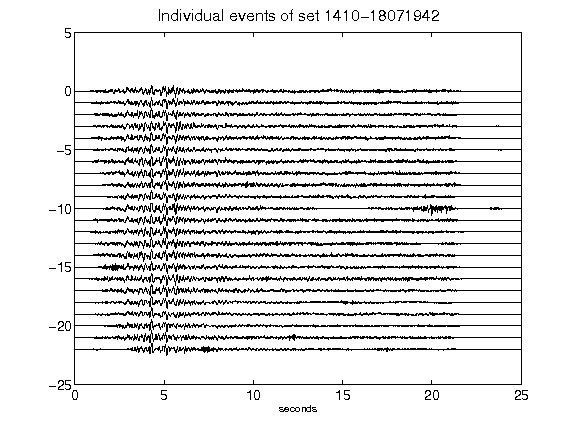](figures/1410-18071942_AllEv.png)