# Repeating Earthquake Activity at RCS

## Waveforms
[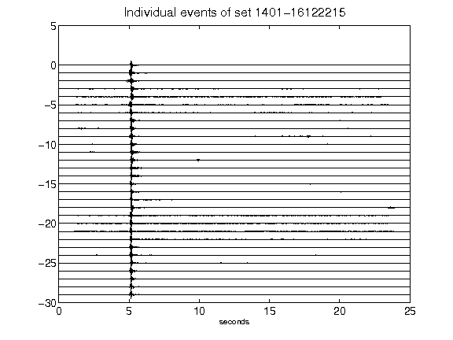](figures/1401-16122215_AllEv.png)[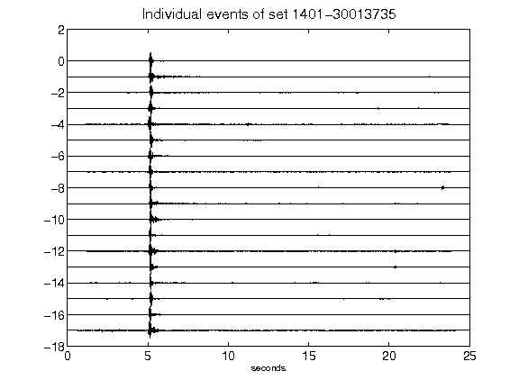](figures/1401-30013735_AllEv.png)[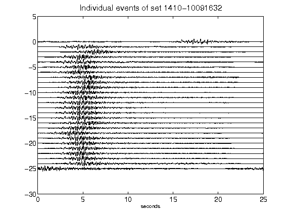](figures/1410-10091632_AllEv.png)[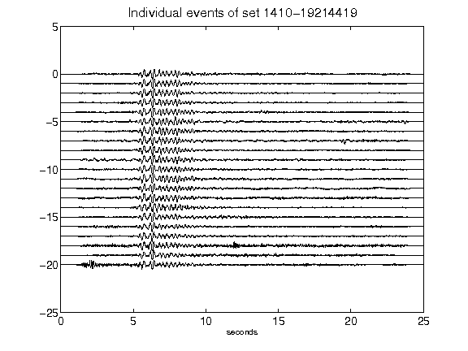](figures/1410-19214419_AllEv.png)[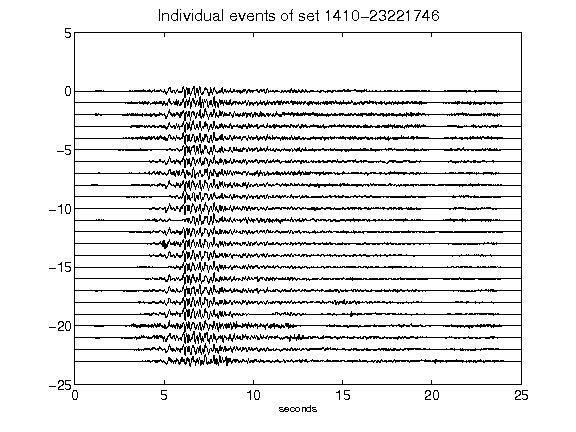](figures/1410-23221746_AllEv.png)[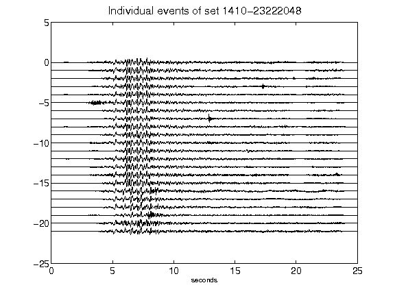](figures/1410-23222048_AllEv.png)[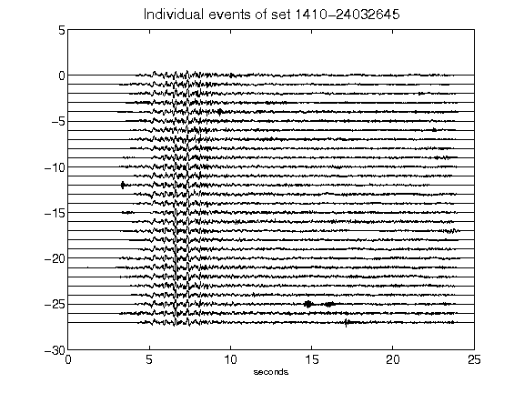](figures/1410-24032645_AllEv.png)[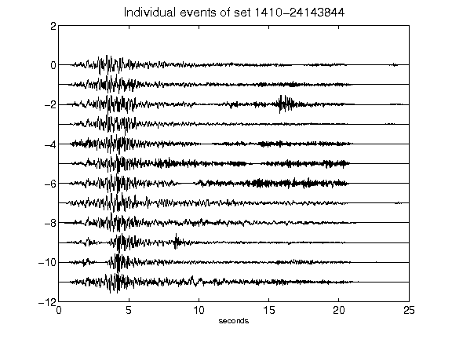](figures/1410-24143844_AllEv.png)[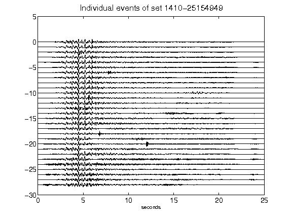](figures/1410-25154949_AllEv.png)[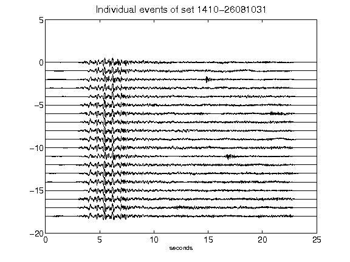](figures/1410-26081031_AllEv.png)[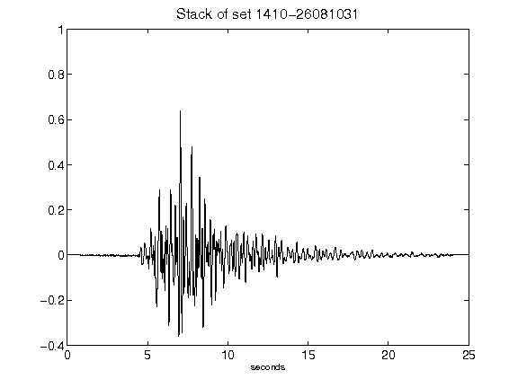](figures/1410-26081031_Stack.png)[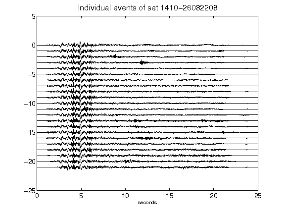](figures/1410-26082208_AllEv.png)[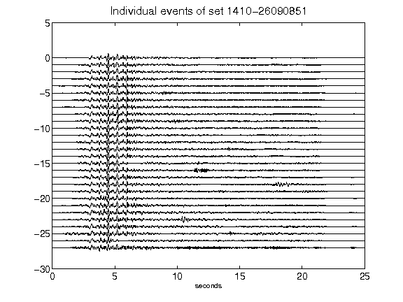](figures/1410-26090851_AllEv.png)[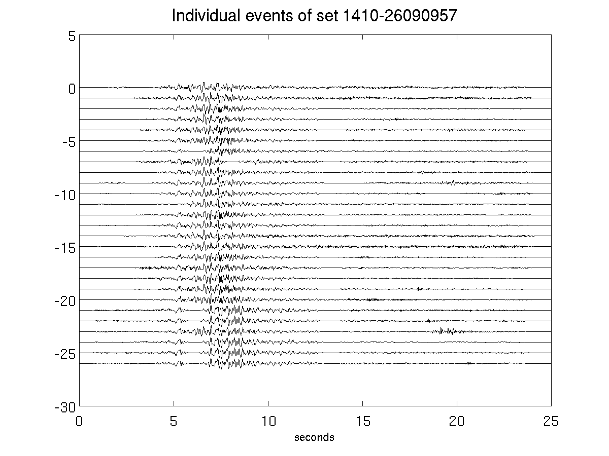](figures/1410-26090957_AllEv.png)[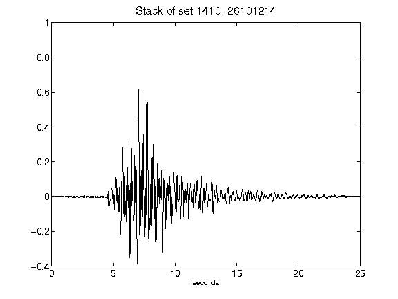](figures/1410-26101214_Stack.png)[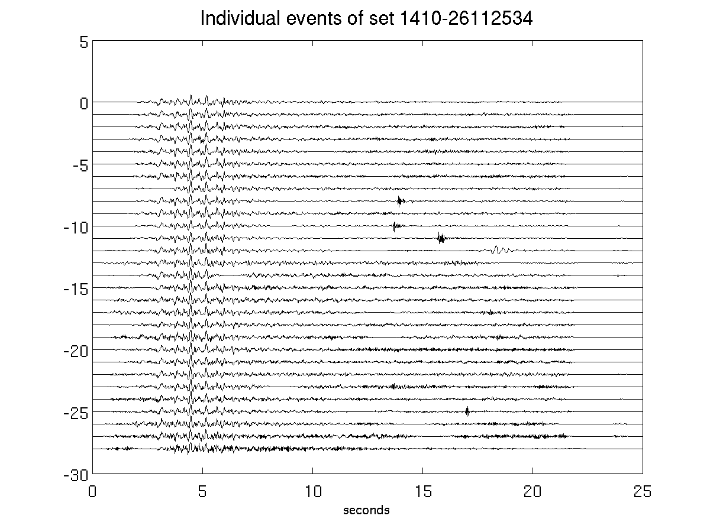](figures/1410-26112534_AllEv.png)[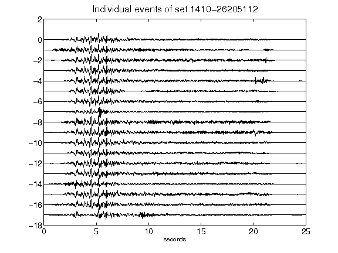](figures/1410-26205112_AllEv.png)[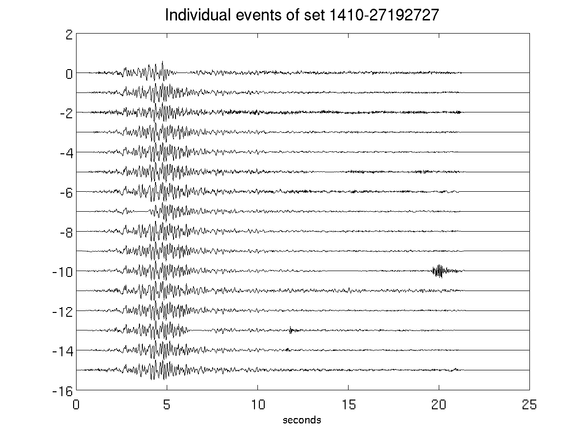](figures/1410-27192727_AllEv.png)