# Repeating Earthquake Activity at RCS

## Waveforms
[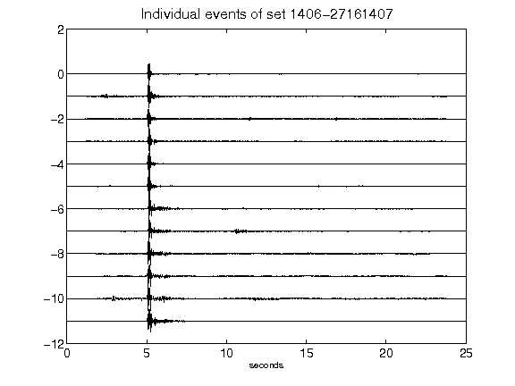](figures/1406-27161407_AllEv.png)[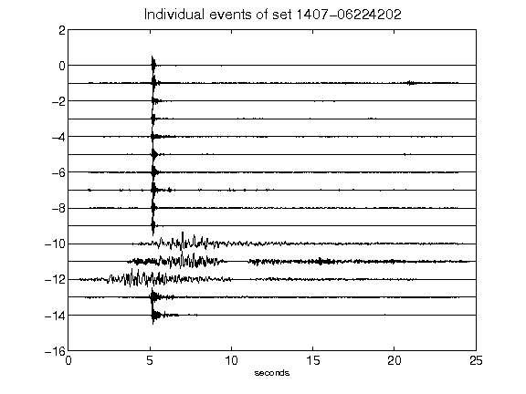](figures/1407-06224202_AllEv.png)[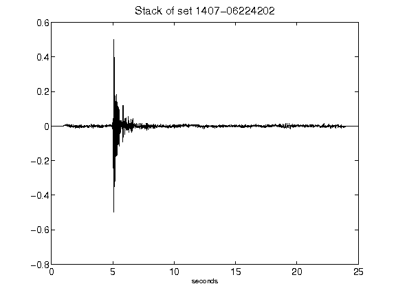](figures/1407-06224202_Stack.png)[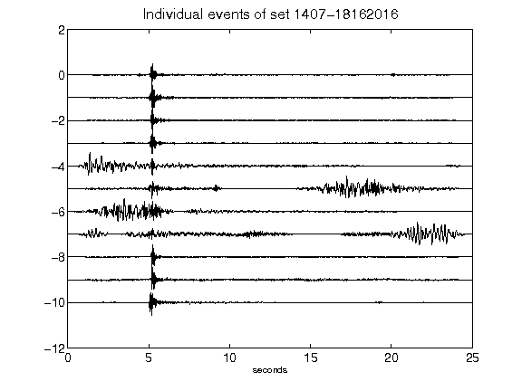](figures/1407-18162016_AllEv.png)[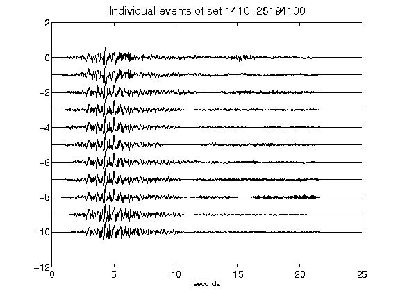](figures/1410-25194100_AllEv.png)[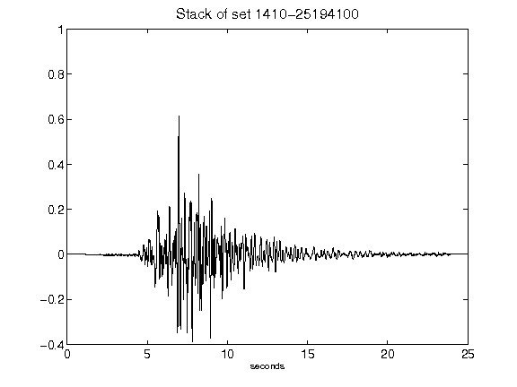](figures/1410-25194100_Stack.png)[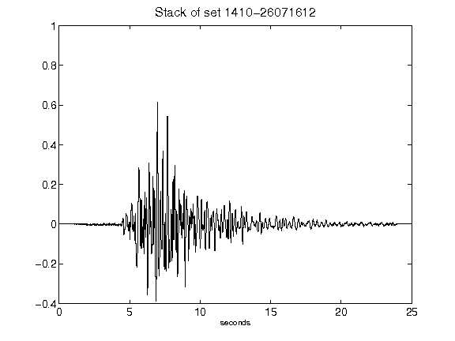](figures/1410-26071612_Stack.png)[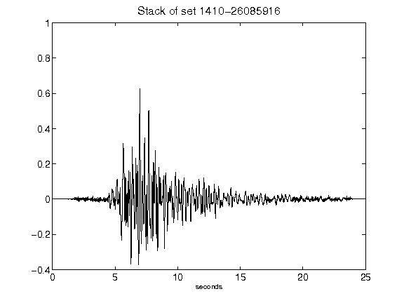](figures/1410-26085916_Stack.png)[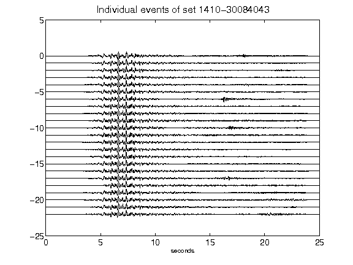](figures/1410-30084043_AllEv.png)[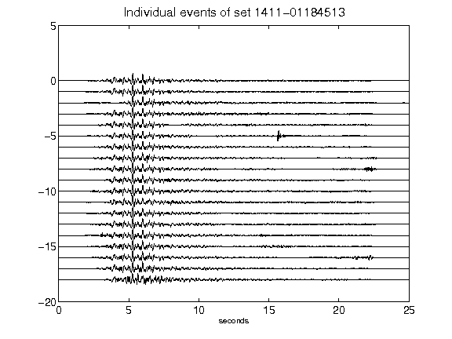](figures/1411-01184513_AllEv.png)[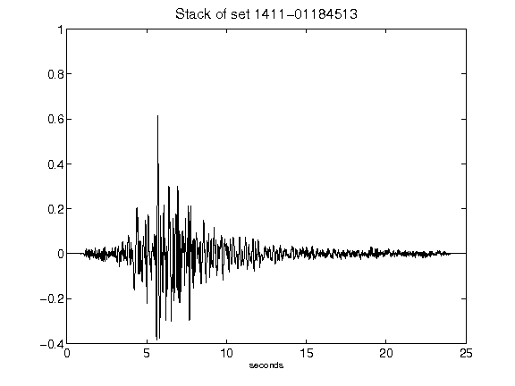](figures/1411-01184513_Stack.png)[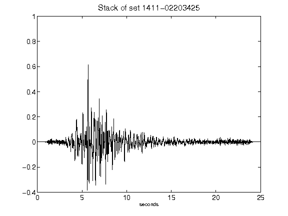](figures/1411-02203425_Stack.png)[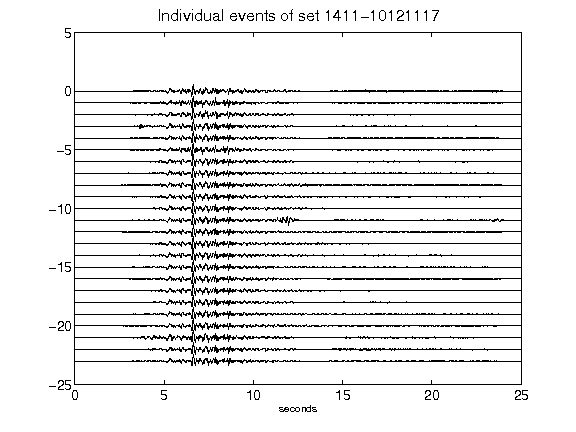](figures/1411-10121117_AllEv.png)[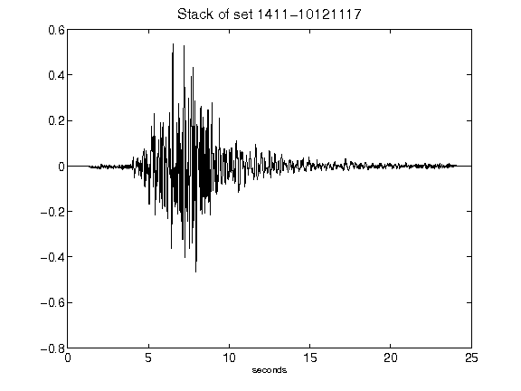](figures/1411-10121117_Stack.png)[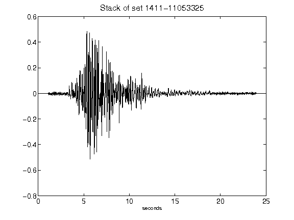](figures/1411-11053325_Stack.png)[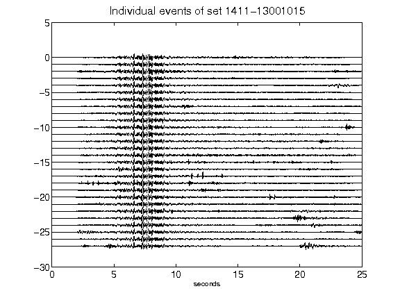](figures/1411-13001015_AllEv.png)[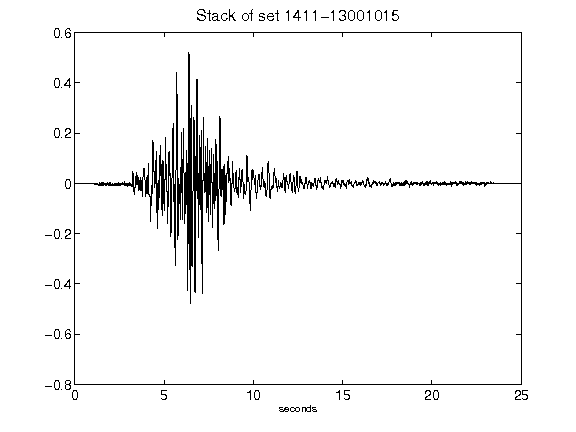](figures/1411-13001015_Stack.png)[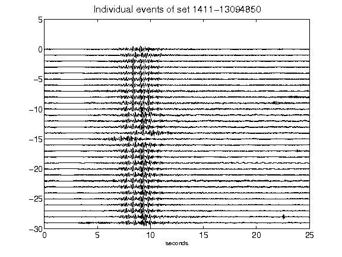](figures/1411-13094850_AllEv.png)[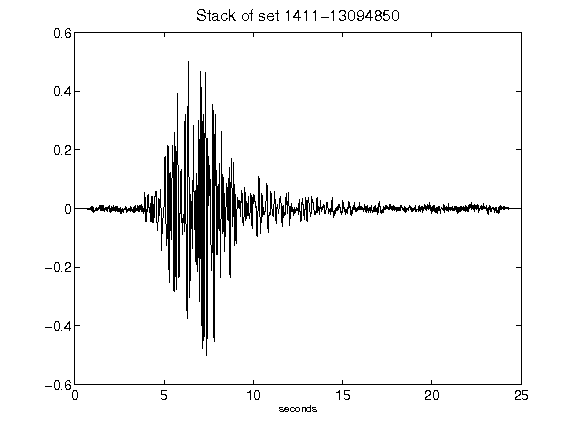](figures/1411-13094850_Stack.png)[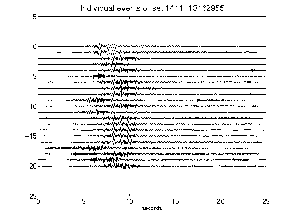](figures/1411-13162955_AllEv.png)[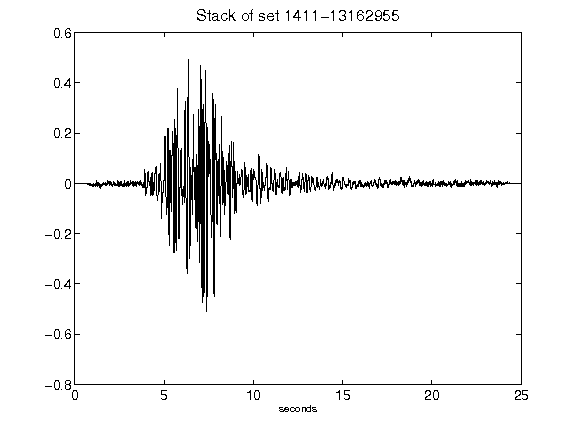](figures/1411-13162955_Stack.png)[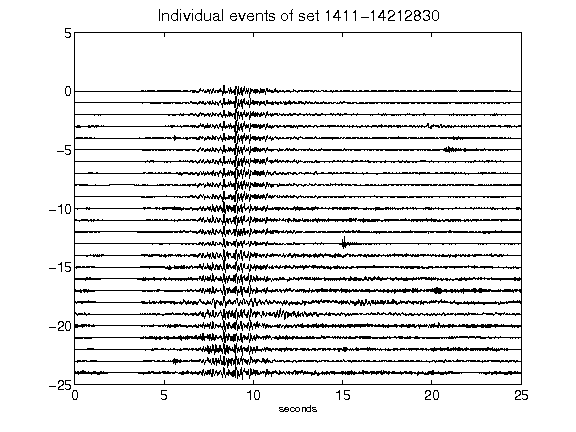](figures/1411-14212830_AllEv.png)[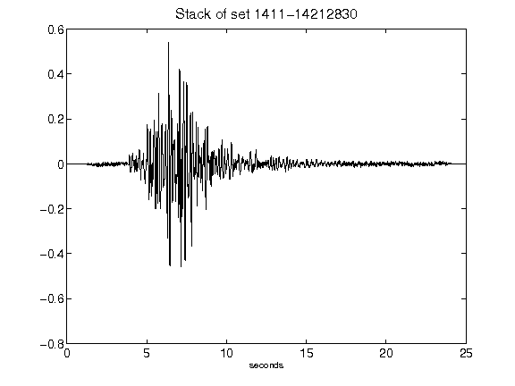](figures/1411-14212830_Stack.png)[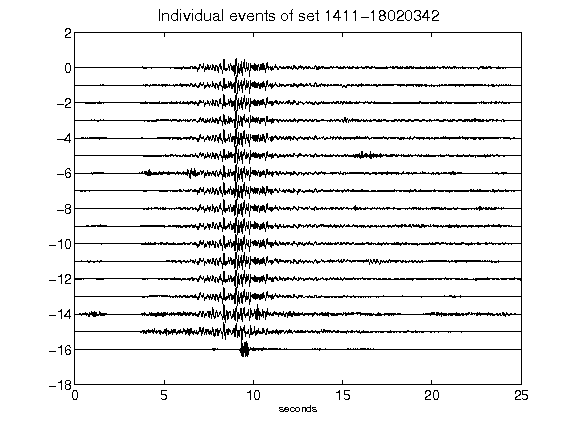](figures/1411-18020342_AllEv.png)[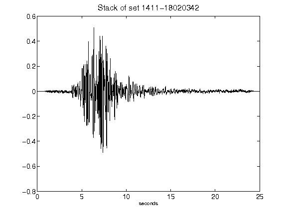](figures/1411-18020342_Stack.png)[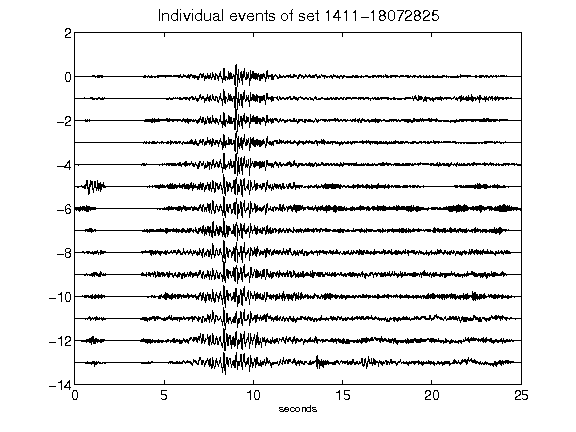](figures/1411-18072825_AllEv.png)[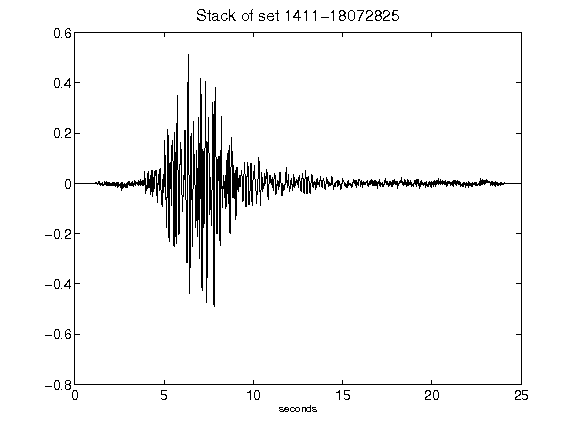](figures/1411-18072825_Stack.png)[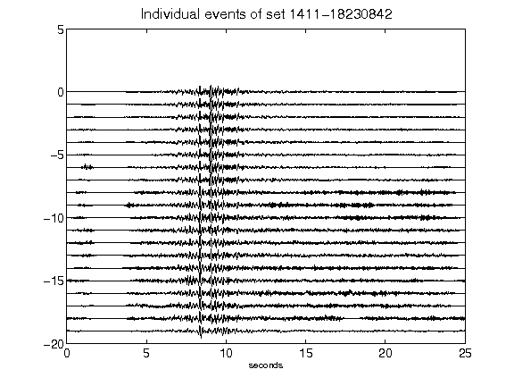](figures/1411-18230842_AllEv.png)[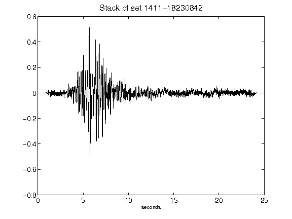](figures/1411-18230842_Stack.png)[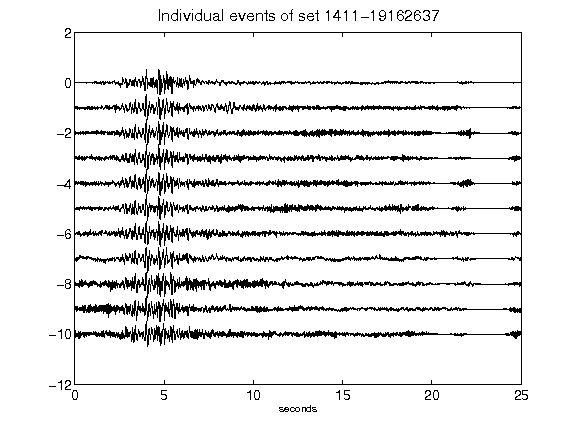](figures/1411-19162637_AllEv.png)[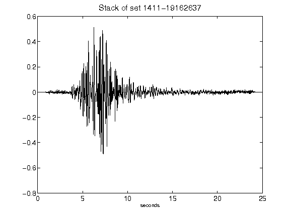](figures/1411-19162637_Stack.png)[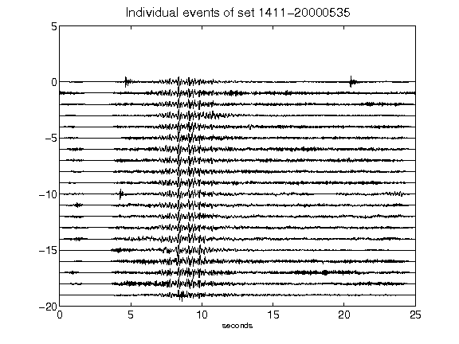](figures/1411-20000535_AllEv.png)[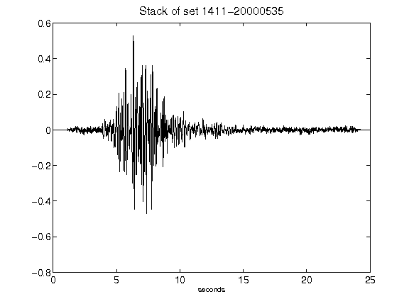](figures/1411-20000535_Stack.png)[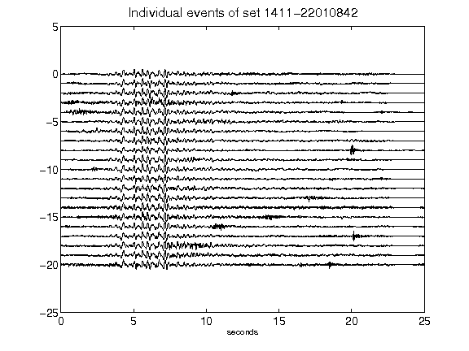](figures/1411-22010842_AllEv.png)[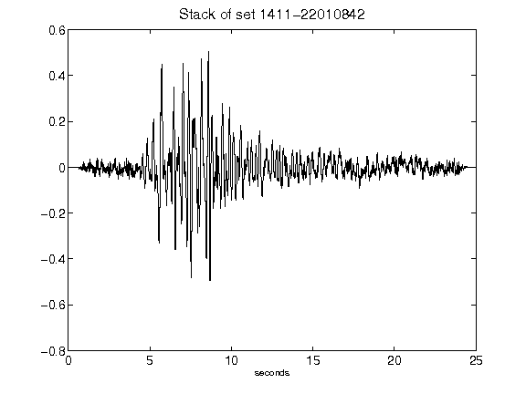](figures/1411-22010842_Stack.png)[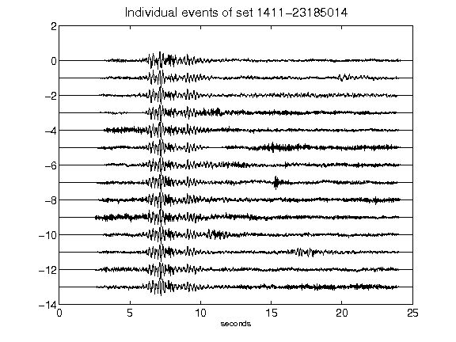](figures/1411-23185014_AllEv.png)[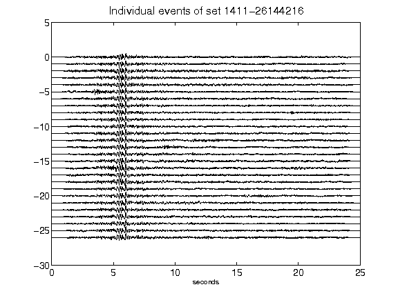](figures/1411-26144216_AllEv.png)[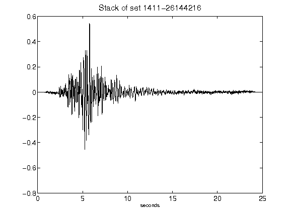](figures/1411-26144216_Stack.png)[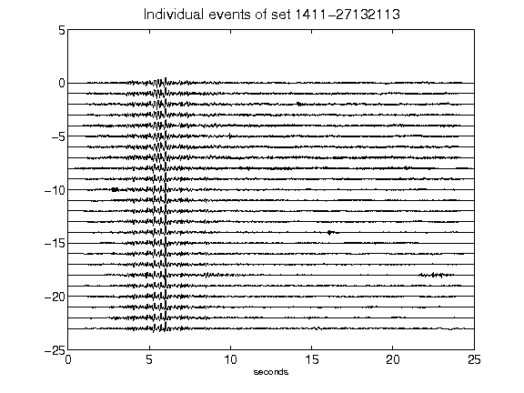](figures/1411-27132113_AllEv.png)[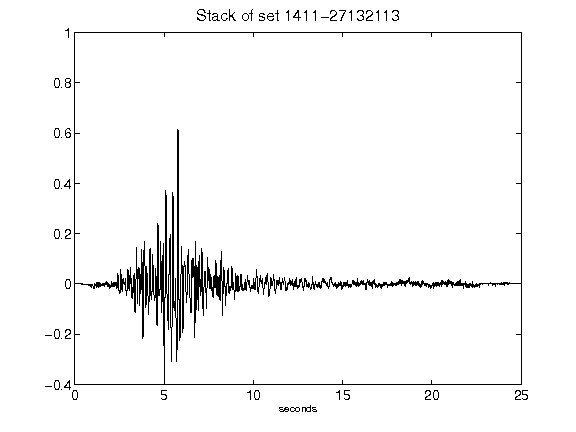](figures/1411-27132113_Stack.png)