# Repeating Earthquake Activity at RCS

## Waveforms
[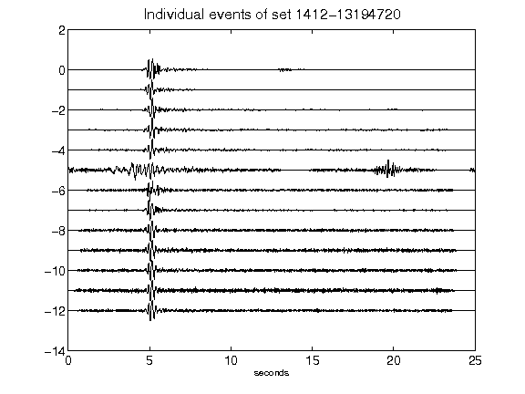](figures/1412-13194720_AllEv.png)[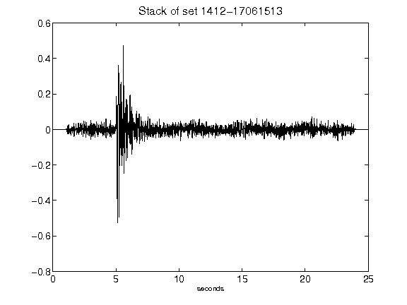](figures/1412-17061513_Stack.png)[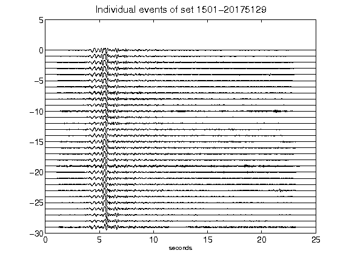](figures/1501-20175129_AllEv.png)[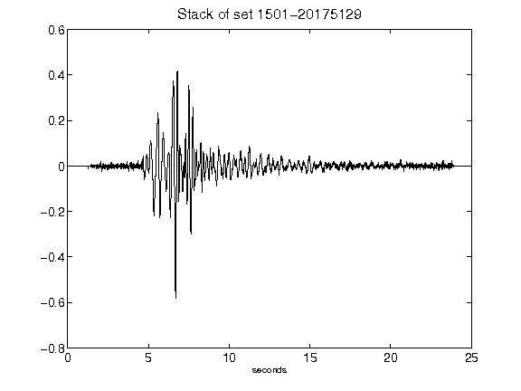](figures/1501-20175129_Stack.png)[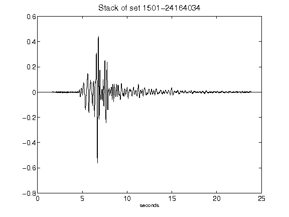](figures/1501-24164034_Stack.png)[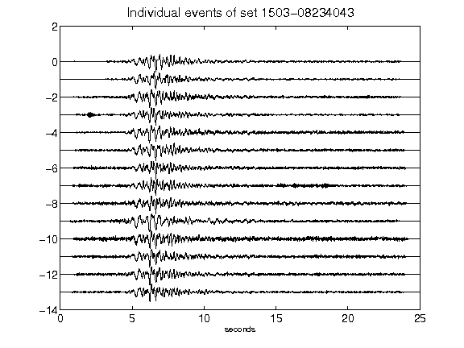](figures/1503-08234043_AllEv.png)[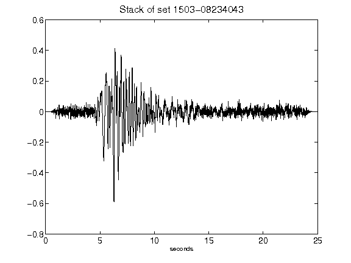](figures/1503-08234043_Stack.png)[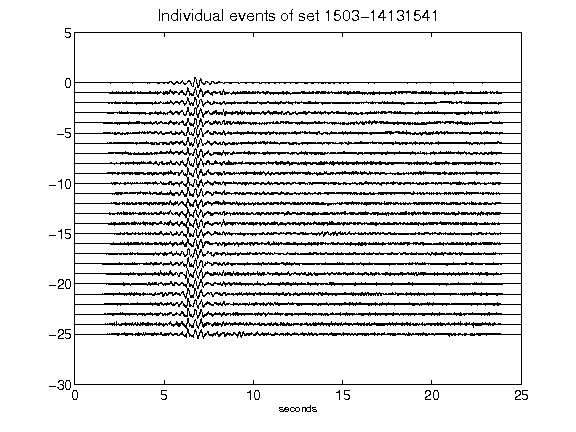](figures/1503-14131541_AllEv.png)[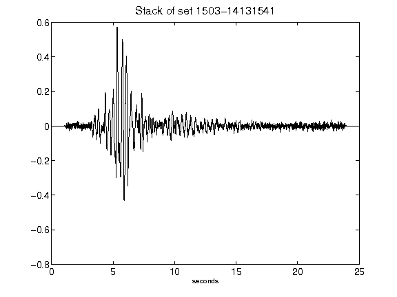](figures/1503-14131541_Stack.png)[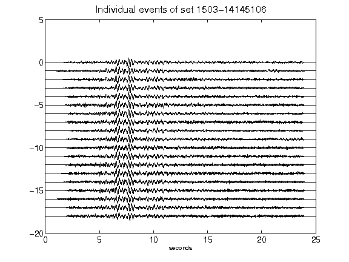](figures/1503-14145106_AllEv.png)[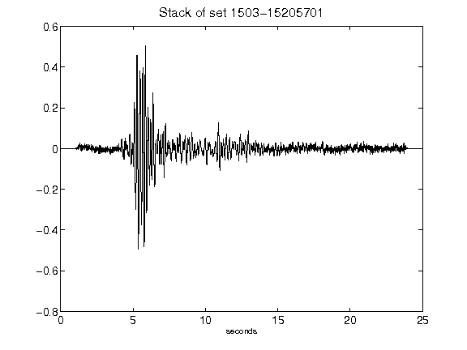](figures/1503-15205701_Stack.png)