# Repeating Earthquake Activity at RCS

## Waveforms
[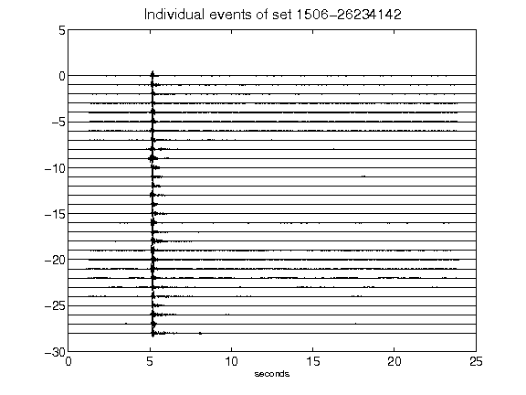](figures/1506-26234142_AllEv.png)[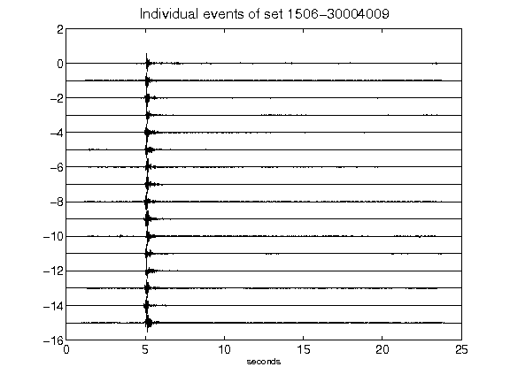](figures/1506-30004009_AllEv.png)[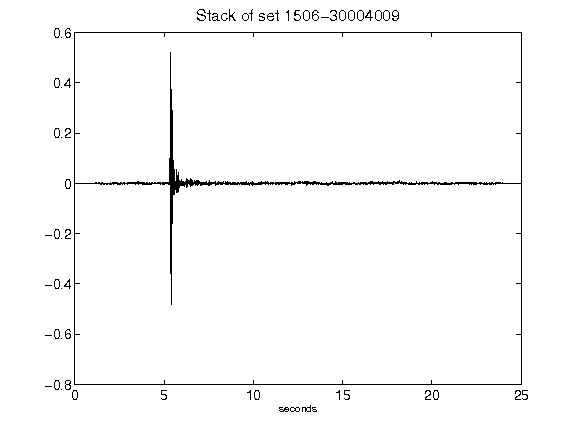](figures/1506-30004009_Stack.png)[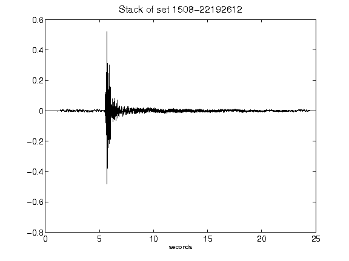](figures/1508-22192612_Stack.png)[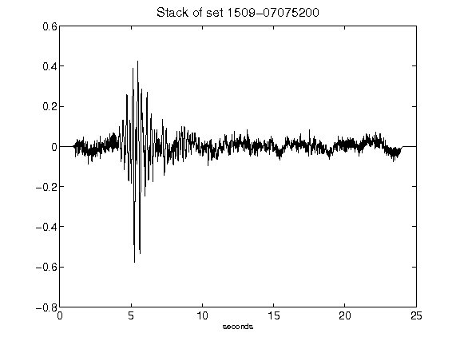](figures/1509-07075200_Stack.png)[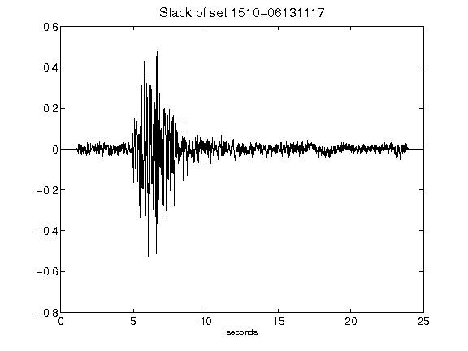](figures/1510-06131117_Stack.png)[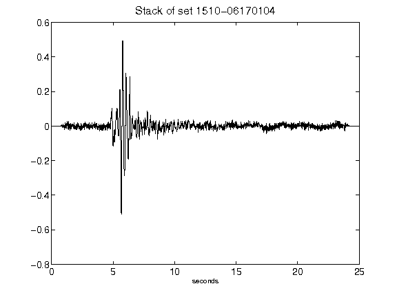](figures/1510-06170104_Stack.png)[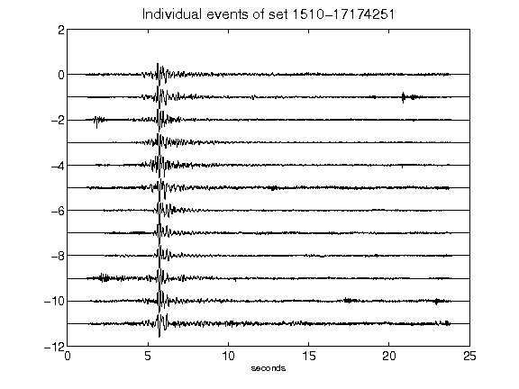](figures/1510-17174251_AllEv.png)[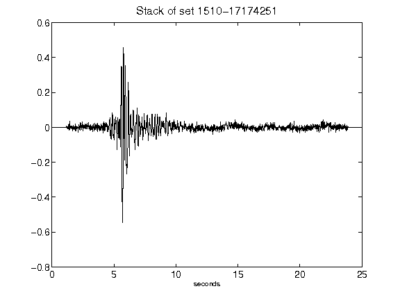](figures/1510-17174251_Stack.png)[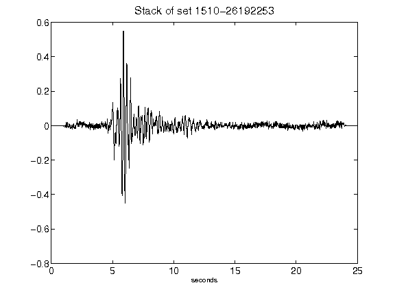](figures/1510-26192253_Stack.png)[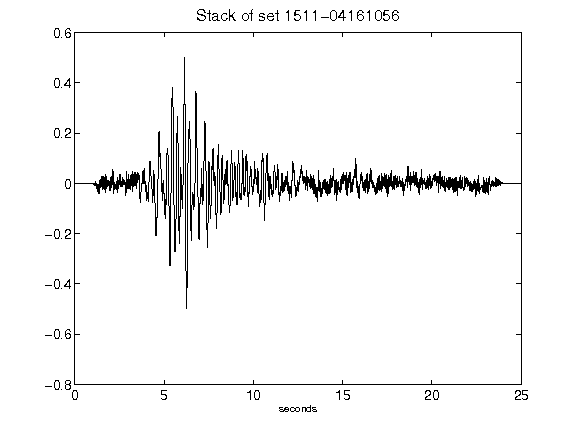](figures/1511-04161056_Stack.png)[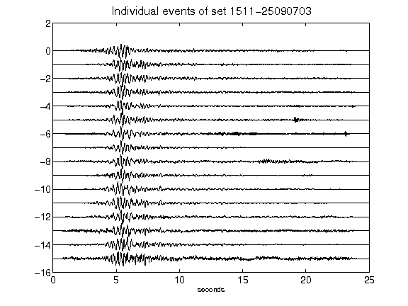](figures/1511-25090703_AllEv.png)[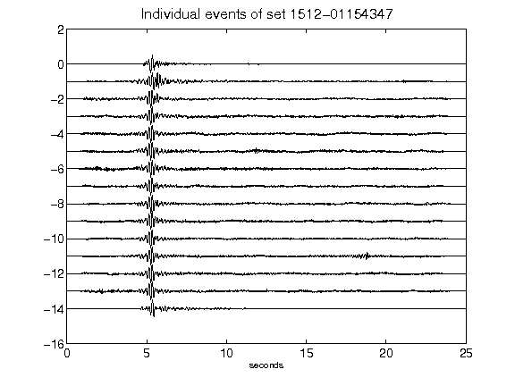](figures/1512-01154347_AllEv.png)[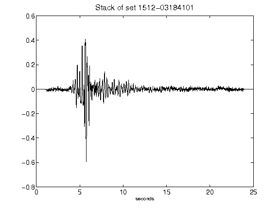](figures/1512-03184101_Stack.png)[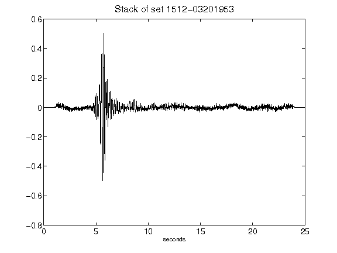](figures/1512-03201953_Stack.png)