# Repeating Earthquake Activity at RCS

## Waveforms
[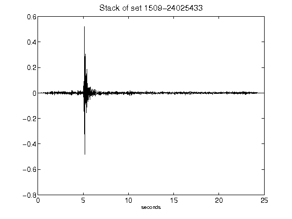](figures/1509-24025433_Stack.png)[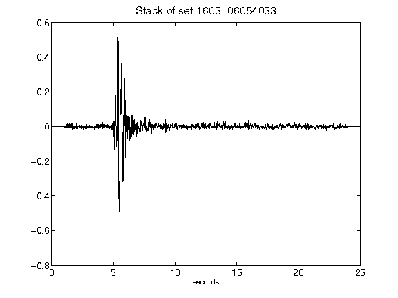](figures/1603-06054033_Stack.png)[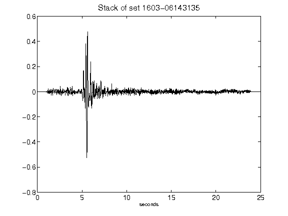](figures/1603-06143135_Stack.png)[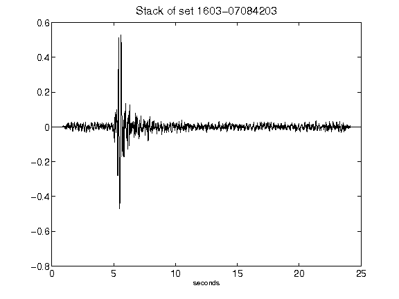](figures/1603-07084203_Stack.png)[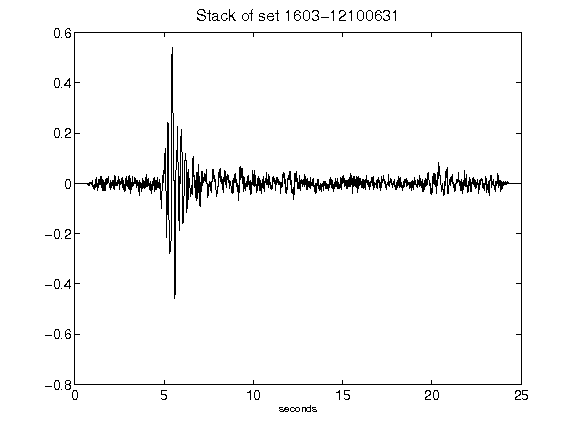](figures/1603-12100631_Stack.png)[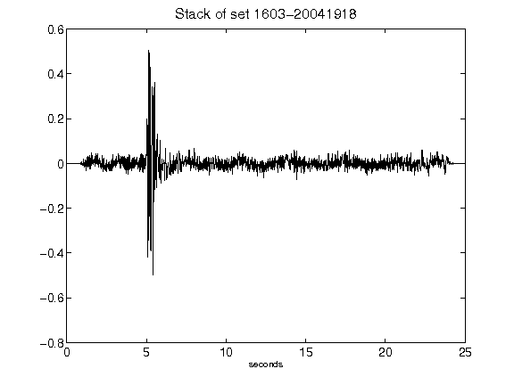](figures/1603-20041918_Stack.png)[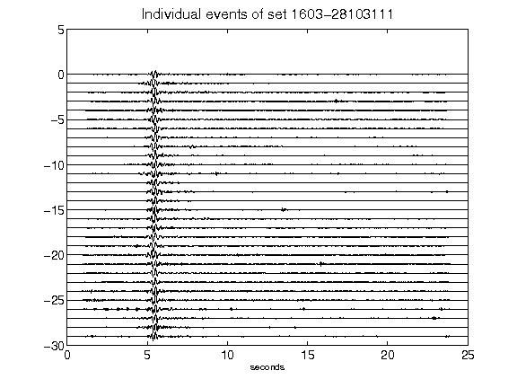](figures/1603-28103111_AllEv.png)[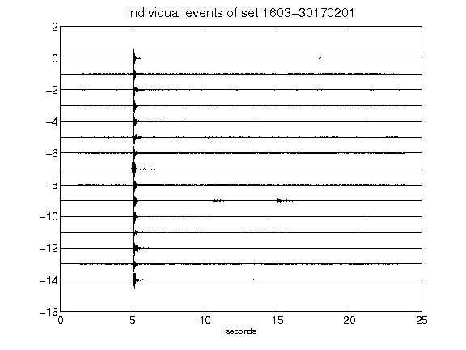](figures/1603-30170201_AllEv.png)[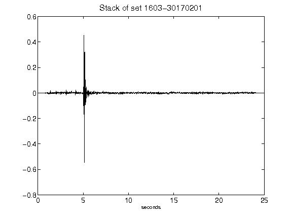](figures/1603-30170201_Stack.png)[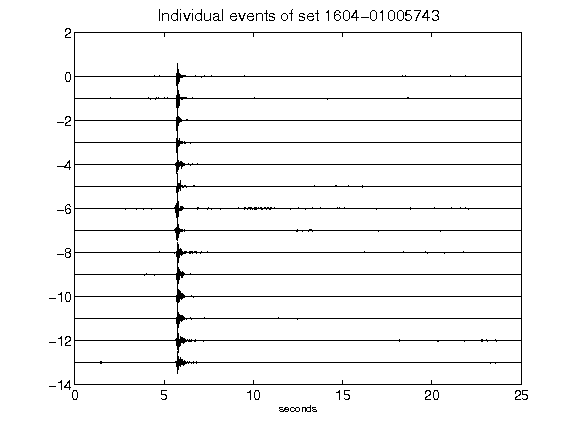](figures/1604-01005743_AllEv.png)[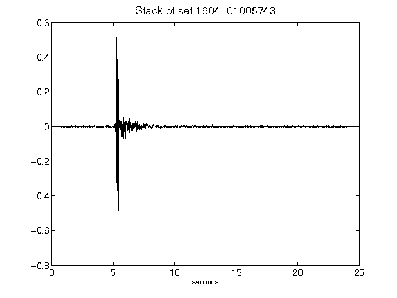](figures/1604-01005743_Stack.png)[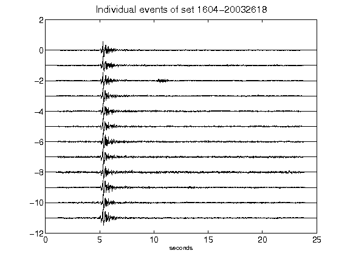](figures/1604-20032618_AllEv.png)