# Repeating Earthquake Activity at RCS

## Waveforms
[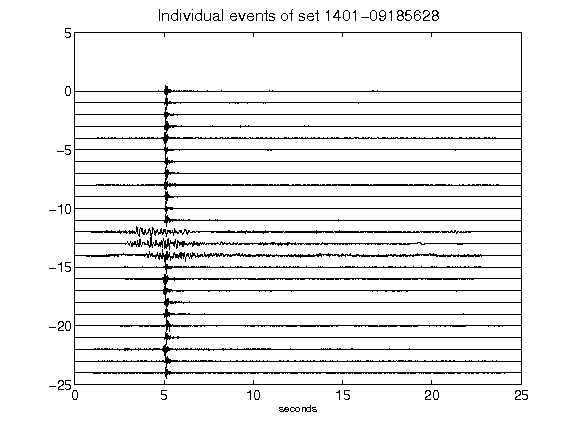](figures/1401-09185628_AllEv.png)[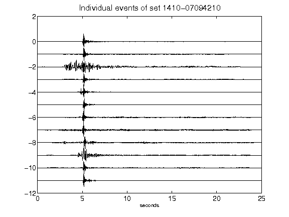](figures/1410-07094210_AllEv.png)[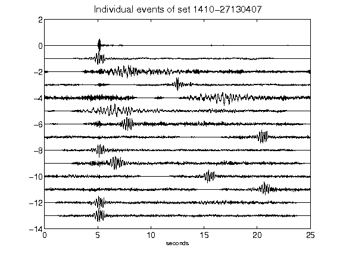](figures/1410-27130407_AllEv.png)[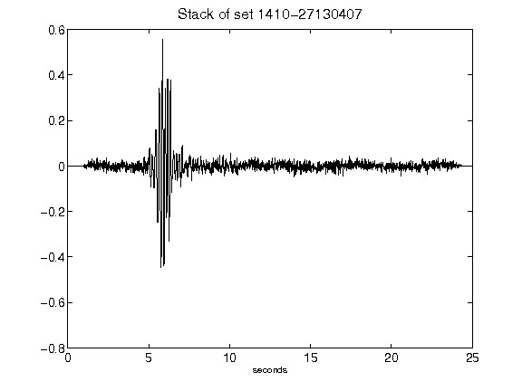](figures/1410-27130407_Stack.png)[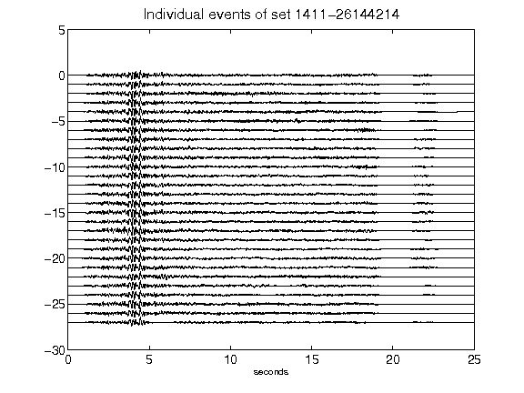](figures/1411-26144214_AllEv.png)[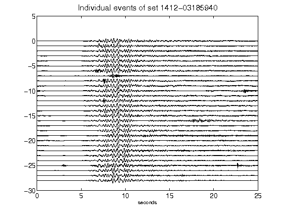](figures/1412-03185940_AllEv.png)[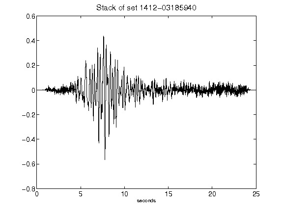](figures/1412-03185940_Stack.png)[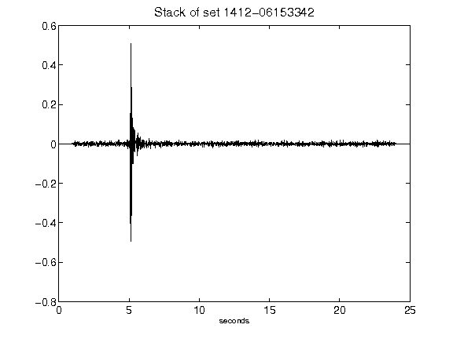](figures/1412-06153342_Stack.png)[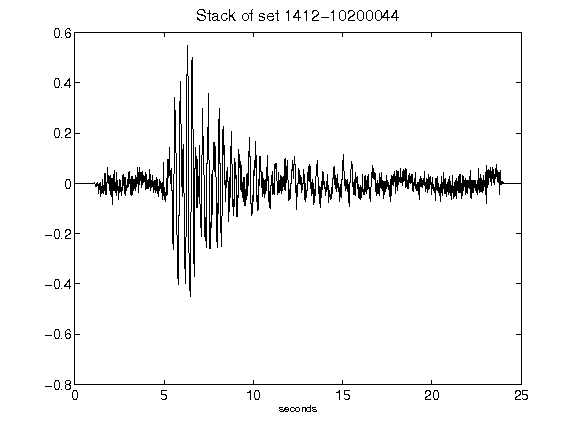](figures/1412-10200044_Stack.png)[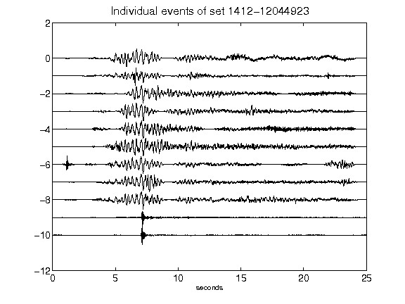](figures/1412-12044923_AllEv.png)[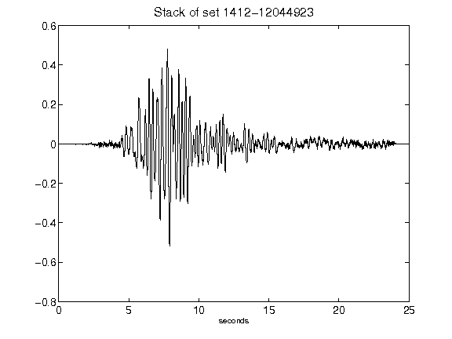](figures/1412-12044923_Stack.png)[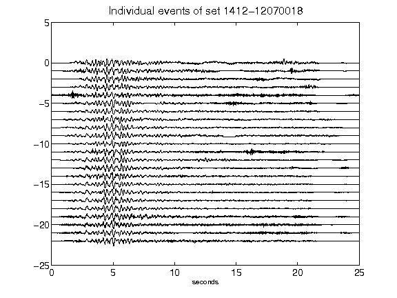](figures/1412-12070018_AllEv.png)[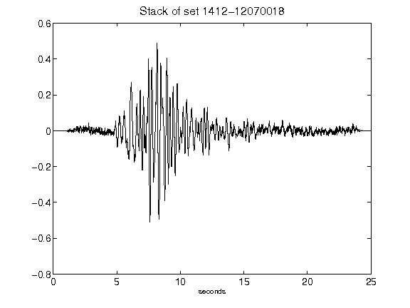](figures/1412-12070018_Stack.png)[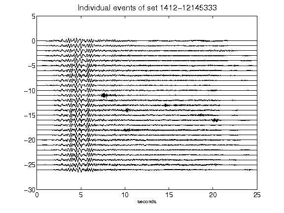](figures/1412-12145333_AllEv.png)[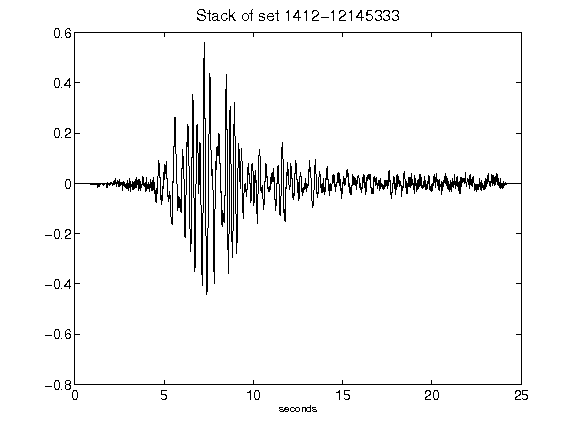](figures/1412-12145333_Stack.png)