# Repeating Earthquake Activity at RCS

## Waveforms
[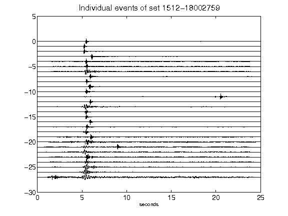](figures/1512-18002759_AllEv.png)[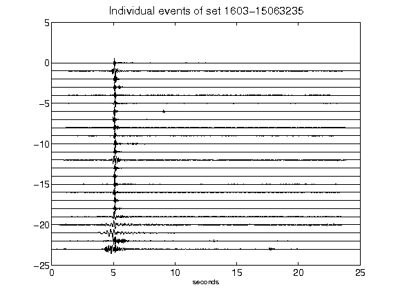](figures/1603-15063235_AllEv.png)[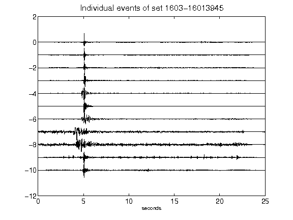](figures/1603-16013945_AllEv.png)[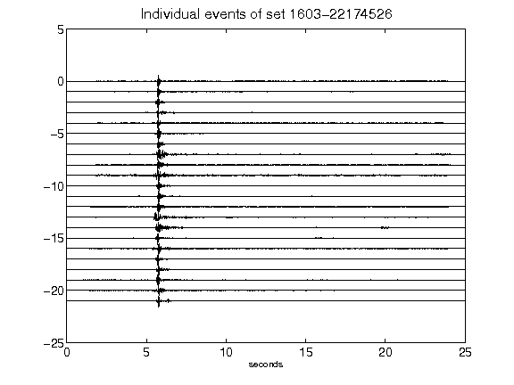](figures/1603-22174526_AllEv.png)[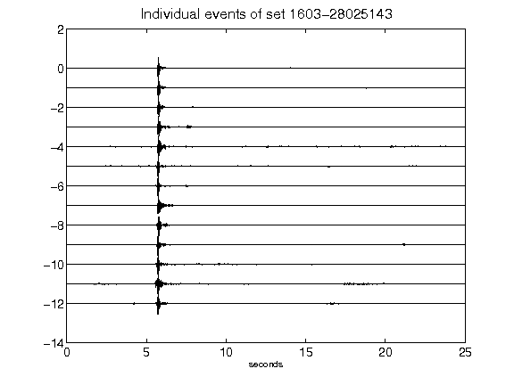](figures/1603-28025143_AllEv.png)[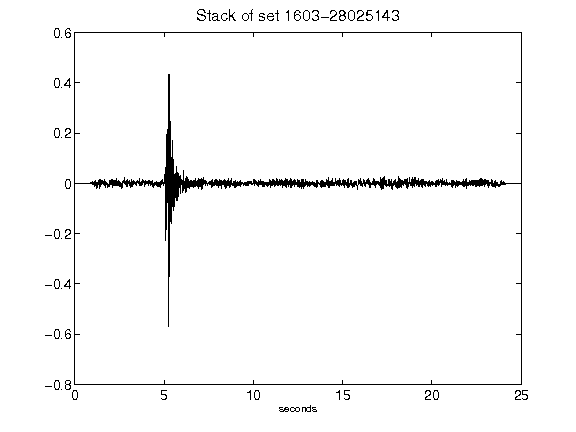](figures/1603-28025143_Stack.png)[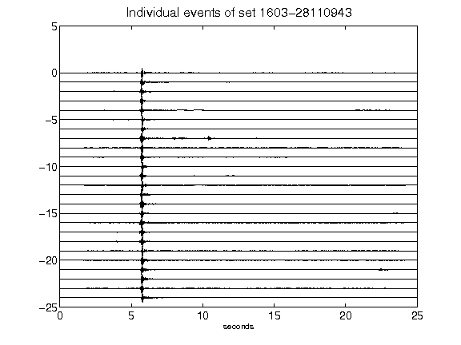](figures/1603-28110943_AllEv.png)[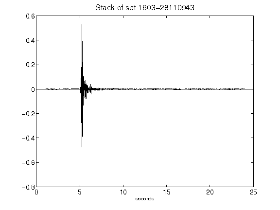](figures/1603-28110943_Stack.png)[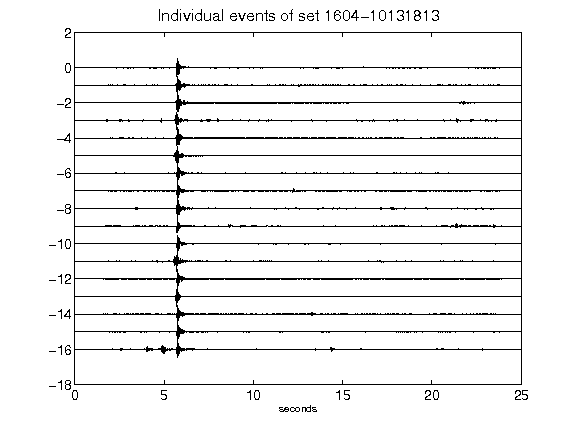](figures/1604-10131813_AllEv.png)[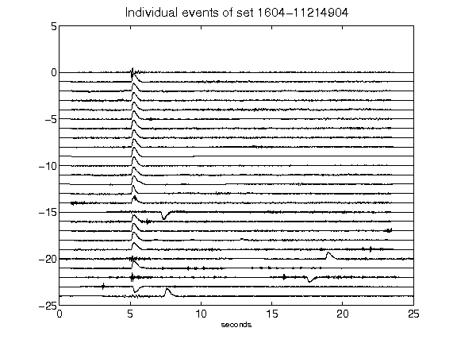](figures/1604-11214904_AllEv.png)[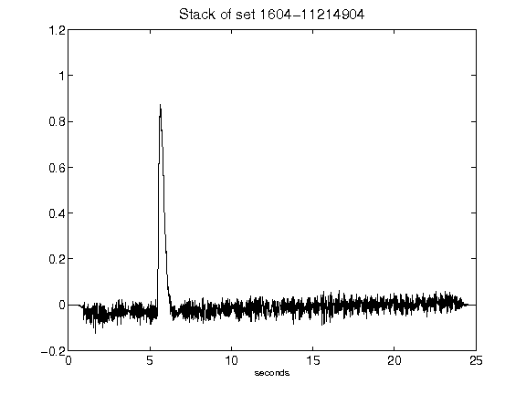](figures/1604-11214904_Stack.png)[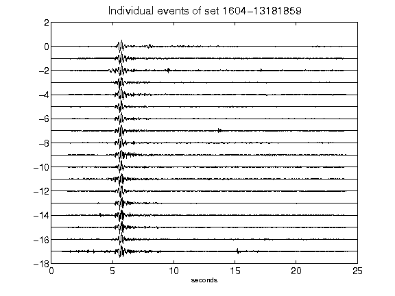](figures/1604-13181859_AllEv.png)[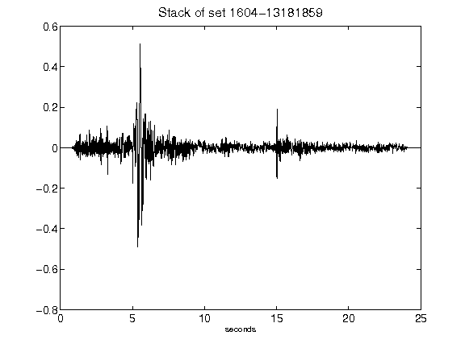](figures/1604-13181859_Stack.png)[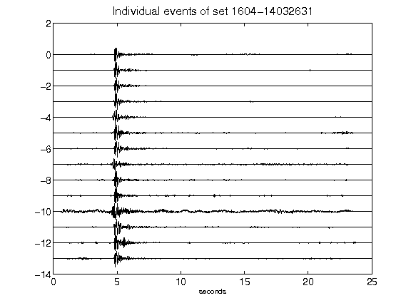](figures/1604-14032631_AllEv.png)[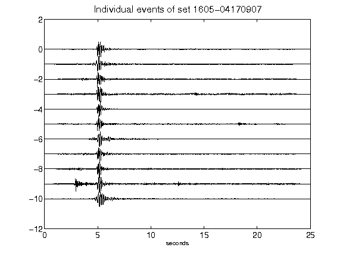](figures/1605-04170907_AllEv.png)[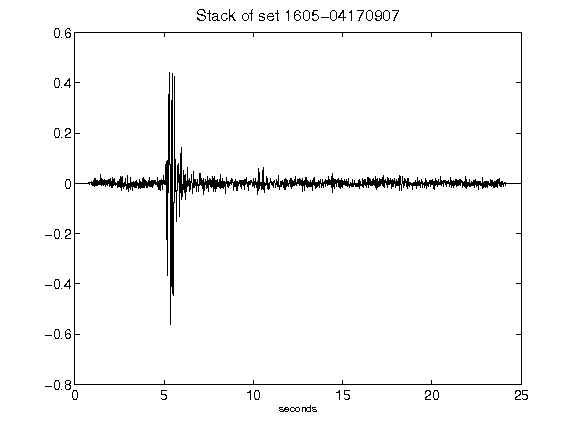](figures/1605-04170907_Stack.png)