# Repeating Earthquake Activity at RCS

## Waveforms
[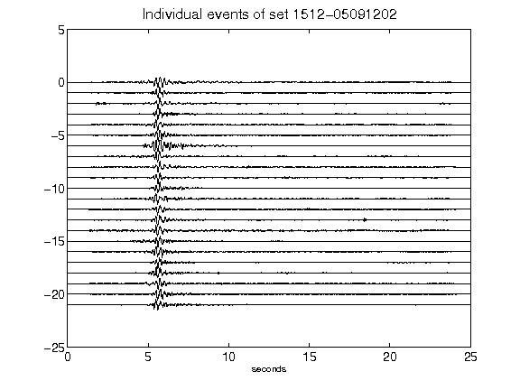](figures/1512-05091202_AllEv.png)[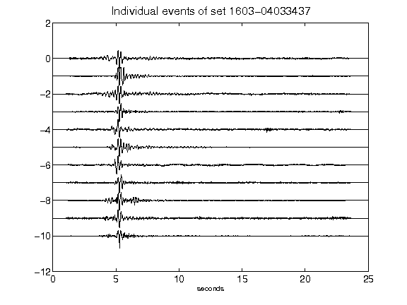](figures/1603-04033437_AllEv.png)[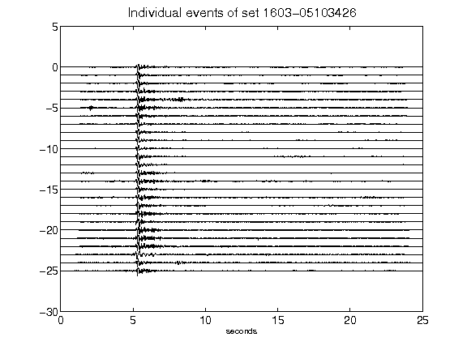](figures/1603-05103426_AllEv.png)[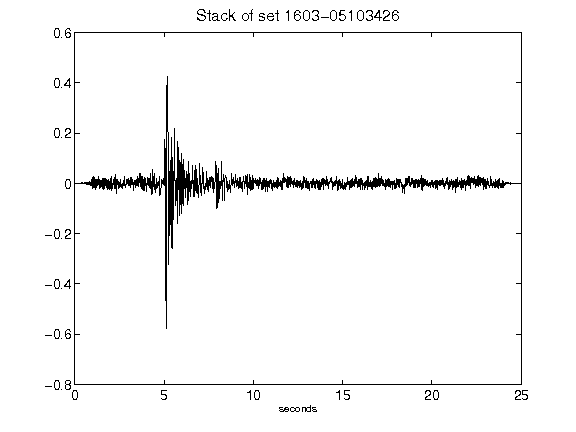](figures/1603-05103426_Stack.png)[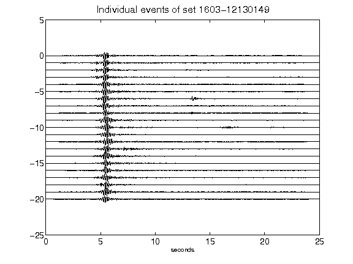](figures/1603-12130149_AllEv.png)[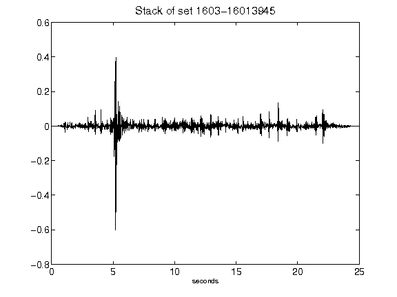](figures/1603-16013945_Stack.png)[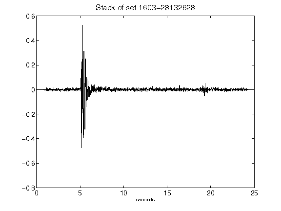](figures/1603-28132628_Stack.png)[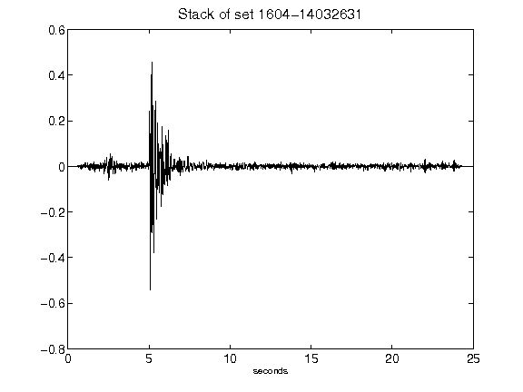](figures/1604-14032631_Stack.png)[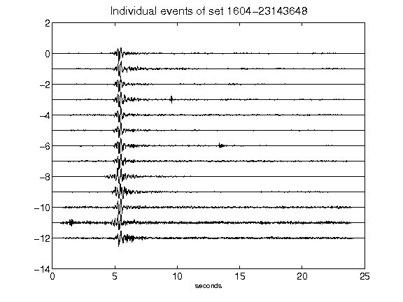](figures/1604-23143648_AllEv.png)[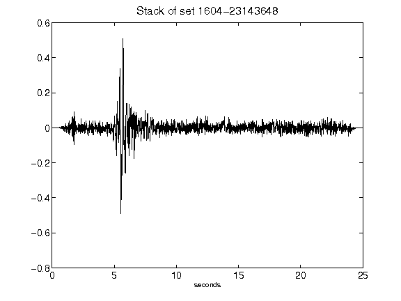](figures/1604-23143648_Stack.png)[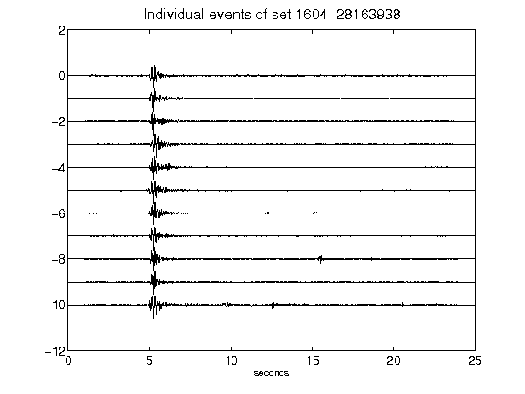](figures/1604-28163938_AllEv.png)[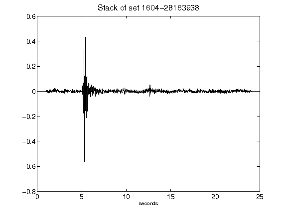](figures/1604-28163938_Stack.png)[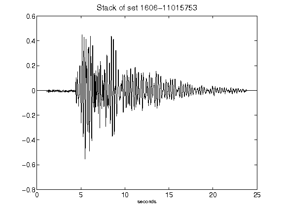](figures/1606-11015753_Stack.png)