# Repeating Earthquake Activity at RCS

## Waveforms
[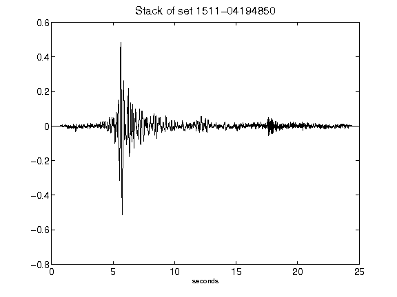](figures/1511-04194850_Stack.png)[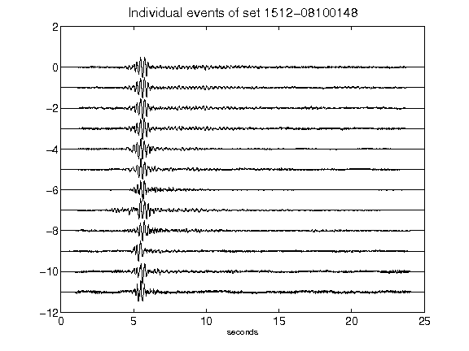](figures/1512-08100148_AllEv.png)[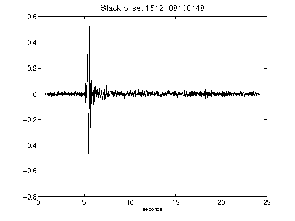](figures/1512-08100148_Stack.png)[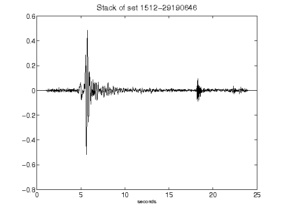](figures/1512-29190646_Stack.png)[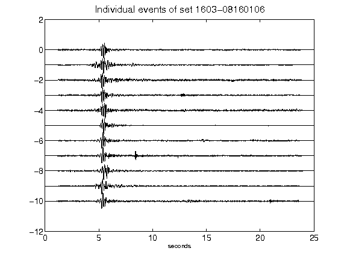](figures/1603-08160106_AllEv.png)[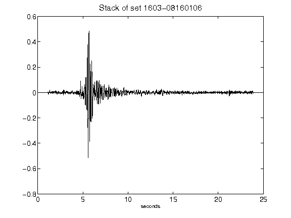](figures/1603-08160106_Stack.png)[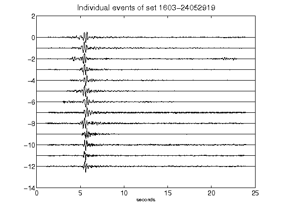](figures/1603-24052919_AllEv.png)[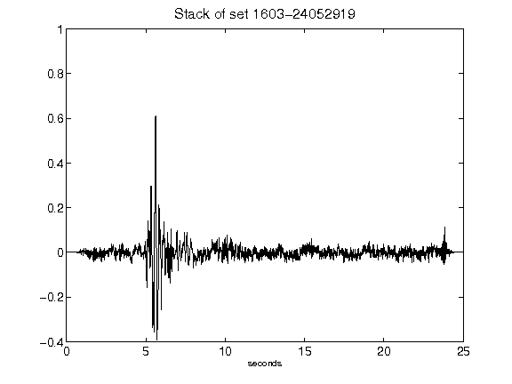](figures/1603-24052919_Stack.png)[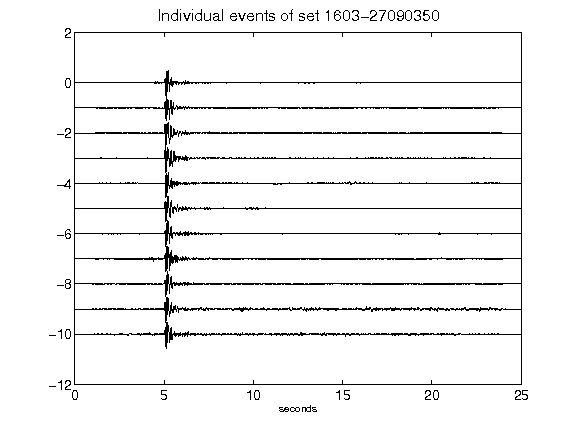](figures/1603-27090350_AllEv.png)[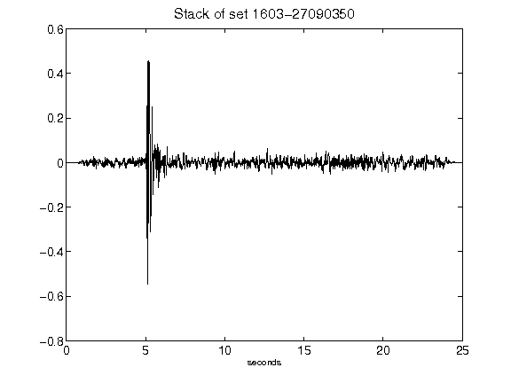](figures/1603-27090350_Stack.png)[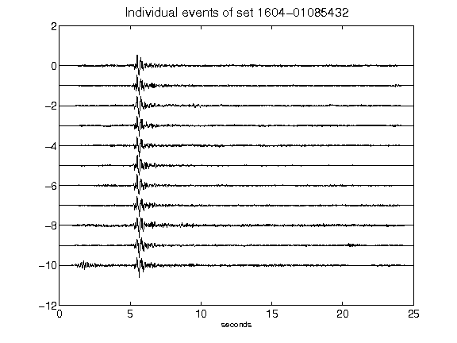](figures/1604-01085432_AllEv.png)[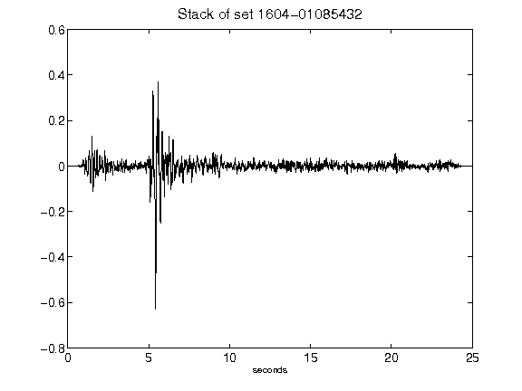](figures/1604-01085432_Stack.png)[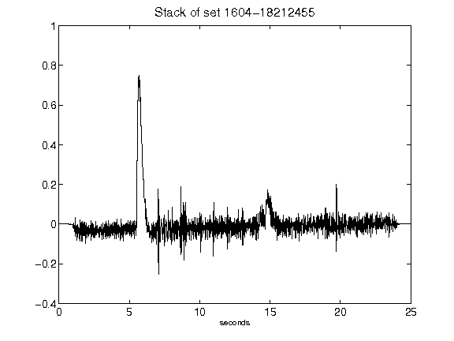](figures/1604-18212455_Stack.png)