# Repeating Earthquake Activity at RCS

## Waveforms
[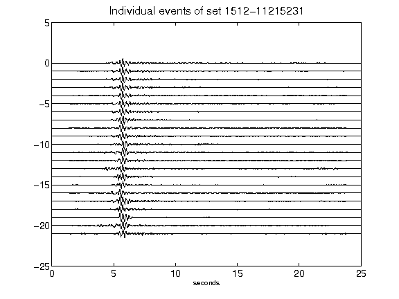](figures/1512-11215231_AllEv.png)[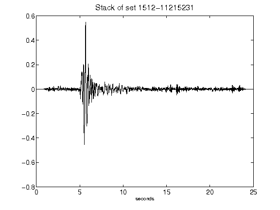](figures/1512-11215231_Stack.png)[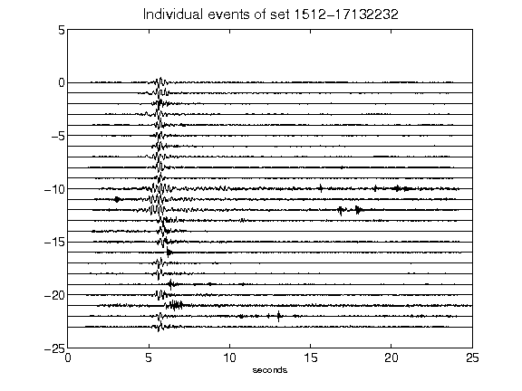](figures/1512-17132232_AllEv.png)[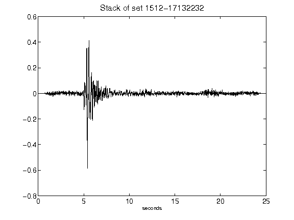](figures/1512-17132232_Stack.png)[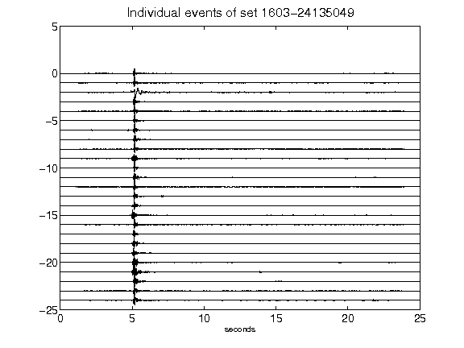](figures/1603-24135049_AllEv.png)[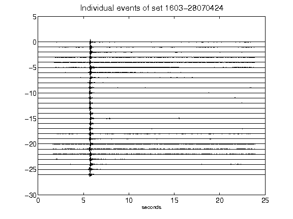](figures/1603-28070424_AllEv.png)[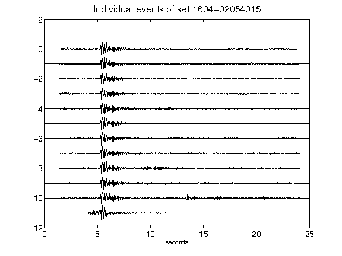](figures/1604-02054015_AllEv.png)[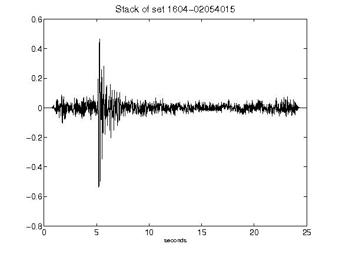](figures/1604-02054015_Stack.png)[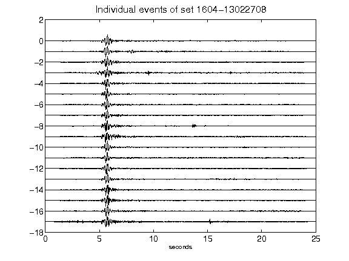](figures/1604-13022708_AllEv.png)[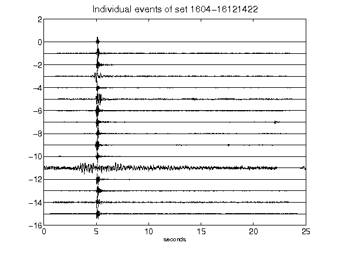](figures/1604-16121422_AllEv.png)[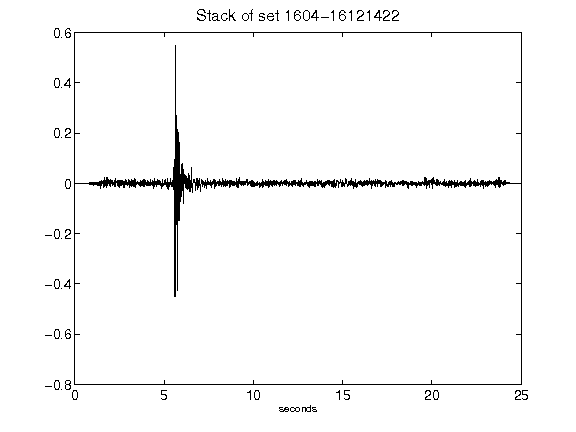](figures/1604-16121422_Stack.png)[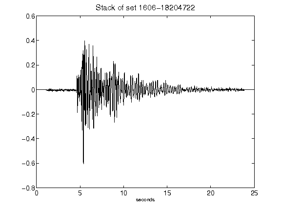](figures/1606-18204722_Stack.png)