# Repeating Earthquake Activity at RCS

## Waveforms
[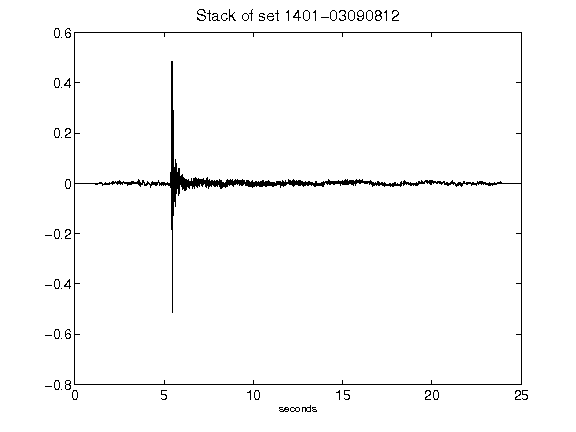](figures/1401-03090812_Stack.png)[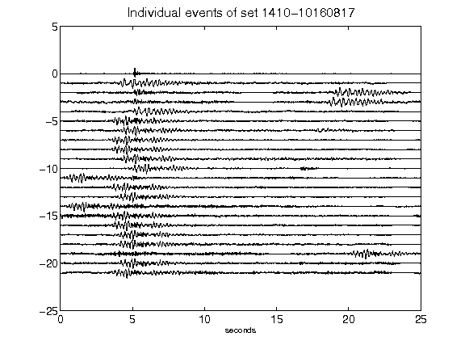](figures/1410-10160817_AllEv.png)[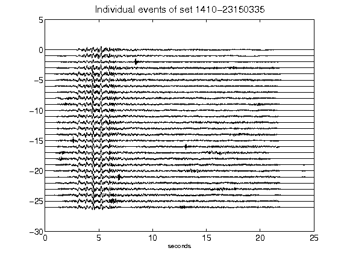](figures/1410-23150335_AllEv.png)[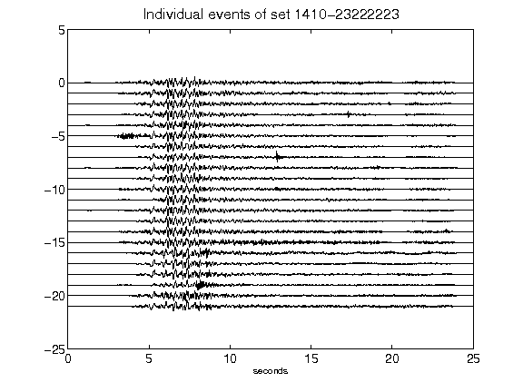](figures/1410-23222223_AllEv.png)[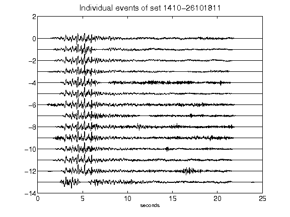](figures/1410-26101811_AllEv.png)[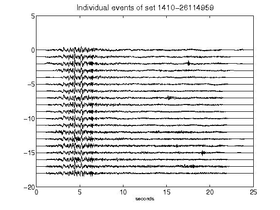](figures/1410-26114959_AllEv.png)[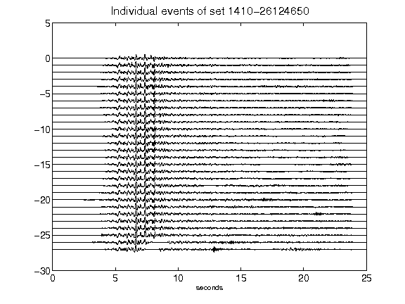](figures/1410-26124650_AllEv.png)[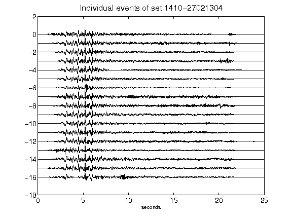](figures/1410-27021304_AllEv.png)[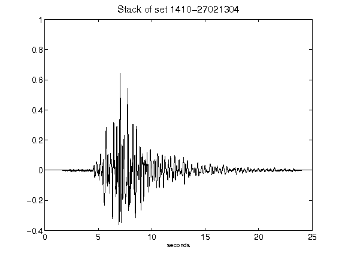](figures/1410-27021304_Stack.png)[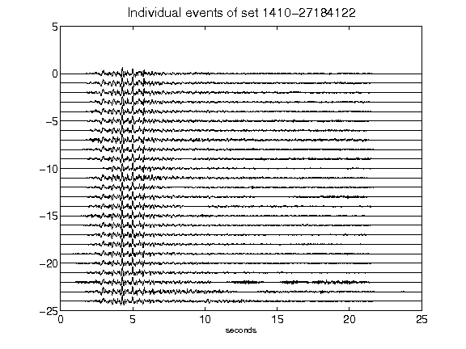](figures/1410-27184122_AllEv.png)[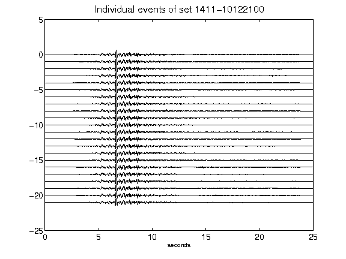](figures/1411-10122100_AllEv.png)[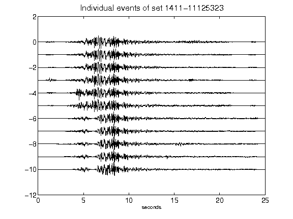](figures/1411-11125323_AllEv.png)[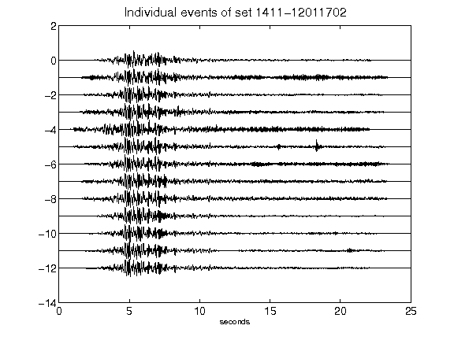](figures/1411-12011702_AllEv.png)[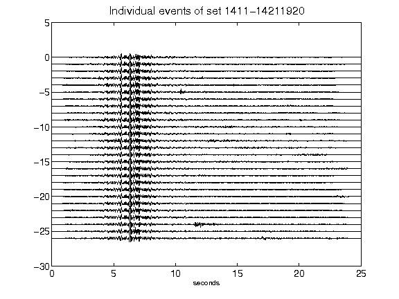](figures/1411-14211920_AllEv.png)