# Repeating Earthquake Activity at RCS

## Waveforms
[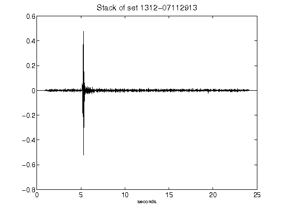](figures/1312-07112913_Stack.png)[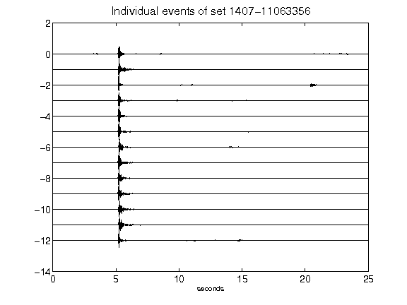](figures/1407-11063356_AllEv.png)[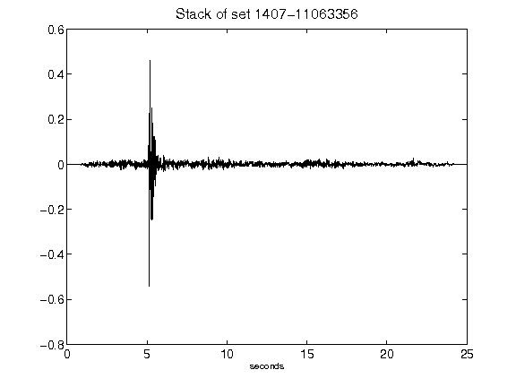](figures/1407-11063356_Stack.png)[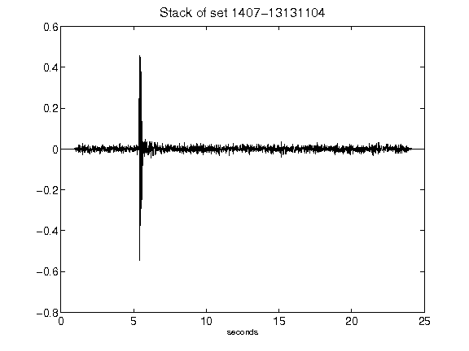](figures/1407-13131104_Stack.png)[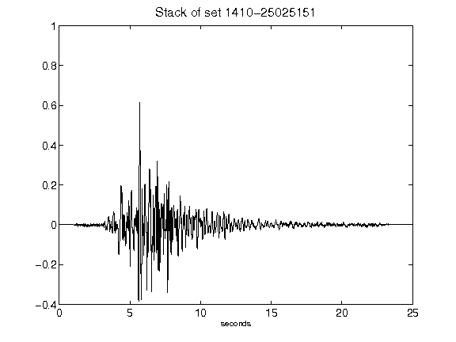](figures/1410-25025151_Stack.png)[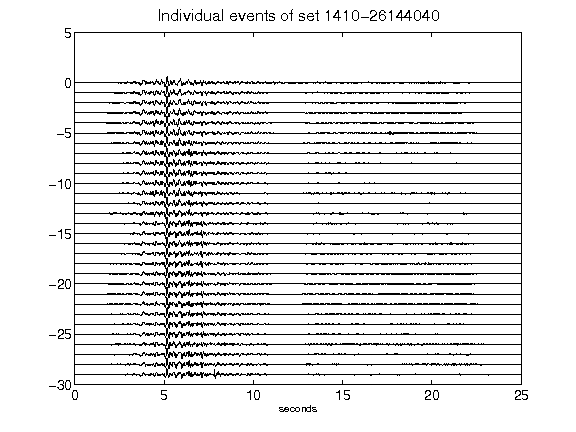](figures/1410-26144040_AllEv.png)[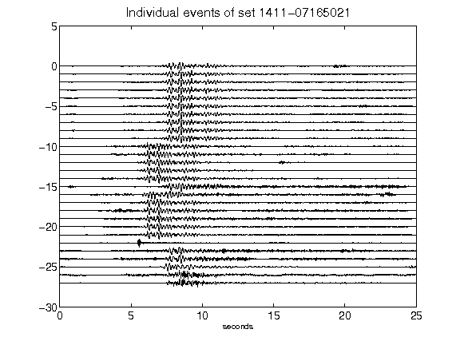](figures/1411-07165021_AllEv.png)[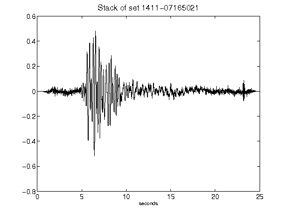](figures/1411-07165021_Stack.png)[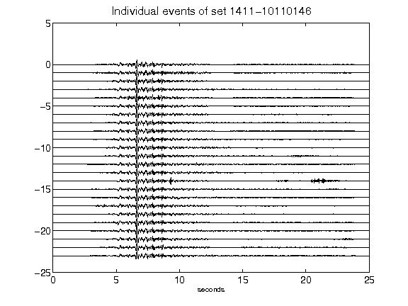](figures/1411-10110146_AllEv.png)[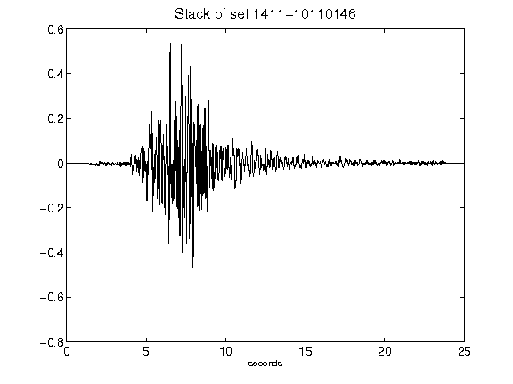](figures/1411-10110146_Stack.png)[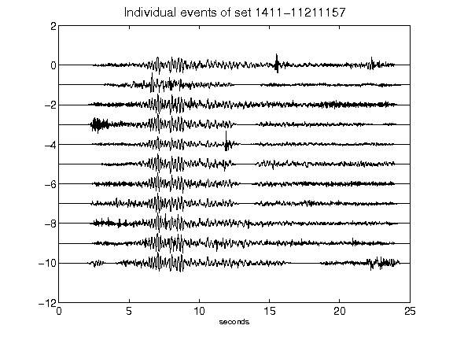](figures/1411-11211157_AllEv.png)[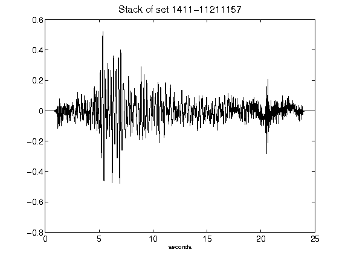](figures/1411-11211157_Stack.png)[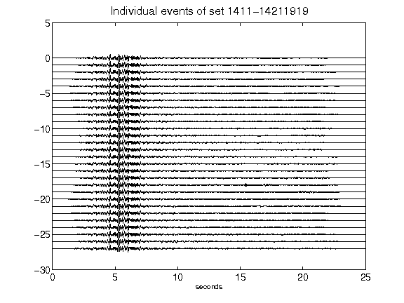](figures/1411-14211919_AllEv.png)[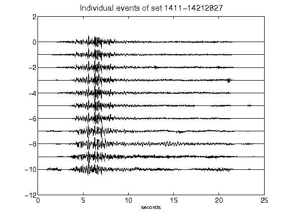](figures/1411-14212827_AllEv.png)[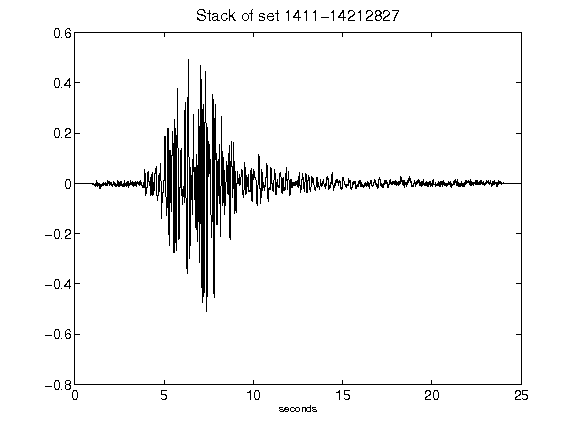](figures/1411-14212827_Stack.png)[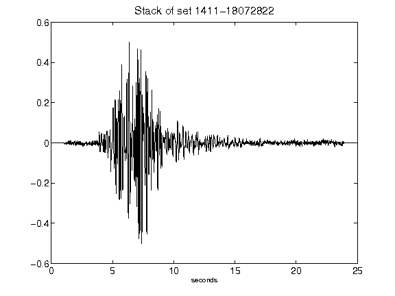](figures/1411-18072822_Stack.png)[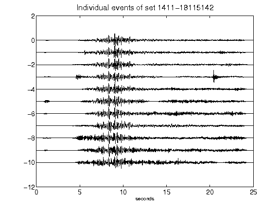](figures/1411-18115142_AllEv.png)[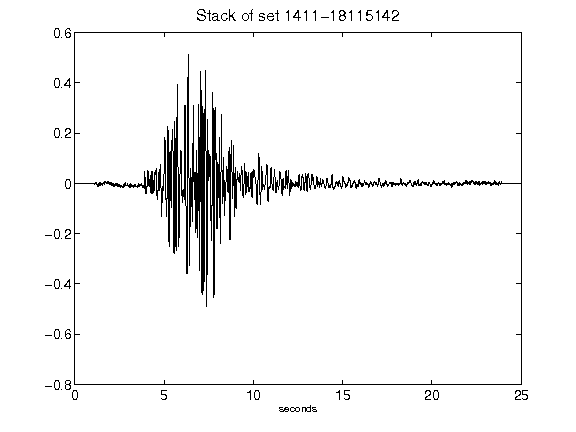](figures/1411-18115142_Stack.png)[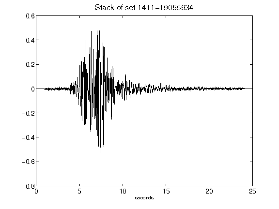](figures/1411-19055934_Stack.png)[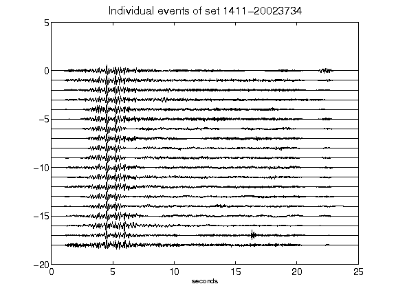](figures/1411-20023734_AllEv.png)[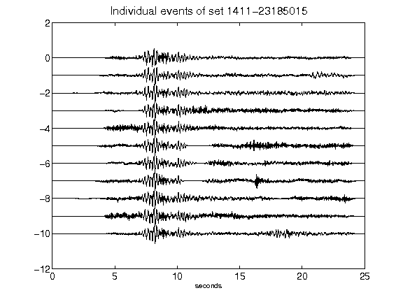](figures/1411-23185015_AllEv.png)[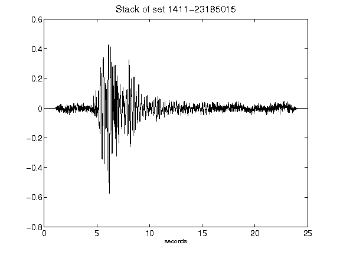](figures/1411-23185015_Stack.png)[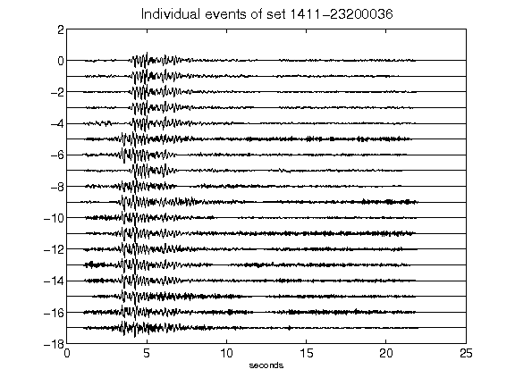](figures/1411-23200036_AllEv.png)[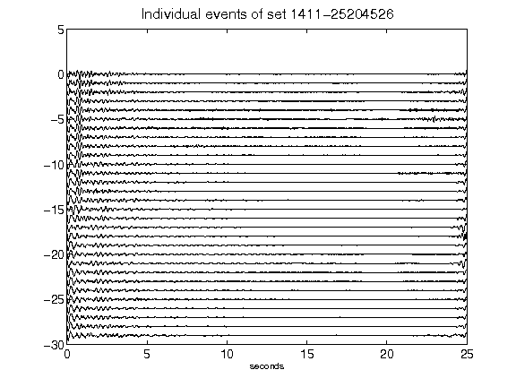](figures/1411-25204526_AllEv.png)[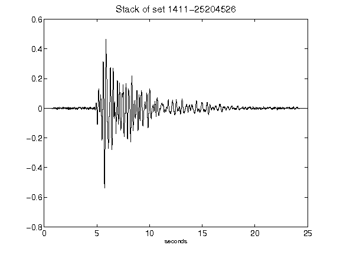](figures/1411-25204526_Stack.png)[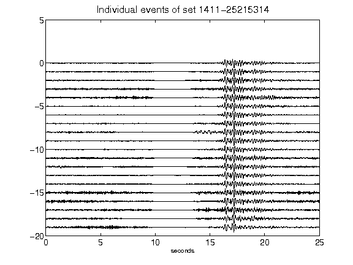](figures/1411-25215314_AllEv.png)[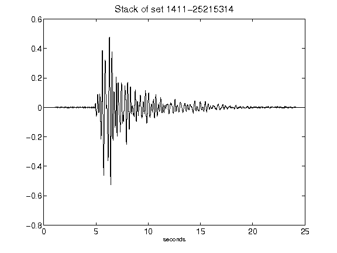](figures/1411-25215314_Stack.png)[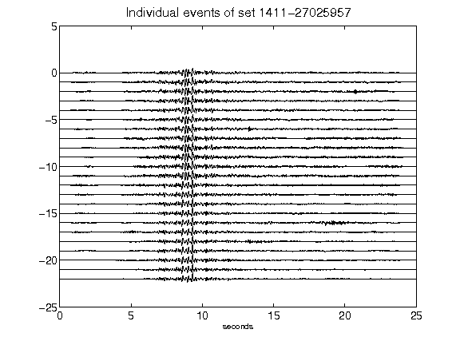](figures/1411-27025957_AllEv.png)[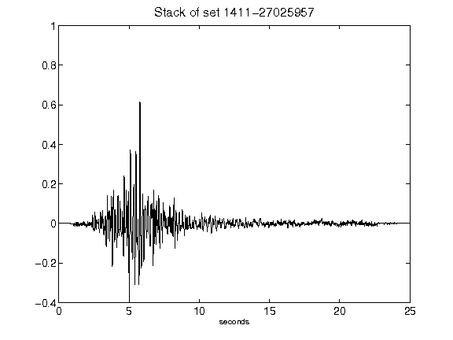](figures/1411-27025957_Stack.png)[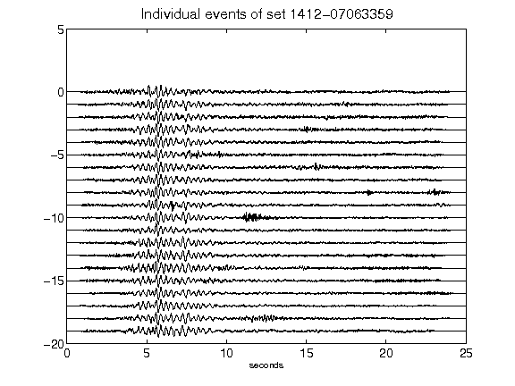](figures/1412-07063359_AllEv.png)[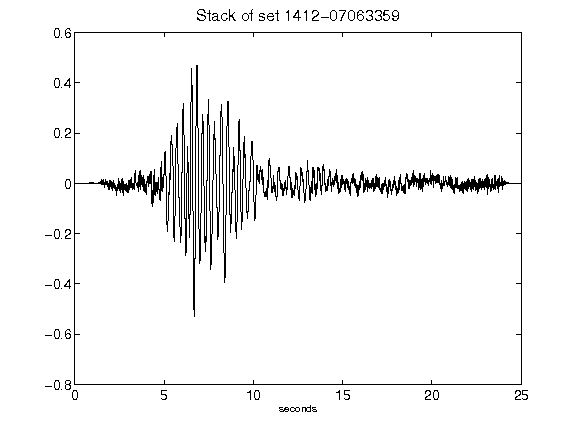](figures/1412-07063359_Stack.png)[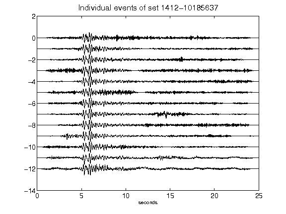](figures/1412-10185637_AllEv.png)[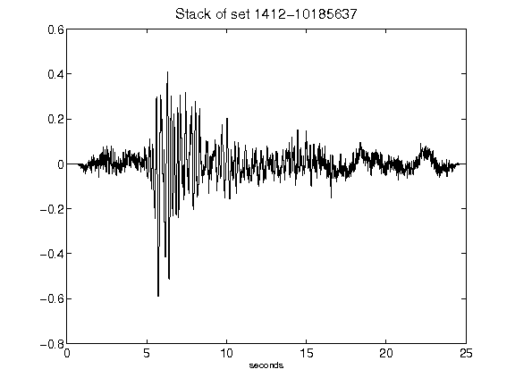](figures/1412-10185637_Stack.png)[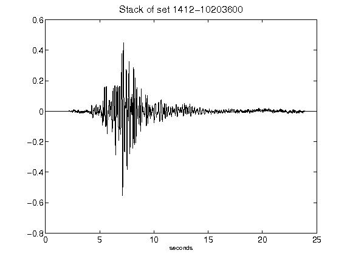](figures/1412-10203600_Stack.png)[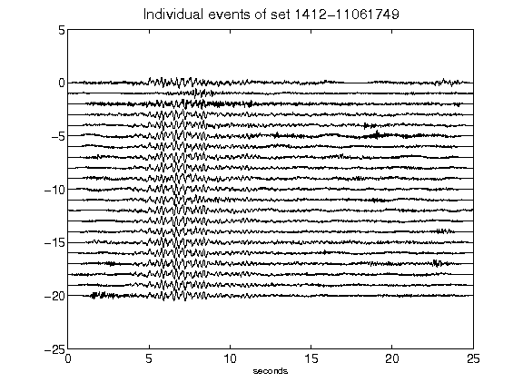](figures/1412-11061749_AllEv.png)[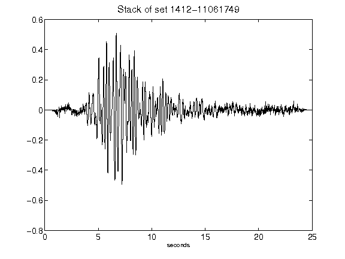](figures/1412-11061749_Stack.png)