# Repeating Earthquake Activity at RCS

## Waveforms
[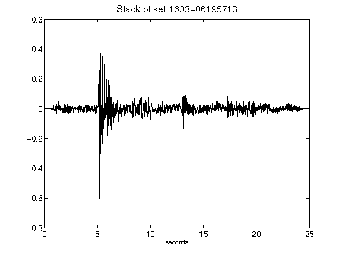](figures/1603-06195713_Stack.png)[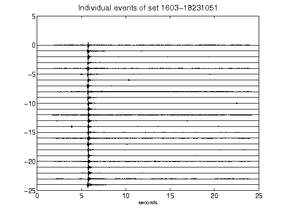](figures/1603-18231051_AllEv.png)[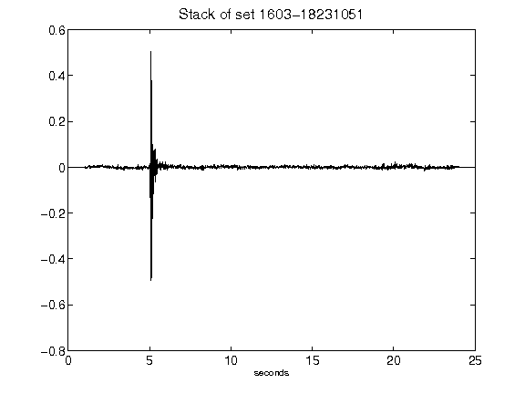](figures/1603-18231051_Stack.png)[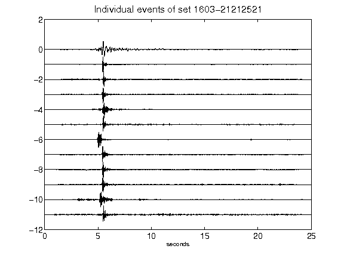](figures/1603-21212521_AllEv.png)[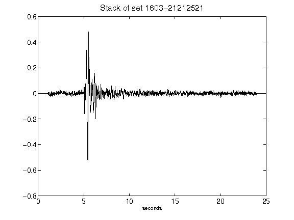](figures/1603-21212521_Stack.png)[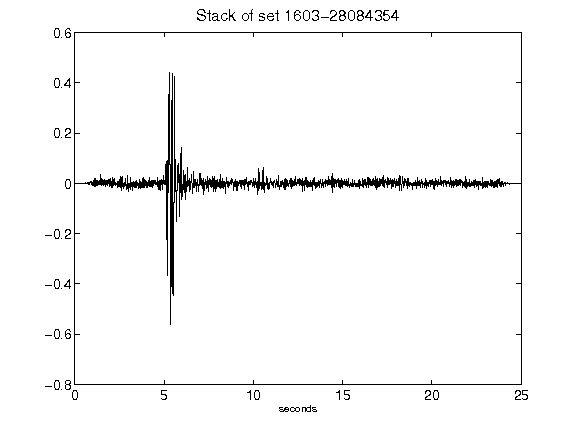](figures/1603-28084354_Stack.png)[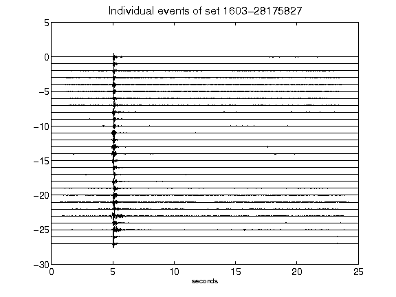](figures/1603-28175827_AllEv.png)[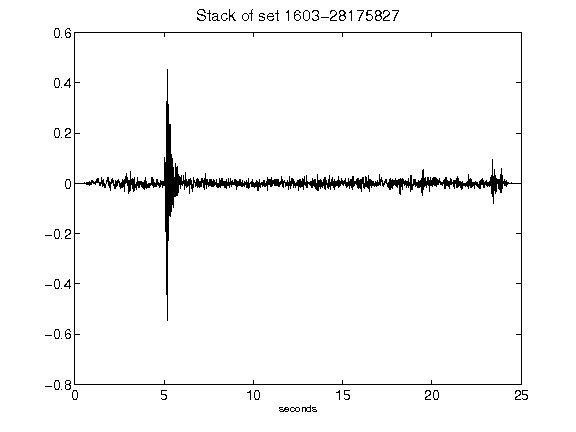](figures/1603-28175827_Stack.png)[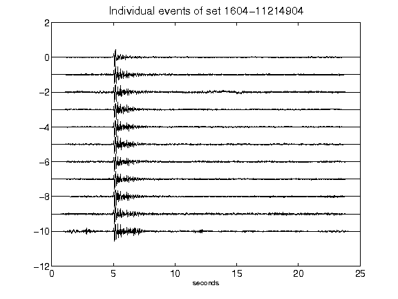](figures/1604-11214904_AllEv.png)[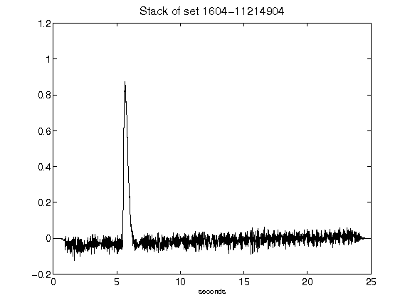](figures/1604-11214904_Stack.png)[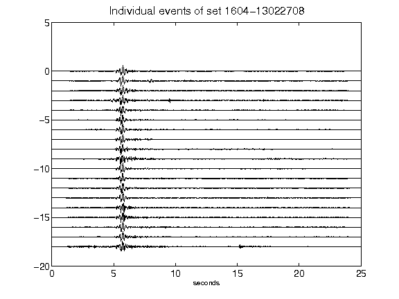](figures/1604-13022708_AllEv.png)[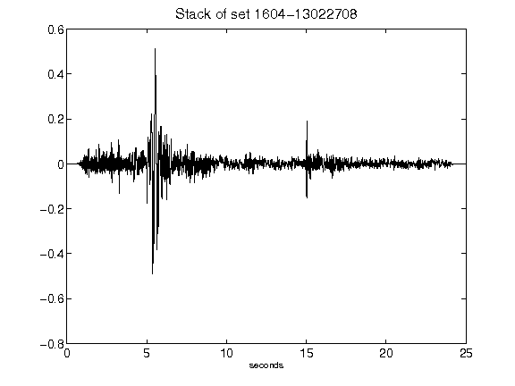](figures/1604-13022708_Stack.png)[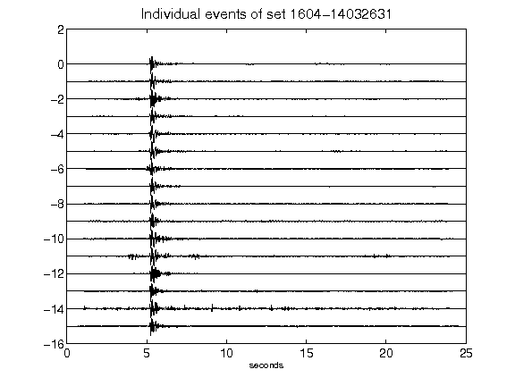](figures/1604-14032631_AllEv.png)[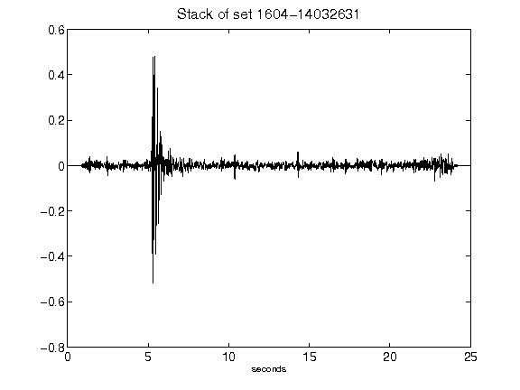](figures/1604-14032631_Stack.png)[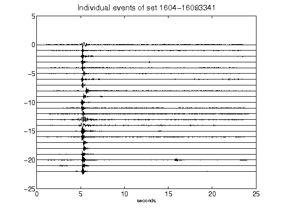](figures/1604-16093341_AllEv.png)[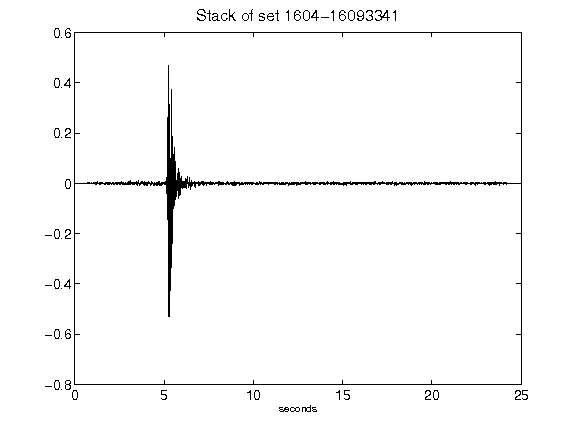](figures/1604-16093341_Stack.png)[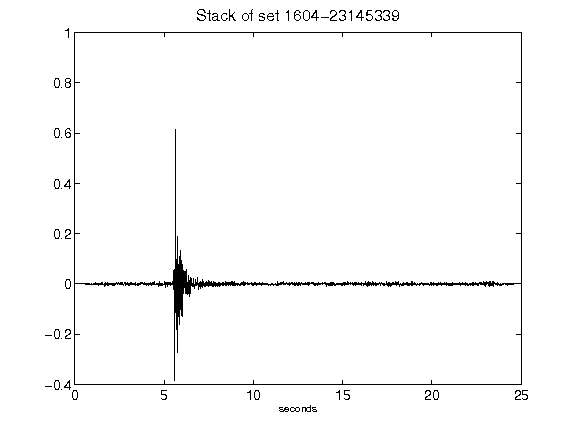](figures/1604-23145339_Stack.png)[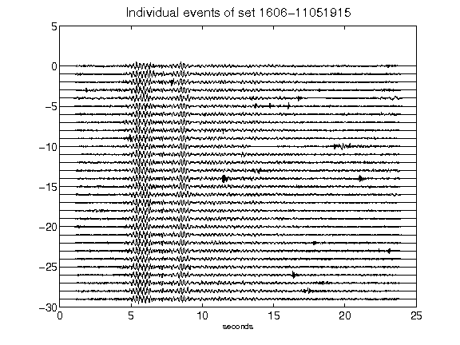](figures/1606-11051915_AllEv.png)