# Repeating Earthquake Activity at RCS

## Waveforms
[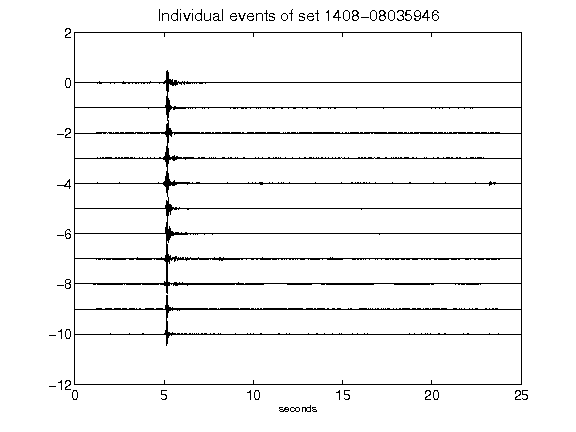](figures/1408-08035946_AllEv.png)[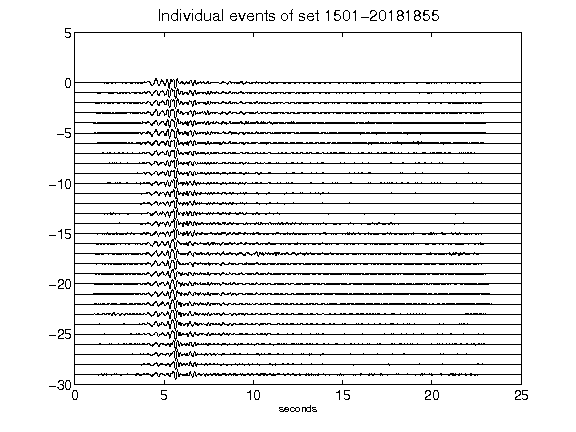](figures/1501-20181855_AllEv.png)[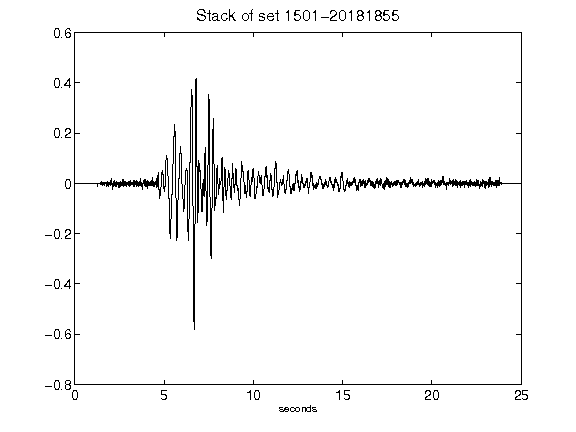](figures/1501-20181855_Stack.png)[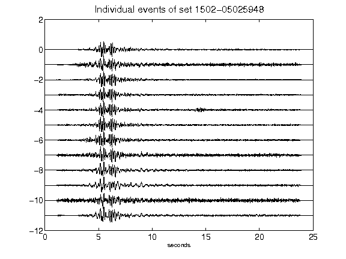](figures/1502-05025948_AllEv.png)[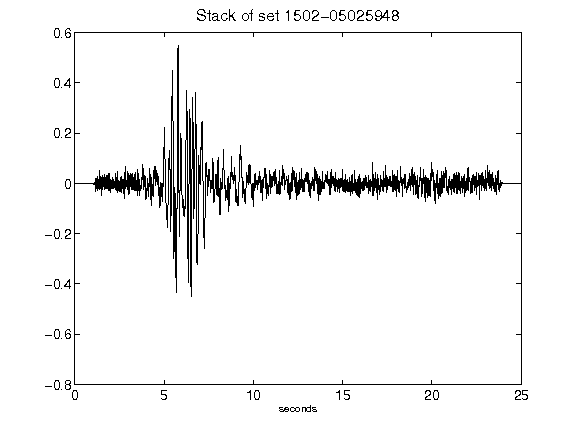](figures/1502-05025948_Stack.png)[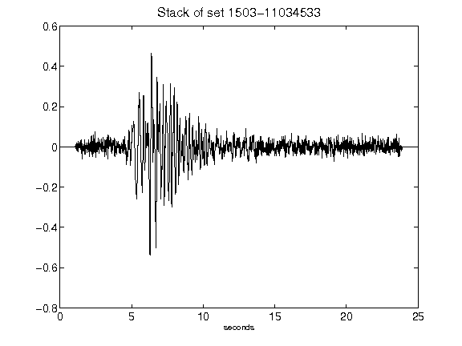](figures/1503-11034533_Stack.png)[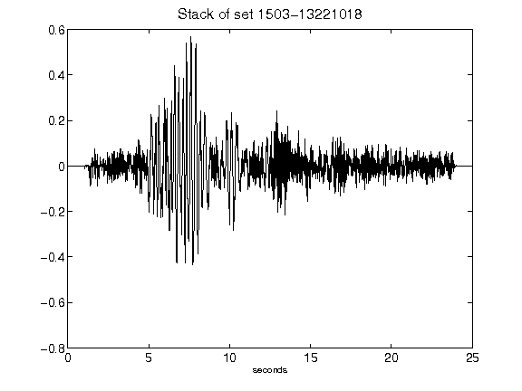](figures/1503-13221018_Stack.png)[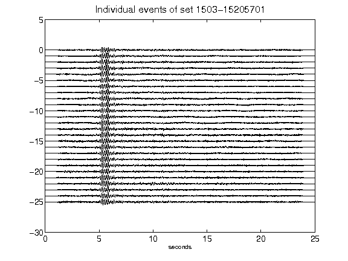](figures/1503-15205701_AllEv.png)[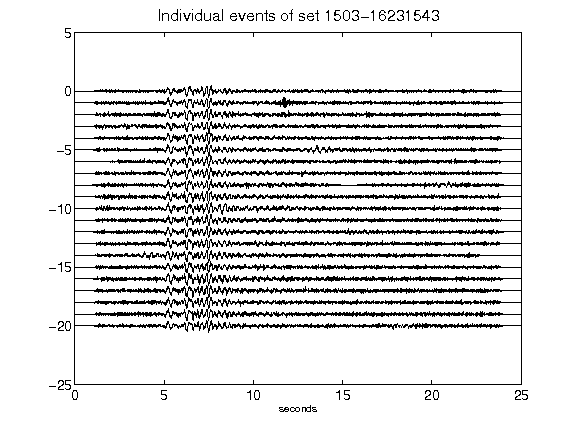](figures/1503-16231543_AllEv.png)[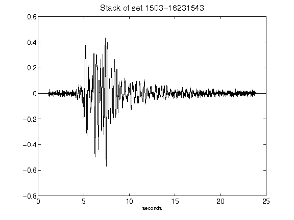](figures/1503-16231543_Stack.png)[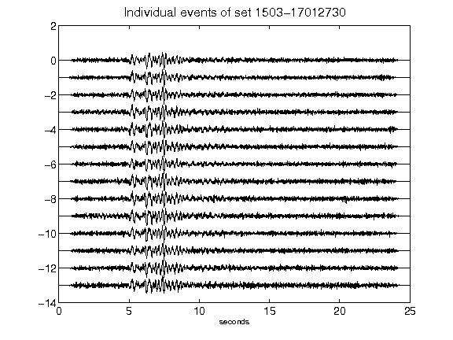](figures/1503-17012730_AllEv.png)[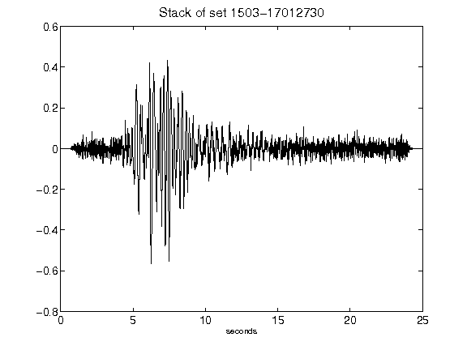](figures/1503-17012730_Stack.png)