# Repeating Earthquake Activity at RCS

## Waveforms
[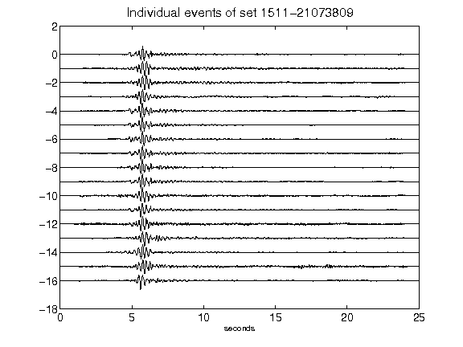](figures/1511-21073809_AllEv.png)[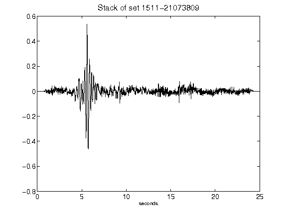](figures/1511-21073809_Stack.png)[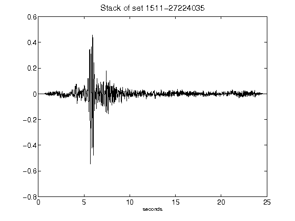](figures/1511-27224035_Stack.png)[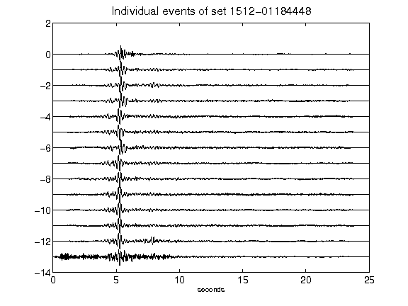](figures/1512-01184448_AllEv.png)[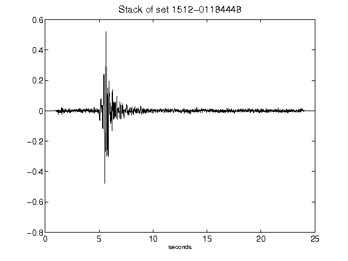](figures/1512-01184448_Stack.png)[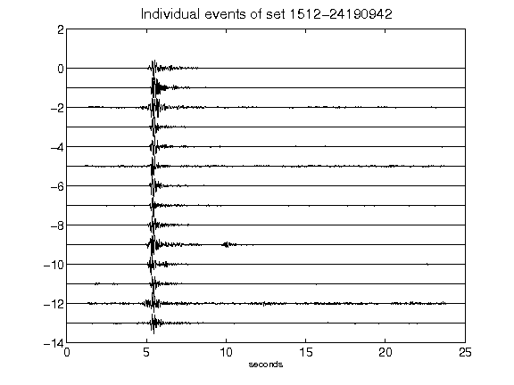](figures/1512-24190942_AllEv.png)[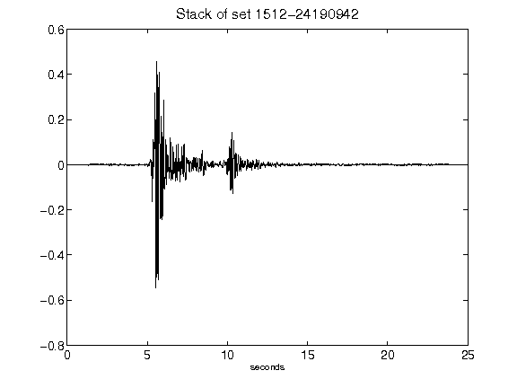](figures/1512-24190942_Stack.png)[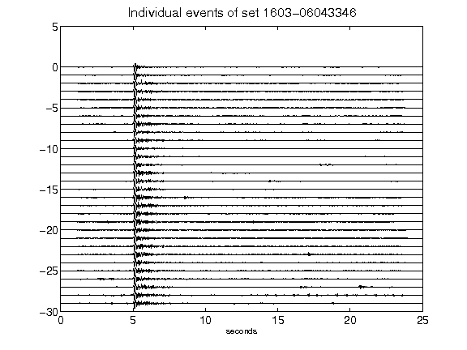](figures/1603-06043346_AllEv.png)[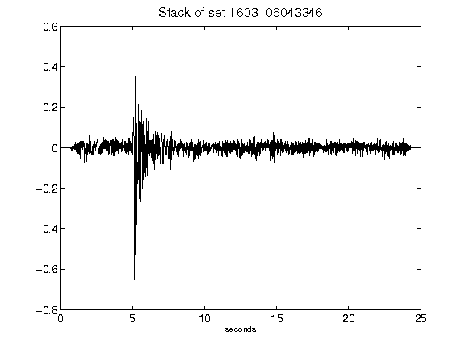](figures/1603-06043346_Stack.png)[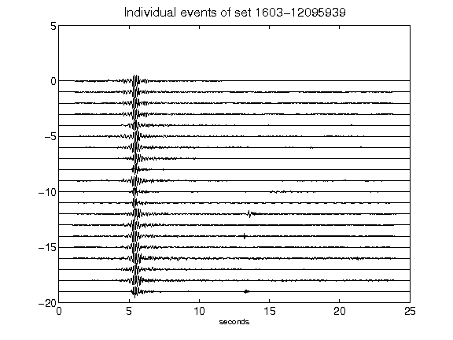](figures/1603-12095939_AllEv.png)[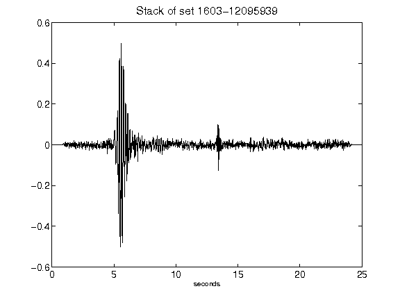](figures/1603-12095939_Stack.png)[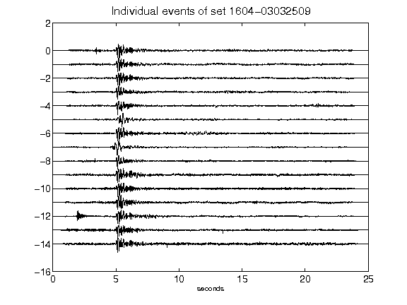](figures/1604-03032509_AllEv.png)[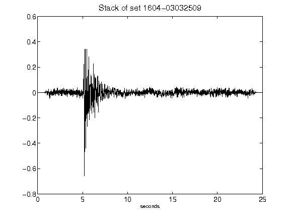](figures/1604-03032509_Stack.png)