# Repeating Earthquake Activity at RCS

## Waveforms
[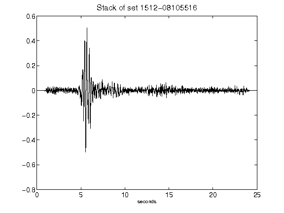](figures/1512-08105516_Stack.png)[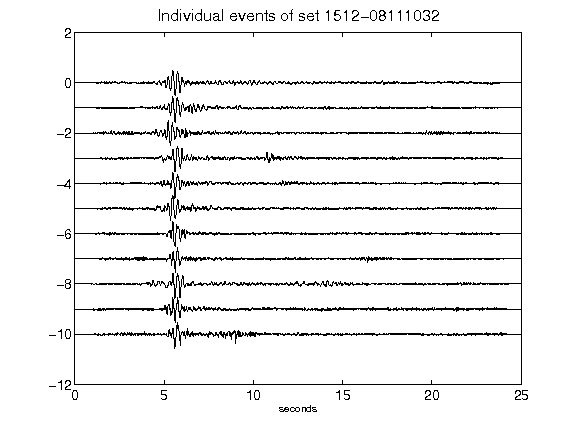](figures/1512-08111032_AllEv.png)[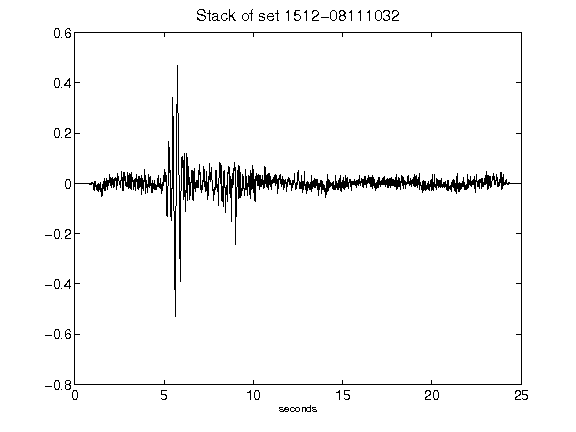](figures/1512-08111032_Stack.png)[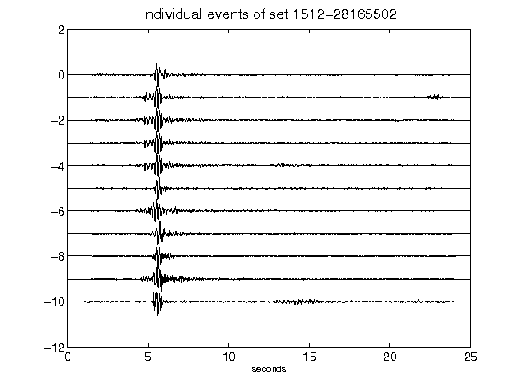](figures/1512-28165502_AllEv.png)[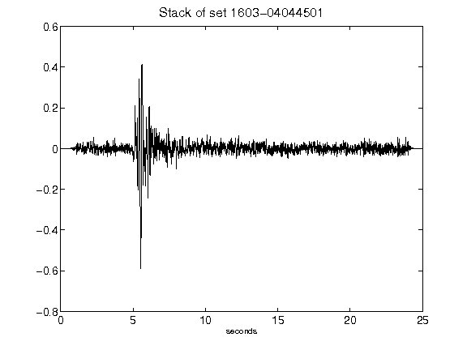](figures/1603-04044501_Stack.png)[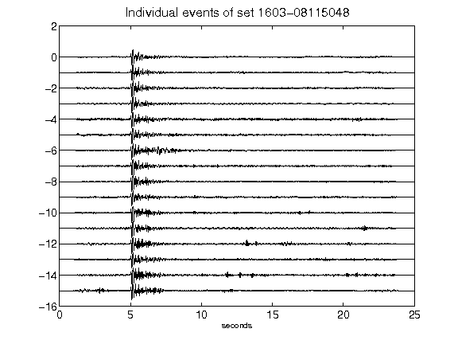](figures/1603-08115048_AllEv.png)[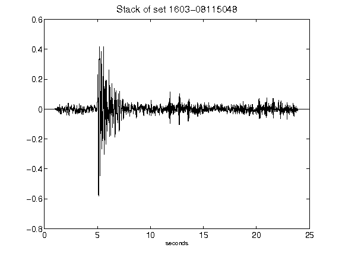](figures/1603-08115048_Stack.png)[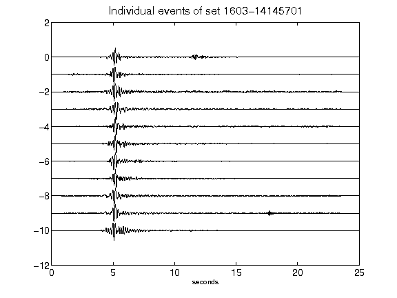](figures/1603-14145701_AllEv.png)[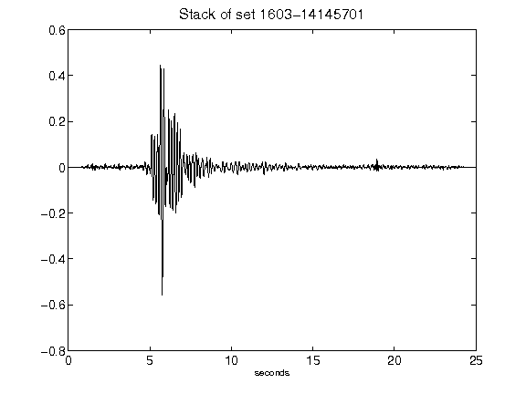](figures/1603-14145701_Stack.png)[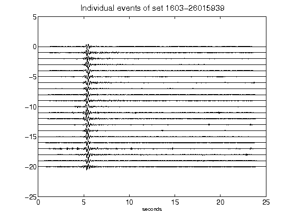](figures/1603-26015939_AllEv.png)[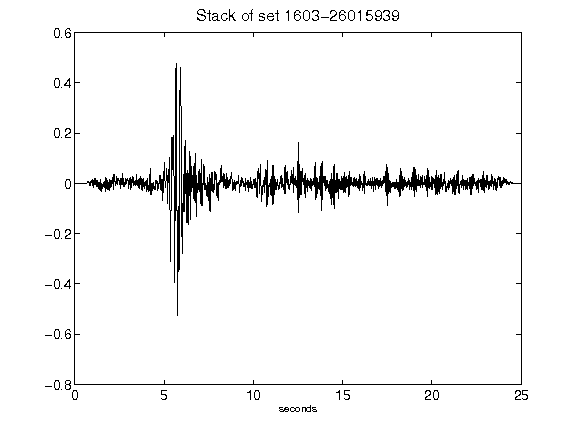](figures/1603-26015939_Stack.png)[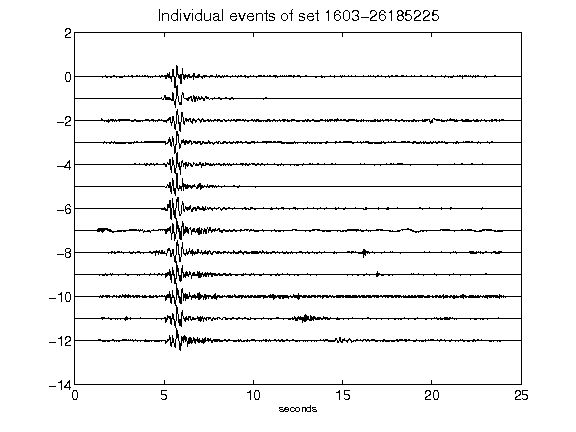](figures/1603-26185225_AllEv.png)[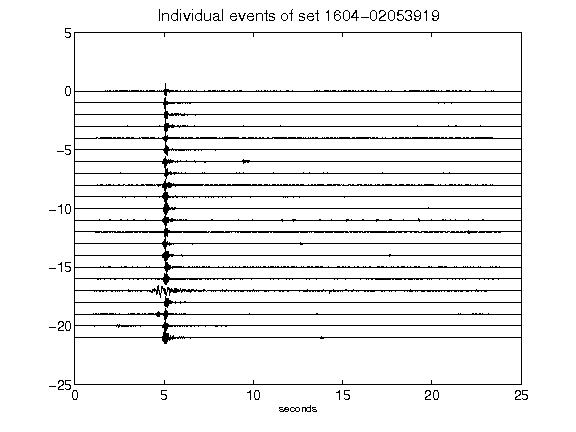](figures/1604-02053919_AllEv.png)[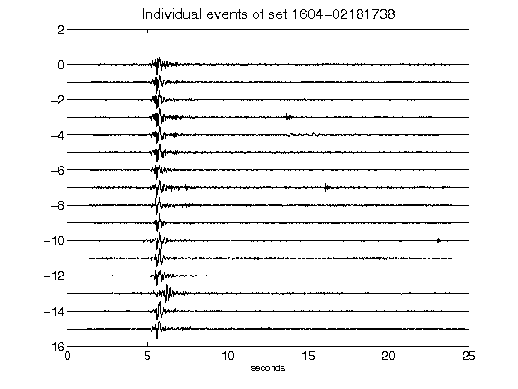](figures/1604-02181738_AllEv.png)[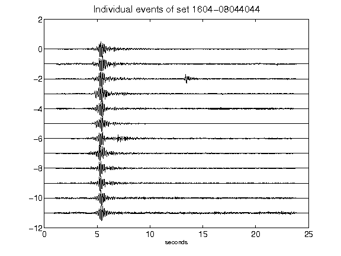](figures/1604-08044044_AllEv.png)[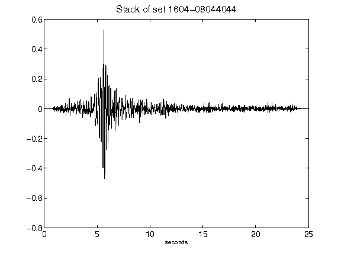](figures/1604-08044044_Stack.png)[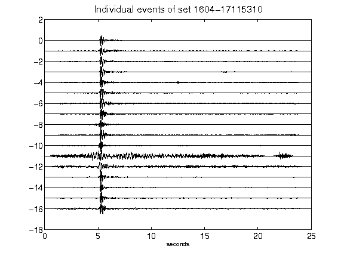](figures/1604-17115310_AllEv.png)[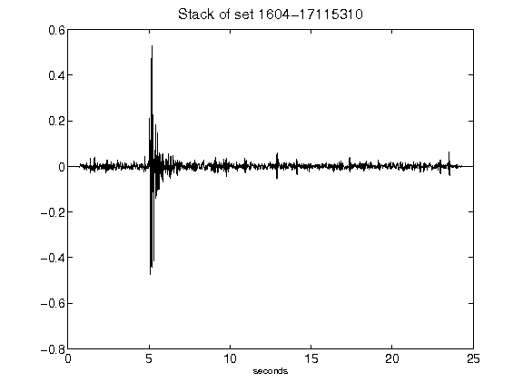](figures/1604-17115310_Stack.png)[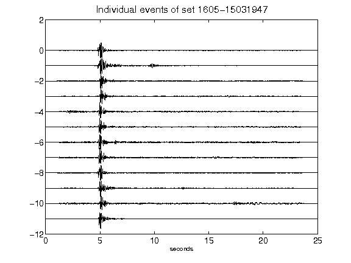](figures/1605-15031947_AllEv.png)[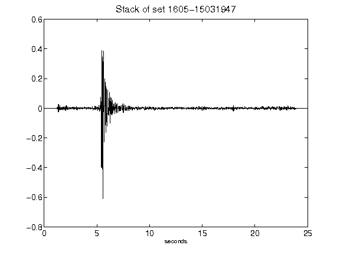](figures/1605-15031947_Stack.png)