# Repeating Earthquake Activity at RCS

## Waveforms
[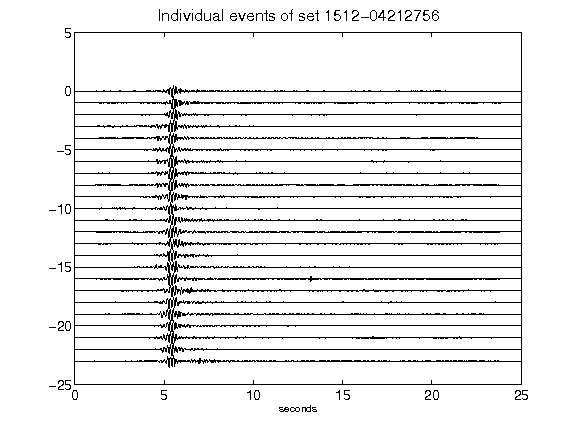](figures/1512-04212756_AllEv.png)[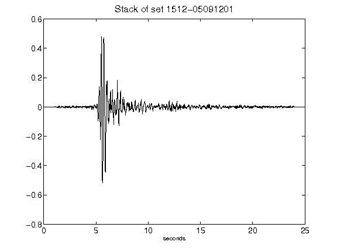](figures/1512-05091201_Stack.png)[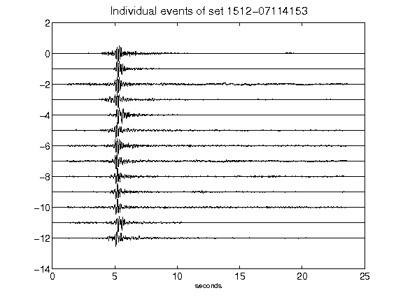](figures/1512-07114153_AllEv.png)[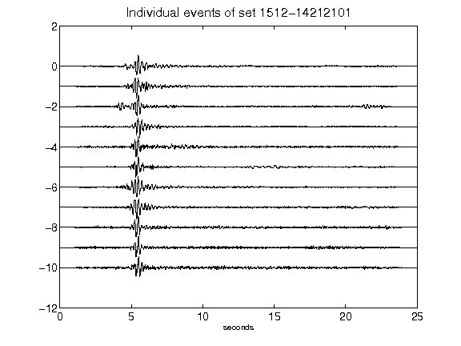](figures/1512-14212101_AllEv.png)[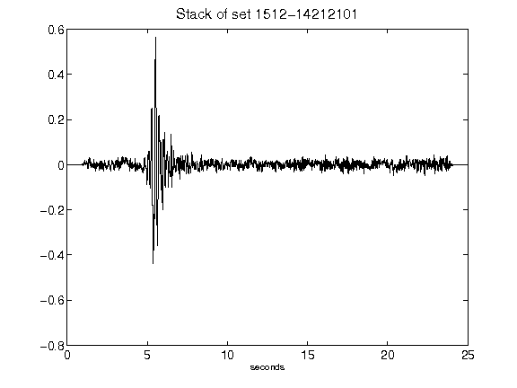](figures/1512-14212101_Stack.png)[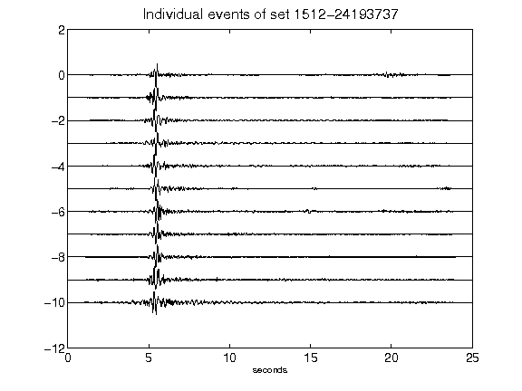](figures/1512-24193737_AllEv.png)[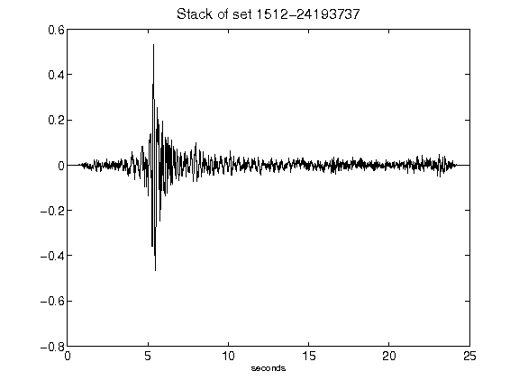](figures/1512-24193737_Stack.png)[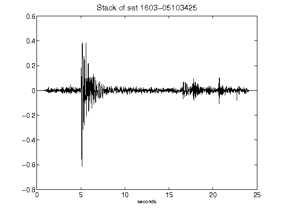](figures/1603-05103425_Stack.png)[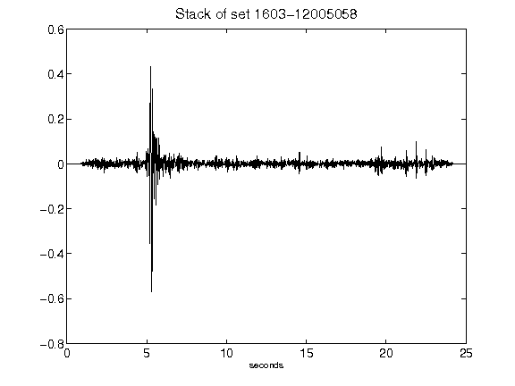](figures/1603-12005058_Stack.png)[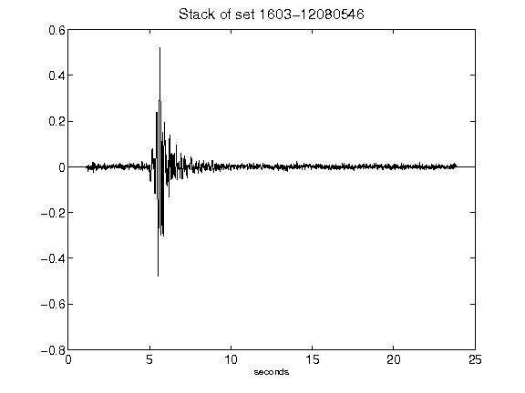](figures/1603-12080546_Stack.png)[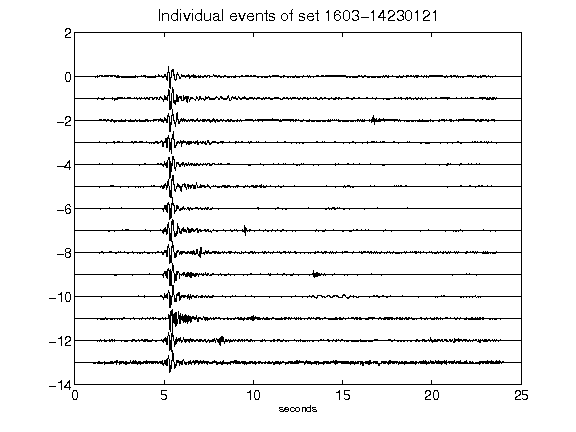](figures/1603-14230121_AllEv.png)[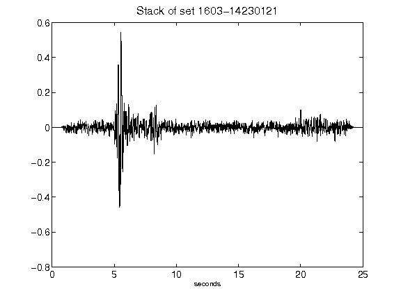](figures/1603-14230121_Stack.png)[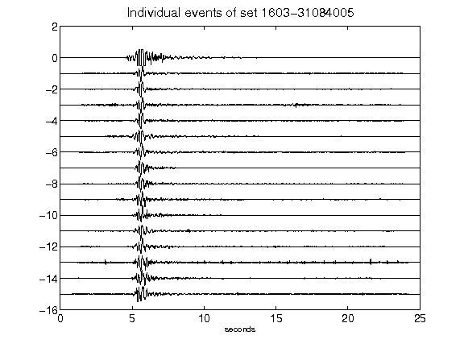](figures/1603-31084005_AllEv.png)[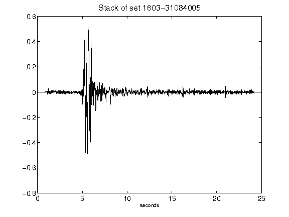](figures/1603-31084005_Stack.png)[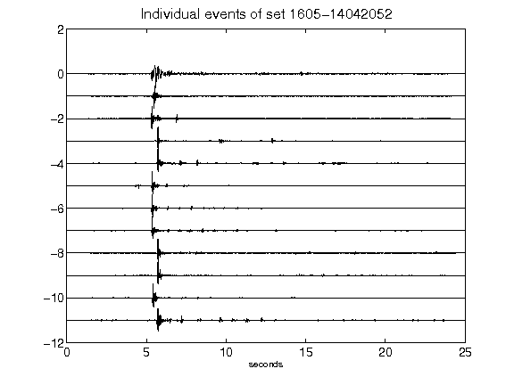](figures/1605-14042052_AllEv.png)[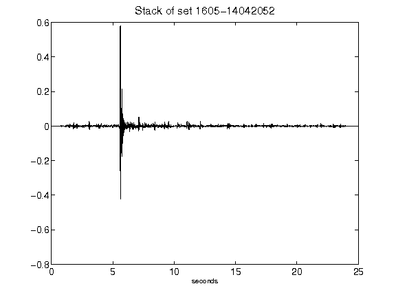](figures/1605-14042052_Stack.png)