# Repeating Earthquake Activity at RCS

## Waveforms
[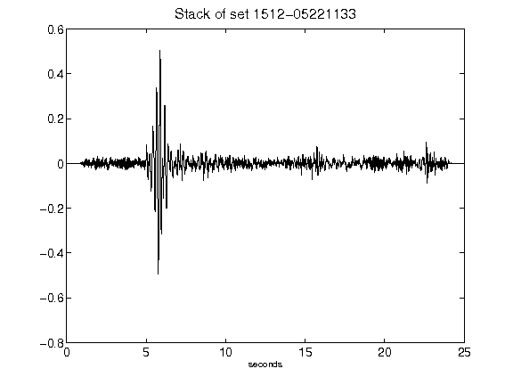](figures/1512-05221133_Stack.png)[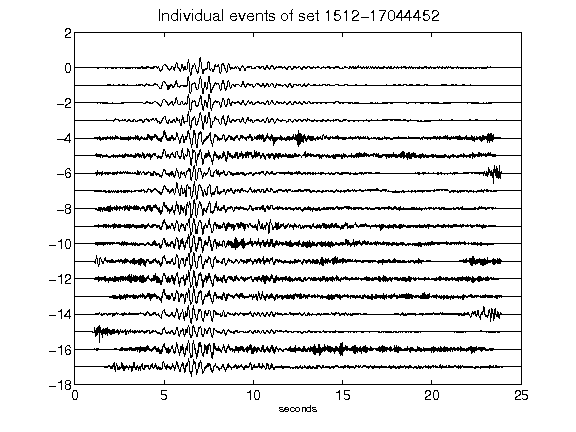](figures/1512-17044452_AllEv.png)[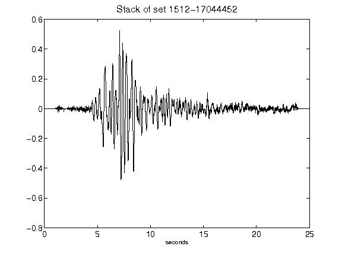](figures/1512-17044452_Stack.png)[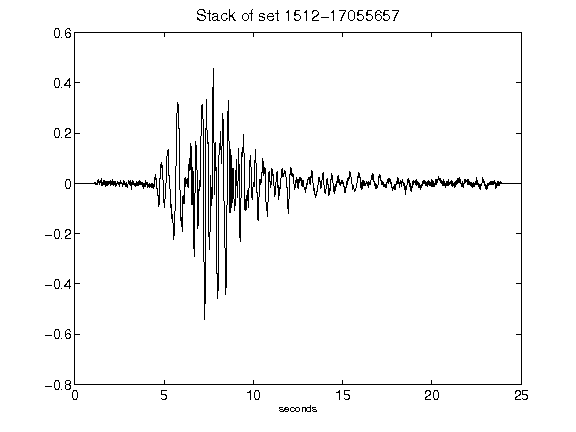](figures/1512-17055657_Stack.png)[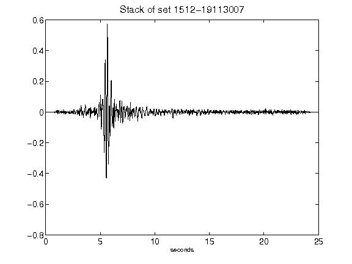](figures/1512-19113007_Stack.png)[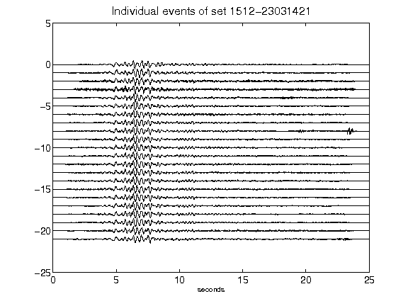](figures/1512-23031421_AllEv.png)[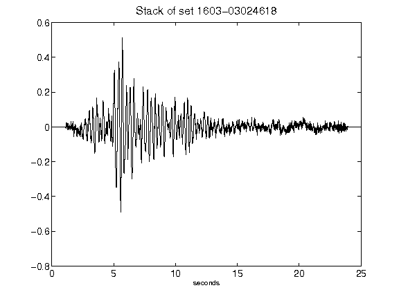](figures/1603-03024618_Stack.png)[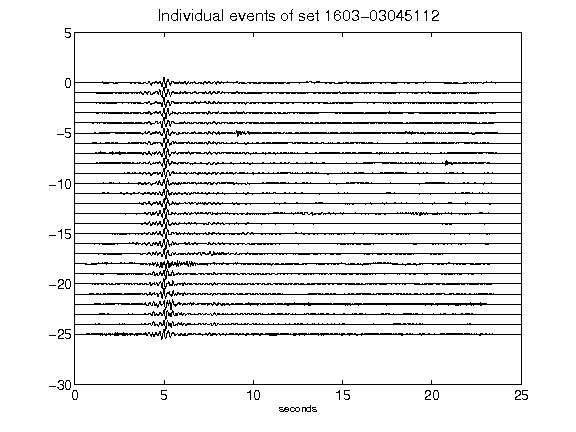](figures/1603-03045112_AllEv.png)[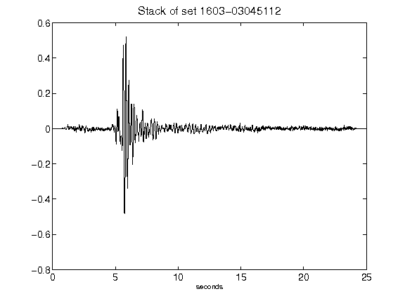](figures/1603-03045112_Stack.png)[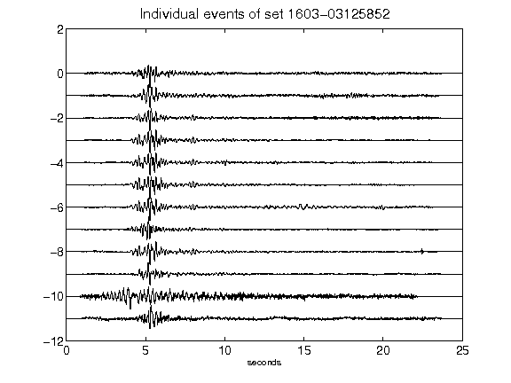](figures/1603-03125852_AllEv.png)[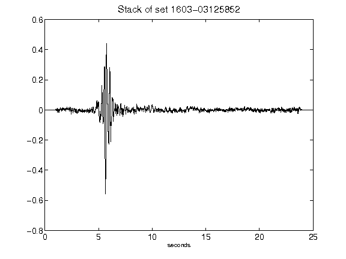](figures/1603-03125852_Stack.png)[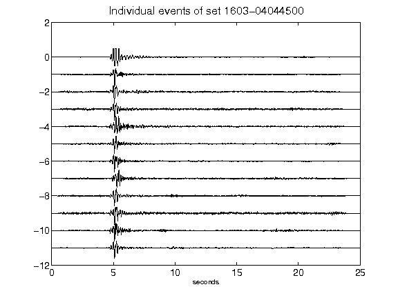](figures/1603-04044500_AllEv.png)[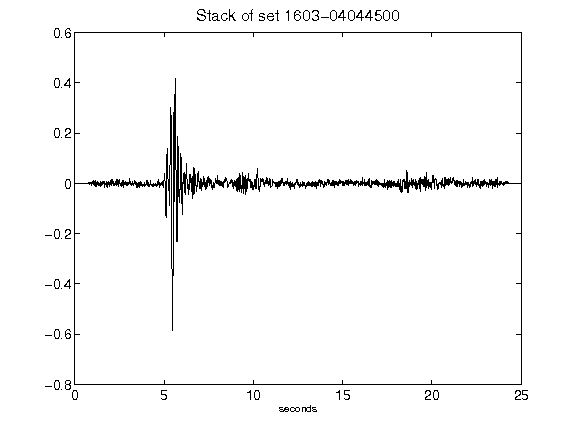](figures/1603-04044500_Stack.png)[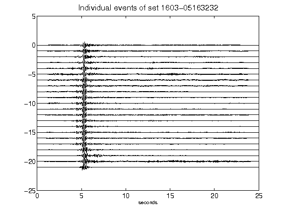](figures/1603-05163232_AllEv.png)[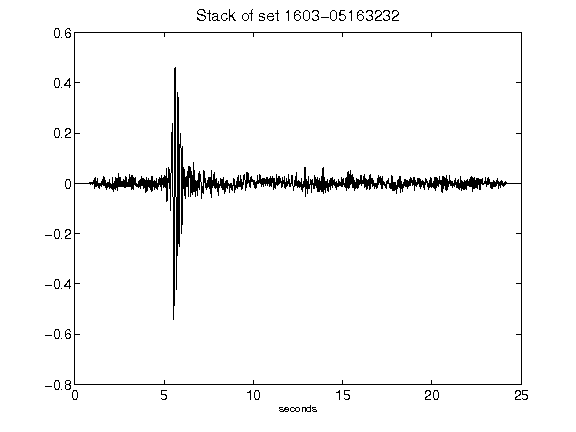](figures/1603-05163232_Stack.png)[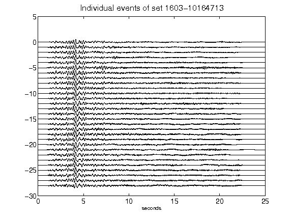](figures/1603-10164713_AllEv.png)[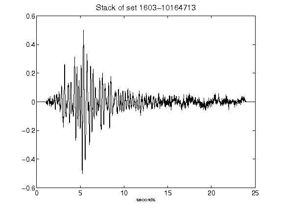](figures/1603-10164713_Stack.png)[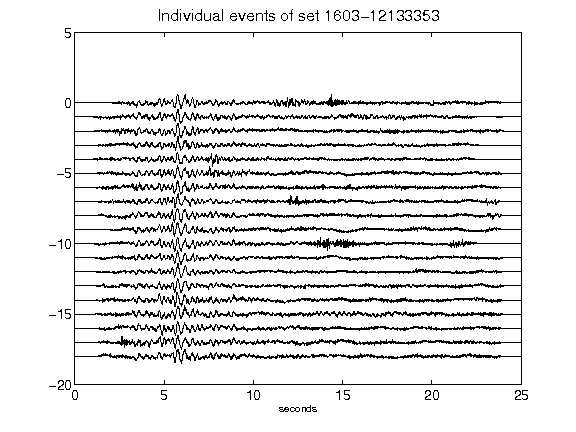](figures/1603-12133353_AllEv.png)