# Repeating Earthquake Activity at RCS

## Waveforms
[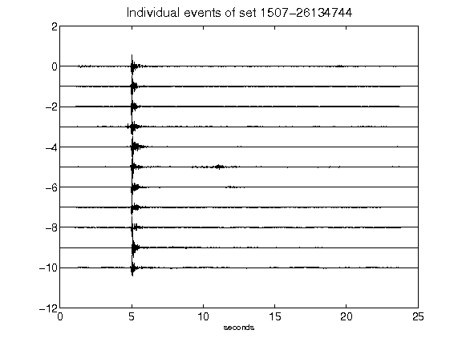](figures/1507-26134744_AllEv.png)[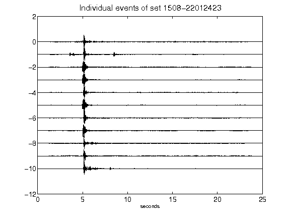](figures/1508-22012423_AllEv.png)[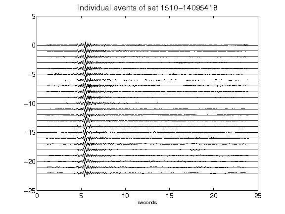](figures/1510-14095418_AllEv.png)[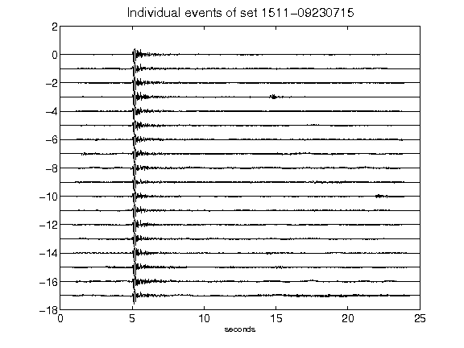](figures/1511-09230715_AllEv.png)[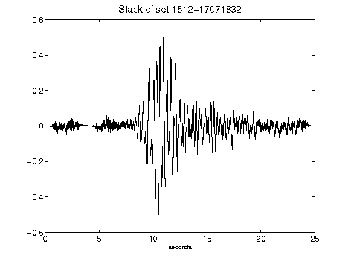](figures/1512-17071832_Stack.png)[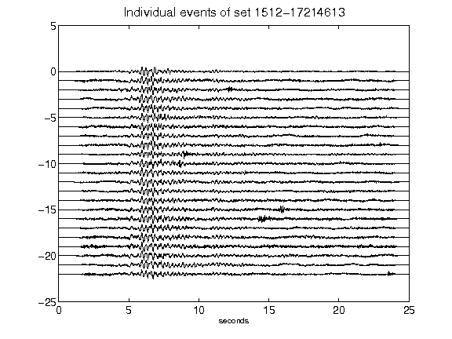](figures/1512-17214613_AllEv.png)[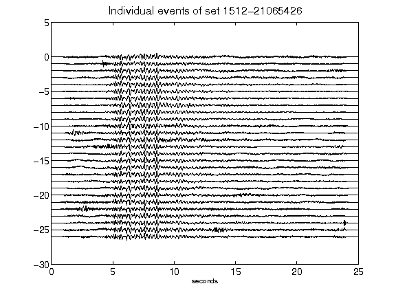](figures/1512-21065426_AllEv.png)[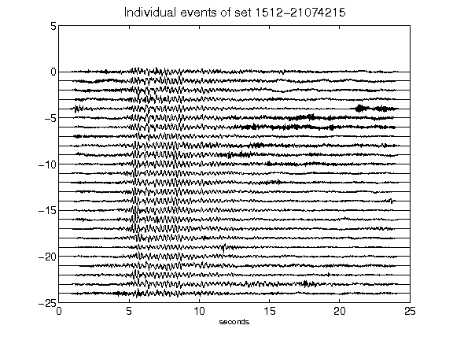](figures/1512-21074215_AllEv.png)[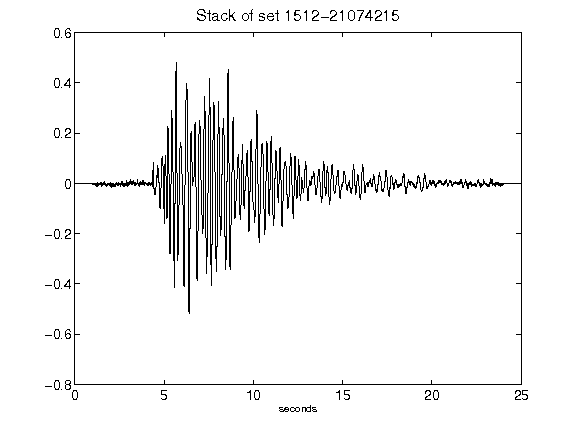](figures/1512-21074215_Stack.png)[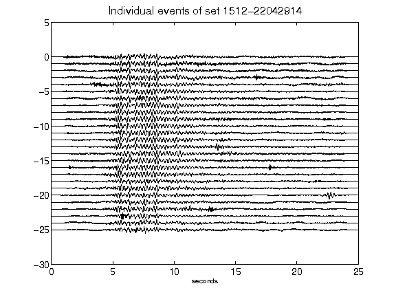](figures/1512-22042914_AllEv.png)[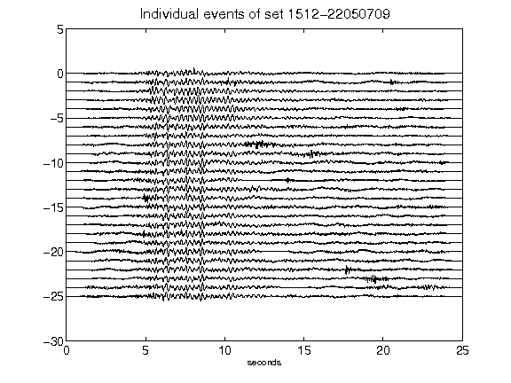](figures/1512-22050709_AllEv.png)