# Repeating Earthquake Activity at RCS

## Waveforms
[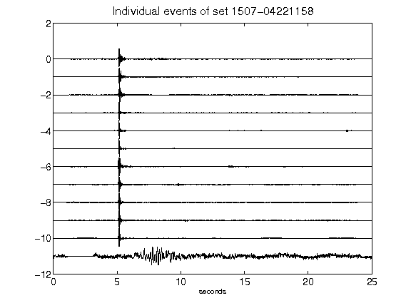](figures/1507-04221158_AllEv.png)[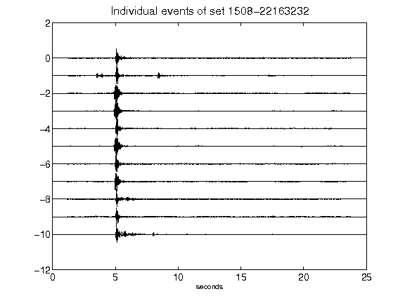](figures/1508-22163232_AllEv.png)[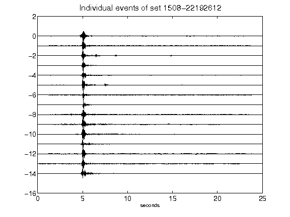](figures/1508-22192612_AllEv.png)[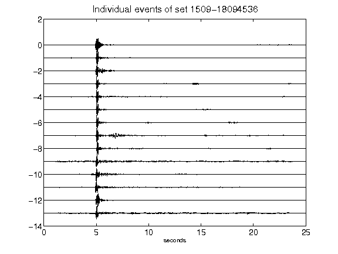](figures/1509-18094536_AllEv.png)[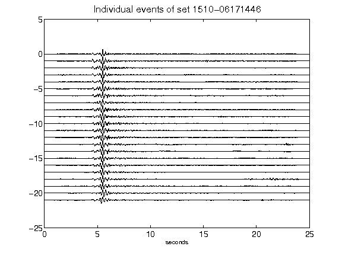](figures/1510-06171446_AllEv.png)[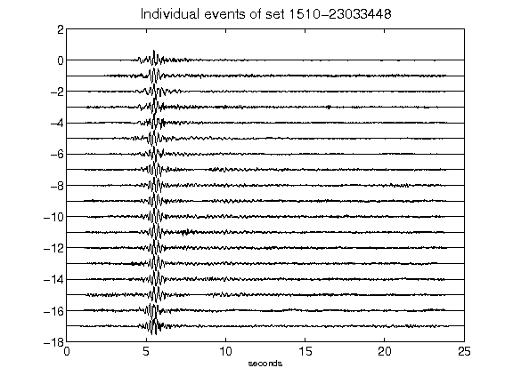](figures/1510-23033448_AllEv.png)[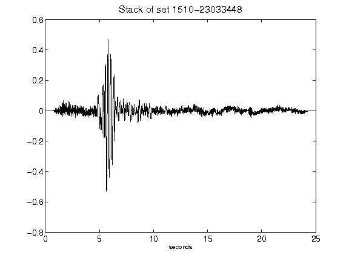](figures/1510-23033448_Stack.png)[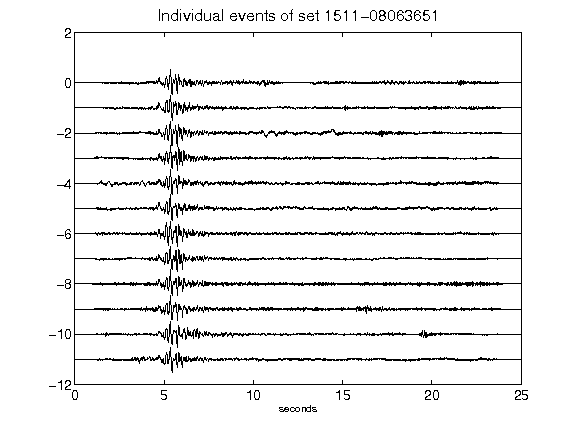](figures/1511-08063651_AllEv.png)[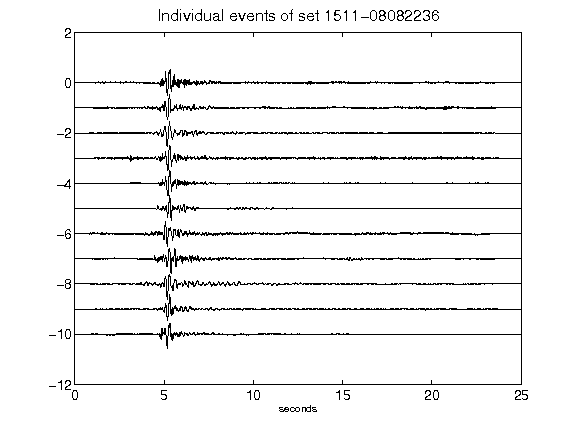](figures/1511-08082236_AllEv.png)[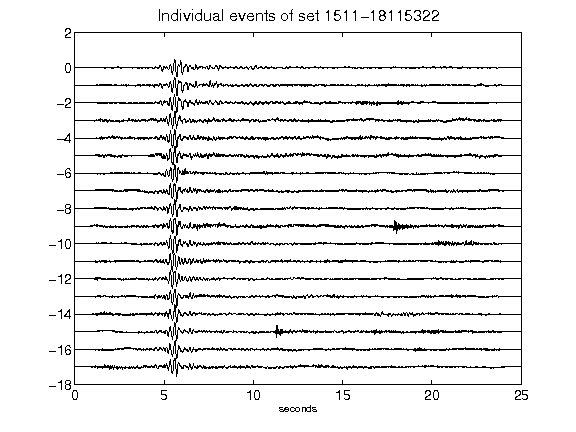](figures/1511-18115322_AllEv.png)[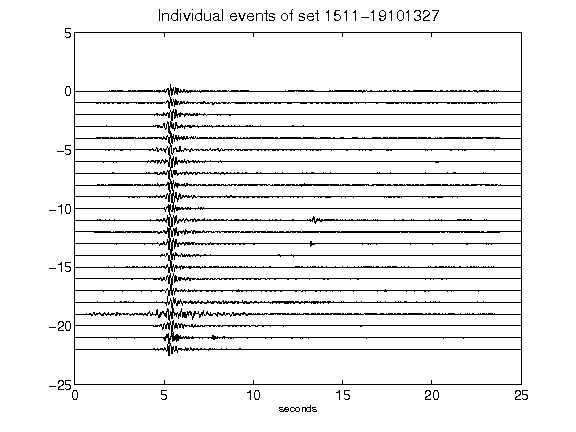](figures/1511-19101327_AllEv.png)[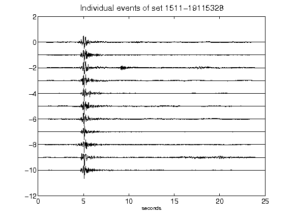](figures/1511-19115328_AllEv.png)[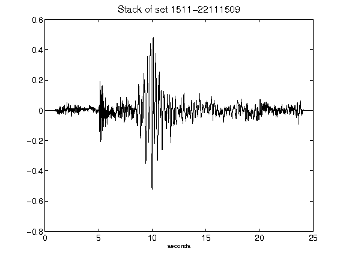](figures/1511-22111509_Stack.png)[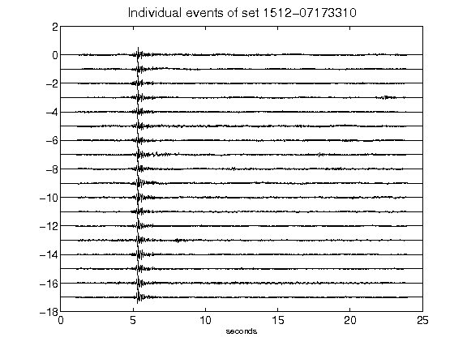](figures/1512-07173310_AllEv.png)[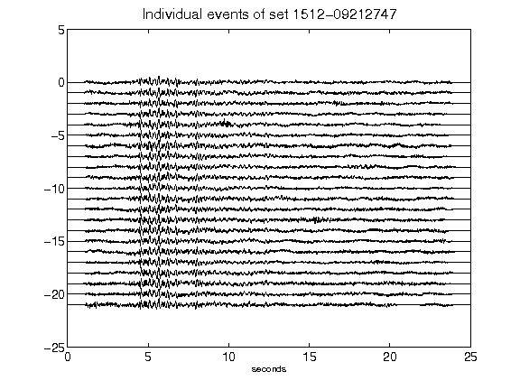](figures/1512-09212747_AllEv.png)[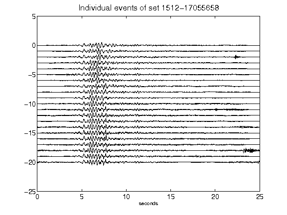](figures/1512-17055658_AllEv.png)[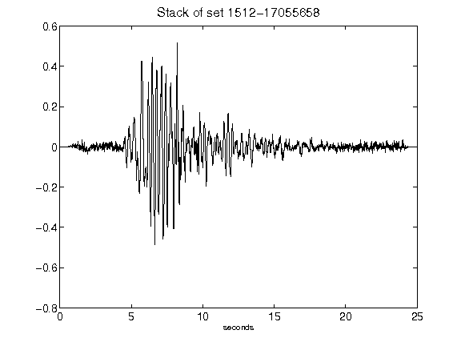](figures/1512-17055658_Stack.png)[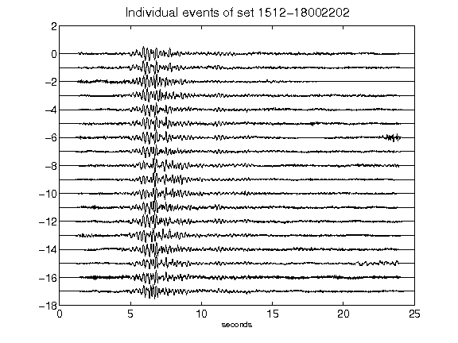](figures/1512-18002202_AllEv.png)[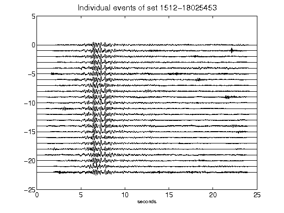](figures/1512-18025453_AllEv.png)[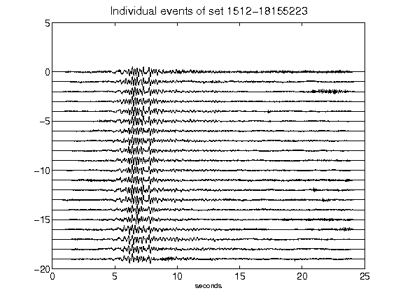](figures/1512-18155223_AllEv.png)[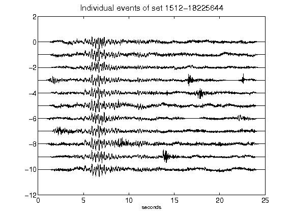](figures/1512-18225644_AllEv.png)[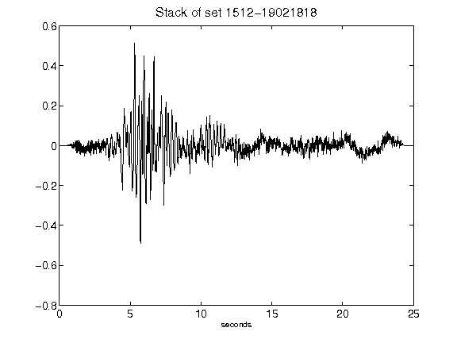](figures/1512-19021818_Stack.png)[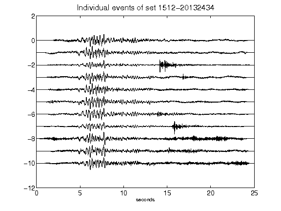](figures/1512-20132434_AllEv.png)[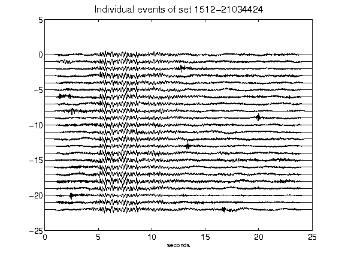](figures/1512-21034424_AllEv.png)[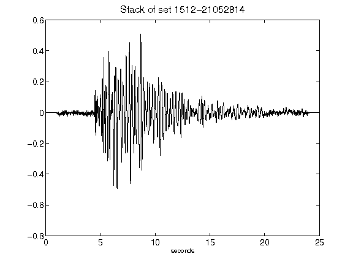](figures/1512-21052814_Stack.png)[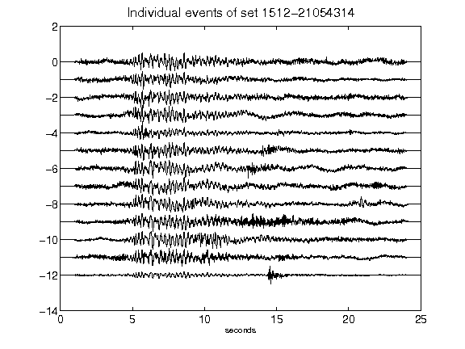](figures/1512-21054314_AllEv.png)[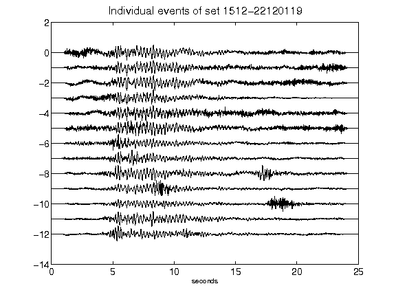](figures/1512-22120119_AllEv.png)