# Repeating Earthquake Activity at RCS

## Waveforms
[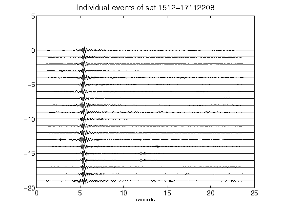](figures/1512-17112208_AllEv.png)[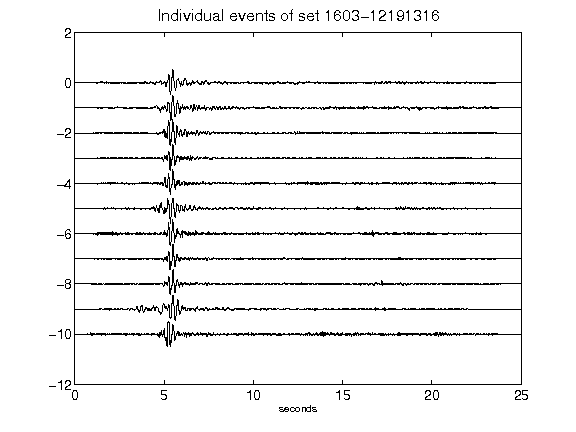](figures/1603-12191316_AllEv.png)[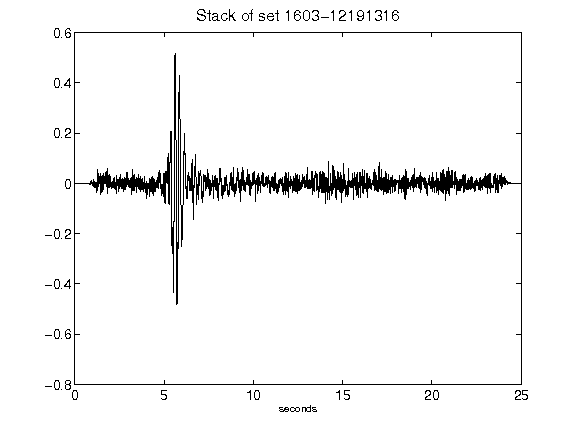](figures/1603-12191316_Stack.png)[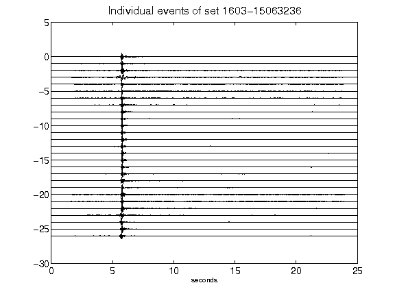](figures/1603-15063236_AllEv.png)[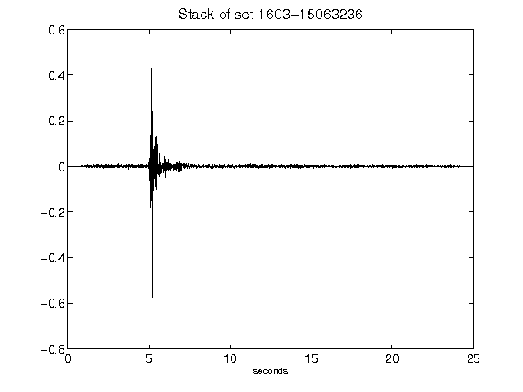](figures/1603-15063236_Stack.png)[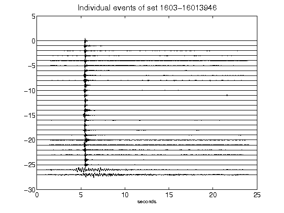](figures/1603-16013946_AllEv.png)[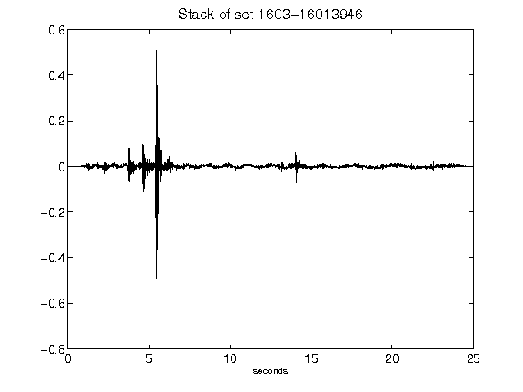](figures/1603-16013946_Stack.png)[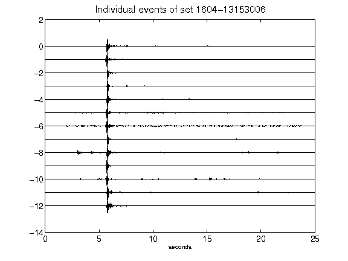](figures/1604-13153006_AllEv.png)[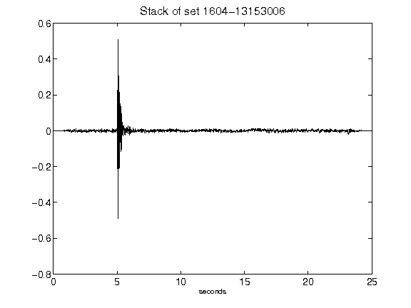](figures/1604-13153006_Stack.png)[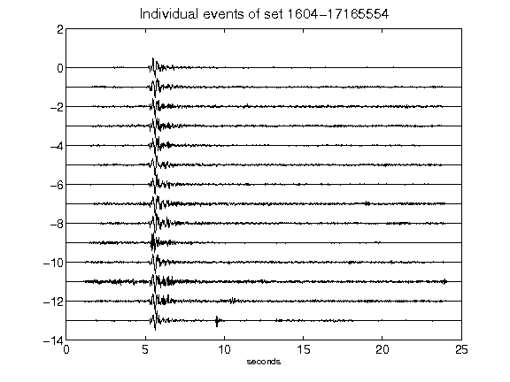](figures/1604-17165554_AllEv.png)[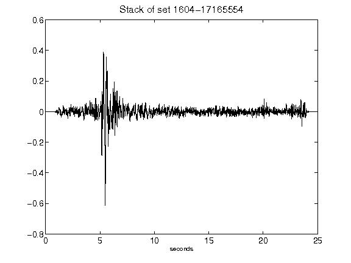](figures/1604-17165554_Stack.png)[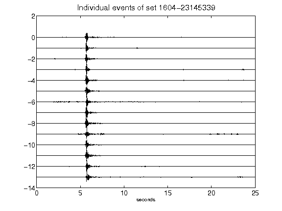](figures/1604-23145339_AllEv.png)[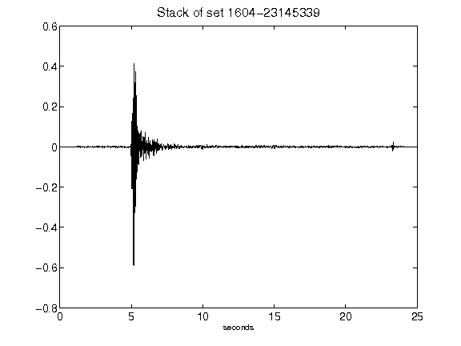](figures/1604-23145339_Stack.png)[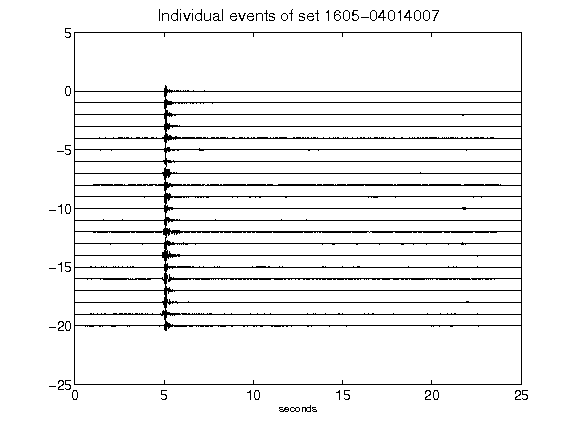](figures/1605-04014007_AllEv.png)[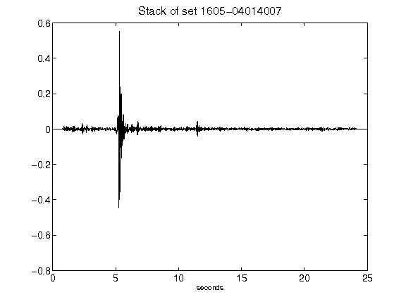](figures/1605-04014007_Stack.png)